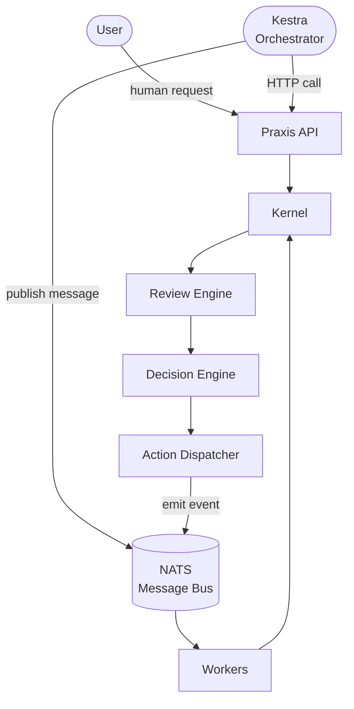

# ADR-002 — External Workflow Orchestrator

**Status:** PROPOSED (not accepted — pending RFC record)
**Date:** 2026-07-01
**Authors:** Tiroq, Architecture
**Supersedes:** —
**Superseded by:** —
**Related:** ADR-003, ADR-006, ADR-009, ADR-011, RFC-013, RFC-020, RFC-021, RFC-022, RFC-023, RFC-030, RFC-031, RFC-040, ADQ-003

---

## Context

The current Praxis architecture follows a linear, event-driven flow:

```
User
 ↓
API
 ↓
Kernel
 ↓
Review
 ↓
Decision
 ↓
Action
 ↓
NATS
 ↓
Workers
```

This design is intentional. The Kernel is a pure domain engine — it handles events, drives reviews, emits decisions, and dispatches actions. It has no scheduler, no retry logic, no cron, and no concept of "running a pipeline." This is a feature, not a gap.

However, Praxis operates in a real environment that requires operational workflows that have nothing to do with the domain model:

- Nightly graph rebuild (`task graph:rebuild`)
- RFC verification runs (`task verify:rfc`)
- Benchmark execution (`task benchmark`)
- Scheduled AI reviews
- Report generation
- Backup pipelines
- Cleanup jobs
- Documentation generation
- Long-running maintenance tasks

These are **operational concerns**, not domain concerns. Implementing them inside the Kernel would violate the principle of separation of concerns, add accidental complexity to the domain engine, and introduce scheduling/retry/approval logic that belongs in infrastructure.

The current approach handles these through manual `Taskfile` invocations or ad-hoc scripts. This is sufficient for early-stage development but does not scale operationally. There is no scheduling, no retry, no observability, no approval flow, and no audit trail for these operations.

---

## Decision

Praxis **MAY** integrate [Kestra](https://kestra.io) as an external workflow orchestration platform for operational pipelines.

Kestra **SHALL** be treated as infrastructure — not as a Praxis component.

The following invariants are non-negotiable:

1. **Kestra SHALL be an external orchestration layer.** It sits outside the Praxis codebase and outside the Kernel boundary.
2. **Kestra SHALL NOT become part of the Kernel.** No Kernel package may import Kestra libraries, SDKs, or clients.
3. **Kestra SHALL communicate with Praxis only through stable, public interfaces:**
   - HTTP API (the existing Praxis API)
   - NATS (publish/subscribe on well-defined subjects)
   - CLI / Taskfile targets
   - Docker-based job execution
4. **The Kernel SHALL remain completely unaware of Kestra.** Kernel internals must not reference Kestra concepts, workflow IDs, or orchestration state.
5. **Domain models SHALL NOT reference Kestra.** No entity, aggregate, or value object may carry a Kestra workflow ID or execution reference.

Kestra orchestrates Praxis. Praxis never depends on Kestra.

This ADR records the **architectural role of an external workflow orchestrator**; Kestra is the
reference implementation of that role, not an architectural dependency. Any statement below that
names Kestra applies equally to any orchestrator satisfying the invariants in this document.

---

## Architecture Principles

1. **Operational ≠ domain.** Scheduling, retries, approvals, and pipeline coordination are
   operational concerns. The domain pipeline (RFC-013 → RFC-020 → RFC-021 → RFC-023) is a
   business concern owned by the Kernel. The two planes never merge.
2. **The Kernel is orchestration-agnostic.** Per RFC-030 §5.2 ("Business rules must never migrate
   into the Infrastructure layer") and §13.1 ("Infrastructure never owns business rules"), no
   orchestrator concept may enter the Kernel, and no business rule may live in a workflow
   definition.
3. **Orchestration terminates at public interfaces.** The orchestrator reaches Praxis only
   through the same stable interfaces any external caller uses (HTTP, NATS, CLI, Docker, MCP),
   consistent with the transport-boundary model of ADR-006 and RFC-030 §12.
4. **The orchestrator is replaceable.** Swapping Kestra for another orchestrator (or removing it
   entirely) must not require a single Kernel change.

---

## Invariants

These invariants are non-negotiable and independent of the orchestrator chosen:

1. **The Kernel MUST compile and operate with no workflow orchestrator present.** Orchestration
   is optional; the domain pipeline runs without it (RFC-030 §6, §14).
2. **The Kernel MUST NOT import or reference orchestrator APIs, SDKs, workflow IDs, or execution
   state** (RFC-030 §5.2, §13.1).
3. **All orchestration MUST terminate at public interfaces** — HTTP, NATS, CLI, Docker, MCP
   (RFC-030 §12; ADR-006; NATS per ADR-003).
4. **Business logic belongs only inside the Kernel** (RFC-013/020/021/023); it is never expressed
   in workflow YAML.
5. **Workflow definitions orchestrate execution but never implement business rules** (RFC-030
   §5.2).
6. **Replacing the orchestrator MUST NOT require Kernel changes** — the orchestrator depends on
   Praxis, never the reverse.

---

## Responsibilities

### Kestra is responsible for

- Scheduling (cron, interval, event-based triggers)
- Retries and failure handling
- Human approval gates
- Notifications (Slack, email, webhook)
- Workflow visualization and audit logs
- Orchestration of operational pipelines
- Sequential and parallel task coordination

### Praxis is responsible for

- The event model (RFC-013)
- Review execution (RFC-020)
- Decision emission (RFC-021)
- Action dispatch (RFC-023)
- Domain rules and business logic
- Agent execution (RFC-040)
- State machine transitions (RFC-022)

These responsibilities do not overlap. The boundary is the API surface and NATS message bus.

### Responsibility matrix (Kernel / Orchestrator / Infrastructure)

| Concern | Kernel (business plane) | Workflow orchestrator | Infrastructure |
|---|---|---|---|
| Domain events (RFC-013) | ✅ owns | ❌ never | — |
| Review / Decision / Action (RFC-020/021/023) | ✅ owns | ❌ never | — |
| Agent execution (RFC-040) | ✅ invokes via contracts | may *trigger* via API | — |
| State-machine transitions (RFC-022) | ✅ owns | ❌ never | — |
| Scheduling (cron/interval/event) | ❌ never | ✅ owns | — |
| Retries / failure handling (operational) | ❌ never | ✅ owns | — |
| Human approval gates (operational) | — (domain gates live in Review, RFC-020) | ✅ owns operational gates | — |
| Notifications / alerting | ❌ never | ✅ owns | — |
| Workflow visualization / audit of ops | ❌ never | ✅ owns | — |
| Event bus transport | — | uses as a client | ✅ NATS (ADR-003) |
| Persistence / stores | via repositories (ADR-007) | its own DB backend | ✅ owns engines |
| Reverse proxy / TLS | — | — | ✅ Caddy (`infra/caddy`) |

The Kernel column never contains an orchestrator responsibility, and the orchestrator column
never contains a business responsibility — this is the RFC-030 §5.2/§13.1 boundary made explicit.

---

## Architecture



Kestra is a peer of the User from the API's perspective — it calls the same stable HTTP endpoints. It may also publish NATS messages on well-defined subjects, which workers consume without knowledge of their origin. The Kernel and all domain components are completely isolated from orchestration concerns.

---

## Integration Boundaries

The orchestrator integrates with Praxis only across the stable, public interfaces below. These
tables define the permitted and forbidden couplings that keep Invariants 1–6 true.

## Allowed Integrations

Kestra workflows may:

| Integration | Example |
|---|---|
| Taskfile targets | `task verify:rfc`, `task graph:rebuild`, `task benchmark`, `task report` |
| HTTP calls | `POST /api/reviews/trigger`, `GET /api/health` |
| NATS publish | Publish to `praxis.events.*` subjects |
| NATS consume | Subscribe to `praxis.events.completed` |
| Docker job execution | Run containerized scripts or tools |
| CLI commands | Execute `praxis` CLI commands |

---

## Forbidden Integrations

| Forbidden | Reason |
|---|---|
| Kernel importing Kestra SDK | Violates isolation; Kernel must be orchestration-agnostic |
| Kernel exposing Kestra-specific interfaces | Creates tight coupling to infrastructure |
| Domain models referencing Kestra | Workflow IDs are infrastructure, not domain |
| Kestra workflow IDs inside domain entities | Leaks orchestration state into the domain |
| Kestra configuration inside Kernel packages | Configuration belongs in `infra/`, not `services/` |
| Business rules implemented in Kestra flows | Domain logic must live in the Kernel, not in YAML |

---

## Options Considered

The decision has two axes: (1) *whether* to use an external orchestrator at all, and (2) *which*
one. Options A–G evaluate concrete orchestrators; Option H evaluates "no orchestrator". All are
judged against the Invariants above and the single-operator, self-hosted, local-first posture
evidenced by `docker-compose.yml`, `infra/`, and `Taskfile.yml`.

### Option A — Kestra *(PROPOSED, reference implementation)*

**Description.** A YAML-driven, self-hostable workflow orchestrator with cron/interval/event
triggers, retries, human approval gates, notifications, and a UI. Calls Praxis over HTTP/NATS/
CLI/Docker; requires no SDK inside Praxis.

**Fits.** Invariants 1–6 (no SDK in Kernel; terminates at public interfaces). RFC-030 §12
(adapters/public interfaces). ADR-003 (publishes to `praxis.events.*`). The YAML model matches
`Taskfile.yml`/`docker-compose.yml`.

**Conflicts.** Adds an infrastructure component with its own database backend; workflow
definitions must be versioned alongside the services they orchestrate to avoid drift.

**Advantages.** No Kernel changes; event + HTTP triggers match the existing transport layer;
self-hosted and local via Docker Compose; lightest full-featured option; not language-coupled.

**Disadvantages.** One more UI and backend to operate; YAML drift risk against Taskfile/API
contracts.

**Operational impact.** Deploy Kestra + its DB + worker processes; back up its state; keep flows
versioned.

**Implementation complexity.** Low: no code integration; flows call existing endpoints/targets.

**Long-term maintainability.** High: orchestrator is fully decoupled and replaceable.

**Verdict.** Best fit for the role: full-featured, self-hosted, zero Kernel coupling, and the
lightest orchestrator that runs locally in Docker Compose.

---

### Option B — Temporal

**Description.** A durable-execution engine where workflows are written in code (Go/Java/…) with
strong state persistence and retries.

**Fits.** Excellent durability, retries, and long-running workflow guarantees; self-hostable.

**Conflicts.** Temporal's model is **SDK-in-your-code**: workflows are program code linked
against Temporal libraries. Using it for domain-adjacent work would pull orchestration into the
same process space as business logic, pressuring Invariant 2 (no SDK in Kernel) unless rigidly
quarantined in a separate worker. Heavier than needed for operational cron/report jobs.

**Advantages.** Best-in-class durable execution; strong for complex, stateful, long-running
processes.

**Disadvantages.** SDK coupling temptation; heavier ops (server + DB + workers); code-first
workflows are overkill for "nightly graph rebuild".

**Operational impact.** Highest among candidates: Temporal cluster + persistence + versioned
workflow code.

**Implementation complexity.** High: SDK integration and workflow code.

**Long-term maintainability.** Medium: powerful but heavy; SDK coupling risks the boundary.

**Verdict.** Over-powered and SDK-coupled for operational pipelines; the durability strengths are
not needed for cron/report/verify jobs. Rejected for this role.

---

### Option C — Argo Workflows

**Description.** A Kubernetes-native workflow engine; workflows are Kubernetes CRDs executed as
pods.

**Fits.** Strong for containerized, parallel, K8s-scheduled pipelines.

**Conflicts.** Requires Kubernetes. The Praxis deployment is Docker Compose + Caddy
(`docker-compose.yml`, `infra/caddy`), not K8s; mandating K8s for operational cron jobs is
disproportionate and breaks local-first dev.

**Advantages.** Scales well on K8s; native container execution; good for heavy parallel DAGs.

**Disadvantages.** Hard K8s dependency; no lightweight local story; overkill at single-operator
scale.

**Operational impact.** Requires operating a Kubernetes cluster.

**Implementation complexity.** High (K8s + CRDs).

**Long-term maintainability.** Medium on K8s; poor without it.

**Verdict.** Disproportionate: forces Kubernetes on a Docker-Compose, local-first system.
Rejected.

---

### Option D — Apache Airflow

**Description.** A mature, Python-centric DAG scheduler for data/ops pipelines.

**Fits.** Rich scheduling, retries, and a large operator ecosystem; good for batch pipelines.

**Conflicts.** Python-centric DAG programming model imposes a language and paradigm on operational
tasks that are otherwise simple `task` targets; heavier to run (scheduler + webserver + workers +
DB); weaker fit for event-triggered flows than Kestra.

**Advantages.** Very mature; huge ecosystem; strong scheduling.

**Disadvantages.** Python DAG coupling; heavy footprint; event triggers are not its strength.

**Operational impact.** Heavy: multiple components + metadata DB.

**Implementation complexity.** Medium-high: DAGs in Python.

**Long-term maintainability.** Medium; heavier ops and a paradigm tax.

**Verdict.** Heavier and more paradigm-coupled than needed; event triggers weaker than Kestra.
Rejected.

---

### Option E — Prefect

**Description.** A modern Python-first orchestration framework with a hybrid execution model.

**Fits.** Good scheduling/retries/observability; friendlier than Airflow.

**Conflicts.** Python-first flows again impose a language on operational tasks; the most natural
deployment leans on Prefect Cloud (managed), which conflicts with the self-hosted posture, though
self-hosting exists.

**Advantages.** Pleasant developer experience; good retries/observability.

**Disadvantages.** Python coupling; best-path is cloud-managed; less YAML-native than Kestra.

**Operational impact.** Medium (self-hosted) to low (cloud, but external dependency).

**Implementation complexity.** Medium: Python flow code.

**Long-term maintainability.** Medium; language coupling and cloud gravity.

**Verdict.** Better than Airflow ergonomically but still Python-coupled and cloud-leaning versus
Kestra's YAML + self-hosted fit. Rejected for this role.

---

### Option F — GitHub Actions

**Description.** CI/CD workflow runner triggered primarily by repository events, with cron
support.

**Fits.** Great for CI (build/test/verify on push) and simple scheduled jobs; already implied by
the `apps`/CI context.

**Conflicts.** Designed around code-push events and hosted runners; it cannot trigger on internal
Praxis domain events over NATS, and self-hosted runners are awkward for always-on operational
orchestration. It is a CI tool, not a general operational orchestrator.

**Advantages.** Zero extra infra for CI; familiar; good for release/verify pipelines (ADR-011
`task ci`).

**Disadvantages.** No internal-event triggers; not designed for long-running operational
orchestration; hosted-runner model.

**Operational impact.** Low for CI; unsuitable as the operational orchestrator.

**Implementation complexity.** Low for CI.

**Long-term maintainability.** High for CI; N/A as the operational orchestrator.

**Verdict.** Complementary for **CI** (ADR-011), not a substitute for an operational orchestrator
that reacts to internal events. Retained for CI; rejected for operational orchestration.

---

### Option G — DIY orchestrator (build our own)

**Description.** Implement scheduling/retries/approvals ourselves (e.g., a Go service using the
Scheduler service, RFC-030 §7).

**Fits.** Total control; no external dependency; trivially satisfies the invariants.

**Conflicts.** Reinvents cron, retries, backoff, approval gates, notifications, and a UI — all
mature, commoditized capabilities — at high build/maintenance cost, for no differentiation.

**Advantages.** No new infrastructure; perfectly tailored; no lock-in.

**Disadvantages.** Large ongoing engineering cost; re-solving solved problems; no UI/audit unless
we build it.

**Operational impact.** We own everything, including bugs.

**Implementation complexity.** High and perpetual.

**Long-term maintainability.** Low: undifferentiated heavy lifting we must fund forever.

**Verdict.** Wasteful for commodity orchestration. The **Scheduler service (RFC-030 §7)** already
covers *domain* scheduling; general operational orchestration is better delegated. Rejected.

---

### Option H — No orchestrator (Cron + Taskfile, status quo)

**Description.** Keep operational jobs as manual `task` invocations and OS cron.

**Fits.** Zero new infrastructure; already present (`Taskfile.yml`).

**Conflicts.** No retries, no approval gates, no notifications, no operational audit trail, no
visualization — the exact gaps the Context section identifies. Does not scale operationally.

**Advantages.** Trivial; no new component; perfect for early development.

**Disadvantages.** No resilience/observability/approval/audit for operational jobs.

**Operational impact.** None to run; brittle to operate at scale.

**Implementation complexity.** Minimal.

**Long-term maintainability.** Low as operational needs grow.

**Verdict.** The correct **fallback** where an orchestrator is not deployed (Kestra is optional),
but insufficient as the target operational model. Retained as fallback; not the decision.

---

### Comparison Matrix

| Criterion | Kestra (A) | Temporal (B) | Argo (C) | Airflow (D) | Prefect (E) | GitHub Actions (F) | DIY (G) | None (H) |
|---|---|---|---|---|---|---|---|---|
| Operational workflows | ✅ first-class | ✅ | ✅ | ✅ | ✅ | ⚠️ limited | ⚠️ build | ⚠️ manual |
| Internal-event triggers (NATS) | ✅ | ⚠️ | ⚠️ | ❌ | ⚠️ | ❌ | ⚠️ build | ❌ |
| No SDK in Kernel (Inv. 2) | ✅ | ⚠️ temptation | ✅ | ✅ | ✅ | ✅ | ✅ | ✅ |
| Retries / approvals / notify | ✅ | ✅ | ✅ | ✅ | ✅ | ⚠️ | ⚠️ build | ❌ |
| Self-hosted / local-first | ✅ Docker Compose | ⚠️ heavy | ❌ needs K8s | ⚠️ heavy | ⚠️ cloud-leaning | ⚠️ hosted | ✅ | ✅ |
| Language-agnostic (YAML) | ✅ | ❌ code | ⚠️ CRD | ❌ Python | ❌ Python | ⚠️ YAML+runners | — | ✅ |
| Visualization / audit UI | ✅ | ✅ | ✅ | ✅ | ✅ | ⚠️ basic | ❌ | ❌ |
| Ops weight | 🟡 low-med | 🔴 high | 🔴 high | 🔴 high | 🟡 med | 🟢 low (CI) | 🔴 high | 🟢 none |
| Kernel changes required | 🟢 none | ⚠️ risk | 🟢 none | 🟢 none | 🟢 none | 🟢 none | 🟢 none | 🟢 none |

---

## Proposed Decision

**Adopt an external workflow orchestrator for operational pipelines, with Kestra (Option A) as
the reference implementation.** Retain **GitHub Actions (F)** for CI (ADR-011) and **Cron +
Taskfile (H)** as the fallback where no orchestrator is deployed. Kestra is optional, not
required: the Kernel and domain pipeline operate without it (Invariant 1).

**Why A over the alternatives.**

- **Over Temporal (B):** Temporal's durable-execution power is unneeded for cron/report/verify
  jobs and its SDK-in-code model pressures Invariant 2; Kestra needs no SDK in Praxis.
- **Over Argo (C):** Argo mandates Kubernetes; Praxis is Docker-Compose + Caddy and local-first.
- **Over Airflow (D) / Prefect (E):** both impose a Python DAG/flow paradigm on tasks that are
  otherwise simple `task` targets; Kestra's YAML + event triggers fit the existing transport and
  tooling; Prefect additionally leans cloud-managed.
- **Over GitHub Actions (F):** it cannot trigger on internal NATS events and is a CI tool, not an
  operational orchestrator; it is retained for CI instead.
- **Over DIY (G):** rebuilding commodity scheduling/retries/approvals/UI is undifferentiated
  cost; the Scheduler service (RFC-030 §7) already covers *domain* scheduling.
- **Over None (H):** the status quo lacks retries, approvals, notifications, and audit for
  operational jobs; it remains only as the fallback.
- **Decisive factor:** Kestra is the lightest full-featured, self-hosted, YAML-native
  orchestrator that triggers on both HTTP and internal NATS events — satisfying every invariant
  with zero Kernel coupling.

---

## Consequences

### Pros

- Operational workflows gain scheduling, retries, and failure handling without any Kernel changes.
- Workflow visualization and audit history via the Kestra UI.
- Human approval gates for sensitive operations (e.g., production deployments, data deletions).
- Notifications and alerting built into the orchestration layer.
- Reusable, composable workflow definitions in YAML.
- Zero coupling: Kernel is unchanged, domain models are unchanged.
- Kestra can be added or removed without touching any Praxis service.

### Cons

- One additional infrastructure component to deploy, monitor, and maintain.
- Operational complexity: Kestra requires a database backend and worker processes.
- Another UI to learn and operate alongside existing tooling.
- Workflows must be kept in sync with Taskfile targets and API contracts — drift is possible.
- Requires deployment discipline: Kestra flows must be versioned alongside the services they orchestrate.

### Trade-offs

- Accepts one additional infrastructure component (orchestrator + its DB) in exchange for
  scheduling, retries, approvals, notifications, and operational audit — with zero Kernel
  coupling.
- Accepts possible YAML/contract drift in exchange for language-agnostic, self-hosted, event-
  aware orchestration.

### Future flexibility

- Because the orchestrator depends on Praxis (never the reverse), Kestra can be replaced by
  Temporal/Argo/Prefect — or removed — without touching the Kernel (Invariant 6).
- New operational pipelines are added as workflow definitions, not code changes.

### Migration cost

- Deploy Kestra alongside `docker-compose.yml`; express existing `task` targets (graph rebuild,
  verify, benchmark, report) as flows that call CLI/HTTP/NATS; version flows with the services
  they orchestrate. No Kernel or domain-model changes.

### Operational impact

- Run and monitor Kestra + its database + workers; back up its state; keep flows in sync with
  Taskfile targets and API contracts (ADR-011).

### Development impact

- Contributors author operational pipelines in YAML against public interfaces; they never add
  orchestration code to the Kernel (RFC-030 §5.2).

### Testing impact

- Verification must assert the invariants (no orchestrator import in the Kernel; no business rule
  in flows) — see Verification Impact. Operational flows are validated against the public API/CLI
  contracts, not against Kernel internals.

### Performance impact

- None on the domain pipeline: orchestration is out-of-band and asynchronous. Orchestrated jobs
  consume the same public interfaces any client would.

### Failure modes

- Orchestrator outage: operational jobs pause; the domain pipeline is unaffected (Invariant 1).
- Flow/contract drift: a flow calling a changed endpoint fails visibly in the orchestrator UI,
  not silently in the Kernel.
- Runaway/duplicate triggers: bounded by orchestrator retry/backoff policy; idempotent consumers
  on the NATS side (ADR-003) neutralize duplicates.

---

## Required RFC Edits (if this ADR is accepted)

| RFC | Required change | Scope |
|-----|-----------------|-------|
| RFC-030 | Note that operational orchestration is an external Infrastructure-layer concern reaching Praxis only via public interfaces (§12), distinct from the Scheduler service (§7) which handles *domain* scheduling. | System architecture |
| RFC-031 | Confirm the orchestrator is an external client of existing contracts, with no dedicated Praxis-owned contract. | Service contracts |
| ADQ-003 | Cross-reference: this ADR covers *operational* workflow orchestration; the *domain* Workflow object remains ADQ-003/OPEN and is out of scope here. | Decision queue |
| RFC-061 | Add invariant checks that no Kernel package references an orchestrator and no business rule lives in a flow. | Verification |

---

## Implementation Impact

### Safe to implement immediately

- Deploying Kestra as infrastructure and expressing existing `task` targets as flows over CLI/
  HTTP/NATS.
- Keeping the Kernel free of any orchestrator reference (already true).

### Blocked until this ADR is accepted

- Declaring the orchestrator a standard part of the deployment topology in RFC-030.
- Wiring approval-gated release pipelines (coordinate with ADR-011 `release`).

---

## Verification Impact

### Existing verification affected

- CI/static checks (ADR-011; RFC-061 §12) gain an assertion that the Kernel imports no
  orchestrator SDK and no domain model carries a workflow ID.

### New verification required

- **Kernel-isolation test** (RFC-061 §12/§14): no `internal/core` package references an
  orchestrator API/SDK/workflow ID (Invariant 2).
- **No-business-logic-in-flows test** (RFC-061 §15): workflow definitions contain only
  orchestration, not domain rules (Invariant 5).
- **Public-interface-only test** (RFC-061 §14): orchestrator interactions occur solely over
  HTTP/NATS/CLI/Docker/MCP (Invariant 3; ADR-006).
- **Optionality test** (RFC-061 §16): the domain pipeline passes its suite with no orchestrator
  running (Invariant 1).

### Testing changes

- Add a static scan for orchestrator identifiers in Kernel packages; validate flows against
  API/CLI contracts in integration runs (ADR-011 `verify:full`).

### Coverage impact

- Adds orchestration-boundary invariants to the RFC-061 manifest; no change to domain unit
  coverage.

### Acceptance criteria

- Kernel compiles/runs with no orchestrator present; no orchestrator reference in Kernel or
  domain models; every orchestration path terminates at a public interface; flows carry no
  business rules.

---

## Rejected Alternatives

- **Temporal (B):** durable-execution power unneeded for operational jobs; SDK-in-code model
  pressures Invariant 2.
- **Argo Workflows (C):** mandates Kubernetes, contradicting the Docker-Compose, local-first
  deployment.
- **Airflow (D) / Prefect (E):** impose a Python DAG/flow paradigm on simple operational tasks;
  Prefect additionally leans cloud-managed.
- **GitHub Actions (F):** cannot trigger on internal NATS events; a CI tool, retained for CI
  (ADR-011), not operational orchestration.
- **DIY (G):** rebuilds commodity orchestration at high, undifferentiated cost; domain scheduling
  already covered by the Scheduler service (RFC-030 §7).
- **None / Cron+Taskfile (H):** lacks retries, approvals, notifications, and audit; retained only
  as the fallback when no orchestrator is deployed.

---

## Open Questions

1. **Scheduler vs orchestrator boundary:** which scheduling belongs to the RFC-030 §7 Scheduler
   service (domain) vs the external orchestrator (operational)? A written split is needed.
2. **Flow versioning:** how are Kestra flows versioned and released alongside services (ADR-011
   `release`)?
3. **Approval gates:** which operational actions require human approval, and how do they relate
   to *domain* approval in Review (RFC-020)?
4. **NATS subjects:** which `praxis.events.*` subjects (ADR-003) are orchestrator-consumable, and
   with what idempotency contract?
5. **Optionality in CI:** does CI assert the "Kernel runs with no orchestrator" invariant on every
   run (RFC-061 §16)?

---

## Future Work

Candidate operational pipelines that Kestra could orchestrate:

- **Nightly graph rebuild** — run `task graph:rebuild` on a schedule, notify on failure
- **RFC hygiene** — run `task verify:rfc` weekly, open issues on violations
- **Benchmark execution** — run `task benchmark` before releases, publish reports
- **Documentation generation** — regenerate docs on schema changes
- **Recurring AI review** — trigger periodic domain reviews via the API
- **MCP maintenance jobs** — refresh MCP server state on a schedule
- **Backup pipelines** — snapshot Postgres and NATS state nightly
- **Release pipelines** — coordinate build → test → deploy sequences with human approval gates

---

## Acceptance Criteria

- [x] ADR created in `docs/adr/`
- [x] No code changes
- [x] No RFC modifications
- [x] No new dependencies introduced
- [x] Kernel remains transport-agnostic
- [x] Kernel remains orchestration-agnostic
- [x] Decision clearly states that Kestra is infrastructure, not domain

---

## References

- [rfcs/013-event-model.md](../../rfcs/013-event-model.md) — event model owned by the Kernel
- [rfcs/020-review-system.md](../../rfcs/020-review-system.md) — review execution (domain)
- [rfcs/021-decision-model.md](../../rfcs/021-decision-model.md) — decision emission (domain)
- [rfcs/022-state-machine.md](../../rfcs/022-state-machine.md) — state-machine transitions (domain)
- [rfcs/023-action-model.md](../../rfcs/023-action-model.md) — action dispatch (domain)
- [rfcs/030-system-architecture.md](../../rfcs/030-system-architecture.md) — layer ownership (§5.2), Scheduler service (§7), external integrations/adapters (§12), runtime boundaries (§13.1)
- [rfcs/031-service-contracts.md](../../rfcs/031-service-contracts.md) — contracts as the integration surface
- [rfcs/040-agent-architecture.md](../../rfcs/040-agent-architecture.md) — agent execution (domain)
- [docs/adr/ADR-003-internal-event-bus.md](ADR-003-internal-event-bus.md) — NATS event bus and `praxis.events.*`
- [docs/adr/ADR-006-transport-boundaries.md](ADR-006-transport-boundaries.md) — orchestration terminates at public interfaces
- [docs/adr/ADR-009-observability.md](ADR-009-observability.md) — operational audit vs business events
- [docs/adr/ADR-011-build-and-development-workflow.md](ADR-011-build-and-development-workflow.md) — CI, release gating, and Task targets orchestrated
- [docs/ARCHITECTURE_DECISION_QUEUE.md](../ARCHITECTURE_DECISION_QUEUE.md) — ADQ-003 (domain Workflow model, out of scope here)
