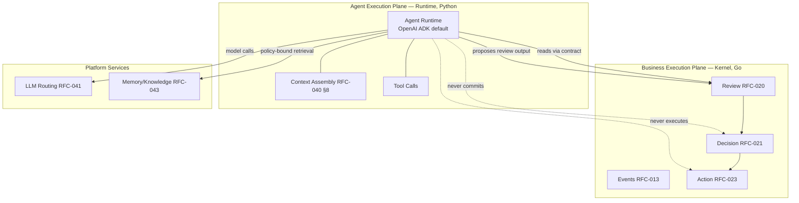

# ADR-004 — Agent Runtime

**Status:** PROPOSED (not accepted — see Open Questions and RFC-040 §6 tension)
**Date:** 2026-07-01
**Authors:** Architecture
**Supersedes:** —
**Superseded by:** —
**Related:** ADR-002, ADR-003, ADR-005, RFC-040, RFC-041, RFC-042, RFC-043, RFC-030, RFC-031, ADQ-002

---

## Context

RFC-040 defines Agents as bounded runtime participants:

- **RFC-040 §1:** "Agents are bounded runtime participants that perform cognitive, analytical,
  advisory, or execution-support work within the Praxis system. They do not replace the core
  architecture. They operate inside it."
- **RFC-040 §6:** "An Agent is a runtime participant with a defined role, capabilities,
  policies, tools, context access, and output contract." An agent "may be powered by: An LLM.
  A deterministic rules engine. A hybrid reasoning pipeline. A script. A human-assisted
  process. A local model. A cloud model."
- **RFC-040 §8** ("Agent Runtime Model") describes: input → context assembly → agent runtime →
  structured output through a service contract, with optional tool calls and an LLM Router.
- **RFC-040 §5:** "Agents propose; humans or policies decide. Agents review; Decisions commit.
  Agents may prepare Actions; Action Service executes."
- **RFC-040 §32** (invariants): "Agents do not own canonical business truth. Agents do not own
  Decisions. Agents do not execute irreversible Actions directly. Agents use Service Contracts.
  Agents use LLM Routing for model calls. Agents use explicit prompt versions."
- **RFC-040 §23:** "Agents may retrieve memory and knowledge, but they do not own memory."

**The gap.** RFC-040 §6 deliberately declines to name a concrete agent runtime — it enumerates
*kinds* of reasoning engines but no library or framework. This is correct for an architecture
RFC, but it leaves implementers without a standard runtime, which risks each agent being built
differently (divergent tool-calling, context-assembly, output-contract, and error-handling
conventions). The repository already carries an agent surface without a codified runtime:

| Location | Evidence | Implication |
|----------|----------|-------------|
| `packages/praxis_agents/` | Python agent package | Agents implemented in Python, separate from the Go kernel |
| `agents/` (critic, finance_reviewer, life_planner, opportunity_scout, progress_watcher, proposal_writer) | Per-agent definition folders | A fixed roster of agents exists |
| `configs/agents.yaml` | Agent registry + enable flags + `review_required` policy | Agent enablement is config-driven (see ADR-008) |
| `configs/llm-routing.yaml` | Per-agent model routing | Agents already route through an LLM layer (RFC-041) |

Because agents are Python and the kernel is Go (`go.mod` → `github.com/tiroq/praxis`), the
agent runtime is necessarily **out-of-process** relative to the kernel and reaches it only
through contracts (RFC-031). This physical separation is an asset: it makes RFC-040 §32's
"Agents use Service Contracts" a structural fact, not merely a guideline.

**Why a decision is needed.** Without a standard runtime, RFC-040 §8's runtime model
(context assembly, tool calls, structured output, LLM routing) would be re-implemented per
agent, producing inconsistent policy enforcement (RFC-040 §23 memory scoping, §32 prompt
versioning) and untestable behavior (RFC-060 §8 "Agent Tests"). This ADR selects a standard
agent runtime **while preserving RFC-040 §6's pluggability**.

---

## Decision

> **This ADR proposes the OpenAI Agent Development Kit (OpenAI ADK / Agents SDK) as the
> standard, default agent runtime for LLM-powered agents in Praxis. The choice is a reference
> runtime, not an architectural dependency: RFC-040 §6's requirement that an agent "may be
> powered by" any reasoning engine (rules, script, human, local/cloud model) remains binding.
> The Kernel MUST NOT depend on any agent runtime. The decision is PROPOSED; no RFC changes
> until it is promoted to ACCEPTED.**

The standard runtime governs *how an LLM-powered agent is executed* (context assembly, tool
invocation, structured output, retries) — it does **not** grant agents any authority the RFCs
withhold. All RFC-040 §32 invariants remain in force regardless of runtime.

---

## Architecture Principles

1. **Two execution planes.** Praxis has a **business execution plane** (the Kernel: events,
   reviews, decisions, actions — RFC-013/020/021/023) and an **agent execution plane** (the
   agent runtime). They are physically and logically separate.
2. **Contracts are the only bridge.** The agent plane reaches the business plane solely through
   RFC-031 service contracts and RFC-041 LLM routing (RFC-040 §32).
3. **Agents propose; the Kernel commits.** No runtime capability may let an agent commit a
   Decision or execute an irreversible Action (RFC-040 §5, §32).
4. **Runtime is replaceable.** RFC-040 §6 pluggability means swapping the runtime must not
   change any contract, invariant, or Kernel line.

### Business execution vs agent execution

The dotted edges are **forbidden**: the runtime may prepare inputs to Decision/Action but never
performs them (RFC-040 §5, §32).

---

## Responsibilities

| Concern | Owner | RFC basis |
|---|---|---|
| Event/Review/Decision/Action lifecycle | Kernel (business plane) | RFC-013/020/021/023 |
| Agent invocation, context assembly, tool orchestration, structured output | Agent runtime | RFC-040 §8 |
| Model selection, fallback, provider isolation | LLM Routing Service | RFC-041 §1, §10, §18 |
| Prompt identity and versions | Prompt Registry | RFC-042 §11 |
| Memory/knowledge retrieval (policy-bound) | Memory/Knowledge services | RFC-043 §28; RFC-040 §23 |
| Agent enablement / `review_required` policy | Configuration | `configs/agents.yaml` (ADR-008) |
| Committing Decisions / executing Actions | Kernel only | RFC-040 §5, §32 |

---

## Invariants

1. **Kernel independence.** No Kernel (Go) package imports or references an agent runtime; the
   Kernel compiles and runs with zero agents present (RFC-040 §1 "operate inside it", §32).
2. **Contract-only bridge.** Agents interact with the business plane exclusively via RFC-031
   contracts and RFC-041 routing (RFC-040 §32).
3. **No authority escalation.** The runtime cannot commit Decisions or execute irreversible
   Actions (RFC-040 §5, §32).
4. **No direct provider calls.** Agents never call LLM providers directly; all model calls go
   through LLM Routing (RFC-040 §32; RFC-041 §21). See ADR-005.
5. **Explicit prompts.** Agents use versioned prompts from the Prompt Registry (RFC-040 §32;
   RFC-042 §10).
6. **Memory non-ownership.** Agents retrieve but never own memory; access is "Policy-bound.
   Scoped. Traceable. Evidence-based. Revocable." (RFC-040 §23).
7. **Runtime pluggability.** A non-LLM agent (rules/script/human) MUST be expressible without
   the standard runtime (RFC-040 §6).

---

## Options Considered

### Option A — OpenAI Agent Development Kit (ADK / Agents SDK) *(PROPOSED)*

**Description.** A first-party agent runtime providing agent loops, tool/function calling,
structured (schema-constrained) outputs, handoffs, and guardrails, with model access through a
provider layer.

**Fits.** RFC-040 §8 (context → runtime → structured output with tool calls) maps directly to
the SDK's agent-loop + tools + structured-output primitives. RFC-040 §32 (explicit prompts,
routed model calls) is expressible. RFC-041 §10/§21 (provider isolation) is satisfied by
routing model calls through the LLM Routing Service rather than the SDK's default provider
path (see ADR-005).

**Conflicts.** RFC-040 §6 mandates runtime-agnosticism; adopting a first-party SDK as the
*standard* must be framed as a default, not a lock-in, or it contradicts §6. The SDK's native
model access must be wrapped so it does not bypass RFC-041 (ADR-005), otherwise it conflicts
with RFC-040 §32 / RFC-041 §21.

**Advantages.** Native structured-output and tool-calling reduce bespoke glue (RFC-040 §8).
First-party maintenance and strong schema-constrained outputs aid RFC-060 §8 Prompt/Agent
tests and RFC-041 §25 structured-output validation. Minimal conceptual surface.

**Disadvantages.** Provider-affinity risk: naive use couples agents to one provider, violating
RFC-041 §21 unless model calls are routed through the LLM Routing adapter. Younger ecosystem
than some graph frameworks.

**Operational impact.** Runs in the Python agent plane (`packages/praxis_agents`), out of
process from the Kernel; no Kernel footprint. Requires the LLM Routing seam to intercept model
calls.

**Implementation complexity.** Low-to-medium: adopt the SDK for the agent loop; inject an
LLM-Routing-backed model client so provider isolation holds (ADR-005).

**Long-term maintainability.** High if the routing seam is enforced; the runtime stays thin and
replaceable (RFC-040 §6).

**Verdict.** Best default: closest primitive match to RFC-040 §8, strong structured output for
verification, minimal surface — provided model calls are routed (RFC-041), not direct.

---

### Option B — LangGraph

**Description.** A graph/state-machine framework for agent workflows with explicit nodes,
edges, and persisted state.

**Fits.** RFC-040 §8 runtime model; its explicit state graph aligns conceptually with RFC-022
state machines and supports complex multi-step reasoning and human-in-the-loop pauses (useful
for RFC-040 §5 "propose; humans decide").

**Conflicts.** Its stateful graph can blur the business/agent plane boundary if workflow state
starts encoding business decisions — RFC-040 §32 forbids agents owning Decisions, and RFC-030
§5.2 forbids business rules leaking into infrastructure. Risk of re-implementing orchestration
that RFC-013 §21/ADQ-003 place outside the agent.

**Advantages.** Powerful for branching, cyclic, and human-gated flows. Explicit state aids
debugging and replay-style inspection.

**Disadvantages.** Heavier conceptual model; more ways to accidentally embed business logic in
graph nodes. Structured-output ergonomics less first-class than ADK.

**Operational impact.** Python plane; may need state persistence, adding a store the RFCs did
not ask agents to own (tension with RFC-040 §31 operational-only storage).

**Implementation complexity.** Medium-high; graph modeling per agent.

**Long-term maintainability.** Medium; power invites boundary erosion without discipline.

**Verdict.** Strong for complex flows but higher boundary-violation risk and heavier than
needed for the current agent roster. Viable secondary runtime for genuinely graph-shaped
agents.

---

### Option C — CrewAI

**Description.** A multi-agent "crew" framework emphasizing role-based collaboration among
agents.

**Fits.** The RFC-040 roster (critic, life_planner, opportunity_scout, …) reads like
role-based agents, which CrewAI models natively.

**Conflicts.** CrewAI encourages agent-to-agent delegation and autonomous task execution;
RFC-040 §5/§32 require that *the Kernel* orchestrates commitment and that agents do not execute
Actions. Inter-agent autonomy risks bypassing RFC-031 contracts and RFC-020/021 review/decision
gating.

**Advantages.** Fast to assemble role-based collaborations; opinionated ergonomics.

**Disadvantages.** Autonomy model is misaligned with Praxis's "agents propose, Kernel commits";
less control over structured outputs and provider routing (RFC-041 §21).

**Operational impact.** Python plane; multi-agent coordination adds runtime complexity.

**Implementation complexity.** Low to start, higher to constrain within RFC-040 boundaries.

**Long-term maintainability.** Medium-low: the framework's philosophy pulls against Praxis's
governance model.

**Verdict.** Philosophically misaligned (agent autonomy vs Kernel-gated commitment). Rejected as
the standard.

---

### Option D — AutoGen

**Description.** A conversational multi-agent framework built around message-passing agents and
group chats.

**Fits.** Conversational tool-use and multi-agent dialogue; flexible.

**Conflicts.** Conversation-centric autonomy and emergent control flow conflict with RFC-040
§5/§32 (deterministic proposal→review→decision gating) and RFC-060 §8 testability
(non-deterministic dialogues are hard to verify). Provider routing again needs wrapping
(RFC-041 §21).

**Advantages.** Rich multi-agent experimentation; good for research-style tasks.

**Disadvantages.** Non-deterministic control flow undermines RFC-060 determinism/traceability
quality dimensions; weaker structured-output guarantees.

**Operational impact.** Python plane; harder to bound and observe.

**Implementation complexity.** Medium; significant work to constrain for production governance.

**Long-term maintainability.** Medium-low for a governed system.

**Verdict.** Better suited to open-ended research than to Praxis's governed, testable agents.
Rejected as the standard.

---

### Option E — Microsoft Semantic Kernel

**Description.** An SDK for composing LLM "skills"/plugins with planners, memory, and connectors,
available in multiple languages (incl. .NET/Python).

**Fits.** RFC-040 §8 tool/skill invocation; planner concept maps to structured task execution;
built-in memory connectors.

**Conflicts.** Its built-in memory/planner abstractions overlap with RFC-043 (Memory/Knowledge)
and RFC-041 (routing) ownership; using them risks agents owning memory/routing, violating
RFC-040 §23/§32 and RFC-043 §28. The abstractions must be disabled/bypassed to respect Praxis
ownership, reducing the value of adopting it.

**Advantages.** Mature, polyglot, enterprise-oriented; good plugin model.

**Disadvantages.** Overlapping subsystems (memory, planning, connectors) that Praxis already
assigns to platform services (ADQ-002); adopting them creates duplicate ownership.

**Operational impact.** Python plane; heavier footprint; overlap with RFC-041/043 services.

**Implementation complexity.** Medium-high to strip overlapping features.

**Long-term maintainability.** Medium; the subsystem overlap is a standing source of drift.

**Verdict.** Capable but overlaps with Praxis-owned platform services (routing, memory).
Rejected as the standard to avoid duplicated ownership.

---

### Option F — DIY runtime

**Description.** Build a bespoke agent loop (prompt render → provider call → tool dispatch →
structured parse → retry) directly against RFC-040 §8 and RFC-041.

**Fits.** Perfect conceptual fit — nothing to reconcile with §6, because we control every line.

**Conflicts.** None architecturally; the conflict is cost. Reimplements tool-calling,
structured-output validation, and retry logic that mature runtimes already provide.

**Advantages.** Zero framework lock-in; maximal control; trivially satisfies RFC-040 §6.

**Disadvantages.** High build/maintenance cost; must re-solve schema-constrained output,
streaming, tool orchestration, and guardrails — duplicating RFC-041 §25 and RFC-042 concerns
by hand.

**Operational impact.** Python plane; all maintenance is ours.

**Implementation complexity.** High initially and ongoing.

**Long-term maintainability.** Medium: fully owned but perpetually funded by us.

**Verdict.** Excellent fallback and the model for **non-LLM agents** (rules/script/human per
RFC-040 §6), but wasteful as the default LLM runtime versus adopting ADK.

---

### Comparison Matrix

| Criterion | OpenAI ADK | LangGraph | CrewAI | AutoGen | Semantic Kernel | DIY |
|---|---|---|---|---|---|---|
| RFC-040 §8 runtime fit | ✅✅ | ✅ | ✅ | ⚠️ | ✅ | ✅✅ |
| Structured output (RFC-041 §25) | ✅✅ | ✅ | ⚠️ | ⚠️ | ✅ | build it |
| Respects "propose, Kernel commits" (§5/§32) | ✅ | ⚠️ | ❌ | ❌ | ✅ | ✅ |
| Provider isolation via routing (RFC-041 §21) | ⚠️ needs wrap | ⚠️ needs wrap | ⚠️ | ⚠️ | ⚠️ | ✅ |
| Determinism/testability (RFC-060 §8) | ✅ | ✅ | ⚠️ | ❌ | ✅ | ✅ |
| Avoids overlap with RFC-041/043 ownership | ✅ | ✅ | ✅ | ✅ | ❌ | ✅ |
| Non-LLM agent support (RFC-040 §6) | ⚠️ | ⚠️ | ❌ | ❌ | ⚠️ | ✅✅ |
| Build/maintenance cost | 🟢 low | 🟡 med | 🟢 low | 🟡 med | 🟡 med | 🔴 high |

---

## Proposed Decision

**Adopt OpenAI ADK (Option A) as the default LLM-agent runtime**, wrapped so all model calls go
through the LLM Routing Service (RFC-041 §21; ADR-005), and **retain a DIY-style minimal path
(Option F) for non-LLM agents** (rules/script/human) to honor RFC-040 §6.

**Why A over the alternatives.**

- **Over LangGraph (B):** ADK is lighter and its structured-output primitives better serve
  RFC-041 §25 and RFC-060 §8 testing; LangGraph's stateful graphs raise the risk of embedding
  business logic in agent state (RFC-040 §32; RFC-030 §5.2). LangGraph remains an approved
  secondary runtime for genuinely graph-shaped agents.
- **Over CrewAI (C) and AutoGen (D):** both center agent autonomy and emergent control flow,
  which conflicts with RFC-040 §5/§32 (Kernel-gated commitment) and RFC-060 determinism.
- **Over Semantic Kernel (E):** its built-in memory/planner/routing overlaps ownership assigned
  to platform services (RFC-041, RFC-043, ADQ-002), creating duplicate-ownership drift.
- **Over DIY (F):** ADK avoids rebuilding tool-calling/structured-output/retry; DIY is kept only
  where §6 requires non-LLM execution.
- **Decisive factor:** ADK's structured-output and tool-calling most directly realize RFC-040
  §8 while keeping the runtime thin and replaceable — provided the RFC-041 routing seam is
  enforced so provider isolation (RFC-041 §21) is never lost.

**Non-negotiable framing:** ADK is the *default*, not the architecture. RFC-040 §6 pluggability
is preserved; the Kernel remains agent-runtime-agnostic (RFC-040 §1/§32).

---

## Consequences

### Positive
- One consistent LLM-agent runtime → uniform tool-calling, structured output, and error
  handling across the RFC-040 agent roster.
- Structured outputs strengthen RFC-041 §25 validation and RFC-060 §8 Agent/Prompt tests.
- Kernel independence preserved (agents are out-of-process Python; Kernel is Go).

### Negative
- Requires a routing wrapper so ADK model calls do not bypass RFC-041 (ADR-005).
- Two runtimes to support long-term (ADK for LLM agents; minimal path for non-LLM agents).

### Trade-offs
- Accepts a first-party SDK dependency in the agent plane in exchange for lower glue cost,
  balanced by keeping the Kernel and contracts runtime-agnostic (RFC-040 §6).

### Future flexibility
- RFC-040 §6 pluggability and RFC-031 contracts mean any agent can be re-hosted on LangGraph or
  a DIY loop without Kernel or contract changes.

### Migration cost
- Refactor `packages/praxis_agents` to a common ADK-based base plus an injected
  LLM-Routing model client; express non-LLM agents on the minimal path.

### Operational impact
- Agent plane runs alongside `praxis-worker`/services in the Python runtime; no new Kernel ops.
  LLM Routing Service becomes a hard dependency of the agent plane (RFC-041).

### Development impact
- Agents share a base runtime and prompt-loading convention (RFC-042); enablement stays in
  `configs/agents.yaml` (ADR-008).

### Testing impact
- RFC-060 §8 Agent Tests and Prompt Tests can assert structured outputs and policy compliance
  against the standard runtime; RFC-062 §16 Agent benchmarks apply.

### Performance impact
- Runtime overhead is dominated by model latency (RFC-041); the SDK adds negligible local cost.
  Benchmarked via RFC-062 §16/§18.

### Failure modes
- Provider failure: handled by LLM Routing fallback (RFC-041 §18), not by the runtime.
- Malformed model output: caught by structured-output validation (RFC-041 §25) → retry/fallback.
- Attempted authority escalation (agent tries to commit/act): structurally impossible — no
  contract exposes commit/execute to agents (RFC-040 §32).

---

## Required RFC Edits (if this ADR is accepted)

| RFC | Required change | Scope |
|-----|-----------------|-------|
| RFC-040 | Add an implementation note: ADK is the default LLM-agent runtime; §6 pluggability remains binding; runtime must route model calls via RFC-041. | Agent architecture |
| RFC-041 | Note that agent runtimes must call models only through the routing seam (reinforces §21). | LLM routing |
| RFC-031 | Confirm the agent-facing contract surface exposes review/prepare operations but never commit/execute. | Service contracts |
| RFC-060/061 | Add Agent runtime conformance tests (structured output, no-commit, routed calls). | Testing / Verification |
| ADQ-002 | Cross-reference: memory/knowledge remain platform services the runtime only *calls* (RFC-043 §28). | Decision queue |

---

## Implementation Impact

### Safe to implement immediately
- Establishing an ADK-based agent base class in `packages/praxis_agents`.
- Loading prompts from a versioned source (RFC-042) and enablement from `configs/agents.yaml`.
- Keeping the Kernel free of any agent-runtime import (already true; Kernel is Go).

### Blocked until this ADR is accepted
- Standardizing all agents on ADK (needs the routing wrapper, ADR-005, accepted first).
- Declaring ADK the reference runtime in RFC-040.

---

## Verification Impact

### Existing verification affected
- `Makefile` `verify_llm_router.py` and agent-related checks must assert routed (not direct)
  model calls (RFC-041 §21).

### New verification required
- **Agent boundary test** (RFC-061 §18): the runtime cannot commit Decisions or execute Actions
  (RFC-040 §32).
- **Routing test** (RFC-061 §14): agent model calls traverse LLM Routing, never a provider SDK
  (RFC-041 §21).
- **Prompt version test** (RFC-061 §19): agents reference explicit prompt versions (RFC-042
  §10).
- **Kernel independence test** (RFC-061 §12/§14): no Go Kernel package imports an agent runtime.

### Testing changes
- Add RFC-060 §8 Agent Tests using deterministic fixtures and schema validation.

### Coverage impact
- Adds Agent/Prompt verification categories tied to RFC-040/041/042 invariants.

### Acceptance criteria
- Every LLM agent runs on the standard runtime; non-LLM agents run on the minimal path (RFC-040
  §6). No agent bypasses routing (RFC-041 §21) or commits Decisions/Actions (RFC-040 §32).

---

## Rejected Alternatives

- **CrewAI (C) / AutoGen (D):** agent-autonomy philosophies conflict with RFC-040 §5/§32
  Kernel-gated commitment and RFC-060 determinism.
- **Semantic Kernel (E):** built-in memory/planner/routing duplicate ownership assigned to
  RFC-041/043 platform services (ADQ-002).
- **DIY as the default (F):** wasteful reimplementation of tool-calling/structured-output;
  retained only for non-LLM agents (RFC-040 §6).
- **LangGraph as the default (B):** heavier and higher boundary-erosion risk; kept as an
  approved secondary runtime for graph-shaped agents.

---

## Open Questions

1. **Reconciling RFC-040 §6:** Should RFC-040 explicitly bless a *default* runtime, or must the
   architecture remain strictly unnamed and this ADR govern only implementation? (This is the
   core tension keeping the ADR PROPOSED.)
2. **Routing seam mechanics:** Exactly how does ADK's model client delegate to the LLM Routing
   Service — custom model provider, HTTP gateway, or in-process adapter? (Depends on ADR-005.)
3. **Non-LLM agents:** Which current agents (if any) are non-LLM (rules/script) and thus use the
   minimal path rather than ADK?
4. **Language boundary:** Do all agents remain Python, or will any future agent run in-process
   with the Go Kernel (which would require a Go runtime and re-open this decision)?
5. **Human-in-the-loop:** How are RFC-040 §5 human approval gates represented in the runtime vs
   in the Review Service (RFC-020)?

---

## References

- [rfcs/040-agent-architecture.md](../../rfcs/040-agent-architecture.md) — agents as bounded participants (§1), runtime-agnostic (§6), runtime model (§8), propose/decide (§5), memory non-ownership (§23), invariants (§32)
- [rfcs/041-llm-routing.md](../../rfcs/041-llm-routing.md) — provider isolation (§10, §21), structured output (§25), fallback (§18)
- [rfcs/042-prompt-versioning.md](../../rfcs/042-prompt-versioning.md) — immutable prompt versions (§10), registry (§11)
- [rfcs/043-memory-knowledge.md](../../rfcs/043-memory-knowledge.md) — memory never owns canonical truth (§28)
- [rfcs/030-system-architecture.md](../../rfcs/030-system-architecture.md) — layer ownership (§5.2), boundaries (§13.1)
- [rfcs/031-service-contracts.md](../../rfcs/031-service-contracts.md) — contracts as the only bridge
- [rfcs/060-testing-strategy.md](../../rfcs/060-testing-strategy.md) — Agent/Prompt test categories (§8)
- [docs/adr/ADR-005-llm-provider-abstraction.md](ADR-005-llm-provider-abstraction.md) — routing seam for provider isolation
- [docs/ARCHITECTURE_DECISION_QUEUE.md](../ARCHITECTURE_DECISION_QUEUE.md) — ADQ-002 (memory/knowledge ownership)
