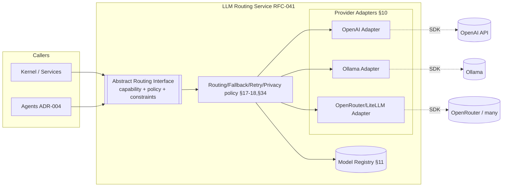

# ADR-005 — LLM Provider Abstraction

**Status:** PROPOSED (not accepted — ratifies RFC-041 intent, pending RFC record)
**Date:** 2026-07-01
**Authors:** Architecture
**Supersedes:** —
**Superseded by:** —
**Related:** ADR-004, ADR-006, ADR-008, RFC-041, RFC-040, RFC-042, RFC-030, RFC-031, ADQ-002

---

## Context

RFC-041 defines LLM Routing as a provider-independent inference layer and states the abstraction
requirement in strong, explicit terms:

- **RFC-041 §1:** "LLM Routing is the provider-independent inference layer used by agents and
  services … The LLM Routing Service owns model selection, provider abstraction, routing policy
  evaluation, fallback, retries, output validation, cost and latency controls, privacy
  enforcement, and routing observability."
- **RFC-041 §5:** Praxis routes by "capability, policy, and constraints", not by provider name;
  "The router then selects the best available model or strategy."
- **RFC-041 §10** ("Provider Adapters"): "Provider Adapters isolate Praxis from
  provider-specific APIs … **Agents and business services must never depend on provider SDKs
  directly.**"
- **RFC-041 §21** ("Provider independence"): "Agents never call providers directly. Provider
  SDKs remain inside adapters. Business logic never branches on provider name. Model selection
  can change without changing agent code."
- **RFC-041 §17–§18:** multi-model strategies ("Fast to Smart", "Cascade", "Parallel Voting",
  "Judge", "Local Preferred", …) and fallback triggers ("Provider unavailable. Timeout. Rate
  limit. Invalid output. Schema validation failure. Low confidence. Context too large. Policy
  rejection.").
- **RFC-041 §25:** "Routing must return either a valid structured response or a structured
  error."
- **RFC-041 §11** ("Model Registry") and **§34** ("Configuration Model"): a versioned,
  declarative registry of Model ID, Provider, Capabilities, Context Window, Structured Output
  Support, Privacy Class, Cost/Latency Profile, Availability, plus Provider Adapters, Routing/
  Fallback/Retry/Privacy/Cache/Validation policies.

So RFC-041 already *decides the shape* of the abstraction: the Kernel and agents depend on an
abstract, capability-oriented routing interface; concrete provider SDKs live only inside
adapters. What RFC-041 does **not** do is choose the *mechanism* that implements that boundary:
a hand-written adapter set, a gateway library, or a third-party router. That mechanism choice is
this ADR's subject.

**Evidence of an in-flight, partially chosen mechanism.**

| Location | Evidence | Implication |
|----------|----------|-------------|
| `services/llm-router/main.py` | A dedicated LLM router service exists | The routing seam is already a separate service, matching RFC-041 §1 |
| `docker-compose.yml` | `llm-router` (port 8081) depends on `ollama` (11434) | Routing already fronts a local provider |
| `configs/llm-routing.yaml` | Local `ollama` models (qwen2.5:3b, gemma) for fast tasks; external placeholders (e.g., Qwen reasoner) for critic/proposal_writer | Capability/cost routing config already exists (RFC-041 §34) |
| `Makefile` → `verify_llm_router.py` | A router verification script exists | Router behavior is already a verification target |
| RFC-030 §12 | "AI Providers: OpenRouter, Ollama, local models" | Multiple providers are anticipated |

The routing service and config already exist, but the **provider-abstraction mechanism** — how
`services/llm-router` talks to OpenAI, Ollama, OpenRouter, etc. — is not codified. Without an
ADR, each provider integration risks being wired ad hoc, which would erode RFC-041 §10/§21 the
moment a caller imports a provider SDK directly. This ADR selects the mechanism that keeps the
RFC-041 boundary intact.

---

## Decision

> **This ADR proposes that all Praxis callers (Kernel, agents, services) depend ONLY on an
> abstract, capability-oriented LLM provider/routing interface owned by the LLM Routing Service
> (RFC-041 §1). Concrete provider SDKs live exclusively behind Provider Adapters inside that
> service (RFC-041 §10). The reference mechanism is a thin custom adapter set within
> `services/llm-router`, optionally fronting a gateway (LiteLLM/OpenRouter) as one adapter among
> many — never as the caller-facing interface. The decision is PROPOSED; no RFC changes until
> promoted to ACCEPTED.**

The Kernel (business plane) and agents (agent plane, ADR-004) hold **no** provider knowledge:
no provider SDK import, no branch on provider name (RFC-041 §21). They express *what capability
and constraints* they need; the router chooses *how* (RFC-041 §5).

---

## Architecture Principles

1. **One caller-facing interface.** Callers depend on a single abstract routing port —
   capability/policy/constraints in, structured response or structured error out (RFC-041 §5,
   §25).
2. **SDKs live in adapters only.** Every concrete provider (OpenAI, Ollama, OpenRouter, …) is a
   Provider Adapter behind the interface (RFC-041 §10).
3. **No provider-name branching in business/agent code.** Selection is data-driven via the Model
   Registry and routing policy (RFC-041 §11, §34), never `if provider == "..."` in callers
   (RFC-041 §21).
4. **Swap without caller change.** Adding/removing a provider or gateway changes only adapter +
   config, never caller code (RFC-041 §21).

---

## Responsibilities

| Concern | Owner | RFC basis |
|---|---|---|
| Capability/policy/constraint request contract | Abstract routing interface | RFC-041 §5, §25 |
| Model selection, fallback, retries, validation, cost/latency/privacy | LLM Routing Service | RFC-041 §1, §17–§18, §25, §34 |
| Provider SDK calls, auth, request/response mapping | Provider Adapters | RFC-041 §10 |
| Model capability metadata | Model Registry | RFC-041 §11 |
| Routing/fallback/privacy configuration | Configuration (see ADR-008) | RFC-041 §34; `configs/llm-routing.yaml` |
| Expressing capability need (not provider) | Callers (Kernel, agents) | RFC-041 §5, §21 |

---

## Invariants

1. **No caller imports a provider SDK** (RFC-041 §10, §21).
2. **No caller branches on provider name** (RFC-041 §21).
3. **Every model call returns a structured response or a structured error** (RFC-041 §25).
4. **Selection is registry/policy-driven**, versioned and declarative (RFC-041 §11, §34).
5. **Provider swap = adapter + config change only** (RFC-041 §21).
6. **Privacy class is honored** in routing (e.g., private data → local model) (RFC-041 §34,
   privacy policies; RFC-030 §13 secrets/privacy).

---

## Options Considered

### Option A — Custom Provider Adapters behind an in-house interface *(PROPOSED, reference)*

**Description.** Praxis defines its own abstract routing interface and writes thin Provider
Adapters (OpenAI, Ollama, OpenRouter, …) inside `services/llm-router`. Routing policy, fallback,
retries, validation, and the Model Registry are Praxis-owned (RFC-041 §1, §11, §34).

**Fits.** RFC-041 §1/§10/§21 verbatim — the interface *is* the abstraction; SDKs live only in
adapters. RFC-041 §17–§18 strategies and §25 structured error contract are directly
implementable. Matches the existing `services/llm-router` + `configs/llm-routing.yaml`.

**Conflicts.** None architecturally; the cost is writing/maintaining adapters and the policy
engine ourselves.

**Advantages.** Full control over the caller-facing contract; zero third-party lock-in at the
boundary; can adopt LiteLLM/OpenRouter *as one adapter* without exposing them to callers.
Cleanest fit for RFC-041 §21 (business logic never branches on provider).

**Disadvantages.** We own the adapter maintenance and the routing/fallback engine. More initial
code than adopting a gateway wholesale.

**Operational impact.** One Praxis-owned service (`llm-router`) to run and monitor; providers
are pluggable behind it.

**Implementation complexity.** Medium: define the interface, implement 2–3 adapters
(Ollama+one cloud), and a policy/fallback engine per RFC-041 §17–§18.

**Long-term maintainability.** High: the boundary is ours and stable; providers/gateways come
and go behind it without caller impact.

**Verdict.** Best fit. It is the literal realization of RFC-041 §10/§21 and preserves freedom to
use gateways as adapters rather than as the interface.

---

### Option B — Direct provider SDK usage in callers

**Description.** Agents/services call OpenAI/Ollama SDKs directly.

**Fits.** Nothing in RFC-041; it is the anti-pattern the RFC forbids.

**Conflicts.** Directly violates RFC-041 §10 ("must never depend on provider SDKs directly") and
§21 ("Agents never call providers directly … Business logic never branches on provider name").
Breaks RFC-040 §32 (agents use LLM Routing).

**Advantages.** Fastest to prototype a single provider.

**Disadvantages.** Hard vendor lock-in; no central fallback/retry/validation (RFC-041 §18/§25);
untestable routing boundary (RFC-060 §8 routing tests); privacy routing impossible.

**Operational impact.** No central control; every caller re-implements resilience.

**Implementation complexity.** Low now, unbounded rework later.

**Long-term maintainability.** Lowest; structurally incompatible with RFC-041.

**Verdict.** Non-viable. Included to show why the abstraction exists.

---

### Option C — OpenRouter as the caller-facing router

**Description.** Point all callers at OpenRouter's unified API and let it fan out to providers.

**Fits.** Provides multi-provider access and a single API surface; conceptually similar to
RFC-041 §5 capability routing.

**Conflicts.** Makes a *third party* the caller-facing interface, so "provider independence"
becomes "OpenRouter independence" — a new lock-in at the boundary (against RFC-041 §21 intent).
Praxis-owned routing policy, privacy class routing to *local* models (Ollama), and the RFC-041
§11 registry become harder to enforce. Local/offline dev (Ollama in `docker-compose`) is not
OpenRouter's model.

**Advantages.** Instant breadth of providers; usage-based billing; no per-provider adapters.

**Disadvantages.** External dependency on the hot path; privacy routing to local models is not
its purpose; policy/fallback semantics (RFC-041 §17–§18) are partly outside our control;
caller-facing lock-in.

**Operational impact.** External dependency and cost surface on every call; offline dev breaks.

**Implementation complexity.** Low to start; higher to reconcile with privacy/local routing.

**Long-term maintainability.** Medium; convenient but strategically constraining at the boundary.

**Verdict.** Excellent **as one Provider Adapter** (Option A), poor **as the caller-facing
interface**. Rejected as the interface; embraced as an adapter.

---

### Option D — LiteLLM as the abstraction layer

**Description.** Use LiteLLM's unified client/proxy to normalize many providers behind one call
signature.

**Fits.** Normalizes provider APIs and offers fallback/retries/streaming — overlaps with
RFC-041 §10/§18 goals.

**Conflicts.** If callers import LiteLLM directly, LiteLLM becomes the abstraction, not Praxis's
interface — re-locating the boundary into a third-party library (tension with RFC-041 §21 and
§11 registry ownership). Its config model competes with `configs/llm-routing.yaml` and the
RFC-041 §34 policy model.

**Advantages.** Large provider coverage, built-in fallback/streaming, active ecosystem; can run
as a proxy.

**Disadvantages.** Ownership of routing policy/registry drifts into LiteLLM; two config models to
reconcile; caller-facing coupling if not wrapped.

**Operational impact.** Either a library dependency in the router or a proxy service to operate.

**Implementation complexity.** Low as an adapter; medium if reconciling its policy/config with
RFC-041 §34.

**Long-term maintainability.** Medium; strong when hidden behind Option A, weak when exposed.

**Verdict.** Strong **inside** a Provider Adapter (Option A) to get breadth/streaming cheaply;
not the caller-facing interface. Rejected as the interface; approved as an adapter/impl detail.

---

### Option E — ADK model abstraction as the interface

**Description.** Let the agent runtime's (OpenAI ADK, ADR-004) built-in model layer be the
provider abstraction.

**Fits.** ADK provides model access with structured output (RFC-041 §25) and could serve LLM
agents directly.

**Conflicts.** Only agents use ADK; RFC-041 §1 says routing serves "agents **and services**".
The Kernel/services are Go and out-of-process from ADK (Python) — they cannot depend on an ADK
model layer. Using ADK's model layer would also bypass the Praxis routing service (RFC-040 §32
"agents use LLM Routing"; RFC-041 §21).

**Advantages.** Zero extra layer for LLM agents; native structured output.

**Disadvantages.** Excludes non-agent callers; provider selection/policy/registry (RFC-041 §11/
§17–§18/§34) live outside Praxis control; violates the single-seam principle.

**Operational impact.** Splits routing across ADK (agents) and something else (services) — two
routing brains.

**Implementation complexity.** Low for agents, but leaves services unaddressed.

**Long-term maintainability.** Low; fragments the RFC-041 abstraction.

**Verdict.** ADK must *call through* the Praxis routing interface, not *be* it (ADR-004). Rejected
as the interface.

---

### Comparison Matrix

| Criterion | Custom adapters (A) | Direct SDK (B) | OpenRouter (C) | LiteLLM (D) | ADK model layer (E) |
|---|---|---|---|---|---|
| RFC-041 §10/§21 boundary | ✅✅ | ❌ | ⚠️ moves boundary | ⚠️ moves boundary | ⚠️ agents-only |
| Serves Kernel + agents (§1) | ✅ | ⚠️ | ✅ | ✅ | ❌ services excluded |
| Praxis-owned policy/registry (§11,§34) | ✅ | ❌ | ⚠️ | ⚠️ | ❌ |
| Multi-provider (§5) | ✅ (via adapters) | ❌ | ✅ | ✅ | ⚠️ |
| Fallback (§18) | ✅ | ❌ | ⚠️ | ✅ | ⚠️ |
| Streaming | ✅ (adapter) | ✅ | ✅ | ✅ | ✅ |
| Structured output (§25) | ✅ | ⚠️ | ⚠️ | ✅ | ✅ |
| Privacy → local routing | ✅ (Ollama adapter) | ❌ | ❌ | ⚠️ | ❌ |
| Vendor lock-in at boundary | 🟢 none | 🔴 hard | 🔴 OpenRouter | 🟡 LiteLLM | 🟡 ADK |
| Local/offline dev | ✅ | ⚠️ | ❌ | ⚠️ | ⚠️ |

---

## Proposed Decision

**Adopt custom Provider Adapters behind a Praxis-owned abstract routing interface (Option A)**,
and treat **OpenRouter (C) and LiteLLM (D) as candidate Provider Adapters** (implementation
details) rather than as the caller-facing interface. **ADK's model layer (E) must call through**
the routing interface, not replace it. **Direct SDK usage (B) is prohibited.**

**Why A over the alternatives.**

- **Over Direct SDK (B):** B violates RFC-041 §10/§21 outright.
- **Over OpenRouter (C) / LiteLLM (D) as interfaces:** both relocate the abstraction boundary
  into a third party, converting "provider independence" into "gateway dependence" and moving
  policy/registry ownership out of Praxis (RFC-041 §11, §21, §34). As *adapters*, they are
  welcome — they give cheap breadth and streaming without exposing callers.
- **Over ADK model layer (E):** it cannot serve Go services (RFC-041 §1 "agents and services")
  and would bypass the routing service (RFC-040 §32).
- **Decisive factor:** RFC-041 §10/§21 already dictate the *shape* (SDKs in adapters, callers
  provider-agnostic). Option A is the only mechanism that keeps the boundary Praxis-owned while
  still allowing gateways to be used *underneath* it.

**Multi-provider / fallback / streaming / structured output / lock-in.**

- **Multi-provider:** provider selection by capability/policy (RFC-041 §5, §11); Ollama for
  local/private/fast, cloud models for reasoning (matches `configs/llm-routing.yaml`).
- **Fallback:** centralized in the router per RFC-041 §18 triggers; callers never see provider
  failures, only a structured response or structured error (RFC-041 §25).
- **Streaming:** exposed by the interface and implemented per adapter; callers stream through
  the port, not a provider SDK.
- **Structured output:** the interface guarantees schema-validated output or a structured error
  (RFC-041 §25); validation lives in the router.
- **Vendor lock-in:** eliminated at the boundary — gateways/providers are swappable adapters
  (RFC-041 §21).

---

## Consequences

### Positive
- Callers (Kernel + agents) are fully provider-agnostic (RFC-041 §21); one seam to test,
  secure, and observe.
- Gateways (OpenRouter/LiteLLM) usable for breadth without boundary lock-in.
- Privacy routing to local models is enforceable (RFC-041 §34).

### Negative
- Praxis owns adapter and policy-engine maintenance.
- More initial code than adopting a gateway wholesale.

### Trade-offs
- Accepts in-house routing/fallback engineering in exchange for a stable, owned boundary and no
  strategic lock-in.

### Future flexibility
- New providers/gateways attach as adapters; routing policy evolves in config (RFC-041 §34)
  without caller changes.

### Migration cost
- Formalize the interface in `services/llm-router`; wrap existing Ollama access as an adapter;
  add one cloud adapter (optionally via LiteLLM/OpenRouter); align `configs/llm-routing.yaml`
  with the RFC-041 §11/§34 registry/policy shape.

### Operational impact
- `llm-router` remains a run/monitor target; provider credentials are secrets (RFC-030 §13),
  never in callers.

### Development impact
- Callers depend on the routing port; no provider SDK appears outside adapters (verifiable).

### Testing impact
- RFC-060 §8 routing-boundary tests assert no direct provider calls; RFC-062 §18 routing
  benchmarks (task success by capability, cost, latency, provider-failure handling) apply.

### Performance impact
- One extra network hop to the router; dominated by provider latency. Fallback/caching (RFC-041
  §34 cache policy) mitigate; benchmarked per RFC-062 §18.

### Failure modes
- Provider outage/timeout/rate-limit/invalid-output → router fallback (RFC-041 §18) → structured
  error only if all strategies exhausted (RFC-041 §25).
- Router outage → callers receive structured errors; no silent provider fallback in callers
  (preserves the boundary).

---

## Required RFC Edits (if this ADR is accepted)

| RFC | Required change | Scope |
|-----|-----------------|-------|
| RFC-041 | Note the reference mechanism (custom adapters; gateways as adapters, not interfaces) and that ADK model calls route through the interface. | LLM routing |
| RFC-040 | Reinforce §32 that agent runtimes call models only via the routing interface (cross-ref ADR-004). | Agent architecture |
| RFC-030 | Confirm provider credentials are secrets held by the router, not callers (§13). | System architecture |
| RFC-060/061 | Add routing-boundary verification (no provider SDK outside adapters). | Testing / Verification |

---

## Implementation Impact

### Safe to implement immediately
- Defining the abstract routing interface and Ollama adapter in `services/llm-router`.
- Aligning `configs/llm-routing.yaml` with RFC-041 §11/§34 fields.
- Keeping all callers free of provider SDK imports (already the target state).

### Blocked until this ADR is accepted
- Choosing whether the cloud adapter is hand-written or backed by LiteLLM/OpenRouter.
- Declaring the interface authoritative in RFC-041.

---

## Verification Impact

### Existing verification affected
- `verify_llm_router.py` must assert: no caller imports a provider SDK; every response is a
  structured response or structured error (RFC-041 §25).

### New verification required
- **Boundary test** (RFC-061 §14): provider SDK imports appear only in adapters (RFC-041 §10).
- **No-provider-branch test** (RFC-061 §15): no business/agent code branches on provider name
  (RFC-041 §21).
- **Fallback test** (RFC-061 §16): induced provider failure triggers fallback per RFC-041 §18.
- **Privacy routing test**: private-class requests route to a local model (RFC-041 §34).

### Testing changes
- Add RFC-060 §8 routing tests with fake adapters and induced failures.

### Coverage impact
- Adds routing-boundary, fallback, and privacy-routing categories tied to RFC-041 invariants.

### Acceptance criteria
- Zero provider SDK usage outside adapters; every call returns structured response/error;
  provider swap requires no caller change.

---

## Rejected Alternatives

- **Direct SDK usage (B):** violates RFC-041 §10/§21; no central resilience or privacy routing.
- **OpenRouter as interface (C):** relocates the boundary to a third party (lock-in) and breaks
  local/offline + privacy routing; accepted only as an adapter.
- **LiteLLM as interface (D):** moves policy/registry ownership out of Praxis; accepted only as
  an adapter/impl detail.
- **ADK model layer as interface (E):** excludes Go services and bypasses the routing service.

---

## Open Questions

1. **Cloud adapter mechanism:** hand-written per provider, or LiteLLM/OpenRouter behind one
   adapter? (Trade-off: breadth/speed vs dependency surface.)
2. **Streaming contract:** how is token streaming exposed through the interface to Go callers vs
   Python agents?
3. **Registry source of truth:** is `configs/llm-routing.yaml` the RFC-041 §11 Model Registry,
   or a projection of it? (Depends on ADR-008.)
4. **Privacy classes:** what is the canonical privacy taxonomy that maps data → local vs cloud
   models (RFC-041 §34)?
5. **Cost/latency budgets:** where are per-capability budgets defined and enforced (RFC-041 §34;
   RFC-062 §18)?

---

## References

- [rfcs/041-llm-routing.md](../../rfcs/041-llm-routing.md) — provider-independent layer (§1), routing by capability (§5), provider adapters (§10), strategies (§17), fallback (§18), provider independence (§21), structured response/error (§25), model registry (§11), configuration model (§34)
- [rfcs/040-agent-architecture.md](../../rfcs/040-agent-architecture.md) — agents use LLM routing (§32)
- [rfcs/042-prompt-versioning.md](../../rfcs/042-prompt-versioning.md) — prompts referenced by routed calls
- [rfcs/030-system-architecture.md](../../rfcs/030-system-architecture.md) — external AI providers (§12), secrets/privacy (§13)
- [rfcs/031-service-contracts.md](../../rfcs/031-service-contracts.md) — service contract boundaries
- [rfcs/060-testing-strategy.md](../../rfcs/060-testing-strategy.md) — routing boundary tests (§8)
- [rfcs/062-benchmarking.md](../../rfcs/062-benchmarking.md) — routing benchmarks (§18)
- [docs/adr/ADR-004-agent-runtime.md](ADR-004-agent-runtime.md) — agent runtime routes through this interface
- [docs/ARCHITECTURE_DECISION_QUEUE.md](../ARCHITECTURE_DECISION_QUEUE.md) — ADQ-002 (platform-service ownership)
