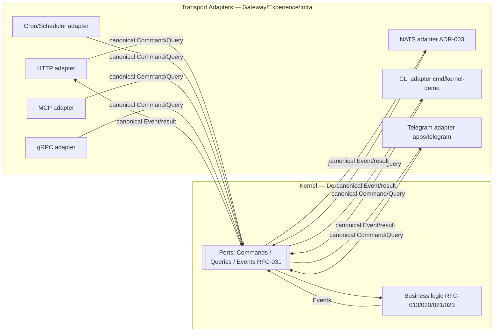

# ADR-006 — Transport Boundaries

**Status:** PROPOSED (not accepted — ratifies RFC-030 boundary intent, pending RFC record)
**Date:** 2026-07-01
**Authors:** Architecture
**Supersedes:** —
**Superseded by:** —
**Related:** ADR-002, ADR-003, ADR-005, RFC-030, RFC-031, RFC-032, RFC-013, RFC-041, RFC-060, RFC-061

---

## Context

Praxis's architecture places business logic in the Domain and Application layers and forbids it
from leaking into Infrastructure or Experience layers. Transport (how bytes arrive: HTTP, a
NATS message, a CLI invocation, a Telegram update, a cron tick, an MCP call, a gRPC request) is
an Infrastructure/Experience concern, not a domain concern:

- **RFC-030 §5.1** ("Runtime Layers"): Experience → Gateway → Application → Domain →
  Infrastructure, and "Dependencies flow strictly from higher layers to lower layers."
- **RFC-030 §5.2** ("Layer Ownership"): "Business rules must never migrate into the
  Infrastructure layer."
- **RFC-030 §12** ("External Integrations"): "State adapters normalize external protocols and
  data formats into Praxis contracts for commands, events, and queries."
- **RFC-030 §13.1** ("Runtime Boundaries"): "Domain never depends on Infrastructure",
  "Infrastructure never owns business rules", "Experience never bypasses Gateway."
- **RFC-031 §5:** "Services expose contracts, not internals"; "Services communicate through
  explicit messages."
- **RFC-030 §8:** "Praxis uses **synchronous APIs only at system edges** … Internally, services
  communicate asynchronously over an event bus."
- **RFC-032 §7:** the Gateway stage turns a "Source Request" into a "Normalized Request", i.e.,
  transport terminates at the Gateway/adapter and canonical Commands/Events flow inward.

Together these say: **the Kernel must have zero transport knowledge.** It consumes canonical
Commands/Queries and emits Events (RFC-031 §8–§9); it never parses HTTP, unmarshals a NATS
message, reads argv, or formats a Telegram reply. Every transport must **terminate at an
adapter** that translates to/from Praxis contracts (RFC-030 §12).

**Evidence the codebase already has many transports — and needs an explicit boundary.**

| Transport | Repo evidence | Layer |
|-----------|---------------|-------|
| HTTP | `services/api-kernel` (Go), `services/api` (Python), Caddy reverse proxy (`infra/caddy`) | Gateway/Experience |
| NATS | `internal/transport/nats/`, `services/worker` ("requires NATS"), `nats:2.10` | Infrastructure event bus (ADR-003) |
| CLI | `cmd/kernel-demo`, `apps/chiefly` | Experience |
| Telegram | `apps/telegram`, `configs/integrations.yaml` (`telegram`) | Experience |
| Cron/Scheduler | `services/scheduler`, RFC-030 §7 Scheduler service | Infrastructure trigger |
| MCP | RFC-030 §13 "Prompt Registry"/tooling context; ADR-002 lists MCP as an allowed integration | Experience/Integration |
| gRPC | Not present today; candidate inter-service transport | Gateway/infra |
| External APIs (GitHub, Google, Upwork) | `configs/integrations.yaml`, RFC-030 §12 | Integration egress |

The **kernel-demo** entry point already proves the intended shape: `cmd/kernel-demo` takes a
natural-language string argument and drives the kernel — the CLI is a transport adapter over a
transport-agnostic core. Without an explicit ADR, though, nothing prevents a future HTTP handler
from embedding business rules, or a NATS consumer from making domain decisions inline —
precisely the RFC-030 §5.2/§13.1 violation the architecture forbids. This ADR codifies the
boundary and the adapter obligation for every transport.

---

## Decision

> **This ADR proposes that the Kernel has ZERO transport knowledge. Every transport (HTTP,
> NATS, CLI, MCP, gRPC, Cron, Telegram, and external integrations) MUST terminate at an adapter
> that translates between the wire protocol and Praxis contracts (Commands, Queries, Events)
> per RFC-030 §12. No domain or application business logic may live in a transport adapter, and
> no transport type may appear inside the Kernel. The decision is PROPOSED; no RFC changes until
> promoted to ACCEPTED.**

The Kernel depends on **ports** (contract-shaped interfaces); adapters implement those ports for
each transport. This is the hexagonal/ports-and-adapters realization of RFC-030 §5.1 layering
and §13.1 boundaries.

---

## Architecture Principles

1. **Transport terminates at the edge.** A transport is decoded to a canonical Command/Query at
   ingress and encoded from an Event/result at egress — always in an adapter (RFC-030 §12,
   §32/RFC-032 §7).
2. **The Kernel speaks contracts only.** Kernel inputs/outputs are RFC-031 Commands, Queries,
   and Events — never `http.Request`, NATS `Msg`, argv, or a Telegram update.
3. **Adapters are logic-free of business rules.** Adapters map, validate shape, authenticate,
   and route; they never decide domain outcomes (RFC-030 §5.2, §13.1).
4. **Symmetric ingress/egress.** The same boundary applies outbound: the Kernel emits Events;
   adapters turn them into HTTP responses, NATS publishes, Telegram messages, etc.

---

## Responsibilities

| Concern | Owner | RFC basis |
|---|---|---|
| Protocol decode/encode, framing, content negotiation | Transport adapter | RFC-030 §12 |
| AuthN/session, rate limiting, request shaping | Gateway adapter | RFC-030 §7 (Gateway), §13 |
| Mapping wire → Command/Query and Event → wire | Transport adapter | RFC-030 §12; RFC-032 §7 |
| Business decisions (review/decision/action) | Kernel (Domain/Application) | RFC-013/020/021/023; RFC-030 §5.2 |
| Async internal delivery | Event bus (NATS) | RFC-030 §8; ADR-003 |
| Scheduling/cron triggers | Scheduler service | RFC-030 §7 |
| External system egress (GitHub, Google, Upwork) | Integration Service adapters | RFC-030 §7, §12 |

---

## Invariants

1. **No transport type in the Kernel.** No Kernel package imports `net/http`, `nats.go`,
   Telegram, gRPC, or reads `os.Args` (RFC-030 §5.2, §13.1).
2. **Every transport has an adapter.** No transport reaches the Kernel except through a
   contract-shaped port (RFC-030 §12).
3. **No business rules in adapters.** Adapters contain no review/decision/action logic (RFC-030
   §5.2).
4. **Experience never bypasses Gateway** for external ingress (RFC-030 §13.1).
5. **Edges synchronous, internals async.** Synchronous transports live only at edges; internal
   propagation is via events (RFC-030 §8).
6. **Symmetry.** Outbound encoding is also adapter-owned; the Kernel emits Events, not wire
   formats (RFC-031 §9).

---

## Options Considered

### Option A — Ports & Adapters (hexagonal) with a transport-agnostic Kernel *(PROPOSED)*

**Description.** The Kernel defines ports (Command/Query handlers, Event emitters). Each
transport is an adapter implementing/consuming those ports. Adapters live in `services/*` and
`apps/*`; the Kernel lives in `internal/core`.

**Fits.** RFC-030 §5.1 layering, §5.2/§13.1 boundaries, §12 adapters; RFC-031 §5 contracts;
RFC-032 §7 Gateway normalization. Matches existing `cmd/kernel-demo` (CLI adapter) and
`internal/transport/nats` (NATS adapter).

**Conflicts.** None architecturally; requires discipline and mapping code per transport.

**Advantages.** Kernel is testable without any transport (RFC-060 §8 unit/contract tests). New
transports (gRPC, MCP) attach without Kernel changes. Uniform boundary for verification (RFC-061
§14 contract layer).

**Disadvantages.** Boilerplate mapping per transport; two representations (wire vs contract) to
maintain.

**Operational impact.** Adapters deploy as services/apps; Kernel is embeddable in any of them.

**Implementation complexity.** Medium: define ports, implement adapters (HTTP, NATS, CLI exist;
add MCP/gRPC as needed).

**Long-term maintainability.** High: the boundary is explicit and enforceable by tests.

**Verdict.** Best fit; the literal realization of RFC-030 §12 and §13.1. It also generalizes
ADR-002's "orchestration terminates at public interfaces" to *all* transports.

---

### Option B — Framework-coupled Kernel (business logic in HTTP/NATS handlers)

**Description.** Put domain logic directly in HTTP handlers and NATS consumers.

**Fits.** Nothing; it is the anti-pattern RFC-030 §5.2/§13.1 forbids.

**Conflicts.** Violates "Business rules must never migrate into the Infrastructure layer"
(RFC-030 §5.2) and "Infrastructure never owns business rules" (§13.1). Couples domain to a
transport.

**Advantages.** Fastest to ship one endpoint.

**Disadvantages.** Untestable core; duplicated logic across transports; adding a transport means
re-implementing rules; breaks RFC-032 §7 normalization.

**Operational impact.** Business behavior fragmented across transports.

**Implementation complexity.** Low now, high rework later.

**Long-term maintainability.** Lowest; structurally incompatible.

**Verdict.** Non-viable; included to justify the boundary.

---

### Option C — Single transport only (HTTP-only, or NATS-only)

**Description.** Restrict Praxis to one transport to avoid multiple adapters.

**Fits.** Simplicity; still needs one adapter.

**Conflicts.** RFC-030 §7 defines a Gateway handling "HTTP, Telegram, CLI" and a Scheduler
(cron); RFC-030 §8 requires internal async (NATS) *and* edge sync (HTTP). A single transport
cannot satisfy both edge-sync and internal-async, nor the Telegram/CLI experiences already in
the repo (`apps/telegram`, `cmd/kernel-demo`).

**Advantages.** Fewer adapters to write.

**Disadvantages.** Cannot serve the required experiences and internal bus simultaneously;
contradicts existing apps and RFC-030 §7/§8.

**Operational impact.** Would force experiences to tunnel through one protocol awkwardly.

**Implementation complexity.** Low but insufficient.

**Long-term maintainability.** Low; forces workarounds.

**Verdict.** Insufficient for the defined experiences and communication model. Rejected.

---

### Option D — API Gateway product as the boundary (e.g., Kong/Envoy) with a thin Kernel

**Description.** Delegate all ingress concerns to an external API gateway; Kernel exposes minimal
endpoints.

**Fits.** RFC-030 §7 Gateway responsibilities (auth, routing) partially map to a gateway
product; Caddy already fronts services (`infra/caddy`).

**Conflicts.** A gateway product handles *edge HTTP* concerns but does not address non-HTTP
transports (NATS, CLI, Telegram, cron, MCP), nor the internal contract boundary. It complements
Option A but cannot replace the ports/adapters boundary that keeps the Kernel transport-agnostic.

**Advantages.** Offloads TLS, routing, rate limiting (already partly done by Caddy).

**Disadvantages.** Only covers HTTP ingress; does nothing for the Kernel's transport-agnosticism
across other transports; not a substitute for adapters.

**Operational impact.** Useful at the HTTP edge; orthogonal to the core boundary.

**Implementation complexity.** Low (Caddy exists); insufficient alone.

**Long-term maintainability.** Fine as an HTTP edge, not as the architectural boundary.

**Verdict.** Complementary to A (HTTP edge), not an alternative. Adopt alongside A, not instead.

---

### Comparison Matrix

| Criterion | Ports & Adapters (A) | Framework-coupled (B) | Single transport (C) | Gateway product (D) |
|---|---|---|---|---|
| Kernel transport-agnostic (§13.1) | ✅✅ | ❌ | ⚠️ | ⚠️ HTTP-only |
| Business logic out of infra (§5.2) | ✅ | ❌ | ⚠️ | ✅ (HTTP) |
| Supports HTTP+NATS+CLI+Telegram+Cron+MCP+gRPC | ✅ | ⚠️ | ❌ | ❌ |
| Edge-sync + internal-async (§8) | ✅ | ⚠️ | ❌ | ⚠️ |
| Testable core (RFC-060 §8) | ✅ | ❌ | ⚠️ | ✅ |
| New transport w/o Kernel change | ✅ | ❌ | ❌ | ⚠️ |
| Boilerplate cost | 🟡 mapping | 🟢 none | 🟢 low | 🟢 low |

---

## Proposed Decision

**Adopt Ports & Adapters (Option A)** as the transport boundary, with an **HTTP edge gateway
(Option D, Caddy) as a complementary ingress layer**. **Framework-coupled (B)** is prohibited;
**single-transport (C)** is insufficient for the defined experiences.

**Why A over the alternatives.**

- **Over B:** B embeds business rules in transports, violating RFC-030 §5.2/§13.1.
- **Over C:** C cannot serve the required Telegram/CLI experiences (`apps/telegram`,
  `cmd/kernel-demo`) plus the internal event bus (RFC-030 §8) at once.
- **Over D alone:** a gateway product covers only the HTTP edge; the Kernel still needs
  ports/adapters for NATS/CLI/Telegram/cron/MCP/gRPC. D is adopted *with* A, at the HTTP edge.
- **Decisive factor:** only A makes RFC-030 §12 ("adapters normalize external protocols") and
  §13.1 ("Domain never depends on Infrastructure") structurally true, and it already matches the
  repo's `cmd/kernel-demo` and `internal/transport/nats` shape.

**Per-transport termination.**

| Transport | Adapter location | Ingress mapping | Egress mapping |
|---|---|---|---|
| HTTP | `services/api-kernel` behind Caddy | HTTP → Command/Query | Event/result → HTTP response |
| NATS | `internal/transport/nats` (ADR-003) | Msg → Command / consume Event | Emit Event → publish |
| CLI | `cmd/kernel-demo`, `apps/chiefly` | argv/stdin → Command | Event → stdout |
| Telegram | `apps/telegram` | update → Command | Event → message |
| Cron | `services/scheduler` | schedule tick → Command | — |
| MCP | MCP adapter (new) | tool call → Command/Query | result → tool response |
| gRPC | gRPC adapter (new, optional) | RPC → Command/Query | Event/result → RPC reply |
| External APIs | Integration Service adapters | webhook/poll → Event | Command → external call |

---

## Consequences

### Positive
- Kernel is transport-agnostic and unit-testable without any wire protocol (RFC-060 §8).
- New transports (MCP, gRPC) attach without Kernel changes.
- Uniform, verifiable boundary (RFC-061 §14).

### Negative
- Mapping boilerplate per transport (wire ↔ contract).
- Two representations to keep in sync (wire schema vs contract).

### Trade-offs
- Accepts adapter boilerplate in exchange for a testable, evolvable, transport-independent core.

### Future flexibility
- Any transport can be added/removed/replaced behind ports; ADR-002 (Kestra) and ADR-003 (NATS)
  are specific instances of this general boundary.

### Migration cost
- Formalize Kernel ports; ensure `api-kernel`, `nats`, and CLI adapters map to contracts; add
  MCP/gRPC adapters when needed. Remove any inline business logic from handlers.

### Operational impact
- Caddy remains the HTTP edge; adapters deploy as services/apps; Kernel embeds in each.

### Development impact
- Contributors add transports by writing adapters, never by touching the Kernel.

### Testing impact
- RFC-060 §8 contract tests assert adapters map correctly; Kernel tests run with no transport.

### Performance impact
- One mapping step per boundary crossing; negligible relative to I/O and model latency.

### Failure modes
- Malformed input: rejected at the adapter with a transport-appropriate error; never reaches the
  Kernel as a domain concern.
- Transport outage: isolated to that adapter; other transports and the Kernel are unaffected.
- Business error: surfaced as an Event/structured result and encoded per transport by the
  adapter.

---

## Required RFC Edits (if this ADR is accepted)

| RFC | Required change | Scope |
|-----|-----------------|-------|
| RFC-030 | Add a note naming the concrete transports and the ports/adapters realization of §12/§13.1. | System architecture |
| RFC-031 | State that the Kernel's public surface is Commands/Queries/Events only; transports are adapters. | Service contracts |
| RFC-032 | Confirm the Gateway stage is the transport-termination point (§7). | Data flow |
| RFC-060/061 | Add transport-boundary verification (no transport imports in Kernel; no business logic in adapters). | Testing / Verification |

---

## Implementation Impact

### Safe to implement immediately
- Defining Kernel ports and keeping `cmd/kernel-demo` / `internal/transport/nats` as adapters.
- Ensuring `services/api-kernel` maps HTTP → contracts with no domain logic.

### Blocked until this ADR is accepted
- Declaring the ports/adapters boundary authoritative in RFC-030/031.
- Adding MCP/gRPC adapters as first-class supported transports.

---

## Verification Impact

### Existing verification affected
- Static checks must ensure no Kernel package imports `net/http`, `nats.go`, Telegram, or reads
  argv (RFC-061 §12 static, §14 contract).

### New verification required
- **Kernel purity test** (RFC-061 §12/§14): no transport dependency in `internal/core`.
- **Adapter logic test** (RFC-061 §14): adapters contain no review/decision/action logic
  (RFC-030 §5.2).
- **Contract round-trip test** (RFC-060 §8 contract): wire → Command → Event → wire preserves
  correlation/causation/trace IDs (RFC-032 §12).

### Testing changes
- Kernel tests run with an in-memory port; adapter tests use protocol fixtures.

### Coverage impact
- Adds transport-boundary and adapter-purity categories tied to RFC-030 §5.2/§13.1.

### Acceptance criteria
- Kernel compiles/runs with no transport imports; every transport reaches it via an adapter; no
  adapter holds business rules.

---

## Rejected Alternatives

- **Framework-coupled Kernel (B):** violates RFC-030 §5.2/§13.1 by placing business logic in
  transports.
- **Single transport (C):** cannot serve the defined Telegram/CLI experiences plus internal
  async bus (RFC-030 §7/§8).
- **Gateway product as the boundary (D alone):** covers only HTTP ingress; adopted *with* A at
  the edge, not instead of it.

---

## Open Questions

1. **gRPC scope:** Is inter-service gRPC in scope, or is NATS the sole inter-service transport
   (ADR-003)? Affects whether a gRPC adapter is built.
2. **MCP surface:** Which Praxis operations are exposed over MCP, and with what auth (RFC-030
   §13)?
3. **Port granularity:** One coarse Command/Query port or per-capability ports? Impacts adapter
   mapping and testing.
4. **Auth placement:** Does all authN live in the Gateway adapter (RFC-030 §7), or partly in
   Caddy (Option D)?
5. **Egress contracts:** How are outbound integration calls (GitHub/Google/Upwork) modeled as
   Commands/Events through the Integration Service (RFC-030 §12)?

---

## References

- [rfcs/030-system-architecture.md](../../rfcs/030-system-architecture.md) — runtime layers (§5.1), layer ownership (§5.2), Gateway/Scheduler services (§7), communication model (§8), external integrations/adapters (§12), runtime boundaries (§13.1)
- [rfcs/031-service-contracts.md](../../rfcs/031-service-contracts.md) — contracts not internals (§5), commands/events (§8–§9)
- [rfcs/032-data-flow.md](../../rfcs/032-data-flow.md) — Gateway normalization (§7), correlation model (§12)
- [rfcs/013-event-model.md](../../rfcs/013-event-model.md) — events emitted by the Kernel
- [rfcs/060-testing-strategy.md](../../rfcs/060-testing-strategy.md) — contract/unit tests (§8)
- [docs/adr/ADR-002-external-workflow-orchestrator.md](ADR-002-external-workflow-orchestrator.md) — orchestration terminates at public interfaces
- [docs/adr/ADR-003-internal-event-bus.md](ADR-003-internal-event-bus.md) — NATS as the internal transport
- [docs/adr/ADR-005-llm-provider-abstraction.md](ADR-005-llm-provider-abstraction.md) — provider adapters as an egress boundary
