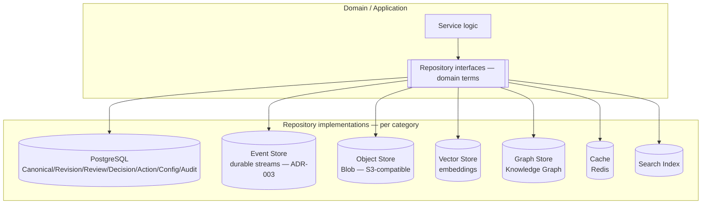

# ADR-007 — Storage Architecture

**Status:** PROPOSED (not accepted — engine selection tensions RFC-033 §4; see Open Questions)
**Date:** 2026-07-01
**Authors:** Architecture
**Supersedes:** —
**Superseded by:** —
**Related:** ADR-001, ADR-003, RFC-033, RFC-011, RFC-012, RFC-013, RFC-014, RFC-030, RFC-031, ADQ-001, ADQ-006

---

## Context

RFC-033 defines a storage model that is deliberately **engine-agnostic** and **service-owned**,
organized into storage *categories* rather than concrete databases:

- **RFC-033 §6** ("Storage Categories") defines: Event Store, Canonical Store, Revision Store,
  Review Store, Decision Store, Action Store, Projection Store, Search Index, Vector Store,
  Knowledge Graph Store, Blob Store, Cache, Audit Store, Configuration Store — each with a
  "Rebuildable" flag and an owning service.
- **RFC-033 §4** ("Non-Goals"): "This RFC does **not**: Select a concrete database engine.
  Define SQL schemas. Define table layouts … Define ORM or repository libraries. Concrete
  implementation choices are deferred to implementation RFCs and engineering design documents."
- **RFC-033 §5:** "Services integrate through Commands, Events, and Queries. **Storage is
  internal to service ownership.**"
- **RFC-033 §31:** "Services own their storage. **Services never read another service's database
  directly.**"
- **RFC-033 §24** (transactions): "A service may use local transactions for its own state.
  Cross-service distributed transactions are avoided. Cross-service coordination uses Events and
  compensating actions."
- **RFC-033 §25** (migrations): "Migrations must be versioned. Migrations must be reversible
  where practical … Event schema migrations must preserve replay compatibility."
- **RFC-033 §30** maps services → stores (Canonical Domain → Canonical + Revision Store; Review
  → Review Store; Knowledge Service → Knowledge Graph + Vector Store; etc.).

Identity ownership is fixed by RFC-014 and constrains what storage may claim as authoritative:

- **RFC-014 §15.1:** "Spaces never own identity. Integrations never own identity … **Only
  Canonical Objects own business identity.**"
- **RFC-014 §16:** external IDs are "references" that "do not confer ownership or identity."
- **RFC-012 §8:** "Each Artifact must have a **stable identity**" (document-level identity; see
  ADR-001).

**Two unresolved decisions bound this ADR.**

1. **ADQ-001 (Canonical Object vs Artifact)** is OPEN and "Blocks … storage ownership". Whether
   Artifacts share the Canonical Store or need their own store depends on ADR-001's outcome
   (Option A vs B). This ADR therefore fixes the *repository/ownership pattern* and *engine
   mapping per category* while leaving the Artifact-store question to ADR-001.
2. **ADQ-006 (Space storage mapping consistency)** is OPEN: some Space RFCs name concrete engines
   (Postgres, Neo4j, S3), contradicting RFC-033 §4. This ADR must not repeat that mistake — it
   selects a **reference** engine mapping without amending RFC-033's engine-agnostic contract.

**Evidence of an in-flight engine choice.**

| Location | Evidence | Implication |
|----------|----------|-------------|
| `docker-compose.yml` | `postgres:16-alpine` (5432) with `init.sql` | Postgres is already the deployed relational engine |
| `infra/postgres/init.sql` | Schema bootstrap | Relational storage already bootstrapped |
| `docker-compose.yml` | `ollama` embeddings-capable; no vector DB yet | Vector Store category not yet realized |
| RFC-033 §6 | Vector Store, Knowledge Graph Store categories | Vector/graph engines anticipated but unbound |

So the *relational* engine is de facto Postgres, but no ADR records it, and the vector/graph/blob
categories are unbound. This ADR makes the repository pattern and a reference engine mapping
explicit, while preserving RFC-033 §4's principle that engine choice is an implementation
decision — recording it here (implementation ADR) rather than in the RFC.

---

## Decision

> **This ADR proposes that the Domain depends ONLY on repository interfaces (ports), never on a
> concrete database, ORM, or query language (realizing RFC-033 §5/§31). Each RFC-033 §6 storage
> category is owned by exactly one service, which alone accesses its store. A reference engine
> mapping is proposed — PostgreSQL as the default relational engine for record-of-truth
> categories; object storage (S3-compatible) for blobs; a vector store for embeddings; a graph
> store for the Knowledge Graph; a cache for acceleration — but this mapping is an
> implementation choice under RFC-033 §4, not an amendment to the engine-agnostic contract.
> Artifact storage ownership is deferred to ADR-001 (ADQ-001). The decision is PROPOSED; no RFC
> changes until promoted to ACCEPTED.**

---

## Architecture Principles

1. **Repository boundary.** Domain/application code calls repository interfaces expressed in
   domain terms; the engine lives behind the interface (RFC-033 §5).
2. **Single-owner stores.** One service owns each store; no cross-service DB reads (RFC-033 §31);
   cross-service coordination is via events (RFC-033 §24).
3. **Identity stays in the Canonical Store.** Only Canonical Objects own business identity
   (RFC-014 §15.1); other stores hold references, projections, or derived data.
4. **Rebuildable vs record-of-truth.** RFC-033 §6's "Rebuildable" flag decides durability
   posture: record-of-truth stores are backed up and never rebuilt; derived stores are rebuilt
   via replay (RFC-013 §16; ADR-003).
5. **Engine choice is swappable.** Because the domain depends on repositories, an engine can be
   replaced per category without domain change (RFC-033 §4).

---

## Responsibilities

| Store (RFC-033 §6) | Owner (RFC-033 §30) | Rebuildable | Reference engine |
|---|---|---|---|
| Event Store | Event/Ingestion runtime | No | Durable streams (NATS JetStream, ADR-003) + archive |
| Canonical Store | Canonical Domain Service | Partially | PostgreSQL |
| Revision Store | Canonical Domain Service | No | PostgreSQL |
| Review Store | Review Service | No | PostgreSQL |
| Decision Store | Decision Service | No | PostgreSQL |
| Action Store | Action Service | No | PostgreSQL |
| Projection Store | Projection Service | Yes | PostgreSQL (rebuildable) |
| Search Index | Search Service | Yes | Search engine (impl TBD) |
| Vector Store | Memory/Search services | Yes | Vector DB (impl TBD) |
| Knowledge Graph Store | Knowledge Service | Where derived | Graph DB (impl TBD) |
| Blob Store | Owning service | Mixed | S3-compatible object storage |
| Cache | Owning service | Yes | Redis (see ADR-003 Option D) |
| Audit Store | Observability/Audit service | No | PostgreSQL / append-only |
| Configuration Store | Configuration/Policy service | No | PostgreSQL + files (ADR-008) |

---

## Invariants

1. **Domain never imports a DB driver/ORM** (RFC-033 §5; realized via repositories).
2. **No cross-service DB access** (RFC-033 §31); coordination via events (RFC-033 §24).
3. **Only Canonical Objects own identity** (RFC-014 §15.1); other stores reference it.
4. **Record-of-truth stores are non-rebuildable and backed up**; derived stores rebuild via
   replay (RFC-033 §6; RFC-013 §16).
5. **Migrations are versioned and replay-safe** (RFC-033 §25).
6. **No distributed transactions**; local transactions per service only (RFC-033 §24).

---

## Options Considered

The decision has two layers: (1) the **access pattern** (repositories vs shared DB), and (2) the
**engine per category**. Options A–B address the pattern; C–H address engines per category.

### Option A — Domain depends only on repository interfaces *(PROPOSED, pattern)*

**Description.** Every store is reached through a domain-defined repository interface; engines are
implementation details injected at the edge.

**Fits.** RFC-033 §5/§31 (storage internal to service; no cross-service reads), §4 (engine
choice deferred/swappable), RFC-014 §15.1 (identity in Canonical Store). RFC-030 §13.1 (Domain
never depends on Infrastructure).

**Conflicts.** None; requires repository + mapping code.

**Advantages.** Engine-swappable per category; testable with in-memory fakes (RFC-060 §8);
enforces single-owner stores; clean transaction boundaries (RFC-033 §24).

**Disadvantages.** Mapping boilerplate; risk of leaky abstractions if queries get engine-specific.

**Operational impact.** Each service owns/operates its store; clear backup posture per category.

**Implementation complexity.** Medium.

**Long-term maintainability.** High; the boundary is explicit and verifiable.

**Verdict.** Best pattern; the literal realization of RFC-033 §5/§31 and the only one that keeps
§4 (engine-agnosticism) true in code.

---

### Option B — Shared database with direct cross-service access

**Description.** Services read/write a shared schema directly.

**Fits.** Nothing in RFC-033; it is the anti-pattern §31 forbids.

**Conflicts.** Violates RFC-033 §31 ("never read another service's database directly") and §5;
couples services; breaks ownership and replay boundaries.

**Advantages.** Simple joins; no mapping.

**Disadvantages.** Tight coupling; no independent evolution/migration; identity/ownership erosion.

**Operational impact.** One DB, many owners → contention and coupling.

**Implementation complexity.** Low now, high later.

**Long-term maintainability.** Lowest; structurally incompatible.

**Verdict.** Non-viable; included to justify the repository boundary.

---

### Option C — PostgreSQL for record-of-truth categories *(PROPOSED, engine)*

**Description.** Use Postgres for Canonical/Revision/Review/Decision/Action/Projection/Audit/
Config stores.

**Fits.** RFC-033 §6 categories map to relational tables; §24 local transactions; §25 versioned
migrations. Matches `postgres:16` + `init.sql`.

**Conflicts.** RFC-033 §4 forbids the *RFC* from selecting an engine — so this selection lives in
this ADR (implementation), not in RFC-033.

**Advantages.** ACID, mature migrations, JSONB for semi-structured payloads, strong ecosystem,
already deployed. Single engine covers most categories.

**Disadvantages.** Not ideal for vectors/graphs/blobs (separate engines needed). Vertical-scaling
bias.

**Operational impact.** One relational engine to operate/back up; already present.

**Implementation complexity.** Low; already bootstrapped.

**Long-term maintainability.** High for relational categories.

**Verdict.** Best default relational engine; already the de-facto choice.

---

### Option D — SQLite for embedded/local categories

**Description.** Use SQLite for local-first/dev or single-node deployments.

**Fits.** RFC-033 §4 (any engine allowed); great for tests and `cmd/kernel-demo`.

**Conflicts.** Concurrency and multi-service ownership limits make it unsuitable as the primary
multi-service record-of-truth engine.

**Advantages.** Zero-ops, embedded, ideal for unit/integration tests and single-user local runs.

**Disadvantages.** Weak concurrent-writer story; not suited to independent per-service stores at
scale.

**Operational impact.** None (embedded); limited horizontally.

**Implementation complexity.** Low.

**Long-term maintainability.** Good for tests/local; poor as primary.

**Verdict.** Adopt for **tests/local dev** behind the same repository interfaces (Option A); not
the primary engine.

---

### Option E — Object storage / S3-compatible for Blob Store

**Description.** Store files/attachments/large payloads (RFC-033 §6 Blob Store) in S3-compatible
object storage (e.g., MinIO locally).

**Fits.** RFC-033 §6 Blob Store ("Files, attachments, large payloads"); RFC-030 §12 external
storage.

**Conflicts.** None; blobs are referenced by Canonical Objects, not identity-owning (RFC-014
§16).

**Advantages.** Cheap, scalable large-object storage; MinIO for local/offline parity.

**Disadvantages.** Eventual-consistency nuances; another system to operate.

**Operational impact.** Add MinIO locally / S3 in cloud.

**Implementation complexity.** Low-medium.

**Long-term maintainability.** High for blobs.

**Verdict.** Adopt for Blob Store; referenced (not identity-bearing).

---

### Option F — Vector database for the Vector Store

**Description.** Dedicated vector DB (e.g., pgvector-in-Postgres, Qdrant, or similar) for
embeddings/semantic search (RFC-033 §6 Vector Store).

**Fits.** RFC-033 §6 Vector Store; RFC-043 memory/semantic retrieval; RFC-062 §19 memory
benchmarks.

**Conflicts.** RFC-043 §28 memory never owns canonical truth — the vector store holds derived,
rebuildable data (RFC-033 §6 "Rebuildable: Yes"), not identity.

**Advantages.** Efficient ANN search; pgvector reuses Postgres ops footprint.

**Disadvantages.** Separate index lifecycle; must be rebuildable from source (RFC-013 §16).

**Operational impact.** Either a Postgres extension (pgvector) or a separate service.

**Implementation complexity.** Low (pgvector) to medium (standalone).

**Long-term maintainability.** High; derived and rebuildable.

**Verdict.** Adopt for Vector Store; **pgvector** is the low-ops default to keep the engine count
down (reconcile with ADQ-002 owner).

---

### Option G — Graph database for the Knowledge Graph Store

**Description.** A graph engine for semantic relationships (RFC-033 §6 Knowledge Graph Store).

**Fits.** RFC-033 §6; RFC-043 §11/§28 (Knowledge Graph references Canonical Objects, append-only
except corrections).

**Conflicts.** ADQ-006 warns against naming concrete engines (Neo4j/JanusGraph) in Space RFCs;
this ADR names a *reference* engine here (implementation), not in RFC-033.

**Advantages.** Natural traversal/relationship queries; provenance paths (RFC-062 §20).

**Disadvantages.** Another engine to operate; graph data is partly rebuildable (RFC-033 §6
"where derived").

**Operational impact.** Add a graph engine (or model relationships in Postgres initially).

**Implementation complexity.** Medium.

**Long-term maintainability.** Medium; owner is ADQ-002-dependent (Knowledge Service).

**Verdict.** Adopt a graph store for the Knowledge Graph, engine TBD; may start as
relational-modeled edges to defer a new engine until warranted.

---

### Option H — Vector/graph collapsed into Postgres (single-engine minimization)

**Description.** Use Postgres (+pgvector, + relational edge tables) for vector and graph
categories to minimize operational surface.

**Fits.** RFC-033 §6 categories remain logically distinct behind repositories (Option A), even if
physically co-located in Postgres.

**Conflicts.** Category *logical* separation must hold even when physically co-located (RFC-033
§31 single-owner semantics per store).

**Advantages.** Fewest engines to operate for Phase 1–2; simplest local dev.

**Disadvantages.** May outgrow Postgres for large-scale ANN/graph traversal later.

**Operational impact.** Lowest; one relational engine + extensions.

**Implementation complexity.** Low.

**Long-term maintainability.** High short-term; revisit at scale.

**Verdict.** Adopt as the **Phase 1–2 minimization**: physical co-location in Postgres behind
distinct repositories, with the option to split engines later without domain change (Option A).

---

### Comparison Matrix (engine per category)

| Category | Postgres (C) | SQLite (D) | Object/S3 (E) | Vector DB (F) | Graph DB (G) | Postgres-collapsed (H) |
|---|---|---|---|---|---|---|
| Canonical/Revision/Review/Decision/Action | ✅✅ | ⚠️ tests | ❌ | ❌ | ❌ | ✅ |
| Projection (rebuildable) | ✅ | ⚠️ | ❌ | ❌ | ❌ | ✅ |
| Blob | ❌ | ❌ | ✅✅ | ❌ | ❌ | ❌ |
| Vector | ⚠️ pgvector | ❌ | ❌ | ✅✅ | ❌ | ✅ pgvector |
| Knowledge Graph | ⚠️ edges | ❌ | ❌ | ❌ | ✅✅ | ⚠️ edges |
| Cache | ⚠️ | ❌ | ❌ | ❌ | ❌ | ⚠️ (Redis pref.) |
| Ops footprint | 🟢 | 🟢 | 🟡 | 🟡 | 🔴 | 🟢 |

---

## Proposed Decision

**Pattern:** adopt **repository-only Domain access (Option A)**; prohibit shared-DB access
(Option B).

**Reference engine mapping (implementation under RFC-033 §4):**
- **PostgreSQL (C)** for record-of-truth relational categories and rebuildable projections.
- **SQLite (D)** for tests and single-user local dev, behind the same repositories.
- **S3-compatible object storage (E)** (MinIO locally) for the Blob Store.
- **pgvector (F/H)** for the Vector Store initially; splittable to a standalone vector DB later.
- **Graph store (G)** for the Knowledge Graph; may start as relational-modeled edges (H) and
  split to a graph engine when traversal scale warrants.
- **Redis** for the Cache (also see ADR-003 Option D).
- **Event Store** on durable streams + archive (ADR-003).

**Why this over alternatives.**

- **Over shared DB (B):** violates RFC-033 §31; the repository boundary is non-negotiable.
- **Engine minimization (H) for Phase 1–2:** keeps operational surface small (one relational
  engine + object store + cache) while Option A guarantees engines can split later without domain
  change — so we defer graph/vector engines until scale demands them.
- **Decisive factor:** RFC-033 §4 forbids the RFC from choosing engines, but implementation must
  choose *something*; recording it here (an implementation ADR) with a swappable repository
  boundary satisfies both §4 and §5/§31.

**Deferred to ADR-001 (ADQ-001):** whether Artifacts share the Canonical Store (Option A of
ADR-001) or require a separate Artifact Store (Option B). This ADR's repository pattern
accommodates either outcome.

---

## Consequences

### Positive
- Engine-swappable, single-owner stores; testable with fakes; clean transaction boundaries.
- Minimal Phase 1–2 footprint (Postgres + object store + cache) with a path to split engines.

### Negative
- Repository mapping boilerplate; multiple engines eventually (vector/graph/blob).
- Artifact-store shape remains open pending ADR-001.

### Trade-offs
- Accepts co-locating vector/graph in Postgres now (H) in exchange for low ops, trading peak
  performance that can be reclaimed later by splitting engines.

### Future flexibility
- Any category's engine can change behind its repository without domain change (RFC-033 §4).

### Migration cost
- Formalize repositories per store; keep `init.sql` as the Postgres bootstrap; add MinIO +
  pgvector when their categories are realized. Versioned, replay-safe migrations (RFC-033 §25).

### Operational impact
- Backup posture follows RFC-033 §6 rebuildable flags: back up record-of-truth stores; rebuild
  derived stores from replay (RFC-013 §16).

### Development impact
- Contributors code against repositories; engine specifics stay in implementations.

### Testing impact
- RFC-060 §8 invariant/replay tests: derived stores reconstruct from events; identity
  uniqueness (RFC-014 §15.1); no cross-service DB access (RFC-033 §31).

### Performance impact
- Co-located vector/graph in Postgres is adequate at personal scale; split later if RFC-062
  §19/§20 benchmarks regress.

### Failure modes
- Store outage isolated to its owning service; other services degrade gracefully via events.
- Derived-store corruption: rebuild from the Event Store (RFC-013 §16).
- Migration failure: reversible where practical (RFC-033 §25); replay-safe for event schemas.

---

## Required RFC Edits (if this ADR is accepted)

| RFC | Required change | Scope |
|-----|-----------------|-------|
| RFC-033 | Add a note that a *reference implementation* engine mapping exists in this ADR (not amending §4's engine-agnosticism); cross-reference the repository pattern. | Storage model |
| RFC-011/012/014 | After ADR-001 resolves, align Artifact storage ownership wording. | Domain/identity |
| RFC-051–054 | Per ADQ-006, replace concrete-engine Space mappings with RFC-033 categories (this ADR provides the reference engines centrally). | Space models |
| RFC-060/061 | Add repository-boundary and replay/rebuild verification. | Testing / Verification |

---

## Implementation Impact

### Safe to implement immediately
- Defining repository interfaces per store; keeping Postgres + `init.sql` as the relational
  engine; test/local via SQLite behind repositories.

### Blocked until this ADR is accepted
- Choosing standalone vector/graph engines vs Postgres co-location (H) as the durable default.
- Finalizing Artifact storage ownership (needs ADR-001 / ADQ-001).
- Rewriting Space storage mappings (needs ADQ-006 resolution).

---

## Verification Impact

### Existing verification affected
- `Makefile` `verify_db.py` must assert repository-only access and single-owner stores.

### New verification required
- **Repository-boundary test** (RFC-061 §14): no domain package imports a DB driver/ORM.
- **Single-owner test** (RFC-061 §15): no service reads another's store (RFC-033 §31).
- **Identity-uniqueness test** (RFC-061 §15): only Canonical Store holds business identity
  (RFC-014 §15.1); dual namespace `canonical_id`/`artifact_id` per ADR-001.
- **Replay/rebuild test** (RFC-061 §17): derived stores reconstruct from events (RFC-013 §16).

### Testing changes
- In-memory/SQLite repositories for unit tests; ephemeral Postgres/MinIO for integration.

### Coverage impact
- Adds storage-boundary, identity, and replay categories tied to RFC-033/014/013.

### Acceptance criteria
- Domain compiles with no DB driver import; derived stores rebuild from events; no cross-service
  store access; migrations versioned and replay-safe.

---

## Rejected Alternatives

- **Shared database (B):** violates RFC-033 §31 single-owner storage.
- **SQLite as primary (D):** concurrency/ownership limits; retained for tests/local only.
- **Standalone vector/graph engines now (F/G as immediate default):** premature operational
  cost; deferred behind repositories, split later if benchmarks warrant (H).

---

## Open Questions

1. **Artifact store (ADQ-001):** shared Canonical Store (ADR-001 Option A) or separate Artifact
   Store (Option B)? Blocks final schema ownership.
2. **Vector/graph split point:** what RFC-062 §19/§20 thresholds trigger moving off Postgres
   co-location (H)?
3. **Knowledge/Memory ownership (ADQ-002):** which service owns Vector/Knowledge Graph stores?
4. **Space mappings (ADQ-006):** confirm all Space RFCs use RFC-033 categories, referencing this
   ADR's reference engines centrally.
5. **Event Store boundary:** is the durable stream (ADR-003) the Event Store, or a feed into a
   separate Event Store? Shared open question with ADR-003.

---

## References

- [rfcs/033-storage-model.md](../../rfcs/033-storage-model.md) — storage categories (§6), non-goals/engine-agnostic (§4), storage as boundary (§5), transactions (§24), migrations (§25), service ownership (§30–§31)
- [rfcs/014-identity-representation-model.md](../../rfcs/014-identity-representation-model.md) — only Canonical Objects own identity (§15.1), external references (§16)
- [rfcs/012-artifact-model.md](../../rfcs/012-artifact-model.md) — stable Artifact identity (§8)
- [rfcs/013-event-model.md](../../rfcs/013-event-model.md) — replay rebuilds derived state (§16)
- [rfcs/011-domain-model.md](../../rfcs/011-domain-model.md) — reviews/decisions operate on canonical objects
- [rfcs/030-system-architecture.md](../../rfcs/030-system-architecture.md) — every service owns its persistence (§14)
- [rfcs/043-memory-knowledge.md](../../rfcs/043-memory-knowledge.md) — memory/knowledge non-ownership (§28)
- [docs/adr/ADR-001-canonical-object-vs-artifact.md](ADR-001-canonical-object-vs-artifact.md) — Artifact storage ownership dependency
- [docs/adr/ADR-003-internal-event-bus.md](ADR-003-internal-event-bus.md) — Event Store on durable streams; Cache (Redis)
- [docs/ARCHITECTURE_DECISION_QUEUE.md](../ARCHITECTURE_DECISION_QUEUE.md) — ADQ-001 (Artifact/CO), ADQ-002 (Memory/Knowledge ownership), ADQ-006 (Space storage mapping)
