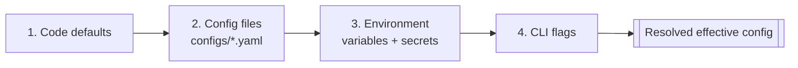

# ADR-008 — Configuration Strategy

**Status:** PROPOSED (not accepted — ratifies existing config layout, pending RFC record)
**Date:** 2026-07-01
**Authors:** Architecture
**Supersedes:** —
**Superseded by:** —
**Related:** ADR-005, ADR-007, ADR-009, RFC-030, RFC-033, RFC-041, RFC-042, RFC-060, RFC-061

---

## Context

Configuration is a cross-cutting concern the RFCs already name but do not operationalize:

- **RFC-030 §13** ("Cross-Cutting Concerns") lists **Configuration** and **Secrets management**
  alongside Observability, Audit, Replay, and the Prompt Registry.
- **RFC-033 §6** defines a **Configuration Store** ("Runtime configuration and service metadata",
  Rebuildable: No, owned by "Configuration/Policy service").
- **RFC-041 §34** ("Configuration Model"): routing config is "versioned and declarative,
  including Model Registry, Provider Adapters, Routing Policies, Fallback Policies, Retry
  Policies, Cost/Latency Budgets, Privacy Policies, Cache Policies, Validation Policies."
- **RFC-042 §11** defines the **Prompt Registry** as a configuration-like store for prompt
  identities/versions.

The repository already carries a **file-based configuration surface** and an **environment-based
deployment surface**, but no ADR states how they compose:

| Source | Repo evidence | Role |
|--------|---------------|------|
| YAML config files | `configs/agents.yaml`, `goals.yaml`, `integrations.yaml`, `life_areas.yaml`, `llm-routing.yaml`, `projects.yaml`, `review-cycles.yaml` | Declarative domain/runtime configuration |
| Environment variables | `docker-compose.yml` (`POSTGRES_USER/PASSWORD/DB`, `ADMIN_BASE_URL`) | Deployment/secret injection |
| CLI arguments | `cmd/kernel-demo "…"`, Taskfile `run:*` targets | Invocation-time input |
| Infra config | `infra/caddy/Caddyfile`, `infra/postgres/init.sql`, `infra/nats` | Infrastructure configuration |
| Defaults | Implicit in code | Baseline when unset |

Concretely, `configs/agents.yaml` drives agent enablement and the `review_required` policy
(ADR-004); `configs/llm-routing.yaml` drives model routing (ADR-005, RFC-041 §34);
`configs/review-cycles.yaml` drives review cadence (RFC-020); `docker-compose.yml` injects
Postgres credentials via environment (secrets, RFC-030 §13). These sources overlap: a value like
"which LLM model for the critic agent" could plausibly come from a YAML default, an environment
override in production, or a CLI flag in a one-off run.

**Why a decision is needed.** Without an explicit precedence order and a secrets rule, the same
setting resolved from two sources yields nondeterministic behavior, and secrets risk leaking into
version-controlled YAML — violating RFC-030 §13 secrets management. This ADR defines a **layered
configuration model** with deterministic precedence and a hard secrets boundary.

---

## Decision

> **This ADR proposes a LAYERED configuration model with a fixed precedence order:
> code defaults < config files (YAML) < environment variables < command-line flags, with
> secrets sourced ONLY from environment/secret stores and NEVER from version-controlled files.
> Declarative domain/runtime configuration lives in `configs/*.yaml` (the Configuration Store
> surface, RFC-033 §6); deployment and secret values live in the environment; invocation-time
> overrides are flags. Routing and prompt configuration remain versioned and declarative per
> RFC-041 §34 / RFC-042 §11. The decision is PROPOSED; no RFC changes until promoted to
> ACCEPTED.**

---

## Architecture Principles

1. **Layered, not scattered.** Every setting has a defined source layer and a deterministic
   resolution order (below).
2. **Declarative config is data.** `configs/*.yaml` describes *what*, not *how*; it is loaded,
   validated, and injected — never executed (aligns RFC-041 §34 declarative routing).
3. **Secrets are never files.** Credentials/tokens come from environment/secret stores only
   (RFC-030 §13); config files hold references, not secrets.
4. **Config is owned.** The Configuration/Policy service owns the Configuration Store (RFC-033
   §6); other services read resolved config, they don't reach into each other's config.

### Precedence (lowest → highest)

Higher layers override lower layers **per key**. Absent a value, the next-lower layer supplies
it; if none do, the code default applies.

---

## Precedence Rules

| Precedence | Layer | Purpose | Example (repo) | Secrets allowed? |
|---|---|---|---|---|
| 1 (lowest) | Code defaults | Safe baseline; system boots with no config | default LLM timeout | No |
| 2 | Config files (YAML) | Declarative domain/runtime config, version-controlled | `configs/agents.yaml`, `configs/llm-routing.yaml` | **No** |
| 3 | Environment variables | Per-deployment values + secret injection | `POSTGRES_PASSWORD`, `ADMIN_BASE_URL` | **Yes** |
| 4 (highest) | CLI flags | Invocation-time overrides, one-off runs | `kernel-demo "…"`, `run:*` args | No (avoid) |

Rules:
1. **Per-key override:** a higher layer overrides only the keys it sets; it does not replace the
   whole config.
2. **Secrets boundary:** secret-classed keys may be set only from layer 3 (env/secret store);
   loading a secret-classed key from layers 2 or 4 is a validation error (RFC-030 §13).
3. **Validation on load:** effective config is schema-validated at startup (RFC-060 §8 Schema
   tests; RFC-061 §13 Schema layer); invalid config fails fast.
4. **Determinism:** given identical layers, resolution is deterministic and reproducible (RFC-060
   §6 Determinism quality dimension).
5. **Versioned declarative config:** routing/prompt config remains versioned and declarative
   (RFC-041 §34; RFC-042 §11), so changes are auditable.

---

## Responsibilities

| Concern | Owner | RFC basis |
|---|---|---|
| Config schema, validation, resolution | Configuration/Policy service | RFC-033 §6 |
| Declarative domain/runtime config | `configs/*.yaml` | RFC-030 §13; RFC-033 §6 |
| Secrets injection | Environment / secret store | RFC-030 §13 |
| Routing config (registry/policies) | LLM Routing Service (declarative) | RFC-041 §34 |
| Prompt config (identities/versions) | Prompt Registry | RFC-042 §11 |
| Invocation overrides | CLI adapters | ADR-006 |

---

## Invariants

1. **No secrets in version control** (RFC-030 §13): `configs/*.yaml` and flags never carry
   credentials.
2. **Deterministic precedence:** defaults < files < env < flags, per key.
3. **Validated at boundaries:** config is schema-checked at load (RFC-061 §13).
4. **Declarative and versioned:** routing/prompt config is data, versioned (RFC-041 §34; RFC-042
   §11).
5. **Config is owned:** one service owns the Configuration Store; no cross-service config reads
   (RFC-033 §31 analog).

---

## Options Considered

### Option A — Layered precedence (defaults < files < env < flags) *(PROPOSED)*

**Description.** Compose all sources with a fixed per-key precedence; secrets only from env.

**Fits.** RFC-030 §13 (Configuration + Secrets as distinct concerns), RFC-033 §6 (Configuration
Store), RFC-041 §34 (declarative routing), RFC-042 §11 (prompt registry). Matches existing
`configs/*.yaml` + `docker-compose` env + CLI.

**Conflicts.** None; requires a resolver and schema validation.

**Advantages.** Deterministic, testable, secret-safe; supports local dev (files), production
(env), and one-off runs (flags) simultaneously. 12-factor-aligned for env/secrets.

**Disadvantages.** A resolver + schemas to build/maintain; contributors must learn the layer
rules.

**Operational impact.** Clear separation of version-controlled config vs deployment secrets.

**Implementation complexity.** Low-medium.

**Long-term maintainability.** High; one model for all settings.

**Verdict.** Best fit; realizes RFC-030 §13 and reconciles every existing source.

---

### Option B — Environment variables only (12-factor strict)

**Description.** All config via env vars; no config files.

**Fits.** RFC-030 §13 secrets; simple container deployment (`docker-compose` already uses env).

**Conflicts.** Poor fit for **structured, declarative** config that RFC-041 §34 (registry,
policies) and RFC-042 (prompts) require, and for the rich `configs/*.yaml` domain taxonomy
(life_areas, projects, review-cycles). Deep/nested config in flat env vars is unwieldy and
unversioned as a unit.

**Advantages.** Dead simple; secret-friendly; no files.

**Disadvantages.** No natural home for structured/versioned declarative config; hard to review
diffs; nested data becomes `A__B__C` sprawl.

**Operational impact.** Fine for secrets, bad for domain taxonomy.

**Implementation complexity.** Low.

**Long-term maintainability.** Low for structured config.

**Verdict.** Correct for **secrets/deployment** (it is layer 3 of Option A), insufficient for
declarative config. Rejected as the whole strategy; adopted as one layer.

---

### Option C — Config files only (YAML/JSON, no env/flags)

**Description.** All settings, including secrets, in files.

**Fits.** Great for declarative domain config (matches `configs/*.yaml`).

**Conflicts.** Placing secrets in files violates RFC-030 §13; no per-deployment override without
editing files; no one-off invocation overrides.

**Advantages.** Reviewable, structured, versioned declarative config.

**Disadvantages.** Secret leakage risk; poor deployment ergonomics; no runtime override path.

**Operational impact.** Dangerous for secrets; rigid for deployment.

**Implementation complexity.** Low.

**Long-term maintainability.** Medium; unsafe for secrets.

**Verdict.** Correct for **declarative config** (layer 2 of Option A), unsafe for secrets.
Rejected as the whole strategy; adopted as one layer.

---

### Option D — JSON as the config file format

**Description.** Use JSON instead of YAML for config files.

**Fits.** Machine-friendly, schema-validatable (JSON Schema), unambiguous.

**Conflicts.** Existing config is YAML (`configs/*.yaml`); JSON lacks comments and is less
human-friendly for the domain taxonomy (goals, life_areas). Switching format is churn without
benefit.

**Advantages.** Strict, tool-friendly, easy schema validation.

**Disadvantages.** No comments; verbose; migration churn from existing YAML.

**Operational impact.** Neutral.

**Implementation complexity.** Low (but a needless migration).

**Long-term maintainability.** Medium; less human-friendly for hand-edited domain config.

**Verdict.** YAML (human-edited, commentable) is preferred for the file layer; JSON remains fine
for machine-generated artifacts. Rejected as the primary file format.

---

### Option E — Flags-only (CLI-driven)

**Description.** Configure everything via command-line flags.

**Fits.** Great for one-off invocations (`cmd/kernel-demo`).

**Conflicts.** Impractical for structured/nested config (RFC-041 §34) and services (`api-kernel`,
`worker`) that run as daemons; secrets on the command line are insecure (visible in process
lists) — violates RFC-030 §13.

**Advantages.** Explicit per-run overrides.

**Disadvantages.** No structured config; insecure for secrets; unusable for daemons.

**Operational impact.** Only suitable for invocation overrides.

**Implementation complexity.** Low.

**Long-term maintainability.** Low as a whole strategy.

**Verdict.** Correct for **overrides** (layer 4 of Option A), insufficient alone. Rejected as the
whole strategy; adopted as one layer.

---

### Comparison Matrix

| Criterion | Layered (A) | Env-only (B) | Files-only (C) | JSON files (D) | Flags-only (E) |
|---|---|---|---|---|---|
| Structured/declarative config (§34) | ✅ | ❌ | ✅ | ✅ | ❌ |
| Secret-safe (§13) | ✅ | ✅ | ❌ | ❌ | ❌ |
| Per-deployment override | ✅ | ✅ | ❌ | ❌ | ⚠️ |
| One-off invocation override | ✅ | ⚠️ | ❌ | ❌ | ✅ |
| Human-reviewable diffs | ✅ (YAML) | ⚠️ | ✅ | ⚠️ | ❌ |
| Deterministic resolution | ✅ | ✅ | ✅ | ✅ | ✅ |
| Matches existing repo | ✅ | partial | partial | ❌ | partial |

---

## Proposed Decision

**Adopt the layered model (Option A)** with **YAML** for the file layer, **environment** for
deployment/secrets, and **flags** for invocation overrides. Options B, C, and E are **not
alternatives** but **layers** of A; D (JSON) is rejected as the primary file format in favor of
YAML.

**Why A over the alternatives.**

- **Over Env-only (B):** cannot host the structured, versioned declarative config RFC-041 §34 and
  the `configs/*.yaml` domain taxonomy require. B is A's secrets/deployment layer.
- **Over Files-only (C):** unsafe for secrets (RFC-030 §13) and rigid for deployment. C is A's
  declarative layer.
- **Over Flags-only (E):** impractical for daemons and structured config; insecure for secrets.
  E is A's override layer.
- **Over JSON (D):** YAML matches existing files and is human-editable/commentable for the domain
  taxonomy; JSON remains fine for generated artifacts.
- **Decisive factor:** RFC-030 §13 separates Configuration from Secrets; only a layered model
  with a hard secrets boundary honors both while reconciling every source already in the repo.

**Concrete mapping.**

| Setting class | Layer | Location |
|---|---|---|
| Agent roster/enablement/`review_required` | Files | `configs/agents.yaml` |
| LLM routing (registry/policies) | Files (declarative, versioned) | `configs/llm-routing.yaml` (RFC-041 §34) |
| Review cadence | Files | `configs/review-cycles.yaml` (RFC-020) |
| Domain taxonomy (goals, life_areas, projects) | Files | `configs/*.yaml` |
| DB credentials, tokens, API keys | Environment/secret store | `POSTGRES_PASSWORD`, provider keys (ADR-005) |
| Deployment URLs/hosts | Environment | `ADMIN_BASE_URL`, service hosts |
| One-off inputs | Flags | `kernel-demo "…"`, `run:*` args |

---

## Consequences

### Positive
- Deterministic, secret-safe configuration across dev/prod/one-off.
- Declarative, versioned routing/prompt config (RFC-041 §34; RFC-042 §11) stays reviewable.
- Every existing source (`configs/*.yaml`, env, CLI) has a defined role.

### Negative
- A resolver + schemas to build and maintain.
- Contributors must learn the precedence and secrets rules.

### Trade-offs
- Accepts multi-source complexity in exchange for determinism, secret safety, and reviewability.

### Future flexibility
- A secret store (Vault, cloud secrets) slots into layer 3 without changing layers 2/4.
- A Configuration Store service (RFC-033 §6) can back dynamic config later without changing the
  precedence contract.

### Migration cost
- Add a config loader with schema validation and layered resolution; ensure no secret exists in
  `configs/*.yaml`; document each key's layer.

### Operational impact
- Clear split: version-controlled declarative config vs deployment secrets; safer audits.

### Development impact
- One documented way to add a setting (choose its layer); schema validation catches mistakes at
  startup.

### Testing impact
- RFC-060 §8 Schema/Policy tests validate config; RFC-061 §13 Schema layer verifies models;
  precedence resolution is unit-tested for determinism.

### Performance impact
- Negligible; config resolves once at startup (or on reload).

### Failure modes
- Missing required key → fail fast with a clear error (no silent defaults for required values).
- Secret in a file → validation error (RFC-030 §13).
- Schema mismatch → startup failure, not runtime surprise.

---

## Required RFC Edits (if this ADR is accepted)

| RFC | Required change | Scope |
|-----|-----------------|-------|
| RFC-030 | Note the layered precedence and secrets-never-in-files rule under §13. | System architecture |
| RFC-033 | Clarify the Configuration Store (§6) is fed by files (declarative) + env (secrets/deploy). | Storage model |
| RFC-041 | Confirm routing config is the declarative file layer (§34) resolved via this precedence. | LLM routing |
| RFC-060/061 | Add config schema-validation and secrets-scanning verification. | Testing / Verification |

---

## Implementation Impact

### Safe to implement immediately
- Documenting each `configs/*.yaml` key's layer; adding schema validation on load; ensuring env
  supplies all secrets.

### Blocked until this ADR is accepted
- Declaring the precedence contract authoritative in RFC-030 §13.
- Introducing a dynamic Configuration Store service (RFC-033 §6) as the runtime config source.

---

## Verification Impact

### Existing verification affected
- Add a secrets scan to `verify:rfc`/CI ensuring no credential appears in `configs/*.yaml`.

### New verification required
- **Config schema test** (RFC-061 §13): every config file validates against its schema.
- **Secrets-boundary test** (RFC-061 §22 security): no secret-classed key sourced from files/
  flags (RFC-030 §13).
- **Precedence test** (RFC-060 §8): per-key override order is deterministic.

### Testing changes
- Unit tests for the resolver; fixtures per layer; a CI secrets scanner.

### Coverage impact
- Adds config-schema, secrets, and precedence categories.

### Acceptance criteria
- No secret in version control; config validates at startup; precedence is deterministic and
  documented per key.

---

## Rejected Alternatives

- **Env-only (B):** no home for structured/versioned declarative config; adopted only as the
  secrets/deployment layer.
- **Files-only (C):** unsafe for secrets (RFC-030 §13); adopted only as the declarative layer.
- **JSON files (D):** needless churn; YAML is human-editable/commentable and already used.
- **Flags-only (E):** impractical for daemons and structured config; adopted only as the
  override layer.

---

## Open Questions

1. **Secret store:** stay with environment variables, or introduce Vault/cloud secrets as layer
   3 (RFC-030 §13)?
2. **Dynamic config:** is runtime-reloadable config (Configuration Store service, RFC-033 §6) in
   scope, or is startup-time resolution sufficient for Phase 1–2?
3. **Schema source:** where do config schemas live and how are they versioned (RFC-061 §13)?
4. **Routing config authority:** is `configs/llm-routing.yaml` the RFC-041 §34 source of truth or
   a projection of a registry (shared question with ADR-005)?
5. **Per-Space config:** how do Space-specific settings (RFC-051–056) layer over global config?

---

## References

- [rfcs/030-system-architecture.md](../../rfcs/030-system-architecture.md) — configuration & secrets management (§13)
- [rfcs/033-storage-model.md](../../rfcs/033-storage-model.md) — Configuration Store (§6), single-owner storage (§31)
- [rfcs/041-llm-routing.md](../../rfcs/041-llm-routing.md) — declarative, versioned routing config (§34)
- [rfcs/042-prompt-versioning.md](../../rfcs/042-prompt-versioning.md) — prompt registry as config (§11)
- [rfcs/060-testing-strategy.md](../../rfcs/060-testing-strategy.md) — schema/policy tests (§8)
- [rfcs/061-verification-scripts.md](../../rfcs/061-verification-scripts.md) — schema/security layers (§13, §22)
- [docs/adr/ADR-005-llm-provider-abstraction.md](ADR-005-llm-provider-abstraction.md) — provider secrets in env, routing config declarative
- [docs/adr/ADR-007-storage-architecture.md](ADR-007-storage-architecture.md) — Configuration Store ownership
