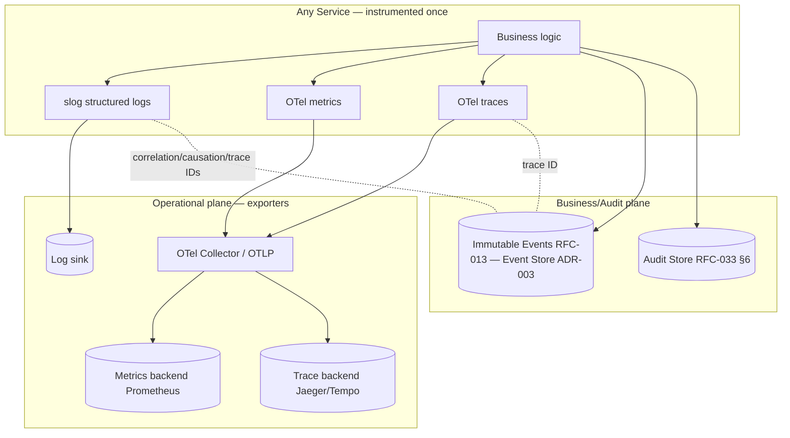

# ADR-009 — Observability

**Status:** PROPOSED (not accepted — selects concrete stack, pending RFC record)
**Date:** 2026-07-01
**Authors:** Architecture
**Supersedes:** —
**Superseded by:** —
**Related:** ADR-003, ADR-006, ADR-008, RFC-030, RFC-031, RFC-032, RFC-013, RFC-062, RFC-060

---

## Context

Observability is an RFC-defined contract, not an optional add-on. The RFCs specify *what* signals
every service must emit and *what* metadata every message must carry; they do not name a
concrete telemetry technology.

- **RFC-031 §20** ("Observability Contracts"): "Every service must emit operational signals:
  Logs, Metrics, Traces, Audit records, Health checks, Contract violation events."
- **RFC-030 §13** ("Cross-Cutting Concerns") lists **Observability**, **Audit**, and **Metrics**
  as first-class concerns; **RFC-030 §7** defines an **Observability Service** owning
  "Observability data".
- **RFC-032 §12** ("Correlation Model"): "Every datum in the pipeline carries: Correlation ID …
  Causation ID … Trace ID … These IDs are propagated and required at every stage for full
  observability and replay."
- **RFC-013 §8/§13:** every Event includes a **Trace ID**, **Correlation ID**, and **Causation
  ID** as mandatory envelope fields.
- **RFC-030 §6/§14:** "Every stage communicates exclusively through immutable events" and "The
  runtime can be rebuilt from event streams" — meaning **business events themselves are an audit/
  observability substrate**, distinct from operational telemetry.
- **RFC-062** benchmarking measures **Latency**, **Cost**, **Reliability**, and **Drift** (§6,
  §13) — which require latency/cost/reliability signals to exist.

Two distinct planes are therefore mandated:

1. **Operational telemetry** — logs, metrics, traces, health checks (RFC-031 §20): *how the
   system is running.*
2. **Business/audit record** — immutable events + audit records (RFC-013, RFC-030 §13; RFC-033
   §6 Audit Store): *what the system decided and did.*

They must share **correlation/causation/trace IDs** (RFC-032 §12) so an operational trace can be
tied to the business events it produced.

**Evidence of a gap.** The repository has **no observability stack yet**:

| Location | Evidence | Implication |
|----------|----------|-------------|
| `go.mod` | No OpenTelemetry, no logging library beyond stdlib | Telemetry not yet wired |
| Kernel (Go) | stdlib available (`log/slog`) | Structured logging available with zero new deps |
| RFC-013 §8/§13 | Trace/Correlation/Causation IDs mandatory | IDs must be generated and propagated |
| `docker-compose.yml` | No collector/Prometheus/Jaeger | No telemetry backend deployed |

Without an ADR, each service risks emitting ad-hoc `fmt.Println`/`print` logs with no structure,
no correlation IDs, and no trace context — making RFC-032 §12 propagation and RFC-031 §20
contracts unverifiable, and RFC-062 latency/cost/reliability benchmarks unmeasurable. This ADR
selects a concrete, vendor-neutral telemetry stack that realizes the RFC contracts.

---

## Decision

> **This ADR proposes OpenTelemetry (OTel) as the vendor-neutral instrumentation standard for
> traces and metrics, and structured logging via Go `log/slog` (with a matching structured
> logger in the Python agent/services plane), unified by the RFC-032 §12 correlation/causation/
> trace IDs. Business decisions and actions are recorded as immutable events (RFC-013) and audit
> records (RFC-033 §6 Audit Store) — a separate plane from operational telemetry, joined by
> shared IDs. The decision is PROPOSED; no RFC changes until promoted to ACCEPTED.**

---

## Architecture Principles

1. **Two planes, shared IDs.** Operational telemetry (logs/metrics/traces) and the business/
   audit record (events/audit) are distinct but joined by Correlation/Causation/Trace IDs
   (RFC-032 §12; RFC-013 §8/§13).
2. **Vendor-neutral instrumentation.** Instrument once with OTel; export anywhere (Prometheus,
   Jaeger/Tempo, OTLP) without code change.
3. **Structured logs only.** All logs are structured (key/value), never free-form strings, and
   always carry the correlation/trace context (RFC-031 §20).
4. **Business events are not logs.** Immutable events (RFC-013) are the record of truth for
   *what happened*; telemetry is the record of *how it ran*. Neither substitutes for the other.
5. **Audit is durable.** Audit records live in the Audit Store (RFC-033 §6, Rebuildable: No),
   owned by the Observability/Audit service (RFC-030 §7).

---

## Signal Model

| Signal | Mechanism | RFC basis | Carries IDs? |
|---|---|---|---|
| Logs | `log/slog` (Go), structured logger (Python) | RFC-031 §20 | Correlation, Causation, Trace |
| Metrics | OpenTelemetry Metrics → Prometheus/OTLP | RFC-031 §20; RFC-062 §13 | Trace exemplars |
| Traces | OpenTelemetry Traces → Jaeger/Tempo/OTLP | RFC-031 §20; RFC-032 §12 | Trace, Span, Correlation |
| Audit records | Audit Store (append-only) | RFC-030 §13; RFC-033 §6 | Correlation, Actor, Trace |
| Business events | Immutable events (Event Store) | RFC-013; RFC-030 §6 | Correlation, Causation, Trace (envelope §8) |
| Health checks | Per-service endpoints | RFC-031 §20 | n/a |
| Contract violations | Emitted as events/signals | RFC-031 §20 | Correlation, Trace |

**Correlation IDs.** Generated at the transport boundary (ADR-006) when a request enters, or
inherited from the triggering event's Causation lineage (RFC-013 §13). Propagated unchanged
through every stage (RFC-032 §12) and attached to every log line, span, event, and audit record.

---

## Invariants

1. **Every service emits the RFC-031 §20 signal set** (logs, metrics, traces, audit, health,
   contract violations).
2. **Every log/span/event/audit record carries Correlation, Causation, and Trace IDs**
   (RFC-032 §12; RFC-013 §8/§13).
3. **No unstructured logging** (no bare `print`/`fmt.Println` in services).
4. **Instrumentation is vendor-neutral** (OTel), swappable at the exporter.
5. **Business events ≠ telemetry:** decisions/actions are recorded as immutable events/audit,
   not merely logged (RFC-013; RFC-033 §6).
6. **Trace ↔ event join:** an operational trace is linkable to the business events it produced
   via shared IDs (RFC-032 §12).

---

## Options Considered

### Option A — OpenTelemetry (traces + metrics) + `slog` (logs), business events/audit separate *(PROPOSED)*

**Description.** Instrument services with OTel for traces/metrics; use Go `log/slog` for
structured logs; keep immutable events (RFC-013) and audit records (RFC-033 §6) as the business
plane; join everything by RFC-032 §12 IDs.

**Fits.** RFC-031 §20 (all six signals), RFC-032 §12 (ID propagation), RFC-013 §8/§13 (envelope
IDs), RFC-030 §7/§13 (Observability Service + Audit), RFC-062 §13 (latency/cost/reliability
metrics).

**Conflicts.** Adds OTel dependencies (not in `go.mod` today) and a collector to operate.

**Advantages.** Vendor-neutral: export to Prometheus/Jaeger/Tempo/OTLP without code change.
`slog` is stdlib → zero-dep structured logging in the Kernel. Clean separation of operational vs
business planes. Correlation across planes via shared IDs.

**Disadvantages.** OTel setup and a collector to run; two logger implementations (Go + Python).

**Operational impact.** Add an OTel Collector + backends (Prometheus, Jaeger/Tempo) to
`docker-compose`; Audit Store per RFC-033 §6.

**Implementation complexity.** Medium: OTel SDK wiring, ID propagation middleware in adapters
(ADR-006), slog handlers that inject context IDs.

**Long-term maintainability.** High: instrument once, swap backends freely.

**Verdict.** Best fit; the only option that is vendor-neutral, stdlib-friendly for logs, and
cleanly separates business events from telemetry while joining them by IDs.

---

### Option B — Vendor-specific APM (e.g., Datadog/New Relic agents)

**Description.** Use a commercial APM SDK/agent for logs, metrics, traces.

**Fits.** RFC-031 §20 signals; rich UIs and turnkey dashboards.

**Conflicts.** Vendor lock-in at the instrumentation layer contradicts the vendor-neutral,
self-hosted posture (ADR-002/003/005); cost surface; offline/local dev harder. Instrumentation
becomes vendor-coupled (analogous to the provider-lock-in the system avoids in ADR-005).

**Advantages.** Fast time-to-value; managed backends; correlation features built in.

**Disadvantages.** Lock-in, cost, and a hosted dependency; conflicts with local-first dev.

**Operational impact.** Low infra to run, but an external dependency and billing.

**Implementation complexity.** Low.

**Long-term maintainability.** Medium; convenient but strategically constraining.

**Verdict.** Rejected as the standard: lock-in contradicts the vendor-neutral posture. OTel can
export *to* such backends later without code change, preserving the option.

---

### Option C — Logs-only (structured logging as the sole observability)

**Description.** Rely on structured logs; derive metrics/traces from log parsing.

**Fits.** RFC-031 §20 logs; simple.

**Conflicts.** Fails RFC-031 §20's explicit **Metrics** and **Traces** requirements as
first-class signals; distributed tracing (RFC-032 §12) cannot be reconstructed reliably from
logs; RFC-062 latency/reliability benchmarks need real metrics/traces.

**Advantages.** Minimal; stdlib-only.

**Disadvantages.** No true distributed traces; metrics-by-log-parsing is fragile and costly.

**Operational impact.** Cheap now, blind later.

**Implementation complexity.** Low.

**Long-term maintainability.** Low; misses two mandated signal types.

**Verdict.** Insufficient: RFC-031 §20 requires metrics and traces as first-class. Rejected.

---

### Option D — Prometheus + Jaeger directly (no OTel abstraction)

**Description.** Instrument with Prometheus client libs and Jaeger client libs directly.

**Fits.** RFC-031 §20 metrics/traces; self-hosted; no vendor lock-in.

**Conflicts.** Couples code to specific client libraries; migrating backends or unifying signals
later means re-instrumentation — the same anti-pattern OTel exists to prevent. Two separate SDKs
instead of one.

**Advantages.** Mature, self-hosted, well-understood.

**Disadvantages.** Backend-coupled instrumentation; no single API for traces+metrics+logs;
harder correlation.

**Operational impact.** Run Prometheus + Jaeger; fine, but instrumentation is not portable.

**Implementation complexity.** Medium; two SDKs.

**Long-term maintainability.** Medium; re-instrumentation risk on backend change.

**Verdict.** OTel wraps exactly these backends without code coupling. Rejected as the
instrumentation API; **Prometheus/Jaeger remain valid OTel export targets** (Option A).

---

### Comparison Matrix

| Criterion | OTel + slog (A) | Vendor APM (B) | Logs-only (C) | Prom+Jaeger direct (D) |
|---|---|---|---|---|
| Logs (RFC-031 §20) | ✅ slog | ✅ | ✅ | ⚠️ separate |
| Metrics (RFC-031 §20) | ✅ | ✅ | ❌ | ✅ |
| Traces (RFC-032 §12) | ✅ | ✅ | ❌ | ✅ |
| Vendor-neutral | ✅✅ | ❌ | ✅ | ⚠️ backend-coupled |
| Self-hosted / local-first | ✅ | ⚠️ | ✅ | ✅ |
| Backend swappable w/o code change | ✅ | ❌ | n/a | ❌ |
| ID correlation across planes (§12) | ✅ | ✅ | ⚠️ | ⚠️ |
| Stdlib logging (Go) | ✅ slog | ❌ | ✅ | ⚠️ |
| New deps/ops | 🟡 OTel+collector | 🟢 agent | 🟢 none | 🟡 two SDKs |

---

## Proposed Decision

**Adopt OpenTelemetry for traces and metrics + `slog` for structured logs (Option A)**, exporting
to self-hosted backends (Prometheus for metrics, Jaeger/Tempo for traces) via an OTel Collector;
keep **business events (RFC-013) and audit records (RFC-033 §6) as a separate plane** joined by
RFC-032 §12 IDs.

**Why A over the alternatives.**

- **Over Vendor APM (B):** instrumentation lock-in contradicts the vendor-neutral, self-hosted
  posture; OTel can still export to any APM later without re-instrumenting.
- **Over Logs-only (C):** RFC-031 §20 mandates metrics and traces as first-class signals;
  logs alone cannot reconstruct distributed traces (RFC-032 §12) or feed RFC-062 benchmarks.
- **Over Prom+Jaeger direct (D):** OTel wraps both without coupling code to them; D's backends
  become A's export targets.
- **Decisive factor:** OTel satisfies RFC-031 §20 with one portable instrumentation API, `slog`
  gives zero-dependency structured logging in the Go Kernel, and the business/audit plane stays
  cleanly separate yet joinable by the RFC-032 §12 IDs that already exist in the event envelope.

**Correlation strategy.** Correlation IDs are minted at transport ingress (ADR-006) or inherited
from event causation (RFC-013 §13), injected into the `slog` context and the OTel span, and
copied into every emitted event/audit record — so a single ID threads a request across logs,
traces, events, and audit (RFC-032 §12).

---

## Consequences

### Positive
- All six RFC-031 §20 signals present and vendor-neutral; backends swappable.
- One correlation ID threads logs ↔ traces ↔ events ↔ audit (RFC-032 §12).
- RFC-062 latency/cost/reliability benchmarks become measurable.

### Negative
- New OTel dependencies + a collector/backends to operate.
- Two structured-logger implementations (Go `slog`, Python).

### Trade-offs
- Accepts OTel/collector operational cost in exchange for portability and full-signal coverage.

### Future flexibility
- Export to any OTLP-compatible backend (including managed APM) without code change.

### Migration cost
- Add OTel SDK + `slog` handlers; add ID-propagation middleware in transport adapters (ADR-006);
  add collector + backends to `docker-compose`; provision the Audit Store (RFC-033 §6).

### Operational impact
- Run OTel Collector, Prometheus, Jaeger/Tempo; back up the Audit Store (non-rebuildable).

### Development impact
- Contributors log via `slog` with context; spans/metrics via OTel helpers; never bare prints.

### Testing impact
- RFC-060 §8 Observability quality dimension; verify ID propagation and structured-log format;
  RFC-062 benchmarks consume the metrics.

### Performance impact
- Sampling controls trace overhead; metrics are cheap; logging is async-buffered. Negligible at
  personal scale.

### Failure modes
- Collector down: telemetry buffered/dropped, but **business events/audit are unaffected**
  (separate plane) — the record of truth survives (RFC-013 §11).
- Missing correlation ID: caught by verification (below), not tolerated.

---

## Required RFC Edits (if this ADR is accepted)

| RFC | Required change | Scope |
|-----|-----------------|-------|
| RFC-031 | Note OTel as the instrumentation standard realizing §20 signals. | Service contracts |
| RFC-030 | Note the Observability Service (§7) exports via OTel; Audit Store per §13. | System architecture |
| RFC-032 | Confirm correlation/causation/trace IDs bind telemetry to events (§12). | Data flow |
| RFC-062 | Note latency/cost/reliability metrics are sourced from OTel. | Benchmarking |
| RFC-060/061 | Add ID-propagation and structured-logging verification. | Testing / Verification |

---

## Implementation Impact

### Safe to implement immediately
- Adopting `slog` structured logging in the Go Kernel (stdlib, zero new deps).
- Minting/propagating correlation/causation/trace IDs at transport adapters (ADR-006).
- Recording decisions/actions as events (RFC-013) rather than logs.

### Blocked until this ADR is accepted
- Adding OTel dependencies + collector/backends as the standard.
- Declaring OTel the instrumentation standard in RFC-031 §20.

---

## Verification Impact

### Existing verification affected
- CI/log checks must reject unstructured logging in services.

### New verification required
- **ID-propagation test** (RFC-061 §17 replay / §15 invariant): every event/log/span/audit
  record carries Correlation, Causation, Trace IDs (RFC-032 §12; RFC-013 §8/§13).
- **Signal-coverage test** (RFC-061 §14): each service exposes logs/metrics/traces/health/
  contract-violation signals (RFC-031 §20).
- **Plane-separation test** (RFC-061 §15): business decisions/actions produce events/audit, not
  only logs (RFC-013; RFC-033 §6).
- **Structured-log test** (RFC-061 §12): no bare `print`/`fmt.Println` in service code.

### Testing changes
- In-test OTel exporter to assert spans/metrics; log-capture to assert structure and IDs.

### Coverage impact
- Adds observability/ID-propagation categories tied to RFC-031 §20 and RFC-032 §12.

### Acceptance criteria
- All six signals present; one correlation ID threads all planes; no unstructured logs; business
  record survives telemetry-backend outage.

---

## Rejected Alternatives

- **Vendor APM (B):** instrumentation lock-in vs the vendor-neutral posture; OTel exports to it
  later if desired.
- **Logs-only (C):** violates RFC-031 §20's metrics/traces requirements and RFC-032 §12 tracing.
- **Prometheus/Jaeger direct (D):** backend-coupled instrumentation; those backends are adopted
  as OTel export targets instead.

---

## Open Questions

1. **Backend choice:** Prometheus + Jaeger, or Grafana stack (Loki/Tempo/Mimir), or plain OTLP?
   (All are Option-A-compatible.)
2. **Audit vs event boundary:** what belongs in the Audit Store (RFC-033 §6) vs the Event Store
   (ADR-003)? Some audit may be derivable from events.
3. **Sampling policy:** head vs tail sampling for traces at personal scale?
4. **Python plane logger:** which structured logger mirrors `slog` semantics in the agent/services
   plane (ADR-004)?
5. **Cost telemetry:** how are LLM cost metrics (RFC-041 §34; RFC-062 §13) emitted from the
   routing service into OTel?

---

## References

- [rfcs/031-service-contracts.md](../../rfcs/031-service-contracts.md) — observability contracts (§20)
- [rfcs/030-system-architecture.md](../../rfcs/030-system-architecture.md) — Observability Service (§7), observability/audit/metrics (§13), events as substrate (§6, §14)
- [rfcs/032-data-flow.md](../../rfcs/032-data-flow.md) — correlation model, ID propagation (§12)
- [rfcs/013-event-model.md](../../rfcs/013-event-model.md) — trace/correlation/causation envelope (§8, §13), immutability (§11)
- [rfcs/033-storage-model.md](../../rfcs/033-storage-model.md) — Audit Store (§6)
- [rfcs/062-benchmarking.md](../../rfcs/062-benchmarking.md) — latency/cost/reliability metrics (§6, §13)
- [rfcs/060-testing-strategy.md](../../rfcs/060-testing-strategy.md) — observability quality dimension (§6, §8)
- [docs/adr/ADR-003-internal-event-bus.md](ADR-003-internal-event-bus.md) — Event Store as the business record
- [docs/adr/ADR-006-transport-boundaries.md](ADR-006-transport-boundaries.md) — correlation IDs minted at transport ingress
