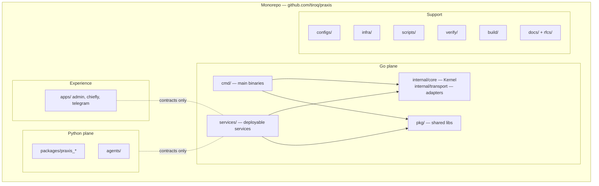

# ADR-010 — Repository Structure

**Status:** PROPOSED (not accepted — ratifies existing layout, pending RFC record)
**Date:** 2026-07-01
**Authors:** Architecture
**Supersedes:** —
**Superseded by:** —
**Related:** ADR-006, ADR-007, ADR-011, RFC-030, RFC-031, RFC-060, RFC-061

---

## Context

Praxis is a single Go module (`go.mod` → `github.com/tiroq/praxis`, Go 1.25) that also contains a
Python plane (agents, legacy services) and front-end apps. The repository layout must encode the
RFC layering (RFC-030 §5.1) and service boundaries (RFC-031) so that the architecture is visible
in the directory tree and enforceable by tooling (RFC-061 §12 static verification).

The RFCs constrain structure indirectly but firmly:

- **RFC-030 §5.1** layers (Experience → Gateway → Application → Domain → Infrastructure) with
  one-way dependencies; **§13.1** "Domain never depends on Infrastructure."
- **RFC-030 §7** enumerates services (Gateway, Ingestion, …, LLM Routing); **RFC-031** gives each
  a contract.
- **RFC-061 §8:** "All verification scripts reside under `/verify/`, with subdirectories per
  layer"; **§12** static checks include "code structure, dependencies, naming".
- **RFC-060 §8** requires unit/contract/invariant tests co-located with the code they verify.
- The RFC README mandates traceability: "Every significant module … must reference the relevant
  RFC(s)."

**Current layout (evidence).**

| Dir | Contents | Role |
|-----|----------|------|
| `cmd/` | `kernel-demo/` | Go entry-point binaries (main packages) |
| `internal/` | `core/` (kernel), `transport/` (nats) | Private Go packages — the Kernel + adapters |
| `services/` | `api/`, `api-kernel/`, `llm-router/`, `scheduler/`, `worker/` | Deployable service binaries/processes |
| `packages/` | `praxis_agents/`, `praxis_connectors/`, `praxis_core/`, `praxis_workflows/` | Python packages (agent plane) |
| `apps/` | `admin/` (Vite), `chiefly/` (CLI), `telegram/` | Experience-layer front-ends/clients |
| `scripts/` | `rebuild_graph.py`, `verify/` | Dev/ops scripts and verification suite |
| `verify/` | per-layer scripts | RFC-061 verification home |
| `build/` | binaries, coverage, `report.md` | Build outputs (generated) |
| `infra/` | `caddy/`, `cloudflare/`, `nats/`, `postgres/` | Infrastructure config |
| `docs/` | architecture, ADRs (`adr/`), decision queue | Documentation |
| `rfcs/` | RFC-000…062 | Architectural constitution |
| `configs/` | `*.yaml` | Declarative config (ADR-008) |
| `domains/` | family/finance/…/work | Space/domain content |
| `agents/` | critic, life_planner, … | Agent definitions |

**Tensions to resolve.** The tree mixes a **Go monorepo** (`cmd/`, `internal/`, `services/*`
Go binaries) with a **Python plane** (`packages/`, some `services/*`, `apps/*`) and no top-level
`pkg/` for shared, importable Go libraries. `internal/` correctly hides the Kernel from external
import, but there is no codified rule for where **shared, reusable Go code** goes, nor a written
rationale for each directory. Without an ADR, contributors may place transport code in
`internal/core`, business logic in `services/*` handlers (violating ADR-006/RFC-030 §5.2), or
shared libraries inconsistently — eroding the RFC-030 layering the tree is meant to express.

---

## Decision

> **This ADR proposes a standard Go monorepo layout as the canonical structure: `cmd/` for
> entry-point binaries, `internal/` for private packages (the Kernel and its adapters, not
> importable outside the module), `pkg/` for shared reusable libraries safe to import,
> `services/` for deployable services, plus the supporting top-level dirs (`apps/`, `configs/`,
> `infra/`, `scripts/`, `verify/`, `build/`, `docs/`, `rfcs/`). The Python agent plane
> (`packages/`, `agents/`, relevant `apps/`) is a sibling plane bridged only by contracts
> (ADR-006). The decision is PROPOSED; no RFC changes until promoted to ACCEPTED.**

---

## Architecture Principles

1. **Structure mirrors layers.** The tree makes RFC-030 §5.1 layering visible: Kernel in
   `internal/core`, transports in `internal/transport` + `services/`, experiences in `apps/`,
   infra in `infra/`.
2. **`internal/` enforces the boundary.** Go's `internal/` rule makes "Domain never imported by
   the wrong layer" a compiler-enforced fact (RFC-030 §13.1), not a convention.
3. **`pkg/` is the only public library surface.** Shared, importable Go code lives in `pkg/`;
   everything Kernel-private stays in `internal/`.
4. **Two planes, one repo.** Go (Kernel/services) and Python (agents) coexist as a monorepo but
   communicate only through contracts (ADR-006; RFC-031), never by importing across the language
   boundary.

---

## Directory Responsibilities

| Directory | Purpose | Why it exists | RFC/ADR basis |
|---|---|---|---|
| `cmd/` | Entry-point `main` packages (one per binary) | Keeps binaries thin; wiring only, no logic | Go convention; RFC-030 §5.1 |
| `internal/core/` | The Kernel (events, review, decision, action) | Compiler-enforced privacy → no external import of domain | RFC-030 §13.1; ADR-006 |
| `internal/transport/` | Transport adapters (NATS, …) | Transports terminate here, not in the Kernel | ADR-006; RFC-030 §12 |
| `pkg/` | Shared, importable Go libraries | Single public surface for reusable code | Go convention |
| `services/` | Deployable services (`api-kernel`, `worker`, `scheduler`, `llm-router`) | One process per RFC-031 service boundary | RFC-030 §7; RFC-031 |
| `apps/` | Experience clients (admin UI, CLI, Telegram) | Experience layer; never bypasses Gateway | RFC-030 §5.1/§13.1 |
| `packages/` | Python agent-plane packages | Agent runtime lives out-of-process (ADR-004) | ADR-004; RFC-040 |
| `agents/` | Agent definitions/config | Declarative agent roster | RFC-040; ADR-008 |
| `configs/` | Declarative YAML config | Config file layer | ADR-008; RFC-033 §6 |
| `infra/` | Infra config (Caddy, NATS, Postgres, Cloudflare) | Infrastructure layer artifacts | RFC-030 §5.1 |
| `scripts/` | Dev/ops scripts (graph rebuild, etc.) | Automation not shipped in binaries | RFC-061 |
| `verify/` | Verification scripts, per layer | RFC-061 verification home | RFC-061 §8 |
| `build/` | Generated build outputs | Isolates artifacts from source (git-ignored) | ADR-011 |
| `docs/` | Docs + ADRs (`docs/adr/`) | Decisions and design records | RFC README |
| `rfcs/` | Architectural constitution | Single source of truth | RFC README |

---

## Invariants

1. **Kernel privacy:** the Kernel lives in `internal/` and is not importable outside the module
   (RFC-030 §13.1).
2. **No transport in `internal/core`:** transports live in `internal/transport` or `services/`
   (ADR-006).
3. **No business logic in `services/*` handlers or `apps/*`:** logic stays in the Kernel
   (RFC-030 §5.2).
4. **Shared Go code only in `pkg/`:** nothing importable escapes `internal/` except via `pkg/`.
5. **Cross-plane only via contracts:** Python ↔ Go communicate via RFC-031 contracts, never by
   source import (ADR-006).
6. **Generated artifacts only in `build/`:** source is never mixed with outputs.

---

## Options Considered

### Option A — Standard Go monorepo (`cmd/` + `internal/` + `pkg/` + `services/`) *(PROPOSED)*

**Description.** Adopt the widely-used Go project layout, adding an explicit `pkg/` for shared
libraries, with the Python plane as a sibling.

**Fits.** RFC-030 §5.1/§13.1 (layering + Kernel privacy via `internal/`), RFC-031 (service per
`services/*`), RFC-061 §8 (`/verify/`). Matches the existing `cmd/`, `internal/`, `services/`.

**Conflicts.** `pkg/` does not yet exist; the Go/Python split needs an explicit bridge rule.

**Advantages.** Familiar to Go developers; `internal/` gives compiler-enforced boundaries;
monorepo enables atomic cross-cutting changes and one source of truth for RFC traceability.

**Disadvantages.** Mixed-language monorepo needs discipline; `pkg/` vs `internal/` placement
decisions per package.

**Operational impact.** One repo, one CI, one `go.mod`; simple.

**Implementation complexity.** Low; mostly ratifies current layout + adds `pkg/`.

**Long-term maintainability.** High; conventional and enforceable.

**Verdict.** Best fit; encodes RFC-030 layering in the tree and uses `internal/` to make the
Kernel boundary a compiler fact.

---

### Option B — Flat/ad-hoc layout (no `internal/`, no `cmd/`)

**Description.** Put packages at the repo root without the standard directories.

**Fits.** Nothing structural; loses `internal/` enforcement.

**Conflicts.** Cannot compiler-enforce Kernel privacy (RFC-030 §13.1); obscures layering;
harder for RFC-061 §12 static checks to reason about structure.

**Advantages.** Fewer directories initially.

**Disadvantages.** No boundary enforcement; poor discoverability; scales badly.

**Operational impact.** Neutral now, painful later.

**Implementation complexity.** Low.

**Long-term maintainability.** Low.

**Verdict.** Rejected; discards the `internal/` boundary the architecture depends on.

---

### Option C — Polyrepo (one repo per service)

**Description.** Split each RFC-031 service into its own repository.

**Fits.** Strong service isolation; independent deploy cadence.

**Conflicts.** RFC-first governance and traceability ("code references accepted RFCs") is far
harder across repos; cross-cutting RFC changes (e.g., event envelope) require coordinated multi-
repo PRs; the graphify/verification tooling assumes one tree.

**Advantages.** Independent versioning/deploy; clear ownership per repo.

**Disadvantages.** Cross-service atomic changes are painful; duplicated tooling/CI; RFC↔code
traceability fragmented; overkill for a single-operator system.

**Operational impact.** N repos, N CIs; higher coordination cost.

**Implementation complexity.** High to split; ongoing coordination.

**Long-term maintainability.** Medium at large org scale; poor at personal scale.

**Verdict.** Rejected for current scale; a monorepo better serves RFC-first traceability and
atomic cross-cutting change.

---

### Option D — Domain-partitioned layout (top-level per domain/Space)

**Description.** Organize the tree by Space/domain (`family/`, `finance/`, …) rather than by
architectural layer.

**Fits.** RFC-050–056 Spaces; the existing `domains/` folder already holds Space content.

**Conflicts.** Layer boundaries (RFC-030 §5.1) become implicit; the Kernel (cross-domain) has no
natural home; risks per-domain duplication of Kernel logic. Spaces are a *runtime projection*
concern (RFC-050), not a code-organization axis for the Kernel.

**Advantages.** Domain locality; good for Space-specific content (`domains/` already does this).

**Disadvantages.** Fragments the single Kernel; obscures layering; duplicates cross-cutting code.

**Operational impact.** Neutral.

**Implementation complexity.** Medium.

**Long-term maintainability.** Low for the Kernel; fine for domain *content* (kept in `domains/`).

**Verdict.** Rejected as the primary axis; retained only for domain *content* (`domains/`), not
for Kernel code, which is organized by layer (Option A).

---

### Comparison Matrix

| Criterion | Std Go monorepo (A) | Flat (B) | Polyrepo (C) | Domain-partitioned (D) |
|---|---|---|---|---|
| Kernel privacy via `internal/` (§13.1) | ✅✅ | ❌ | ✅ per-repo | ⚠️ |
| Layering visible (§5.1) | ✅ | ❌ | ⚠️ | ❌ |
| RFC↔code traceability | ✅ | ⚠️ | ❌ | ⚠️ |
| Atomic cross-cutting change | ✅ | ✅ | ❌ | ⚠️ |
| Verification tooling fit (RFC-061 §8) | ✅ | ⚠️ | ❌ | ⚠️ |
| Scales to more services | ✅ | ❌ | ✅ | ⚠️ |
| Matches current repo | ✅ | ❌ | ❌ | partial (`domains/`) |
| Ops overhead | 🟢 one CI | 🟢 | 🔴 N CIs | 🟡 |

---

## Proposed Decision

**Adopt the standard Go monorepo layout (Option A)**: `cmd/` (binaries), `internal/` (Kernel +
adapters), `pkg/` (shared libraries), `services/` (deployable services), with `apps/`,
`configs/`, `infra/`, `scripts/`, `verify/`, `build/`, `docs/`, `rfcs/` as supporting trees, and
the Python plane (`packages/`, `agents/`) as a sibling bridged only by contracts. Keep
`domains/` for Space **content** (a limited, content-only application of Option D), never for
Kernel code.

**Why A over the alternatives.**

- **Over Flat (B):** B loses the `internal/` compiler boundary that makes RFC-030 §13.1
  enforceable.
- **Over Polyrepo (C):** C fragments RFC-first traceability and makes cross-cutting RFC changes
  painful; a monorepo gives atomic change and one source of truth at personal scale.
- **Over Domain-partitioned (D):** D fragments the single Kernel and hides layering; domain
  *content* stays in `domains/`, but *code* is organized by layer.
- **Decisive factor:** Option A encodes RFC-030 §5.1 layering directly in the tree and uses Go's
  `internal/` to convert the RFC-030 §13.1 boundary from a rule into a compiler guarantee, while
  matching the repo as it already exists.

**Why it scales.** New services are new `services/*` dirs with an RFC-031 contract; shared code
graduates to `pkg/`; the Kernel stays private in `internal/`; verification scales by adding
`verify/*` scripts (RFC-061 §8). Adding a transport is a new `internal/transport/*` or
`services/*` adapter (ADR-006), never a Kernel change.

---

## Consequences

### Positive
- Layering and Kernel privacy are visible and compiler-enforced.
- One repo → atomic cross-cutting changes and unified RFC↔code traceability.
- Conventional layout lowers onboarding cost for Go developers.

### Negative
- Mixed-language monorepo needs discipline at the Go/Python bridge.
- `pkg/` vs `internal/` placement is a per-package judgment.

### Trade-offs
- Accepts monorepo coordination in exchange for atomic change and boundary enforcement.

### Future flexibility
- Services can later be extracted to their own repos if scale demands, because each already has a
  clean `services/*` boundary and an RFC-031 contract.

### Migration cost
- Introduce `pkg/`; move any shared Go code out of `internal/` or `services/*` into `pkg/`;
  document each directory's purpose; ensure `build/` is git-ignored.

### Operational impact
- One CI pipeline (ADR-011); one module version; simpler releases.

### Development impact
- Clear placement rules: binaries → `cmd/`, Kernel → `internal/core`, adapters →
  `internal/transport`/`services`, shared → `pkg/`, experiences → `apps/`.

### Testing impact
- Tests co-locate with code (RFC-060 §8); `verify/` holds cross-cutting checks (RFC-061 §8).

### Performance impact
- None (structural).

### Failure modes
- Misplaced code (e.g., transport in `internal/core`) is caught by static verification (RFC-061
  §12) — see below.

---

## Required RFC Edits (if this ADR is accepted)

| RFC | Required change | Scope |
|-----|-----------------|-------|
| RFC-030 | Note the repository layout that realizes the §5.1 layers and §13.1 boundary. | System architecture |
| RFC-031 | Note that each service maps to a `services/*` directory with a contract. | Service contracts |
| RFC-061 | Confirm `/verify/` layout and add structure/naming static checks (§8, §12). | Verification |
| RFC-060 | Note test co-location convention. | Testing |

---

## Implementation Impact

### Safe to implement immediately
- Documenting directory purposes; keeping the Kernel in `internal/core`; keeping `verify/`
  per-layer.

### Blocked until this ADR is accepted
- Introducing `pkg/` as the canonical shared-library surface and migrating shared code into it.
- Declaring the layout authoritative in RFC-030/031.

---

## Verification Impact

### Existing verification affected
- Static checks (`verify/`, `scripts/verify/`) should assert directory/import rules.

### New verification required
- **Boundary import test** (RFC-061 §12/§14): no `internal/core` import of transport libs
  (ADR-006); no `services/*`/`apps/*` package holds business logic (RFC-030 §5.2).
- **Public-surface test** (RFC-061 §12): shared Go code lives only in `pkg/`.
- **Cross-plane test** (RFC-061 §14): no source import across the Go/Python boundary.
- **Artifact-isolation test**: no generated files committed outside `build/`.

### Testing changes
- Add structure/naming static checks; enforce test co-location.

### Coverage impact
- Adds structural/static categories tied to RFC-030 layering.

### Acceptance criteria
- Kernel is `internal/`-private; shared code only in `pkg/`; no business logic in transports/
  experiences; planes bridged only by contracts.

---

## Rejected Alternatives

- **Flat (B):** loses `internal/` boundary enforcement (RFC-030 §13.1).
- **Polyrepo (C):** fragments RFC-first traceability and atomic change at personal scale.
- **Domain-partitioned code (D):** fragments the Kernel and hides layering; domain *content*
  stays in `domains/` only.

---

## Open Questions

1. **`pkg/` scope:** what qualifies for `pkg/` vs staying in `internal/`? Needs a written rule.
2. **Python plane consolidation:** do legacy Python `services/*` (api, worker) migrate to Go
   `services/*`, leaving Python only for the agent plane (ADR-004)?
3. **`domains/` vs `configs/`:** where does Space *content* end and Space *config* begin
   (RFC-050–056; ADR-008)?
4. **Monorepo tooling:** is a single `go.mod` sufficient, or will workspaces/`go.work` be needed
   as services grow?
5. **`scripts/verify` vs `verify/`:** consolidate the two verification locations (RFC-061 §8)?

---

## References

- [rfcs/030-system-architecture.md](../../rfcs/030-system-architecture.md) — runtime layers (§5.1), Gateway/services (§7), boundaries (§13.1), layer ownership (§5.2)
- [rfcs/031-service-contracts.md](../../rfcs/031-service-contracts.md) — service-per-boundary
- [rfcs/061-verification-scripts.md](../../rfcs/061-verification-scripts.md) — `/verify/` layout (§8), static checks (§12)
- [rfcs/060-testing-strategy.md](../../rfcs/060-testing-strategy.md) — test categories (§8)
- [rfcs/README.md](../../rfcs/README.md) — RFC↔code traceability governance
- [docs/adr/ADR-006-transport-boundaries.md](ADR-006-transport-boundaries.md) — adapters in `internal/transport`/`services`
- [docs/adr/ADR-004-agent-runtime.md](ADR-004-agent-runtime.md) — Python agent plane
- [docs/adr/ADR-011-build-and-development-workflow.md](ADR-011-build-and-development-workflow.md) — `build/`, Taskfile, CI
