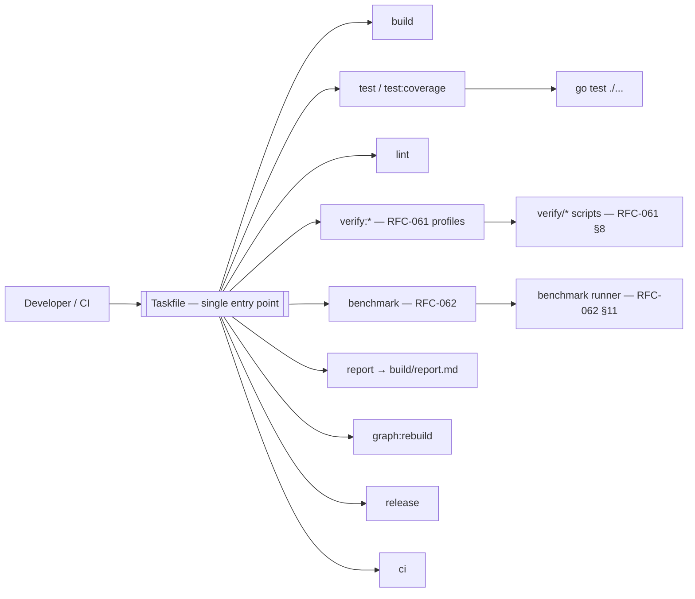
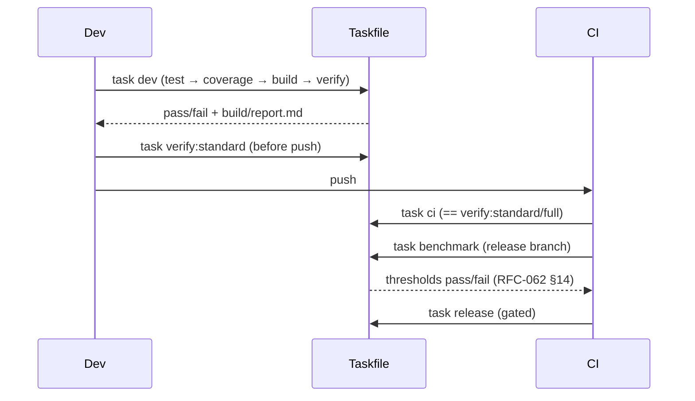

# ADR-011 — Build & Development Workflow

**Status:** PROPOSED (not accepted — ratifies existing Taskfile, pending RFC record)
**Date:** 2026-07-01
**Authors:** Architecture
**Supersedes:** —
**Superseded by:** —
**Related:** ADR-009, ADR-010, RFC-060, RFC-061, RFC-062, RFC-030

---

## Context

Praxis's governance requires that architecture be continuously verified against code: the RFC
README mandates that "the implementation always follows the accepted architecture", and RFC-061
makes verification executable. This only works if there is **one obvious, reproducible way** to
build, test, verify, and report — otherwise contributors and CI diverge, and the RFC-061
verification suite is run inconsistently (or not at all).

The RFCs define the *obligations* a developer workflow must satisfy:

- **RFC-060 §8** requires many test categories (unit, contract, invariant, replay, agent,
  prompt, security, …); **§9:** "RFC invariants are not documentation only. They are test
  obligations."
- **RFC-061 §7–§10** define verification **layers**, **profiles** (`fast`, `standard`, `full`,
  `release`), a script **manifest**, and a naming convention, all under `/verify/`.
- **RFC-062 §11/§14** require a benchmark runner and regression thresholds gating releases.
- **RFC-030 §13** lists Replay and Audit as cross-cutting concerns exercised by tooling.

**Current workflow surface (evidence).**

`Taskfile.yml` (Go plane) targets:

| Target | Command / behavior |
|---|---|
| `test` | `go test ./...` |
| `test:coverage` | `go test -coverprofile=build/coverage.out ./...` |
| `build` | deps: `build:kernel-demo`, `build:api-kernel`, `build:worker` |
| `build:kernel-demo` | `go build -o build/kernel-demo ./cmd/kernel-demo` |
| `build:api-kernel` | `go build -o build/api-kernel ./services/api-kernel` |
| `build:worker` | `go build -o build/worker ./services/worker` |
| `run:api-kernel` / `run:worker` / `run:kernel-demo` | run services/demo |
| `dev` | `test` → `test:coverage` → `build` → `verify:rfc` |
| `report` | tests + coverage + binaries + RFC hygiene + graph health → `build/report.md` |
| `clean` | `rm -rf build/` |
| `verify:rfc` | `python3 verify/rfc/run.py` |
| `graph:rebuild` | `python3 scripts/rebuild_graph.py` |

`Makefile` (Python plane) targets: `verify` (compileall → `verify_db.py` → `verify_queue.py` →
`verify_llm_router.py` → `verify_json_sanitizer.py` → `verify_work_item_pipeline.py` →
`verify_upwork_pipeline.py` → `verify_e2e.py`), `run-api`, `run-worker`, `run-chiefly`,
`run-telegram`.

**The tension.** There are **two** entry points — `Taskfile.yml` (Go) and `Makefile` (Python) —
with overlapping intent (`verify:rfc` vs `make verify`, `run:*` vs `run-*`). RFC-061 §7–§10
specify verification **profiles** and a **manifest**, but the current `dev`/`report` targets do
not yet expose `fast`/`standard`/`full`/`release` profiles, and `verify:rfc` is a single script,
not the layered manifest RFC-061 describes. There is also no `lint`, no `benchmark` (RFC-062),
and no `release`/`ci` target. Without an ADR, the developer entry point stays split and the
RFC-061 profile model goes unimplemented, weakening the "architecture is verified" guarantee.

---

## Decision

> **This ADR proposes Taskfile (`Taskfile.yml`) as the single canonical developer and CI entry
> point for all workflows — build, test, coverage, lint, verify (RFC-061 layers/profiles),
> benchmark (RFC-062), report, graph rebuild, release, and CI. The Python `Makefile` targets are
> folded in as Task tasks (or invoked by Task) so there is one command surface. Task targets map
> directly to the RFC-060/061/062 obligations. The decision is PROPOSED; no RFC changes until
> promoted to ACCEPTED.**

---

## Architecture Principles

1. **One entry point.** Every routine action is a `task <name>`; contributors and CI run the same
   commands (no divergence).
2. **Targets map to RFC obligations.** `verify:*` mirrors RFC-061 layers/profiles; `test:*`
   mirrors RFC-060 categories; `benchmark` mirrors RFC-062.
3. **Reproducible outputs.** All artifacts land in `build/` (ADR-010) and are git-ignored;
   `clean` fully resets.
4. **Local == CI.** CI runs the same Task targets a developer runs locally, so "green locally"
   means "green in CI."

---

## Target Model (mapping to RFC obligations)

| Task target | Responsibility | RFC basis |
|---|---|---|
| `build` / `build:*` | Compile all binaries to `build/` | ADR-010 |
| `test` | `go test ./...` (unit/contract) | RFC-060 §8 |
| `test:coverage` | Coverage profile → `build/coverage.out` | RFC-060 §8 |
| `lint` | Static/style/vet (Go + Python) | RFC-060 §6 (Correctness); RFC-061 §12 static |
| `verify:fast` | Static + Schema + Contract | RFC-061 §8 profile `fast` |
| `verify:standard` | + Invariant + Security | RFC-061 profile `standard` |
| `verify:full` | All layers except Benchmark/Integration | RFC-061 profile `full` |
| `verify:release` | All layers incl. Benchmark + Integration | RFC-061 profile `release` |
| `verify:rfc` | RFC hygiene (existing) folded into layers | RFC-061 §11 |
| `benchmark` | Run RFC-062 suites, apply thresholds | RFC-062 §11, §14 |
| `report` | Aggregate tests/coverage/hygiene/graph → `build/report.md` | RFC-060/061 |
| `graph:rebuild` | Rebuild the architecture graph | graphify tooling |
| `release` | Build + verify:release + benchmark gate + package | RFC-062 §15 |
| `ci` | The exact target CI runs (== `verify:standard` or `verify:full`) | RFC-061 profiles |
| `dev` | Fast local loop: test → coverage → build → verify | RFC-060/061 |
| `clean` | Remove `build/` | ADR-010 |

---

## Invariants

1. **Single entry point:** every routine action is reachable via `task` (no parallel Make/shell
   surface for the same action).
2. **Profiles honored:** `verify:*` implements RFC-061 `fast/standard/full/release` profiles.
3. **CI == local:** CI invokes the same Task targets as developers.
4. **Artifacts in `build/`:** outputs never pollute source (ADR-010).
5. **Release is gated:** `release` fails if verification or RFC-062 thresholds fail (RFC-062
   §14).
6. **Obligation coverage:** every RFC-060 §9 test obligation is reachable from a Task target.

---

## Options Considered

### Option A — Taskfile as the single entry point *(PROPOSED)*

**Description.** Consolidate all workflows into `Taskfile.yml`; Python verification/run commands
become Task tasks (or are invoked by Task). Add `lint`, `benchmark`, `verify:{fast,standard,full,
release}`, `release`, `ci`.

**Fits.** RFC-061 §7–§10 profiles/manifest; RFC-060 §8 categories; RFC-062 §11/§14 runner/
thresholds. Matches existing `Taskfile.yml` (`dev`, `report`, `verify:rfc`, `graph:rebuild`).

**Conflicts.** Requires folding the `Makefile` targets in and building the profile/benchmark
targets that don't exist yet.

**Advantages.** YAML, cross-platform, dependency-aware, discoverable (`task --list`); already the
Go entry point; fits the YAML-first infra posture (docker-compose, configs, ADR-002 Kestra).
One surface for a mixed Go/Python repo.

**Disadvantages.** Task must be installed (a dev dependency); migrating Make targets is work.

**Operational impact.** One tool; CI installs Task and runs `task ci`.

**Implementation complexity.** Low-medium: add targets, fold Make in.

**Long-term maintainability.** High; single, readable surface.

**Verdict.** Best fit; unifies the split surface and directly encodes RFC-061 profiles.

---

### Option B — Makefile as the single entry point

**Description.** Standardize on GNU Make; port Task targets into the `Makefile`.

**Fits.** Ubiquitous; already used for the Python plane.

**Conflicts.** Make's tab-sensitive syntax and weak cross-platform story are poor for a YAML-first
repo; the Go plane already standardized on Task; migrating Task→Make is backward relative to the
richer `Taskfile` targets (`dev`, `report`).

**Advantages.** Preinstalled on most Unix; familiar.

**Disadvantages.** Brittle syntax; poor Windows support; less discoverable; would regress the Go
plane's existing Task investment.

**Operational impact.** No install needed, but weaker ergonomics.

**Implementation complexity.** Medium (port Task → Make).

**Long-term maintainability.** Medium; brittle for complex workflows.

**Verdict.** Rejected: porting the richer Task surface into Make is a regression; Make remains
usable as a thin alias to Task at most.

---

### Option C — Plain shell scripts (`scripts/*.sh`)

**Description.** A `scripts/` directory of shell scripts as the entry points.

**Fits.** Zero tool dependency; maximally portable-ish.

**Conflicts.** No dependency graph, no task listing, no caching; reinvents what Task provides;
harder to keep local == CI consistent.

**Advantages.** No extra tool; total control.

**Disadvantages.** No discoverability; duplicated logic; error-prone; no `--list`.

**Operational impact.** Neutral, but ergonomics suffer.

**Implementation complexity.** Medium and ongoing.

**Long-term maintainability.** Low; grows into an unstructured pile.

**Verdict.** Rejected as the entry point; shell scripts remain fine when *invoked by* Task tasks.

---

### Option D — `just` (command runner)

**Description.** Use `just`, a modern make-like command runner.

**Fits.** Nice ergonomics; simple recipes.

**Conflicts.** Another tool to introduce where Task is already adopted; no advantage over Task for
this repo; smaller ecosystem than Task in the Go world.

**Advantages.** Clean syntax; fast.

**Disadvantages.** Redundant with Task; migration churn; no dependency-graph edge over Task.

**Operational impact.** Neutral.

**Implementation complexity.** Medium (migration).

**Long-term maintainability.** Medium.

**Verdict.** Rejected: no benefit over the already-adopted Task.

---

### Option E — Language-native only (`go test`, `pytest`, `npm`)

**Description.** No orchestrator; contributors run native per-language tools directly.

**Fits.** Simple per-language actions.

**Conflicts.** No single surface for a mixed Go/Python/JS repo; RFC-061 profiles and RFC-062
gates have no home; local vs CI drift; cross-cutting `report`/`verify` impossible to express
uniformly.

**Advantages.** Nothing to install beyond language tools.

**Disadvantages.** Fragmented; no unified verify/report/release; drift-prone.

**Operational impact.** Every contributor memorizes many commands.

**Implementation complexity.** Low now, high coordination cost.

**Long-term maintainability.** Low.

**Verdict.** Rejected as the entry point; native tools are *invoked by* Task tasks (e.g., `test`
→ `go test ./...`).

---

### Option F — Heavyweight monorepo build system (Bazel/Nx)

**Description.** Adopt Bazel or Nx for hermetic, cached, graph-based builds.

**Fits.** Excellent for very large polyglot monorepos with heavy caching needs.

**Conflicts.** Massive complexity/onboarding cost for a single-operator, modest-scale repo;
disproportionate to `go build` + a handful of services; conflicts with the lightweight,
local-first posture (ADR-002/003).

**Advantages.** Hermetic builds; remote caching; fine-grained incrementality.

**Disadvantages.** Steep learning curve; heavy config; overkill here.

**Operational impact.** High setup and maintenance.

**Implementation complexity.** High.

**Long-term maintainability.** Medium at huge scale; poor at this scale.

**Verdict.** Rejected: disproportionate; revisit only if the repo grows to many teams/services.

---

### Comparison Matrix

| Criterion | Taskfile (A) | Makefile (B) | Shell (C) | just (D) | Native-only (E) | Bazel/Nx (F) |
|---|---|---|---|---|---|---|
| Single surface for Go+Python+JS | ✅ | ⚠️ | ⚠️ | ✅ | ❌ | ✅ |
| RFC-061 profiles (§8) | ✅ | ⚠️ | ⚠️ | ✅ | ❌ | ✅ |
| Discoverable (`--list`) | ✅ | ❌ | ❌ | ✅ | ❌ | ⚠️ |
| Cross-platform | ✅ | ⚠️ | ⚠️ | ✅ | ✅ | ⚠️ |
| Dependency-aware | ✅ | ✅ | ❌ | ✅ | ❌ | ✅✅ |
| Local == CI | ✅ | ✅ | ⚠️ | ✅ | ❌ | ✅ |
| Matches current repo | ✅ | partial | partial | ❌ | partial | ❌ |
| Onboarding cost | 🟢 | 🟢 | 🟢 | 🟡 | 🟢 | 🔴 |

---

## Proposed Decision

**Adopt Taskfile as the single entry point (Option A).** Native tools (`go test`, `pytest`) and
shell scripts are **invoked by** Task tasks, not used as parallel surfaces. The Python `Makefile`
verification/run targets are folded into Task (`verify:*`, `run:*`) so there is one command
surface. Add the missing `lint`, `benchmark`, `verify:{fast,standard,full,release}`, `release`,
and `ci` targets to close the RFC-061/062 gap.

**Why A over the alternatives.**

- **Over Makefile (B) / just (D):** Task is already the Go entry point; porting to Make/just is a
  regression with no benefit; Make may remain a thin alias at most.
- **Over Shell (C) / Native-only (E):** neither gives a single discoverable surface, RFC-061
  profiles, or local==CI guarantees; both are *invoked by* Task instead.
- **Over Bazel/Nx (F):** disproportionate complexity for a single-operator repo; conflicts with
  the lightweight, local-first posture.
- **Decisive factor:** Task already hosts `dev`/`report`/`verify:rfc`/`graph:rebuild`; extending
  it to RFC-061 profiles and RFC-062 gates yields one surface where every RFC-060 §9 test
  obligation and RFC-062 §14 threshold is a named, reproducible target run identically locally
  and in CI.

**Developer workflow.**

---

## Consequences

### Positive
- One discoverable, reproducible command surface for a mixed-language repo.
- RFC-061 profiles and RFC-062 gates become first-class targets; local == CI.
- New contributors learn `task --list` and nothing else.

### Negative
- Task is a required dev dependency.
- Folding the `Makefile` in and building profile/benchmark targets is upfront work.

### Trade-offs
- Accepts a small tool dependency in exchange for a unified, RFC-aligned workflow.

### Future flexibility
- New RFC-061 layers or RFC-062 suites attach as new Task targets without changing the surface.

### Migration cost
- Add `lint`, `benchmark`, `verify:*` profiles, `release`, `ci`; move `Makefile` verify/run
  targets into Task; ensure `build/` is git-ignored.

### Operational impact
- CI installs Task and runs `task ci` / `task benchmark` / `task release`; identical to local.

### Development impact
- Contributors run `task dev` in the inner loop and `task verify:standard` before push.

### Testing impact
- Every RFC-060 §8 category and RFC-061 layer is a target; coverage flows to `build/coverage.out`
  and `report`.

### Performance impact
- `fast`/`standard` profiles keep the inner loop quick; `full`/`release` run heavier suites.

### Failure modes
- Divergent local vs CI behavior is prevented by running the *same* Task targets.
- A missing benchmark threshold fails `release` (RFC-062 §14), blocking regressions.

---

## Required RFC Edits (if this ADR is accepted)

| RFC | Required change | Scope |
|-----|-----------------|-------|
| RFC-061 | Note Task targets implement the `fast/standard/full/release` profiles and the `/verify/` manifest. | Verification |
| RFC-060 | Note each test category is reachable from a Task target (§8–§9). | Testing |
| RFC-062 | Note the benchmark runner and thresholds are invoked via `task benchmark`/`task release`. | Benchmarking |
| RFC-030 | Note Replay/Audit tooling is exercised through Task verify targets (§13). | System architecture |

---

## Implementation Impact

### Safe to implement immediately
- Adding `lint`, `verify:{fast,standard}` targets over existing scripts; keeping `dev`/`report`/
  `graph:rebuild`.

### Blocked until this ADR is accepted
- Declaring Task the sole entry point (retiring/aliasing the `Makefile`).
- Wiring `benchmark`/`release` gates to RFC-062 thresholds (needs the runner, RFC-062 §11).

---

## Verification Impact

### Existing verification affected
- `Makefile verify` and `task verify:rfc` are unified under `verify:*` profiles (RFC-061 §8).

### New verification required
- **Profile-coverage test** (RFC-061 §11): every RFC-060 invariant maps to a script reachable in
  a profile.
- **Entry-point test**: no routine action exists only outside Task (single-surface invariant).
- **Release-gate test** (RFC-062 §14): `release` fails when thresholds regress.

### Testing changes
- CI job list collapses to Task targets; add a benchmark job on release branches.

### Coverage impact
- Coverage is produced by `test:coverage` and surfaced in `report`; profiles ensure breadth.

### Acceptance criteria
- `task --list` shows every workflow; CI runs only Task targets; `release` is gated by verify +
  RFC-062 thresholds; `build/` holds all artifacts.

---

## Rejected Alternatives

- **Makefile (B) / just (D):** regression or redundancy relative to the adopted Task surface.
- **Shell scripts (C) / native-only (E):** no single surface, profiles, or local==CI guarantee;
  used only *inside* Task tasks.
- **Bazel/Nx (F):** disproportionate for a single-operator repo.

---

## Open Questions

1. **Makefile fate:** retire it entirely, or keep it as a thin alias (`make verify` → `task
   verify:standard`) for muscle memory?
2. **Lint stack:** which linters (`golangci-lint`, `ruff`, `eslint`) constitute `task lint`?
3. **CI provider:** which CI runs `task ci` (GitHub Actions per `apps`/ADR-002 references), and
   how are profiles mapped to branches/PRs (RFC-061 §8)?
4. **Benchmark runner:** where does the RFC-062 §11 runner live, and how are baselines stored
   (RFC-062 §15)?
5. **Release packaging:** what does `release` produce (containers, binaries, tagged images) and
   how does it coordinate with ADR-002 orchestration?

---

## References

- [Taskfile.yml](../../Taskfile.yml) — existing `dev`, `report`, `verify:rfc`, `graph:rebuild`, `build:*`, `test:*`
- [Makefile](../../Makefile) — Python-plane verify/run targets to fold in
- [rfcs/060-testing-strategy.md](../../rfcs/060-testing-strategy.md) — test categories (§8), test obligations (§9)
- [rfcs/061-verification-scripts.md](../../rfcs/061-verification-scripts.md) — layers/profiles (§7–§8), manifest (§10), RFC mapping (§11), static (§12)
- [rfcs/062-benchmarking.md](../../rfcs/062-benchmarking.md) — runner (§11), thresholds (§14), baselines (§15)
- [rfcs/030-system-architecture.md](../../rfcs/030-system-architecture.md) — replay/audit cross-cutting concerns (§13)
- [docs/adr/ADR-009-observability.md](ADR-009-observability.md) — benchmarks consume telemetry
- [docs/adr/ADR-010-repository-structure.md](ADR-010-repository-structure.md) — `build/` outputs, `verify/` layout
