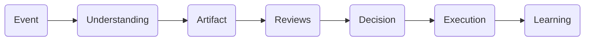
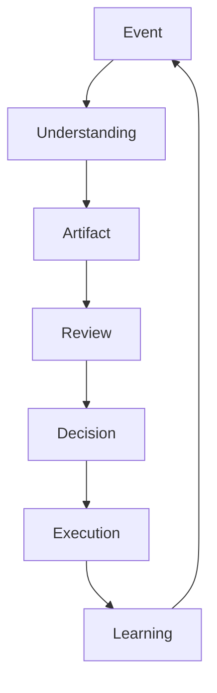
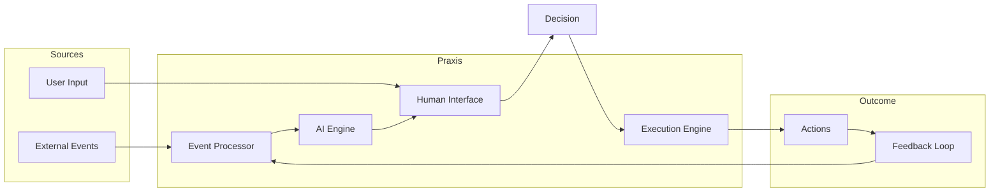

# RFC-000 Vision

**Status:** Draft  
**Authors:** Tiroq + ChatGPT  
**Last Updated:** 2026-06-28

---

## 1. Summary

This RFC defines the vision for Praxis, a next-generation AI Work Operating System designed to unify fragmented knowledge, streamline decision-making, and empower users through a seamless integration of AI and human collaboration. Praxis aims to transform how work is orchestrated by providing a coherent, event-driven platform that supports understanding, artifact creation, review, decision, execution, and continuous learning.

---

## 2. Problem Statement

Modern knowledge work suffers from several critical challenges:

- **Fragmented Knowledge:** Information is scattered across multiple disconnected tools and platforms, impeding holistic understanding and context.
- **Fragmented Decisions:** Decision-making is often siloed, lacking traceability, consistency, and alignment across teams and systems.
- **AI Chat Limitations:** Current AI chat interfaces are interaction-limited, lacking deep integration with workflows, context persistence, and actionable outputs.
- **Disconnected Productivity Tools:** Existing productivity and automation tools often operate in isolation, creating friction and manual overhead in coordinating complex workflows.

These challenges result in inefficiencies, duplicated efforts, lost context, and missed opportunities for leveraging AI to augment human productivity.

---

## 3. Vision

Praxis is an **AI Work Operating System** that bridges the gap between fragmented knowledge, decision-making, and execution. It acts as a unified platform where events drive understanding, artifacts are created and reviewed, decisions are made transparently, and execution is coordinated effectively — all enhanced by AI and human collaboration.

---

## 4. Mission

To empower individuals and teams to work smarter by providing an integrated, explainable, and composable platform that transforms raw events into meaningful decisions and actions, enabling continuous learning and improvement.

---

## 5. Long-Term Vision (5-10 years)

- Become the foundational platform for knowledge work orchestration, integrating seamlessly with diverse tools and AI providers.
- Enable fully transparent, auditable decision-making workflows that adapt dynamically to changing contexts.
- Establish a global community of users who co-create, share, and evolve best practices and domain models.
- Foster AI-human symbiosis where AI proposes and humans decide, accelerating innovation and reducing cognitive load.
- Achieve broad adoption across industries including freelancing, product development, technical leadership, and individual knowledge work.

---

## 6. Goals

- Provide a unified event-driven platform for capturing and processing work-related events.
- Enable AI-powered understanding that contextualizes events into actionable artifacts.
- Support robust review workflows ensuring human oversight and quality control.
- Facilitate transparent, traceable decision-making processes.
- Integrate execution capabilities to automate or assist with carrying out decisions.
- Implement continuous learning loops to improve AI models and workflows over time.
- Support local-first data storage and processing where practical to ensure privacy and responsiveness.
- Be provider-agnostic, supporting multiple AI models and external services.
- Prioritize explainability and auditability in all AI-driven processes.
- Foster composability by enabling modular integration with third-party tools and services.
- Maintain architecture-first development ensuring clarity, consistency, and scalability.
- Design for extensibility to accommodate evolving user needs and technology advances.
- Support multiple user personas with tailored experiences.
- Facilitate onboarding and adoption through clear documentation and workflows.
- Establish clear governance to manage evolving standards and contributions.

---

## 7. Non-Goals

Praxis is explicitly **not**:

- Another chatbot or conversational AI interface.
- A simple note-taking application.
- A task manager or to-do list replacement.
- A CRM system or direct substitute.
- A generic automation builder without architectural rigor.

---

## 8. Product Philosophy

- **AI Proposes, Humans Decide:** AI augments insight and suggestions; ultimate authority remains with humans.
- **Event-Driven:** Work flows are driven by events capturing real-world changes and triggers.
- **Local-First Where Practical:** Prioritize local data control and responsiveness, syncing with cloud as needed.
- **Provider Agnostic:** Support multiple AI providers and external services to avoid vendor lock-in.
- **Composability Over Reinvention:** Integrate best-in-class tools rather than rebuilding existing capabilities.
- **Explainability:** All AI-driven outputs include rationale and traceability.
- **Architecture Before Implementation:** Design and governance precede coding to ensure consistency and quality.

---

## 9. Core Mental Model

Events trigger understanding, which produces artifacts. Artifacts undergo review, leading to decisions. Decisions drive execution, and outcomes feed learning for continuous improvement.

---

## 10. User Journey Vision

A user sends a message via Telegram:

1. **Event:** The message is received as an event.
2. **Understanding:** AI contextualizes the message, extracting intent and relevant data.
3. **Artifact:** A task or proposal artifact is created.
4. **Reviews:** The artifact is reviewed by the user or collaborators.
5. **Decision:** A decision is made to approve, modify, or reject the artifact.
6. **Execution:** Approved actions are executed automatically or with human assistance.
7. **Learning:** Results and feedback improve future AI understanding and workflows.

---

## 11. Primary Personas

- **Individual Knowledge Worker:** Needs to organize and act on fragmented information efficiently.
- **Freelancer:** Manages proposals, clients, and workflows independently.
- **Technical Lead:** Oversees complex projects requiring structured decision-making and traceability.
- **Product Builder:** Coordinates cross-functional teams and integrates diverse tools.

---

## 12. Why Existing Solutions Are Not Enough

| Tool           | Limitations                                                                                      |
|----------------|------------------------------------------------------------------------------------------------|
| Notion         | Great for notes but lacks integrated AI-driven decision workflows and event-driven architecture.|
| Linear         | Focused on issue tracking, limited AI integration and composability.                            |
| GitHub Projects| Code-centric, insufficient for broad knowledge work orchestration.                             |
| Google Tasks   | Simple task management without context or AI augmentation.                                     |
| ChatGPT        | Chat interface only; lacks workflow integration and artifact management.                        |
| n8n            | Automation focused but lacks architectural rigor and AI-human decision integration.             |
| LangGraph      | AI orchestration tool but limited in supporting human-in-the-loop decision frameworks.         |

Praxis fills the architectural gap by combining event-driven design, AI augmentation, human oversight, and composability into a unified platform.

---

## 13. Success Criteria

| Timeframe    | Success Metrics                                                                                          |
|--------------|---------------------------------------------------------------------------------------------------------|
| 1 Year       | Prototype demonstrating end-to-end event-to-execution pipeline; initial user onboarding and feedback.  |
| 3 Years      | Production-ready platform with multiple AI providers, composable integrations, and growing user base.  |
| 10 Years     | Widely adopted AI Work Operating System supporting diverse industries and enabling continuous learning.|

---

## 14. Design Constraints

- Must support heterogeneous AI providers and service integrations.
- Data privacy and local-first principles where feasible.
- Scalable architecture supporting multiple concurrent users and workflows.
- Extensible data and domain models.
- Transparent and auditable workflows.
- Modular design enabling incremental adoption.
- Support offline-first scenarios with eventual sync.

---

## 15. Open Questions

- How to best balance local-first data storage with cloud synchronization?
- What governance models will ensure consistent evolution of domain models and standards?
- How to optimize human-AI interaction for maximum productivity and trust?
- Which AI providers and models should be prioritized initially?
- How to design intuitive review and decision interfaces that scale to complex workflows?

---

## 16. Future RFC Dependencies

- RFC-001 Principles  
- RFC-002 Terminology  
- RFC-010 Capability Map  
- RFC-011 Domain Model  

---

## 17. Decision Log

| Date       | Change                                   | Author  |
|------------|------------------------------------------|---------|
| 2026-06-28 | Initial draft created                     | Tiroq + ChatGPT |

---

## Additional Diagrams

### Overall Lifecycle

### High-Level Architecture Relationship

---

**Praxis doesn't manage tasks. Praxis manages decisions.**

---

## Next Evolution

This RFC intentionally focuses on the long-term vision of Praxis rather than implementation details.

The following RFCs progressively refine this vision into an implementable architecture:

1. RFC-001 Principles — Immutable architectural principles.
2. RFC-002 Terminology — Common language used across the project.
3. RFC-010 Capability Map — What the platform must be capable of.
4. RFC-011 Domain Model — Business domains and bounded contexts.
5. RFC-012 Artifact Model — The canonical representation of work.
6. RFC-013 Event Model — How information enters and flows through the system.

Together these documents define the conceptual foundation upon which every implementation decision in Praxis must be based.

### Acceptance Criteria

This RFC can be considered Accepted when:

- The long-term vision of Praxis is stable.
- The problem statement is agreed upon.
- The mission and philosophy no longer require structural changes.
- Subsequent RFCs do not contradict this document.
- All future architectural decisions remain consistent with this vision.