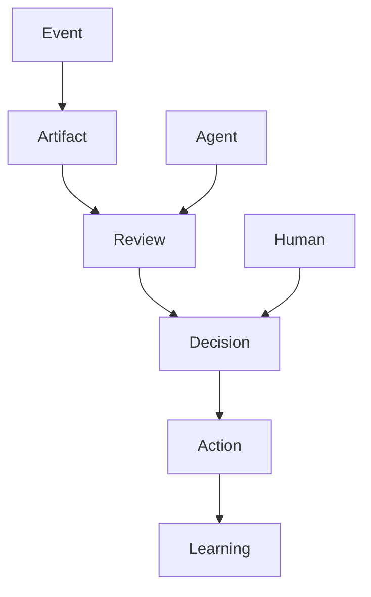

# RFC-003 Concept Model

**Status**: Draft  
**Authors**: Ivan + ChatGPT  
**Last Updated**: 2026-06-28

---

## 1. Summary

This RFC defines the conceptual building blocks of Praxis, independent of any implementation, programming language, or technology stack. It establishes the core concepts, their relationships, and categories that structure all Praxis systems. This model provides a shared mental framework for future design, analysis, and implementation.

## 2. Relationship to Previous RFCs

- **RFC-000 (Vision)** explains *why* Praxis exists.
- **RFC-001 (Principles)** provides constraints and values.
- **RFC-002 (Terminology)** standardizes language.
- **This RFC** defines the *conceptual categories* and their relationships, serving as the foundation for all further modeling.

## 3. Goals

- Establish a stable, shared conceptual model for Praxis.
- Provide a foundation for Domain-Driven Design (DDD), API design, and database design.
- Enable clear communication among all contributors and stakeholders.

## 4. Non-Goals

- Does **not** define database schemas or storage mechanisms.
- Does **not** prescribe code structure or package layout.
- Does **not** specify implementation details or user interfaces.

## 5. Concept Taxonomy

| Concept    | Category         | Description                                                                 |
|-----------|------------------|-----------------------------------------------------------------------------|
| Agent     | Actor            | Any entity (human or automated) capable of initiating or participating.      |
| Human     | Actor            | A person interacting with the system.                                       |
| LLM       | Actor            | A large language model acting as an agent.                                  |
| Event     | Event            | Any occurrence entering the system; the primary input.                      |
| Artifact  | Domain Concept (provisional) | A structured representation of understanding or knowledge.             |
| Project   | Domain Concept (provisional) | A collection of related artifacts, actions, or goals.                  |
| Proposal  | Domain Concept (provisional) | A suggested plan or artifact for review and decision.                  |
| Review    | Process          | The act of evaluating an artifact or proposal.                              |
| Decision  | Process          | The selection of a course of action based on reviews.                       |
| Action    | Process          | The execution of a decision.                                                |
| Workflow  | Process          | An orchestrated sequence of processes.                                      |
| Policy    | Rule             | A formal rule or guideline governing behavior.                              |
| Capability| Behavior         | A skill or function the system or actor can perform.                        |
| Projection| Read Model       | A derived, query-optimized view of state.                                   |
| State     | State            | The current condition or status of a concept.                               |
| Revision  | Version          | A versioned change to an artifact or state.                                 |
| Integration | External System | A technical connection to an external system or service.                    |
| Provider  | External System  | An external system or entity supplying data or functionality.                |

## 6. Concept Relationships

## 7. Lifecycle

The canonical Praxis lifecycle is:

**Event → Understanding → Artifact → Reviews → Decision → Action → Learning**

- Every occurrence enters as an **Event**.
- Events are interpreted, resulting in **understanding** (often as an **Artifact**).
- Artifacts are subjected to **Reviews**.
- Reviews inform a **Decision**.
- Decisions lead to **Actions**.
- Actions produce outcomes, feeding back as **Learning** (new Events).

**Every Praxis implementation must preserve this pipeline, even if steps are automated or implicit.**

## 8. Architectural Laws

- **Everything enters as an Event.**
- **Actions require Decisions.**
- **Decisions require Reviews.**
- **Reviews are immutable.**
- **Event history is never lost.**
- **External systems interact through Integrations.**

## 9. Domain Independence

This concept model is *shared and universal* across all Praxis domains, including:
- Personal
- Work
- Freelance
- Products
- Content

No domain may redefine or remove these core concepts; extensions must be additive.

## 10. Evolution Strategy

- **Stable concepts** (e.g., Event, Review, Decision, Action) are core and unlikely to change.
- **Provisional concepts** (e.g., Artifact, Project, Proposal) may evolve as Praxis matures.
- **Domain Concepts** will be further refined in RFC-011.

## 11. Dependencies

- **References**: RFC-000 (Vision), RFC-001 (Principles), RFC-002 (Terminology)
- **Prerequisite for**: RFC-010 (Capability Map), RFC-011 (Domain Model)

## 12. Acceptance Criteria

- All core concepts and categories are defined and mapped.
- Concept relationships are visualized in a graph.
- Lifecycle and architectural laws are clearly stated.
- This RFC is referenced by subsequent modeling RFCs.

## 13. Decision Log

- *2026-06-28*: Initial draft created.

---

> "A shared conceptual model is the bridge between vision and implementation."