# RFC-010 Capability Map

**Status:** Draft  
**Authors:** Tiroq + ChatGPT
**Last Updated:** 2026-06-28

---

## 1. Summary

This RFC defines *what Praxis must be capable of*, independent of implementation, user interface, storage, or service choices. The Capability Map describes the fundamental, reusable behaviors Praxis must support, forming the foundation for all workflows and domains. It does not prescribe *how* capabilities are implemented, only *what* the system must be able to do.

## 2. Relationship to Previous RFCs

- [RFC-000 Vision](./000-vision.md): Sets the overall purpose and aspirations for Praxis.
- [RFC-001 Principles](./001-principles.md): Establishes guiding principles.
- [RFC-002 Terminology](./002-terminology.md): Defines key terms.
- [RFC-003 Concept Model](./003-concept-model.md): Defines what entities and relationships exist in Praxis.

The Concept Model (RFC-003) describes what exists in the Praxis universe (objects, relationships, etc.), while the Capability Map (this RFC) defines what the system can *do*—the set of possible actions and transformations. Capabilities are the verbs of Praxis; the Concept Model is the nouns.

## 3. Design Goals

- **Stable capability taxonomy:** The set and structure of capabilities should change rarely.
- **Technology independent:** Capabilities are defined without reference to specific tools, languages, or platforms.
- **Domain independent:** Capabilities are not tied to a particular domain (e.g., work, personal, freelance).
- **Extensible:** New capabilities can be added as Praxis evolves.
- **Composable:** Capabilities can be combined to form higher-level workflows.

## 4. Capability Philosophy

Capabilities in Praxis are *reusable behaviors* that can be invoked across domains and workflows. They are not features or UI affordances, but abstract, implementation-agnostic actions. Capabilities are shared across domains, enabling Praxis to generalize and adapt to new contexts without duplicating logic.

## 5. Capability Hierarchy

Praxis capabilities are organized in a hierarchy, with eight Level 1 (top-level) capabilities. Each Level 1 capability is further decomposed into representative Level 2 capabilities.

### Level 1 Capabilities

- **Capture:** Receive and parse new information or events.
- **Understand:** Interpret, classify, and extract meaning from inputs.
- **Enrich:** Augment information with additional context or knowledge.
- **Think:** Plan, reason, and decompose problems.
- **Review:** Critique, validate, and assess plans or actions.
- **Decide:** Make choices, approvals, and escalations.
- **Execute:** Perform actions that change the state of the world or system.
- **Learn:** Adapt and improve Praxis based on feedback.

### Level 2 Capabilities (by Level 1)

#### Capture
- **Receive:** Accept incoming signals, messages, or events.
- **Import:** Bring in data from external systems.
- **Observe:** Monitor for changes or triggers.
- **Parse:** Convert raw inputs into structured representations.

#### Understand
- **Normalize:** Standardize data formats and structures.
- **Translate:** Convert between languages or representations.
- **Classify:** Categorize inputs into known types.
- **Detect Intent:** Identify user or system intent.
- **Extract Entities:** Identify and extract key elements.
- **Summarize:** Generate concise representations.

#### Enrich
- **Context Lookup:** Retrieve relevant context for an input.
- **Memory Retrieval:** Access prior knowledge or history.
- **Similarity Search:** Find related items or experiences.
- **Knowledge Expansion:** Link to external or inferred knowledge.

#### Think
- **Planning:** Develop sequences of actions to achieve goals.
- **Reasoning:** Apply logic or inference to solve problems.
- **Prioritization:** Order tasks or items by importance.
- **Estimation:** Predict effort, cost, or outcomes.
- **Decomposition:** Break down complex tasks into smaller parts.

#### Review
- **Planner Review:** Assess quality and feasibility of plans.
- **Critic Review:** Identify flaws, risks, or improvements.
- **Risk Review:** Evaluate risks and mitigation strategies.
- **Portfolio Review:** Assess collections of tasks or projects.
- **Human Review:** Solicit or incorporate human feedback.

#### Decide
- **Approve:** Accept or greenlight actions or changes.
- **Reject:** Decline or block actions or changes.
- **Merge:** Combine similar or related items.
- **Split:** Divide complex items into parts.
- **Escalate:** Raise issues to higher authority or urgency.
- **Schedule:** Assign timing or deadlines.

#### Execute
- **Create Task:** Add new actionable items.
- **Update Project:** Modify project structures or status.
- **Send Message:** Communicate with users or systems.
- **Generate Proposal:** Produce recommendations or plans.
- **Trigger Workflow:** Start automated or manual processes.
- **Synchronize:** Ensure consistency across systems or states.

#### Learn
- **Capture Feedback:** Gather explicit or implicit feedback.
- **Improve Prompt:** Refine instructions or queries.
- **Improve Routing:** Enhance decision logic for task assignment.
- **Improve Knowledge:** Update or expand Praxis’s knowledge base.
- **Improve Policy:** Refine system rules or constraints.

## 6. Capability Tree (Mermaid)

```mermaid
graph TD
  A[Capability] --> B[Capture]
  A --> C[Understand]
  A --> D[Enrich]
  A --> E[Think]
  A --> F[Review]
  A --> G[Decide]
  A --> H[Execute]
  A --> I[Learn]
  B --> B1[Receive]
  B --> B2[Import]
  B --> B3[Observe]
  B --> B4[Parse]
  C --> C1[Normalize]
  C --> C2[Translate]
  C --> C3[Classify]
  C --> C4[Detect Intent]
  C --> C5[Extract Entities]
  C --> C6[Summarize]
  D --> D1[Context Lookup]
  D --> D2[Memory Retrieval]
  D --> D3[Similarity Search]
  D --> D4[Knowledge Expansion]
  E --> E1[Planning]
  E --> E2[Reasoning]
  E --> E3[Prioritization]
  E --> E4[Estimation]
  E --> E5[Decomposition]
  F --> F1[Planner Review]
  F --> F2[Critic Review]
  F --> F3[Risk Review]
  F --> F4[Portfolio Review]
  F --> F5[Human Review]
  G --> G1[Approve]
  G --> G2[Reject]
  G --> G3[Merge]
  G --> G4[Split]
  G --> G5[Escalate]
  G --> G6[Schedule]
  H --> H1[Create Task]
  H --> H2[Update Project]
  H --> H3[Send Message]
  H --> H4[Generate Proposal]
  H --> H5[Trigger Workflow]
  H --> H6[Synchronize]
  I --> I1[Capture Feedback]
  I --> I2[Improve Prompt]
  I --> I3[Improve Routing]
  I --> I4[Improve Knowledge]
  I --> I5[Improve Policy]
```

## 7. Capability Pipeline

Every workflow in Praxis is a specialization of the following canonical pipeline:

**Event → Capture → Understand → Enrich → Think → Review → Decide → Execute → Learn**

Each step invokes one or more capabilities. For example, a new message (event) is captured, understood (intent detected), enriched (context retrieved), thought over (plan generated), reviewed (risk checked), decided (approved), executed (task created), and then Praxis learns from the outcome.

## 8. Domain Independence

Capabilities are reused across domains. For example:

| Capability      | Personal | Work | Freelance | Products | Content |
|----------------|:--------:|:----:|:---------:|:--------:|:-------:|
| Capture        |    ✓     |  ✓   |     ✓     |    ✓     |    ✓    |
| Understand     |    ✓     |  ✓   |     ✓     |    ✓     |    ✓    |
| Enrich         |    ✓     |  ✓   |     ✓     |    ✓     |    ✓    |
| Think          |    ✓     |  ✓   |     ✓     |    ✓     |    ✓    |
| Review         |    ✓     |  ✓   |     ✓     |    ✓     |    ✓    |
| Decide         |    ✓     |  ✓   |     ✓     |    ✓     |    ✓    |
| Execute        |    ✓     |  ✓   |     ✓     |    ✓     |    ✓    |
| Learn          |    ✓     |  ✓   |     ✓     |    ✓     |    ✓    |

## 9. Capability Composition

Workflows are defined as compositions of capabilities, not as hardcoded business logic. This enables new workflows to be assembled from existing building blocks.

**Example 1: Telegram Task Processing**
1. **Capture:** Receive Telegram message.
2. **Understand:** Detect intent and extract entities.
3. **Enrich:** Retrieve user context.
4. **Think:** Plan task creation.
5. **Review:** Critic review of plan.
6. **Decide:** Approve or escalate.
7. **Execute:** Create task and send confirmation.
8. **Learn:** Capture feedback from user.

**Example 2: Upwork Opportunity Processing**
1. **Capture:** Import new job posting.
2. **Understand:** Classify opportunity and extract requirements.
3. **Enrich:** Lookup freelancer skills and history.
4. **Think:** Plan proposal draft.
5. **Review:** Risk review and human review.
6. **Decide:** Approve or schedule proposal submission.
7. **Execute:** Generate and send proposal.
8. **Learn:** Capture feedback on outcome.

## 10. Architectural Constraints

- Capabilities must be composable and reusable.
- Domains cannot redefine or fork existing capabilities.
- New providers (implementations) must plug into existing capabilities, not invent new ones unnecessarily.
- New workflows must reuse existing capabilities wherever possible.
- Capabilities remain implementation and technology independent.

## 11. Future Evolution

Future RFCs may define new implementations, providers, or workflows, but not new fundamental capabilities unless justified by a major shift in scope. The Capability Map should remain stable.

## 12. Dependencies

- Depends on: RFC-000 Vision, RFC-001 Principles, RFC-002 Terminology, RFC-003 Concept Model.
- Required before: RFC-011 Domain Model, RFC-030 System Architecture.

## 13. Acceptance Criteria

- All Level 1 and representative Level 2 capabilities are defined and described.
- Capability tree is included.
- Capability pipeline and composition examples are provided.
- Architectural constraints are explicit.
- The document is implementation, UI, and technology agnostic.

## 14. Decision Log

- *2026-06-28*: Initial draft.

---

> "Capabilities define what Praxis can do. Domains define where those capabilities are applied."