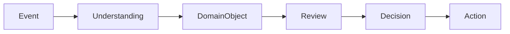

# RFC-011 Domain Model

**Status:** Draft  
**Authors:** Tiroq + ChatGPT  
**Last Updated:** 2026-06-28

---

## 1. Summary

This RFC defines the Domain Model for the Praxis system, establishing the principles, boundaries, and objects that organize business concepts into bounded contexts. Domains are responsible for contextualizing universal capabilities and encapsulating business logic, while sharing a common capability pipeline.

## 2. Relationship to Previous RFCs

- **RFC-000:** System Overview – establishes foundational concepts.
- **RFC-001:** Capabilities – defines universal system capabilities.
- **RFC-002:** Event Model – initial event concepts, further refined here.
- **RFC-003:** Understanding – describes how meaning is derived from events.
- **RFC-010:** Capability Pipeline – specifies the shared pipeline all domains use.

This RFC builds on these, formalizing how business meaning is layered atop the universal pipeline.

## 3. Goals

- Define clear domain boundaries and responsibilities.
- Specify a shared approach for modeling business concepts.
- Enable domain isolation and event-driven collaboration.
- Establish a provisional domain object model.
- Lay the groundwork for future domain and artifact modeling.

## 4. Non-Goals

- Does not prescribe implementation details for any domain.
- Does not finalize the artifact or event model.
- Does not define UI or API specifics.

## 5. Domain Philosophy

Praxis organizes business logic into **bounded contexts** called domains. Each domain owns its business concepts, rules, and objects, contextualizing the same universal capabilities. All domains share the same capability pipeline, ensuring consistency and interoperability, but their business logic and models are isolated. Communication between domains occurs only via Events, never through direct coupling.

## 6. Domain Hierarchy

| Domain    | Purpose                            | Primary Objects                           | Integrations                  |
|-----------|------------------------------------|-------------------------------------------|-------------------------------|
| Personal  | Manage individual productivity     | Project, Task, Reminder, Note             | Calendar, Notifications       |
| Work      | Organize professional activities   | Project, Meeting, Document, Research      | HR, Email, Calendar           |
| Freelance | Track freelance engagements        | Lead, Proposal, Client, Project, Task     | Invoicing, CRM                |
| Products  | Oversee product development        | Product, Backlog, Roadmap, Release        | Issue Tracker, Repo           |
| Content   | Plan and manage content creation   | Content Piece, Research, Document, Note   | CMS, Publishing, Social Media |

## 7. Shared Domain Object Model

The following are **provisional domain objects** produced after the Understanding phase. They are not fundamental architectural concepts, but rather business objects derived from the interpretation of events and user input:

- **Project:** A collection of related tasks or objectives.
- **Task:** A unit of work to be completed.
- **Lead:** A potential client or opportunity (Freelance).
- **Proposal:** An offer or plan submitted to a client.
- **Client:** An entity receiving services (Freelance).
- **Meeting:** A scheduled gathering (Work).
- **Research:** Investigative work supporting other objects.
- **Document:** A persistent record of information.
- **Note:** A brief, informal piece of information.
- **Reminder:** A scheduled prompt for attention.

These objects are created through Understanding and are contextualized by their owning domain.

## 8. Domain Object Lifecycle

## 9. Bounded Contexts

Each domain is a **bounded context**, encapsulating its own business rules, models, and invariants. Domains communicate exclusively via Events, never through direct references or business logic coupling. This ensures isolation, autonomy, and the ability to evolve independently.

## 10. Cross-Domain Relationships

Some concepts are reusable or referenced across domains, but **ownership** and **business rules** reside within a single domain. Cross-domain relationships are managed through events and shared knowledge, not shared logic.

| Concept   | Description                        | Ownership Rule                     |
|-----------|------------------------------------|------------------------------------|
| Project   | Coordinated work unit              | Owned by creating domain           |
| Context   | Circumstantial grouping            | Defined per domain                 |
| Knowledge | Information produced/consumed      | Shared, but contextualized         |
| Policy    | Rules governing behavior           | Each domain defines its own        |
| Workflow  | Sequence of tasks/actions          | Defined and owned per domain       |

## 11. Aggregate Boundaries

Aggregate roots are the entry points for business operations within a bounded context. They are defined per domain and will be refined in future RFCs. Candidate aggregate roots:

- **Personal:** Project, Task
- **Work:** Project, Meeting
- **Freelance:** Client, Proposal, Project
- **Products:** Product, Backlog
- **Content:** Content Piece, Research

## 12. Domain Invariants

- Domains cannot redefine or override universal capabilities.
- Domains own all business rules for their objects.
- Domains communicate only via Events.
- Knowledge is shared, but business logic is not.
- Every object belongs to exactly one owning domain.

## 13. Future Evolution

New domains can be added at any time without requiring changes to existing domains, provided they adhere to the shared capability pipeline and event-driven communication model.

## 14. Dependencies

This RFC depends on:
- RFC-000 through RFC-010

It is required before:
- RFC-012 Artifact Model
- RFC-013 Event Model
- RFC-030 System Architecture

## 15. Acceptance Criteria

- Domain boundaries and responsibilities are clearly defined.
- Provisional domain object model is documented.
- Event-driven domain communication is specified.
- Aggregate root candidates are listed per domain.
- Domain invariants and cross-domain relationship rules are explicit.

## 16. Decision Log

- 2026-06-28: Draft created and submitted for review.

---

> "Capabilities are universal. Domains give them meaning."