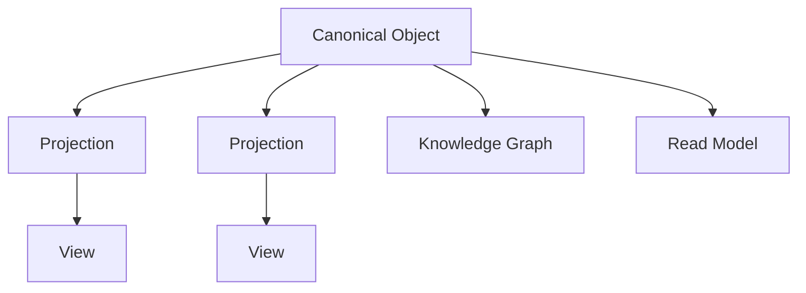

# RFC-011 Domain Model

**Status:** Draft  
**Authors:** Tiroq + ChatGPT  
**Last Updated:** 2026-06-28

---

## 1. Summary

Spaces are the primary bounded contexts within Praxis. Each Canonical Object belongs to exactly one primary Space, which defines its governance boundaries and ownership. Cross-space collaboration and integration are achieved through projections, cross-space references, events, and the Knowledge Graph, enabling consistent and coherent interaction across multiple Spaces.

## 2. Relationship to Previous RFCs

- **RFC-000:** System Overview – foundational concepts.  
- **RFC-001:** Principles – core guiding principles.  
- **RFC-002:** Terminology – standard definitions.  
- **RFC-003:** Concept Model – foundational conceptual structures.  
- **RFC-010:** Capability Map – overview of system capabilities.

This RFC builds on these by redefining how business concepts are organized and presented to users.

## 3. Conceptual Layers

The architecture of Praxis is organized into the following conceptual layers, each with distinct responsibilities:

```
Architecture
↓
Capabilities
↓
Spaces (Bounded Contexts)
↓
Canonical Objects
↓
Representations
↓
Workflows
```

- **Architecture:** The foundational system design, including infrastructure, event pipelines, and system-wide protocols.

- **Capabilities:** Universal, reusable functions and services that provide core system abilities independent of business context.

- **Spaces (Bounded Contexts):** The primary bounded contexts that own governance boundaries for business entities, workflows, policies, and knowledge.

- **Canonical Objects:** Authoritative business entities with globally unique identities that belong to exactly one primary Space.

- **Representations:** Contextualized projections and views of Canonical Objects tailored for specific Spaces, user interfaces, or workflows.

- **Workflows:** Orchestrations of capabilities and interactions within Spaces, guiding users through sequences of tasks and decisions.

## 4. Spaces

A **Space** is the primary bounded context within Praxis. It owns governance boundaries for Canonical Objects, Reviews, Decisions, Agents, Prompts, Memory, Policies, Knowledge, and Workflows. Spaces define the authoritative context for business entities and processes.

User interface workspaces may aggregate multiple Spaces for presentation purposes, but these aggregations are presentation concerns and do not alter the governance or ownership boundaries defined by Spaces.

Example Spaces include:

- Personal  
- Freelance  
- Work  
- Family  
- Open Source  
- Products  

Users will be able to create custom Spaces in the future, enabling flexible organization of their work according to individual needs.

## 5. Canonical Objects

Canonical Objects are authoritative business entities with globally unique identities. Each Canonical Object belongs to exactly one primary Space, which defines its ownership and governance. Canonical Objects may be referenced or projected into other Spaces, enabling cross-space collaboration without duplicating ownership or identity.

Examples include:

- Project  
- Task  
- Client  
- Proposal  
- Meeting  
- Research  
- Document  
- Note  
- Reminder  

## 6. Canonical Object Lifecycle


This flow illustrates how events are understood to produce Canonical Objects, which are then presented within Spaces and orchestrated through Workflows leading to Reviews, Decisions, and Actions.

## 7. Canonical Object Identity and Projection

Canonical Objects have a single primary Space to which they belong. Other Spaces access these objects through Cross-Space References, Projections, Events, and Knowledge Graph relationships. These mechanisms enable collaboration and data sharing across Spaces without altering the canonical identity or ownership of the object.

## 8. Bounded Contexts

In Praxis, a Space is the primary bounded context. It defines the governance boundaries for business logic, data ownership, workflows, and policies. User interface workspaces are presentation constructs that may aggregate multiple Spaces for user convenience, but they do not constitute bounded contexts and do not own business logic or entities.

## 9. Representation Model

The same business concept may have multiple representations across different contexts, user interfaces, or workflows, while preserving a single canonical identity. This approach allows for flexibility in presentation and adaptation, without duplicating business logic or ownership.



### Canonical Object
The single authoritative business object containing identity, lifecycle, and business invariants. All representations ultimately refer back to this canonical instance.

### Canonical Object Identity
The Canonical Object is the authoritative runtime entity that owns the global identity and business invariants. Projections and views never own or replicate this identity; they provide contextualized, read-only representations tailored for specific Spaces or workflows.

### Projection
Projections adapt Canonical Objects for a particular Space or workflow, providing contextualized representations without duplicating business ownership or logic.

### View
Views are presentation-specific, read-only models optimized for UI or API consumption. They tailor data for display and interaction.

### Read Model
Read models are optimized query representations of business data, often denormalized for performance. They can be rebuilt at any time from canonical sources and events.

### Knowledge Graph
The Knowledge Graph connects Canonical Objects across Spaces and Domains through semantic relationships, enabling cross-context insights and reasoning without implying ownership.

> **Representation is contextual. Identity is canonical.**

## 10. Architectural Invariants

- Every Canonical Object belongs to exactly one primary Space.  
- Canonical identity is globally unique.  
- Spaces own governance boundaries.  
- Cross-Space communication is explicit.  
- Projections never own business identity.  
- Knowledge Graph never owns Canonical Objects.  
- Capabilities remain reusable across Spaces.  
- Reviews and Decisions operate on Canonical Objects.

## 11. Future Evolution

- Users will be empowered to create custom Spaces for personalized organization.

- Bounded contexts and domain-specific logic will be formalized in future RFCs, aligned with system architecture.

- The Knowledge Graph will evolve to provide enhanced insights across Spaces and Domain Objects.

## 12. Dependencies

This RFC depends on:

- RFC-000 through RFC-010

It is required before:

- RFC-012 Artifact Model  
- RFC-013 Event Model  
- RFC-030 System Architecture  
- RFC-043 Memory & Knowledge Graph

## 13. Acceptance Criteria

- Space defined as the primary bounded context.  
- Canonical Object ownership model defined.  
- Cross-Space communication defined.  
- Representation model aligned with RFC-050.  
- Architectural invariants aligned with RFC-014, RFC-033, RFC-043, and RFC-050.

---

> "Spaces organize work. Domain Objects represent work. Capabilities transform work."