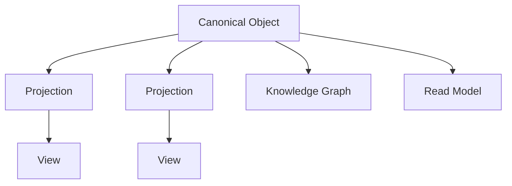

# RFC-011 Domain Model

**Status:** Draft  
**Authors:** Tiroq + ChatGPT  
**Last Updated:** 2026-06-28

---

## 1. Summary

This RFC redefines the architectural role of Spaces, Domain Objects, and Capabilities within the Praxis system. It clarifies that Personal, Work, Freelance, Products, and Content are **Spaces**—user-facing workspaces—rather than Domain-Driven Design (DDD) domains or bounded contexts. The document introduces a layered conceptual model and updates the ownership and architectural principles accordingly.

## 2. Relationship to Previous RFCs

- **RFC-000:** System Overview – foundational concepts.  
- **RFC-001:** Capabilities – universal system capabilities.  
- **RFC-002:** Event Model – initial event concepts.  
- **RFC-003:** Understanding – deriving meaning from events.  
- **RFC-010:** Capability Pipeline – shared pipeline architecture.

This RFC builds on these by redefining how business concepts are organized and presented to users.

## 3. Conceptual Layers

The architecture of Praxis is organized into the following conceptual layers, each with distinct responsibilities:

```
Architecture
↓
Capabilities
↓
Domain Objects
↓
Spaces (UI)
↓
Workflows
```

- **Architecture:** The foundational system design, including infrastructure, event pipelines, and system-wide protocols.

- **Capabilities:** Universal, reusable functions and services that provide core system abilities independent of business context.

- **Domain Objects:** Reusable business concepts representing core entities such as Project, Task, Client, and Meeting. These objects encapsulate business data and rules but are independent of user-facing contexts.

- **Spaces (UI):** Logical, user-facing workspaces that organize and present Domain Objects in meaningful ways. Spaces provide contextual boundaries for users but do not own business logic.

- **Workflows:** Orchestrations of capabilities and interactions within Spaces, guiding users through sequences of tasks and decisions.

## 4. Spaces

A **Space** is a logical organizational boundary presented to the user as a workspace tailored to specific contexts or activities. Spaces help users organize and manage their work but are not technical domains or bounded contexts.

Example Spaces include:

- Personal  
- Freelance  
- Work  
- Family  
- Open Source  
- Products  

Users will be able to create custom Spaces in the future, enabling flexible organization of their work according to individual needs.

## 5. Domain Objects

Domain Objects are reusable business concepts shared across multiple Spaces. They represent the fundamental entities of work and collaboration, including but not limited to:

- Project  
- Task  
- Client  
- Proposal  
- Meeting  
- Research  
- Document  
- Note  
- Reminder  

These objects are not owned or confined to any single Space. Instead, they maintain canonical identities and may appear in multiple Spaces through projections or views.

## 6. Domain Object Lifecycle


This flow illustrates how events are understood to produce Domain Objects, which are then presented within Spaces and orchestrated through Workflows leading to Reviews, Decisions, and Actions.

## 7. Domain Object Identity and Projection

A Domain Object may appear in multiple Spaces through projections while maintaining a single canonical identity. This approach ensures consistency and prevents duplication of business entities across user workspaces.

## 8. Bounded Contexts

DDD bounded contexts are internal implementation concerns that define boundaries for business logic and models. These will be specified in detail alongside the System Architecture (RFC-030) and are not exposed as user-facing concepts.

**Spaces are not bounded contexts.** They are abstractions designed for user experience and do not own business logic or enforce invariants.

## 9. Representation Model

The same business concept may have multiple representations across different contexts, user interfaces, or workflows, while preserving a single canonical identity. This approach allows for flexibility in presentation and adaptation, without duplicating business logic or ownership.



### Canonical Object
The single authoritative business object containing identity, lifecycle, and business invariants. All representations ultimately refer back to this canonical instance.

### Domain Object
A Domain Object is the conceptual business entity (such as Project, Task, Client, Meeting, Proposal, etc.), while the Canonical Object is its runtime authoritative instance in the system.

### Projection
Projections adapt Canonical Objects for a particular Space or workflow, providing contextualized representations without duplicating business ownership or logic.

### View
Views are presentation-specific, read-only models optimized for UI or API consumption. They tailor data for display and interaction.

### Read Model
Read models are optimized query representations of business data, often denormalized for performance. They can be rebuilt at any time from canonical sources and events.

### Knowledge Graph
The Knowledge Graph connects Canonical Objects across Spaces and Domains through semantic relationships, enabling cross-context insights and reasoning without implying ownership.

> **Representation is contextual. Identity is canonical.**

## 10. Architectural Invariants

- Spaces never own business logic; they are purely organizational and presentational.

- Capabilities remain independent of Spaces and provide universal functions.

- Domain Objects are reusable and maintain canonical identities.

- Workflows orchestrate capabilities and user interactions within Spaces.

- Reviews and Decisions operate on Domain Objects to enforce business rules.

- Knowledge spans all Spaces, enabling shared understanding without coupling.

## 11. Future Evolution

- Users will be empowered to create custom Spaces for personalized organization.

- Bounded contexts and domain-specific logic will be formalized in future RFCs, aligned with system architecture.

- The Knowledge Graph will evolve to provide enhanced insights across Spaces and Domain Objects.

## 12. Dependencies

This RFC depends on:

- RFC-000 through RFC-010

It is required before:

- RFC-012 Artifact Model  
- RFC-013 Event Model  
- RFC-030 System Architecture  
- RFC-043 Memory & Knowledge Graph

## 13. Acceptance Criteria

- Clear distinction between Spaces and bounded contexts.

- Introduction of the layered conceptual model.

- Definition of Domain Objects as reusable business concepts.

- Updated ownership and architectural invariants.

- Lifecycle flow reflecting Space and Workflow integration.

---

> "Spaces organize work. Domain Objects represent work. Capabilities transform work."