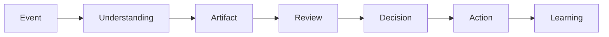
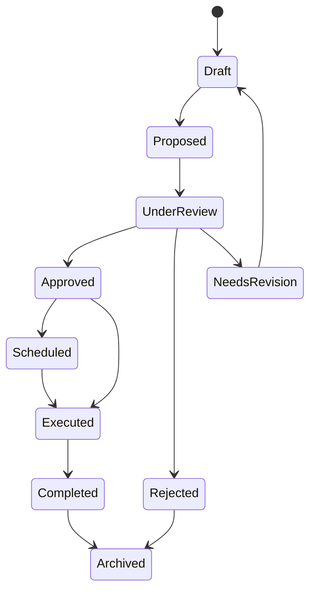
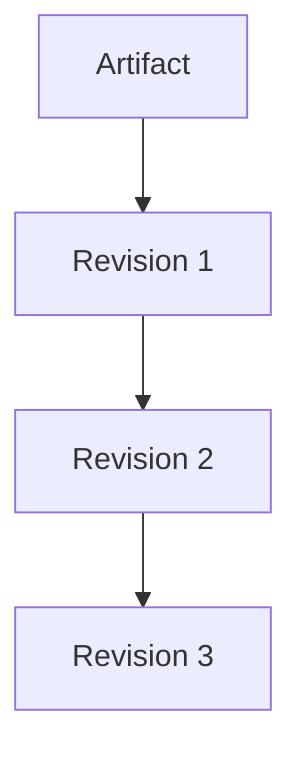
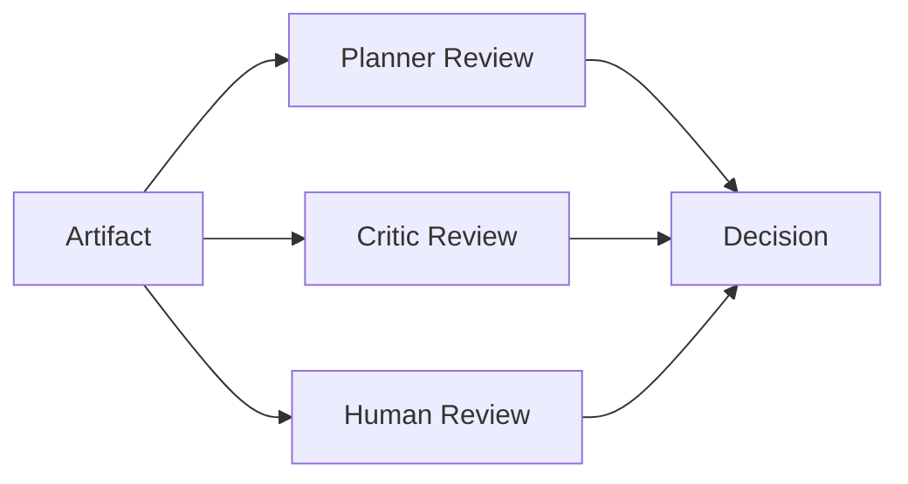
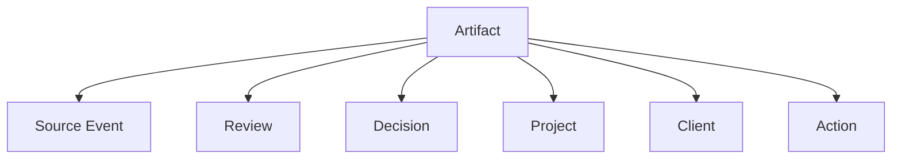

# RFC-012 Artifact Model

**Status:** Draft  
**Authors:** Tiroq + ChatGPT  
**Last Updated:** 2026-06-28

---

## 1. Summary

This RFC defines the Artifact Model for Praxis.

An Artifact is a durable representation of work produced by the Praxis lifecycle. It is not the root of the entire system, but it is one of the most important outcomes of Understanding. Events enter the system, are interpreted, and may produce one or more Artifacts. Artifacts are then reviewed, decided upon, executed, represented in Spaces, and connected through knowledge.

This RFC clarifies what an Artifact is, what it is not, how it relates to Domain Objects, Canonical Objects, Projections, Views, Reviews, Decisions, Actions, and the Knowledge Graph.

---

## 2. Relationship to Previous RFCs

This RFC depends on the following foundation documents:

- RFC-000 Vision — defines why Praxis exists.
- RFC-001 Principles — defines architectural principles.
- RFC-002 Terminology — defines shared language.
- RFC-003 Concept Model — defines conceptual categories.
- RFC-010 Capability Map — defines what Praxis must be capable of.
- RFC-011 Domain Model — defines Spaces, Domain Objects, and Representation Model.

RFC-011 established that user-facing areas such as Personal, Work, Freelance, Products, and Content are Spaces, not DDD bounded contexts. This RFC builds on that model by defining the Artifact as a canonical form of durable work representation.

---

## 3. Goals

The goals of this RFC are to:

- Define Artifact as a canonical work representation.
- Distinguish Artifact from Event, Domain Object, Projection, View, Task, and Workflow.
- Define artifact identity, lifecycle, status, revision, and history.
- Establish how Artifacts participate in Reviews, Decisions, and Actions.
- Ensure Artifacts can appear in multiple Spaces without duplication.
- Provide a foundation for storage, APIs, workflows, and UI design in later RFCs.

---

## 4. Non-Goals

This RFC does not:

- Define the database schema.
- Define API endpoints.
- Define the final UI model.
- Define all possible Artifact types exhaustively.
- Define Event storage or event sourcing implementation.
- Define the complete Knowledge Graph model.
- Replace the future RFC-014 Identity & Representation Model.

---

## 5. Artifact Definition

An **Artifact** is a durable, reviewable representation of interpreted work.

Artifacts are produced after the system has understood an Event or a set of Events. They are stable enough to be stored, reviewed, revised, linked, projected into Spaces, and acted upon.

Examples of Artifacts include:

- Task
- Proposal
- Lead
- Client record
- Meeting summary
- Research note
- Document
- Reminder
- Decision record
- Project brief
- Content idea
- MVP plan

An Artifact is not merely raw information. It is information that has been interpreted and shaped into a useful work object.

---

## 6. Artifact in the Praxis Lifecycle



The Artifact appears after Understanding and before Review.

This means:

- Raw input is not an Artifact.
- An Event may produce zero, one, or many Artifacts.
- Artifacts are subject to Review.
- Decisions operate on Artifacts.
- Actions may be executed based on Decisions about Artifacts.
- Learning may update future handling of similar Artifacts.

---

## 7. Artifact vs Related Concepts

| Concept | Difference from Artifact |
|--------|---------------------------|
| Event | Raw occurrence entering the system. Events are inputs; Artifacts are interpreted outputs. |
| Domain Object | Broader conceptual business object. Artifact is one possible durable representation of a Domain Object. |
| Canonical Object | Runtime authoritative instance with identity and invariants. Artifact may become or reference a Canonical Object. |
| Projection | Contextual representation of an Artifact in a Space or workflow. |
| View | UI/API-specific read model derived from a Projection or Read Model. |
| Workflow | Process that acts on or creates Artifacts. |
| Review | Evaluation of an Artifact. |
| Decision | Resolution about an Artifact. |
| Action | Execution resulting from a Decision. |

---

## 8. Artifact Identity

Each Artifact must have a stable identity.

Artifact identity is independent of:

- Space membership
- UI view
- External integration ID
- Display title
- Current status
- Current revision

An Artifact may be shown in multiple Spaces, but it remains the same Artifact if it has the same canonical identity.

Example:

```text
Artifact: Proposal #123

Visible in:
- Freelance Space
- Client Space
- Products Space

Identity remains:
Proposal #123
```

This prevents duplication and allows Praxis to preserve relationships and history across contexts.

---

## 9. Artifact Types

Artifact types are provisional and may evolve in later RFCs.

Initial Artifact categories:

| Artifact Type | Description | Example |
|--------------|-------------|---------|
| Task | Actionable unit of work | "Fix Telegram review flow" |
| Proposal | Suggested plan, offer, or change | Upwork proposal draft |
| Lead | Potential opportunity | Upwork job posting |
| Client | Person or organization receiving work | Freelance client |
| Meeting | Structured record of a meeting | Meeting summary + actions |
| Research | Investigative knowledge artifact | Market research note |
| Document | Long-form written artifact | Architecture document |
| Note | Lightweight captured thought | Quick Telegram note |
| Reminder | Time-based attention artifact | Follow up in 2 days |
| Decision Record | Durable record of a decision | Approved architecture change |
| Project Brief | Summary of a project objective | MVP brief |
| Content Idea | Potential publishable topic | Article idea |

This list is intentionally not final. Later domain-specific RFCs may extend it.

---

## 10. Artifact Lifecycle

Artifacts follow a lifecycle.



Canonical lifecycle states:

| State | Meaning |
|------|---------|
| Draft | Artifact exists but is not ready for review. |
| Proposed | Artifact is ready to be reviewed. |
| UnderReview | Artifact is being evaluated by agents or humans. |
| NeedsRevision | Artifact requires changes before approval. |
| Approved | Artifact has been accepted. |
| Rejected | Artifact has been declined. |
| Scheduled | Approved Artifact has planned execution time. |
| Executed | Action has been performed based on Artifact. |
| Completed | Artifact has reached intended outcome. |
| Archived | Artifact is no longer active but preserved. |

Not every Artifact must pass through every state.

---

## 11. Artifact Revisions

Artifacts are versioned.

Every meaningful change to an Artifact creates a Revision.

A Revision records:

- Previous state
- New state
- Change reason
- Actor
- Timestamp
- Source event or decision
- Related review if applicable

Revisions are required because Praxis must preserve reasoning and traceability.



---

## 12. Artifact History

Artifact history must never be silently overwritten.

History includes:

- Source Events
- Understanding outputs
- Reviews
- Decisions
- Actions
- Revisions
- External synchronization events
- Human edits
- AI-generated suggestions

This history allows Praxis to answer:

- Why does this Artifact exist?
- Where did it come from?
- Who or what changed it?
- Why was it approved or rejected?
- Which action was executed because of it?

---

## 13. Artifact and Reviews

Reviews evaluate Artifacts.

A Review may be produced by:

- Human
- Planner Agent
- Critic Agent
- Risk Agent
- Architect Agent
- Portfolio Agent
- LLM-based reviewer
- Rule-based validator

A Review does not mutate the Artifact directly.

Instead, it produces an evaluation, recommendation, critique, score, or requested change.



---

## 14. Artifact and Decisions

A Decision resolves what should happen to an Artifact.

Examples:

- Approve
- Reject
- Revise
- Split
- Merge
- Archive
- Schedule
- Execute
- Escalate

A Decision must be explicit and recorded.

No irreversible Action may be executed without a valid Decision or explicit policy allowing automated execution.

---

## 15. Artifact and Actions

Actions are the execution result of Decisions.

Examples:

- Persist to storage
- Publish to external system
- Notify user
- Create external task
- Update CRM record
- Schedule reminder
- Send proposal
- Trigger workflow

Actions are not Artifacts, but they may create or modify Artifacts.

---

## 16. Artifact and Spaces

Artifacts may appear in multiple Spaces through Projections.

Examples:

| Artifact | Space Projection |
|---------|------------------|
| Proposal | Freelance Space |
| Proposal | Client Space |
| Task | Work Space |
| Task | Personal Space |
| Research | Products Space |
| Research | Content Space |

Spaces organize Artifacts for the user.

Spaces do not own Artifact identity or business logic.

---

## 17. Artifact and Knowledge Graph

Artifacts are nodes in the Knowledge Graph.

They may be connected to:

- Source Events
- People
- Projects
- Clients
- Decisions
- Reviews
- Documents
- External references
- Similar Artifacts
- Follow-up Actions



The Knowledge Graph does not own Artifacts. It connects them semantically.

---

## 18. Artifact Invariants

The following invariants must hold:

- Every Artifact has a stable identity.
- Every Artifact has a type.
- Every Artifact has a lifecycle state.
- Every Artifact has a revision history.
- Every Artifact is traceable to at least one Event, Decision, or manually created source.
- Reviews do not directly mutate Artifacts.
- Decisions about Artifacts are recorded.
- Spaces may project Artifacts but do not own them.
- External systems may reference Artifacts but do not define their canonical identity.

---

## 19. Artifact Creation Rules

Artifacts may be created by:

- Understanding an Event
- Human manual input
- Workflow execution
- Import from external system
- Decision to split an existing Artifact
- Decision to materialize a proposal

Artifacts must not be created silently without a source.

Every Artifact creation must record provenance.

---

## 20. Artifact Merge and Split

Artifacts may be merged or split through Decisions.

### Merge

Merge combines two or more Artifacts into one canonical Artifact.

The original Artifacts must not be deleted; they should be linked as superseded, merged, or archived.

### Split

Split creates multiple Artifacts from one original Artifact.

The original Artifact remains as the source or parent of the new Artifacts.

---

## 21. Artifact Synchronization

Artifacts may be synchronized with external systems.

Examples:

- Google Tasks
- GitHub Issues
- CRM Opportunities
- Calendar Events
- Upwork proposals

External IDs are references, not canonical identities.

Praxis owns the canonical Artifact identity.

---

## 22. Open Questions

- Should all Artifact types share one base lifecycle, or should some types have specialized lifecycle extensions?
- Should manually created Artifacts always require an Event wrapper?
- How should conflicting external updates be resolved?
- What is the minimum required metadata for every Artifact type?
- Which Artifact types should exist in MVP?

---

## 23. Future Evolution

This RFC will be refined by:

- RFC-013 Event Model
- RFC-014 Identity & Representation Model
- RFC-020 Review System
- RFC-021 Decision Model
- RFC-030 System Architecture
- RFC-043 Memory & Knowledge Graph

Future RFCs may define specialized Artifact types, but must preserve the invariants defined here.

---

## 24. Dependencies

Depends on:

- RFC-000 Vision
- RFC-001 Principles
- RFC-002 Terminology
- RFC-003 Concept Model
- RFC-010 Capability Map
- RFC-011 Domain Model

Required before:

- RFC-013 Event Model
- RFC-014 Identity & Representation Model
- RFC-020 Review System
- RFC-021 Decision Model
- RFC-030 System Architecture
- RFC-043 Memory & Knowledge Graph

---

## 25. Acceptance Criteria

This RFC can be accepted when:

- Artifact is clearly distinguished from Event, Domain Object, Projection, View, Review, Decision, Action, and Workflow.
- Artifact identity rules are clear.
- Artifact lifecycle is defined.
- Artifact revision and history requirements are explicit.
- Artifact interaction with Spaces is consistent with RFC-011.
- Artifact interaction with Reviews, Decisions, and Actions is defined.
- Artifact invariants are agreed upon.

---

## 26. Decision Log

| Date | Change | Author |
|------|--------|--------|
| 2026-06-28 | Initial draft | Tiroq + ChatGPT |

---

> **Artifacts are how Praxis gives durable shape to understood work.**