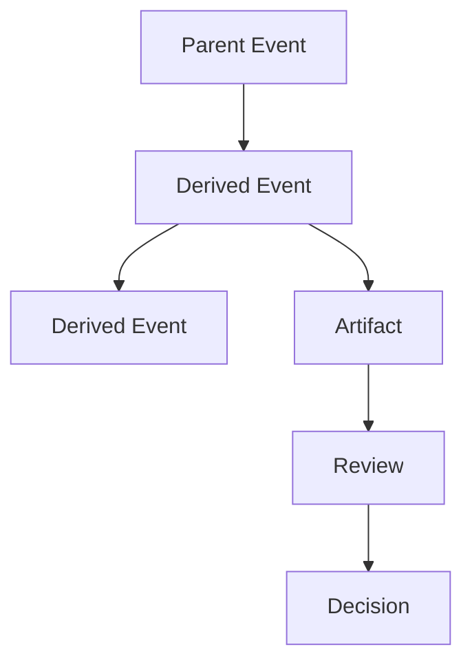

# RFC-013 Event Model

**Status:** Draft  
**Authors:** Tiroq + ChatGPT  
**Last Updated:** 2026-06-28

---

## 1. Summary

Events are the immutable entry point into Praxis. They represent facts about something that happened, was observed, or was received. Events are the primary building blocks for provenance, traceability, and system understanding.

---

## 2. Relationship to Previous RFCs

This RFC builds upon concepts introduced in:
- **RFC-000**: Vision
- **RFC-001**: Principles
- **RFC-002**: Terminology
- **RFC-003**: Concept Model
- **RFC-010**: Capability Map
- **RFC-011**: Domain Model
- **RFC-012**: Artifact Model

Events are the immutable input to the system, while Artifacts are durable outputs of Understanding.

---

## 3. Goals

- Define what constitutes an Event in Praxis.
- Specify the event lifecycle from capture to artifact generation.
- Define required event metadata for traceability and provenance.
- Clarify the separation between Events and Artifacts.
- Enable replay and full traceability for all downstream data.

---

## 4. Non-Goals

- This RFC does **not** specify any transport protocol, message broker, storage engine, or event sourcing implementation.

---

## 5. Event Definition

An **Event** is a record of something that happened, was observed, or was received. Events are immutable facts: once recorded, they cannot be changed. They serve as the canonical source for all derived knowledge, artifacts, and decisions within Praxis.

---

## 6. Event Sources

Events can originate from many sources:

| Source         | Description                               |
|---------------|-------------------------------------------|
| Telegram      | Messages, notifications, commands         |
| Email         | Received or sent emails                   |
| Calendar      | Calendar invites, updates, reminders      |
| GitHub        | Commits, issues, PRs, comments            |
| Upwork        | Contracts, messages, milestones           |
| Manual Input  | User-entered data                         |
| API           | External system calls                     |
| Webhook       | Third-party event notifications           |
| Files         | File uploads, changes, processing         |
| Sensors       | IoT or hardware sensor data               |
| Scheduled Jobs| Cron jobs, scheduled tasks                |
| Internal Events| System-generated events                  |

---

## 7. Event Lifecycle

```mermaid
flowchart LR
    S[Source]
    --> C[Capture]
    --> V[Validate]
    --> P[Persist]
    --> U[Understand]
    --> A[Artifact(s)]
```

This RFC intentionally ends at Artifact creation; Review, Decision, Action and Learning belong to later RFCs.

---

## 8. Event Structure

Every Event must include the following mandatory fields:

- **Event ID**: Unique, immutable identifier.
- **Timestamp**: When the event occurred or was observed.
- **Source**: Originating system, user, or process.
- **Type**: Classification (e.g., `email.received`, `github.commit`).
- **Payload**: Raw event data. The Payload is immutable.
- **Metadata**: Additional context (e.g., processing info). Metadata may be enriched during processing without changing the original payload.
- **Correlation ID**: Links related events in a chain.
- **Causation ID**: Identifies the event that caused this event.
- **Actor**: Who or what performed the action.
- **Trust Level**: Degree of confidence in authenticity.
- **Schema Version**: Version of the event structure.
- **Trace ID**: Identifier used to trace the event through distributed systems.
- **Confidence**: Numeric or categorical measure of certainty in the event's accuracy.
- **Validation Status**: Result of validation checks (e.g., valid, invalid, pending).
- **Content Type**: MIME type or format of the Payload.
- **Observed At**: Timestamp when the event was observed or received by Praxis.

---

## 9. Event Classification

### By Origin

- External
- Internal
- User
- AI
- Scheduled
- Integration

### By Semantics

- Observation Event
- Signal Event
- Command Event
- System Event
- Derived Event

---

## 10. Event Relationships



Events may produce derived events and artifacts, which in turn may produce reviews and decisions. Events never directly become Decisions.

---

## 11. Event Immutability

Events are **append-only**. After being persisted, they can never be modified or deleted. If a correction is needed, a new event is appended that references the original, describing the correction or retraction.

---

## 12. Provenance

Every **Artifact**, **Review**, and **Decision** in Praxis must be traceable to one or more originating Events. This ensures full provenance and auditability throughout the system.

---

## 13. Correlation & Causation

- **Correlation ID**: Groups events that are related (e.g., all events in a workflow).
- **Causation ID**: Points to the specific event that caused this event.

Correlation and causation are distinct: correlation groups, causation tracks direct lineage.

---

## Event Quality

Event quality attributes influence routing and processing but do not alter the original Event:

- **Authenticity**: Verification that the event source is genuine.
- **Completeness**: Indicates whether the event contains all expected data.
- **Confidence**: The degree of certainty in the event's accuracy.
- **Validation Result**: Outcome of validation processes (e.g., valid, invalid).
- **Trust Level**: Overall trustworthiness assigned to the event.

These attributes help determine how events are handled but never change the immutable event data.

---

## 14. Event Invariants

- Every Event has an immutable identity.
- Events are append-only.
- Events are immutable after Persist.
- Events never become Artifacts.
- Events never contain business decisions.
- Events preserve the original payload forever.
- Corrections are represented by new Events.
- Events may produce zero or more Artifacts.
- Events may be replayed without modification.

---

## 15. Event Replay

Replay enables rebuilding projections, read models, and the knowledge graph by reprocessing the event log from a known state. This supports system recovery, migration, and auditing.

---

## 16. Event Retention

Events are retained for the maximum feasible period, outliving any projections or read models built from them. This guarantees the ability to reconstruct system state and provenance at any time.

---

## 17. Event Security

- **Trust Levels**: Each event's trustworthiness is recorded.
- **Signature Verification**: Events from external sources may be signed and verified.
- **Source Authentication**: Each event's source must be authenticated.
- **Auditability**: All events are fully auditable and tamper-evident.

---

## 18. Open Questions

- How to handle schema evolution for event payloads?
- Should all events be cryptographically signed?
- What is the minimum retention period for events?
- How to efficiently query and replay large event logs?

---

## 19. Event Contract

Every integration—Telegram, Gmail, GitHub, Upwork, Calendar, API, Webhooks, and future connectors—must emit the canonical Event Envelope regardless of transport protocol. This ensures consistency and interoperability across the Praxis ecosystem.

---

## 20. Future Evolution

This RFC will inform and be extended by:
- **RFC-014**: Identity & Representation Model
- **RFC-020**: Review System
- **RFC-030**: System Architecture

---

## 21. Dependencies

- Depends on: RFC-000 through RFC-012
- Required before: RFC-020, RFC-030, RFC-032, RFC-043

---

## 22. Acceptance Criteria

- All Events in Praxis conform to the defined structure and invariants.
- All Artifacts, Reviews, and Decisions are fully traceable to Events.
- Event immutability and append-only properties are enforced.
- Event replay and provenance are demonstrably supported.

---

## 23. Decision Log

| Date       | Change         | Author           |
|------------|----------------|------------------|
| 2026-06-28 | Initial draft  | Tiroq + ChatGPT  |

---

> "Events are immutable facts. Everything else is interpretation."