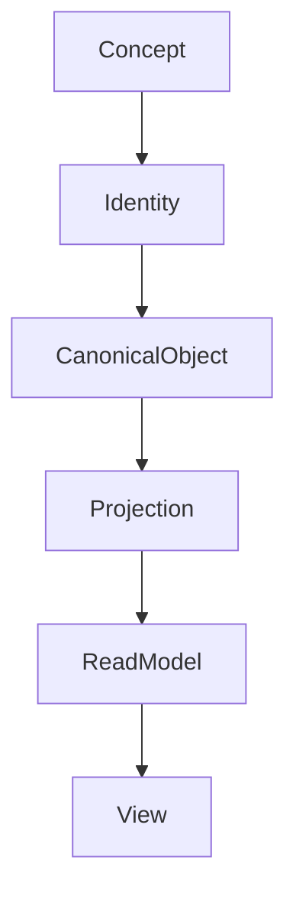
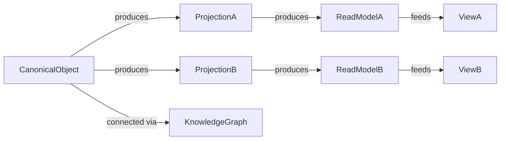

# RFC-014 Identity & Representation Model

**Status:** Draft  
**Authors:** Tiroq + ChatGPT  
**Last Updated:** 2026-06-28

---

## 1. Summary

This RFC defines the model for identity, canonical ownership, and representation of business objects throughout Praxis. It establishes how objects retain stable identity, how canonical objects relate to projections and views, and how these representations remain consistent and connected across Spaces, integrations, and the knowledge graph.

## 2. Relationship to Previous RFCs

This RFC builds upon RFC-000 through RFC-013:
- RFC-011 introduced Spaces.
- RFC-012 defined Artifacts.
- RFC-013 defined Events.

This RFC explains how objects such as Artifacts and Events maintain the same identity across multiple representations, Spaces, and integrations.

## 3. Goals

- **Stable Identity:** Ensure that every business object has a globally unique, immutable identity.
- **Canonical Ownership:** Define a single source of truth for object state and lifecycle.
- **Multiple Representations:** Support projections and read models for different Spaces, workflows, and integrations.
- **Cross-Space Consistency:** Guarantee that objects are consistent and connected across Spaces.
- **Knowledge Graph Integration:** Enable semantic relationships between objects without duplicating identity.

## 4. Non-Goals

- Defining database schema or storage implementation.
- UI or API implementation.
- Graph engine or storage details.

## 5. Conceptual Model

Praxis models identity and representation as a layered system:

```
Concept
  ↓
Identity
  ↓
Canonical Object
  ↓
Projection
  ↓
Read Model
  ↓
View
```

- **Concept:** Abstract idea in the domain language.
- **Identity:** Globally unique, immutable identifier.
- **Canonical Object:** Single authoritative runtime object.
- **Projection:** Adaptation of Canonical Object for Spaces/workflows.
- **Read Model:** Optimized, disposable representation for queries.
- **View:** Presentation layer (UI, API, integrations).

## 6. Mermaid Diagram: Layered Model



## 7. Concept

A **Concept** is an element of the ubiquitous language with no runtime identity or storage. It is a shared understanding within the domain.

**Examples:** Project, Task, Client, Proposal, Meeting.

## 8. Identity

**Identity** is a globally unique, immutable identifier for a business object. It is independent of Spaces, integrations, and UI. Identity is assigned at creation and never changes.

**Identity Invariants:**
- Never changes or is reassigned.
- Exists independently of any Space or integration.
- Used to connect all representations and projections.

## 9. Canonical Object

The **Canonical Object** is the single authoritative runtime object for a business entity. It contains all business invariants, lifecycle state, and relationships.

### Responsibilities
- Own business identity.
- Enforce business invariants.
- Own lifecycle.
- Maintain relationships.
- Maintain revision history.
- Maintain mappings to external identities.
- Serve as the authoritative source for projections.

## 10. Projection

**Projections** adapt Canonical Objects for use in different Spaces, workflows, or integrations. They do not create new ownership or identity, but provide context-specific adaptation.

**Examples:**  
- Personal Space view of a Task  
- Work Space projection of a Project  
- Freelance Space adaptation of a Proposal

## 11. Read Model

**Read Models** are optimized, disposable representations of objects, tailored for specific queries or UI patterns. They are generated from Canonical Objects and Projections, and can be rebuilt at any time.

**Examples:**  
- Kanban board  
- Calendar view  
- Dashboard metrics  
- Search index

## 11.1 Representation Types

| Representation | Purpose | Disposable |
|---------------|---------|------------|
| Projection | Adapt Canonical Objects to a Space or workflow | No |
| Read Model | Optimize queries and navigation | Yes |
| View | Present information to a consumer (UI/API/Telegram) | Yes |

These representations exist at different architectural layers and should not be treated as interchangeable. Each serves a specific role in adapting, optimizing, or presenting information, and their boundaries must be maintained.

## 12. View

**Views** are presentation concerns: UI, API, mobile, Telegram, or other integrations. Views never own business state or identity.

## 13. Identity Lifecycle


## 14. Representation Relationships



## 15. Identity Invariants

- **Identity never changes.**
- **Projections never own business logic or state.**
- **Read Models may be rebuilt at any time.**
- **Views never own state or identity.**
- **External IDs (GitHub, Google, Upwork, etc.) are references only.**
- **Spaces never own Canonical Objects.**

## 15.1 Identity Boundaries

- Spaces never own identity.
- Integrations never own identity.
- Read Models never own identity.
- Views never own identity.
- Knowledge Graph never owns identity.
- Only Canonical Objects own business identity.

Identity has exactly one authoritative owner. Every other representation is a reference.

## 16. External Identity Mapping

Canonical IDs are mapped to external system IDs (e.g., GitHub issues, Google Tasks, Calendar events, Upwork contracts) via reference tables or mappings. These references do not confer ownership or identity; they only link Canonical Objects to external representations.

## 17. Knowledge Graph Integration

The Knowledge Graph connects Canonical Objects semantically. It never owns identity or state, but enables rich relationships and queries across all objects, projections, and external references.

## 18. Architectural Consequences

This model enables:
- CQRS (Command Query Responsibility Segregation) via projections and read models.
- Event replay and rebuilding of read models.
- Multi-space organization and cross-space consistency.
- Provider independence and seamless integration with external systems.
- Semantic navigation and reasoning via the Knowledge Graph.
- Enables replay-driven reconstruction from Events.
- Separates business identity from presentation, storage and transport.

## 19. Dependencies

- Depends on RFC-000 through RFC-013.
- Required before:
    - RFC-020 Review System
    - RFC-021 Decision Model
    - RFC-030 System Architecture
    - RFC-032 Data Flow
    - RFC-043 Memory & Knowledge Graph

## Architectural Summary
- Concept defines language.
- Identity defines uniqueness.
- Canonical Object owns business truth.
- Projections adapt context.
- Read Models optimize access.
- Views present information.
- Knowledge Graph connects meaning.

## 20. Acceptance Criteria

- All business objects have globally unique, immutable identity.
- Canonical Objects are the single source of truth.
- Projections, Read Models, and Views are derived and disposable.
- Identity mapping to external systems is reference-only.
- Knowledge Graph integration is semantic, not owning.
- All invariants in section 15 are enforced.
- Identity ownership is unambiguous.
- Representation layers remain independent.
- Canonical Objects remain the only business source of truth.

## 21. Decision Log

| Date       | Decision      | Authors        | Notes                |
|------------|--------------|---------------|----------------------|
| 2026-06-28 | Initial Draft| Tiroq, ChatGPT|                      |

---

> "Identity is permanent. Representation is contextual."