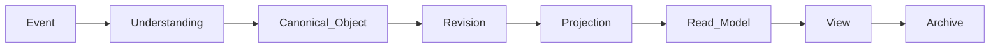
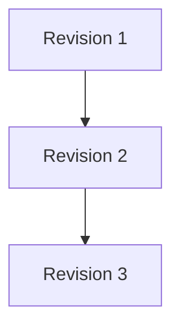

# RFC-015 Object Lifecycle Model

**Status:** Draft  
**Authors:** Tiroq + ChatGPT  
**Last Updated:** 2026-06-28

---

## 1. Summary

This RFC defines the lifecycle of Canonical Objects from creation to archival and connects Events, Artifacts, Revisions, Projections, and Views. It establishes a comprehensive model describing how objects evolve through various stages, how their revisions are managed immutably, and how projections and views are synchronized and rendered. This lifecycle model forms a foundational component of the overall system architecture, ensuring consistency and clarity in object state transitions and representations.

## 2. Relationship to Previous RFCs

This RFC builds upon the foundations laid out in RFC-000 through RFC-014. While those RFCs established core concepts such as Events, Artifacts, and basic object models, RFC-015 completes the Foundation architecture by formalizing the lifecycle of Canonical Objects and their associated representations. It integrates and extends prior work to provide a unified lifecycle framework essential for subsequent RFCs.

## 3. Goals

- Define a clear and comprehensive lifecycle for Canonical Objects.
- Separate the processing lifecycle (how data is handled) from the business lifecycle (how objects evolve in business terms).
- Define an immutable revision model for object versions.
- Define the projection lifecycle for derived data representations.
- Define archival procedures and states.

## 4. Non-Goals

- This RFC does not specify persistence implementations.
- It does not define workflow engines or storage details.
- It does not prescribe UI or UX specifics.

## 5. Lifecycle Philosophy

The lifecycle model distinguishes three interrelated but distinct lifecycles:

- **Events** have *processing states* that track how events are handled within the system.
- **Canonical Objects** have *business lifecycles* representing their real-world or domain-related state transitions.
- **Projections** have *synchronization lifecycles* describing how derived representations stay current or become stale.

This separation ensures clarity in responsibilities and enables flexible system design.

## 6. Canonical Lifecycle

The lifecycle begins with an Event, which is processed into an Understanding. This understanding produces or modifies a Canonical Object, which is versioned through Revisions. Revisions are projected into Projections, which feed Read Models. Views are rendered from Read Models and eventually objects or views may be Archived.

## 7. Lifecycle Stages

Canonical Objects progress through the following business lifecycle stages:

- **Created:** The object is instantiated.
- **Active:** The object is in normal operational state.
- **Under Review:** The object is being audited or verified.
- **Approved:** The object has passed review and is authorized.
- **Scheduled:** The object is planned for future action.
- **Executing:** The object is currently undergoing its intended process.
- **Completed:** The object's process is finished.
- **Archived:** The object is no longer active and is retained for historical or compliance reasons.

Not every object must traverse every stage; paths may vary by object type and business rules.

## 8. Processing vs Business Lifecycle

| Event Processing States | Object Business States   |
|------------------------|-------------------------|
| Received               | Created                 |
| Validated              | Active                  |
| Processed              | Under Review            |
| Failed                 | Approved                |
| Retried                | Scheduled               |
| Completed              | Executing               |
| Archived               | Completed / Archived    |

This table illustrates the distinction between the transient states of event processing and the persistent states of object business lifecycle.

## 9. Revision Model

Revisions are immutable snapshots of a Canonical Object at a point in time. Each revision records:

- A unique identifier.
- The lineage (parent revision(s)).
- The author of the revision.
- Timestamp of creation.
- Reason for the revision.
- Source decision or event that triggered the revision.

Revisions form a chain representing the full history of an object.

## 10. Projection Lifecycle

Projections are derived representations of revisions optimized for specific queries or use cases. Their lifecycle stages include:

- **Created:** Projection instance is created.
- **Synchronized:** Projection is up-to-date with the latest revisions.
- **Stale:** Projection is out-of-date due to new revisions.
- **Rebuilt:** Projection is refreshed or rebuilt from source revisions.
- **Removed:** Projection is deleted or discarded.

Projections are considered disposable and replaceable.

## 11. Read Model Lifecycle

Read Models are generated from projections to support querying and UI rendering. Their lifecycle stages are:

- **Generated:** Initial creation.
- **Refreshed:** Updated to reflect changes.
- **Invalidated:** Marked outdated due to data changes.
- **Rebuilt:** Fully reconstructed.

## 12. View Lifecycle

Views represent rendered presentations of Read Models, typically consumed by clients or UIs. Their lifecycle stages are:

- **Requested:** A view is requested.
- **Rendered:** The view is generated.
- **Expired:** The view is no longer valid or cached.

Views do not own state and are ephemeral by nature.

## 13. Lifecycle Invariants

- Canonical Objects own their lifecycle and transitions.
- Revisions never overwrite history; they append immutable state.
- Projections are replaceable and disposable.
- Read Models are rebuildable to ensure consistency.
- Views are ephemeral and stateless.
- Object identity persists across lifecycle transitions.

## 14. Lifecycle Relationships

This diagram shows one Canonical Object producing multiple revisions, which feed projections and read models.

## 15. Replay & Recovery

Replay mechanisms reconstruct lifecycle-derived representations (revisions, projections, read models) by reprocessing events and decisions without altering the canonical state of objects. This ensures consistency and supports recovery from failures or migrations.

## 16. Dependencies

- Depends on RFC-000 through RFC-014.
- Required before RFC-020 (Advanced Event Modeling), RFC-021 (Workflow Engine), RFC-030 (Storage Abstractions), RFC-032 (UI Rendering), and RFC-043 (Archival Strategies).

## 17. Acceptance Criteria

- Lifecycle stages and transitions are clearly defined and implemented.
- Revision immutability is enforced.
- Projection and read model synchronization mechanisms are reliable.
- Archival processes are defined and tested.
- Documentation and diagrams are complete and accurate.

## 18. Decision Log

| Date       | Decision                          | Notes                       |
|------------|---------------------------------|-----------------------------|
| 2026-06-28 | Initial draft completed          | RFC-015 submitted for review|

---

"Objects evolve. Identity endures. History is never lost."
