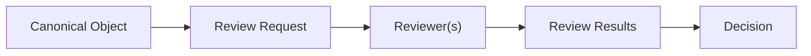
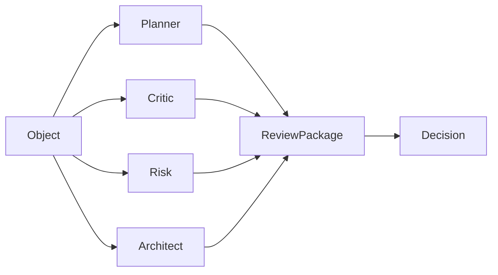
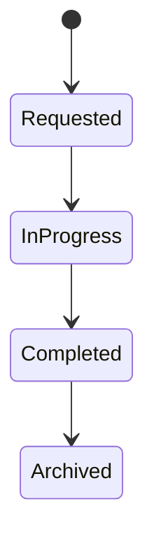

# RFC-020 Review System

**Status:** Draft  
**Authors:** Tiroq + ChatGPT  
**Last Updated:** 2026-06-28

---

## 1. Summary

The Review System is responsible for evaluating Canonical Objects and Artifacts prior to any Decision-making. Reviews are structured evaluations—performed by both humans and agents—that provide recommendations and supporting evidence. Importantly, reviews never execute actions or modify objects directly; they serve as advisory input for subsequent Decision processes.

---

## 2. Relationship to Previous RFCs

This RFC builds upon RFC-000 through RFC-015, which define Canonical Objects, Artifacts, Understanding, and foundational concepts. The Review System operates after Understanding and Artifact creation, but before Decisions (see RFC-021). Reviews are a prerequisite for Decisions, providing structured, explainable evaluations.

---

## 3. Goals

- **Multi-review architecture:** Support multiple, independent reviewers for each object or artifact.
- **Human and AI collaboration:** Enable both human and agent-based reviews.
- **Explainable evaluations:** Require clear explanations and traceable evidence for every review.
- **Immutable review history:** Ensure all reviews are append-only and never deleted or altered.
- **Provider-independent reviewers:** Allow reviewers to be implemented with different technologies or providers.

---

## 4. Non-Goals

- The Review System does **not** contain decision logic.
- It does **not** orchestrate workflows, scheduling, or execution of actions.
- It does **not** directly modify Canonical Objects or Artifacts.

---

## 5. Review Philosophy

Reviews are opinions, not facts. Each review expresses a judgment, supported by evidence, about a Canonical Object or Artifact. Multiple reviewers may disagree; disagreement is expected and valuable. Reviews do **not** replace Decisions—they inform them. The Decision process is responsible for weighing reviews and committing to actions.

---

## 5.1 Review Strategy

| Strategy    | Description                                       | Typical Usage                  |
|-------------|---------------------------------------------------|-------------------------------|
| Single      | One reviewer evaluates the object                 | Low-risk reminders            |
| Parallel    | Independent reviewers execute simultaneously      | Architecture review           |
| Sequential  | Reviewers execute in order                        | Proposal refinement           |
| Hierarchical| Junior reviewers before senior reviewers          | Production changes            |
| Consensus   | Agreement or majority required                    | High-impact decisions         |
| Weighted    | Review influence depends on reviewer weight       | Multi-model AI evaluation     |

Review Strategies determine how Reviews are collected, not how Decisions are made.
---

## 6. Review Pipeline

---

## 7. Review Participants

| Reviewer            | Responsibility                | Deterministic |
|---------------------|------------------------------|:------------:|
| Human Reviewer      | Manual expert review         | N            |
| Planner Agent       | Plan evaluation              | Y/N          |
| Critic Agent        | Critical/defect analysis     | N            |
| Architect Agent     | Architecture assessment      | N            |
| Risk Agent          | Risk identification          | Y            |
| Domain Expert Agent | Domain-specific assessment   | N            |
| Policy Engine       | Policy compliance            | Y            |
| Rule Engine         | Rule-based evaluation        | Y            |
| LLM Reviewer        | LLM-based holistic review    | N            |

---

## 8. Review Structure

Every Review contains structured metadata, an assessment, and a recommendation.

Metadata fields (always required):
- **Review ID:** Unique identifier for the review.
- **Object ID:** Reference to the reviewed Canonical Object or Artifact.
- **Reviewer:** Identity of the reviewer (agent, engine, or person).
- **Timestamp:** When the review was completed.
- **Review Type:** Category or purpose of the review.
- **Evidence:** Cited sources, calculations, or rules.
- **Explanation:** Human-readable rationale for the review.
- **Version:** Version of the object/artifact reviewed.

### Assessment
Assessment represents the factual evaluation produced by a reviewer.
Mandatory elements:
- **Score**
- **Findings**
- **Risks**
- **Opportunities**
- **Confidence**

### Recommendation
Recommendation expresses the proposed outcome.
Allowed values:
- **Approve**
- **Reject**
- **Needs Revision**
- **Escalate**
- **Informational**

---

## 9. Review Categories

- Technical
- Business
- Risk
- Quality
- Policy
- Security
- Cost
- Priority
- Completeness
- Consistency

---

## 10. Review Outcomes

- **Approve:** Recommend acceptance.
- **Reject:** Recommend rejection.
- **Needs Revision:** Recommend changes before acceptance.
- **Escalate:** Refer to higher authority or manual review.
- **Informational:** No recommendation; informational only.

These outcomes are **recommendations only**; they do not mandate actions.

---

## 11. Review Evidence

Every review must cite evidence supporting its recommendation. Evidence may include:
- Policies
- Rules
- Retrieved Knowledge
- Previous Decisions
- Previous Reviews
- Similar Canonical Objects
- Similar Artifacts
- Calculations
- External References
- Confidence Metrics

---

## 12. Review Immutability

Reviews are append-only and never modified or deleted. Corrections or updates are made by submitting new reviews referencing the prior review and object version.

---

## 13. Multi-Agent Review

Multiple reviewers operate independently and in parallel. Their results are aggregated for Decision-making.

---

## 13.1 Review Package

A Review Package is an immutable collection of Reviews targeting the same Canonical Object or Artifact. It aggregates multiple reviews along with:

- Review Strategy  
- Review Policy  
- Aggregated assessments  
- Completion status  
- Evidence summary  

Decisions consume Review Packages instead of individual Reviews.

---

## 14. Human-in-the-Loop

Approval policies are configurable to require human review, escalation, or override at any stage. Manual override is always available to authorized users.

---

## 14.1 Review Policy

Review Policies determine which Reviews are required before Decision evaluation.
Examples:
- Human mandatory.
- Architect review required.
- Risk review when risk exceeds threshold.
- Consensus for production changes.
- Skip review for low-risk reminders.

Policies do not produce Decisions; they only specify review requirements.
---

## 15. Review Invariants

- Reviews never modify Canonical Objects or Artifacts.
- Reviews never execute actions.
- Reviews are immutable.
- Reviews require traceable evidence.
- Every Review targets exactly one Canonical Object or Artifact.
- Reviews never own business state.
- Reviews never modify identity.
- Deterministic reviewers should produce reproducible Reviews.
- Every Review belongs to exactly one Review Package.

---

## 16. Review Lifecycle

Lifecycle states apply to the Review itself, not the reviewed object.

---

## 17. Dependencies

- Depends on RFC-000 through RFC-015.
- Required before RFC-021 Decision Model and RFC-030 System Architecture.

---

## 18.1 Architectural Summary

- Reviews evaluate.  
- Review Packages aggregate.  
- Decisions commit.  
- Actions execute.  
- Reviews are evidence.  
- Decisions consume Review Packages rather than individual Reviews.  
- Review Strategies define collection.  
- Review Policies define completion.  

---

## 18. Acceptance Criteria

- Reviews must be immutable and append-only.
- Every review must include all mandatory fields.
- Multiple reviewers must be supported.
- Human and agent reviewers must be supported.
- Review evidence must be traceable.
- Review outcomes must be recommendations only.
- Review lifecycle must be implemented.

---

## 19. Decision Log

| Date       | Decision           | Rationale        | Status |
|------------|--------------------|------------------|--------|
| 2026-06-28 | Initial Draft      | First draft RFC  | Draft  |

---

> "Reviews provide judgment. Decisions provide commitment."