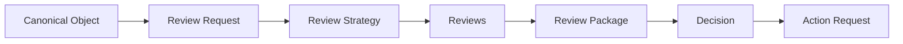
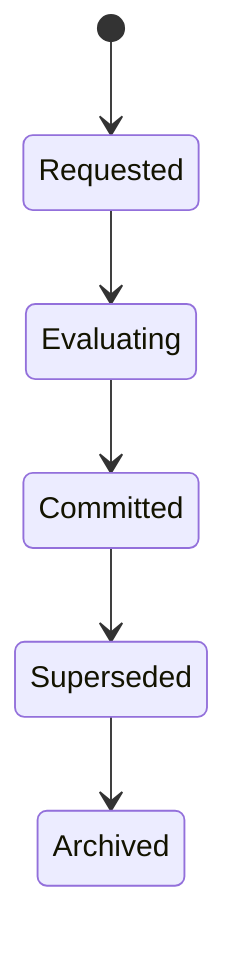

# RFC-021 Decision Model

**Status:** Draft  
**Authors:** Tiroq + ChatGPT  
**Last Updated:** 2026-06-28

---

## 1. Summary

Decisions are explicit, immutable commitments made by the system or a human actor based on evidence aggregated in Review Packages. Unlike Reviews, which evaluate and provide evidence, Decisions never evaluate; they commit. Each Decision is the authoritative answer to a Decision Request, referencing a Review Package and producing an Action Request for subsequent execution.

---

## 2. Relationship to Previous RFCs

This RFC builds upon RFC-000 through RFC-020. In particular, Decisions consume Review Packages as defined in RFC-020. Decisions are the bridge between evidence (Reviews/Review Packages) and execution (Actions), and are prerequisites for future runtime architecture RFCs. Decisions do not directly interact with individual Reviews, but only with Review Packages. Actions generated by Decisions will be further specified in subsequent RFCs.

---

## 3. Goals

- **Explicit commitment:** Decisions are unambiguous, authoritative commitments.
- **Explainable decisions:** Each Decision must be explainable and traceable to evidence and policy.
- **Policy-driven:** Decisions are produced according to explicit, versioned policies.
- **Human override:** Human actors can override automated Decisions, creating new Decisions.
- **Immutable history:** Decisions are append-only and never modified.
- **Provider independence:** Decision model is agnostic to underlying review or action providers.

---

## 4. Non-Goals

- No workflow execution or orchestration.
- No scheduling or queueing.
- No storage implementation details.
- No transport or networking specification.

---

## 5. Decision Philosophy

- **Reviews provide evidence:** Reviews are evaluations by engines, humans, or advisors.
- **Decision commits:** A Decision is a single, explicit commitment made based on a Review Package.
- **Action executes:** Actions are the execution of Decisions.
- **Learning improves future Decisions:** Outcomes and feedback are used to improve future policies and Decisions.

---

## 6. Decision Pipeline

> **Note:** Decisions consume Review Packages only.

---

## 7. Decision Request

A **Decision Request** is the trigger that asks the Decision Engine to evaluate a completed Review Package and produce a Decision.

**Mandatory fields:**
- **Decision Request ID**
- **Object ID**
- **Review Package ID**
- **Policy**
- **Requested By**
- **Timestamp**

---

## 8. Decision Participants

| Participant      | Responsibility                        | Deterministic |
|------------------|---------------------------------------|--------------|
| Decision Engine  | Commits the Decision                  | Yes          |
| Human           | May override or commit Decisions       | Yes/No       |
| Policy Engine   | Provides decision policies             | Yes          |
| Rule Engine     | Applies deterministic rules            | Yes          |
| LLM Advisor     | Provides non-binding advice            | No           |
| Domain Expert   | Provides contextual input/advice       | No           |

*Advisors (LLM Advisor, Domain Expert) never make Decisions directly; they inform the process.*

---

## 9. Decision Structure

Every Decision must include the following fields:

- **Decision ID**
- **Decision Request ID**
- **Object ID**
- **Review Package ID**
- **Timestamp**
- **Decision Outcome**
- **Confidence**
- **Reasoning**
- **Evidence Summary**
- **Decision Policy**
- **Decision Version**
- **Actor** (who/what made the Decision)

---

## 10. Decision Policies

Policies determine how a Decision is produced from a Review Package. Strategies include:

- **Single Approver:** One authorized participant decides.
- **Consensus:** Majority or unanimity required.
- **Weighted:** Inputs are weighted by role or expertise.
- **Human Required:** Human must explicitly make the Decision.
- **Policy First:** Policy engine makes the first attempt.
- **Risk First:** High-risk cases escalate to humans.
- **Custom:** Any composable or domain-specific policy.

---

## 11. Decision Outcomes

- **Approve**
- **Reject**
- **Needs Revision**
- **Escalate**
- **Defer**
- **Split**
- **Merge**
- **Archive**
- **No Action**

*Outcomes are explicit commitments, not evaluations or suggestions.*

---

## 12. Decision Reasoning

Every Decision must be explainable and traceable to:
- The Review Package consumed.
- The evidence and Reviews summarized.
- The policy and rules applied.

---

## 13. Decision Immutability

Decisions are append-only. Once committed, a Decision is never modified or deleted. Superseding a Decision creates a new Decision referencing the original.

---

## 14. Decision Lifecycle

*The lifecycle belongs to the Decision, not the underlying Review or Action.*

---

## 15. Decision Invariants

- Decisions consume Review Packages only.
- Decisions never consume individual Reviews.
- Decisions never modify Reviews.
- Decisions are immutable.
- Decisions are traceable.
- Every Decision references exactly one Decision Request.
- Every Decision targets exactly one Canonical Object or Artifact.

---

## 16. Decision vs Action

| Aspect      | Decision                        | Action                      |
|-------------|---------------------------------|-----------------------------|
| Nature      | Commitment                      | Execution                   |
| Example     | "Approve deployment"            | "Deploy to production"      |
| Mutability  | Immutable (append-only)         | May be retried/cancelled    |
| References  | Review Package, Policy, Object  | Decision, Object            |

---

## 17. Human Override

When a human overrides an automated Decision, a new Decision is created. The original Decision remains immutable. The new Decision references the superseded Decision and includes override reasoning.

---

## 18. Decision Replay

Replay means re-executing downstream Actions from an existing Decision. Replay never changes historical Decisions; it may rebuild Actions for audit or recovery.

---

## 19. Decision Package Relationships

---

## 20. Architectural Summary

- **Review evaluates.**
- **Review Package aggregates.**
- **Decision commits.**
- **Action executes.**
- **Learning improves future policies.**

---

## 21. Dependencies

- Depends on: RFC-000 through RFC-020
- Required before: RFC-022 State Machine, RFC-030 System Architecture, RFC-040 Agent Architecture

---

## 22. Acceptance Criteria

- Unambiguous separation between Review, Decision, and Action.
- Decisions are immutable, append-only, and reference Review Packages.
- Each Decision produces an Action Request, not an Action.
- Decision structure and lifecycle are explicit and versioned.

---

## 23. Decision Log (Initial Draft)

| Decision ID | Decision Request ID | Object ID | Review Package ID | Outcome   | Policy      | Actor   | Timestamp           | Supersedes |
|-------------|--------------------|-----------|-------------------|-----------|-------------|---------|---------------------|------------|
| D-001       | DR-001             | O-001     | RP-001            | Approve   | Consensus   | Engine  | 2026-06-28T10:00Z   |            |
| D-002       | DR-002             | O-002     | RP-002            | Reject    | Human Req.  | HumanA  | 2026-06-28T10:10Z   |            |
| D-003       | DR-001             | O-001     | RP-001            | Reject    | Override    | HumanB  | 2026-06-28T10:20Z   | D-001      |

---

> "Evidence informs. Decisions commit. Actions change the world."