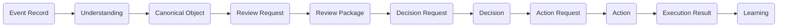
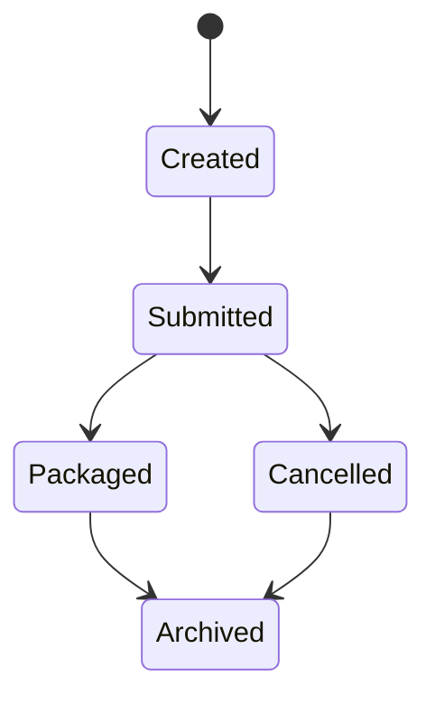
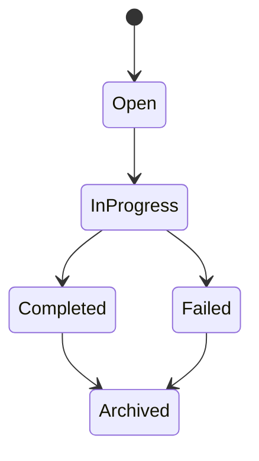
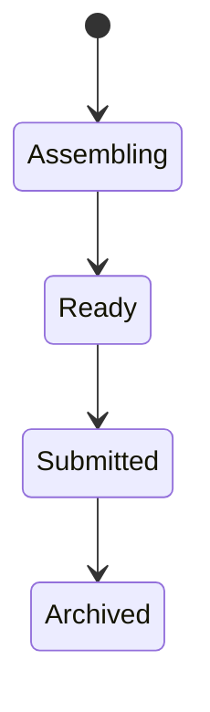
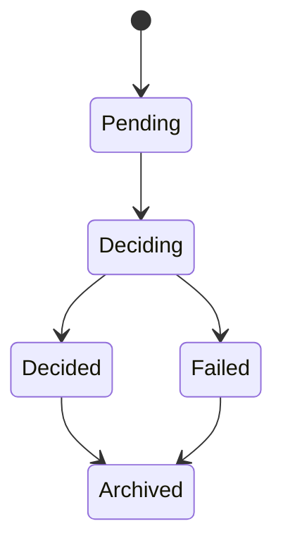
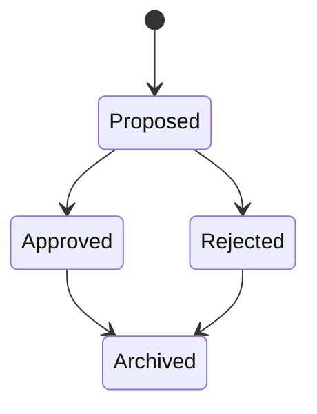
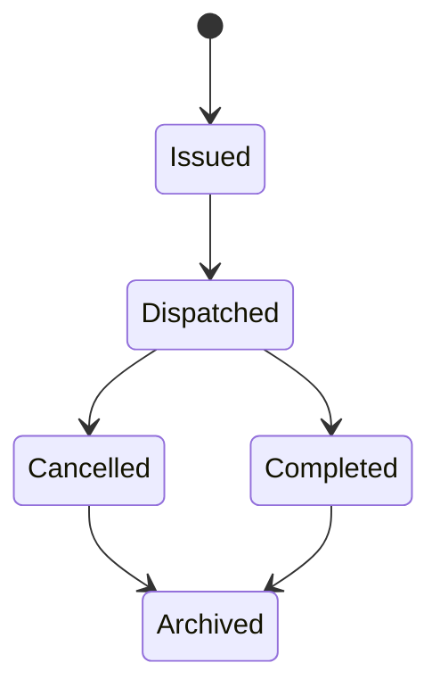
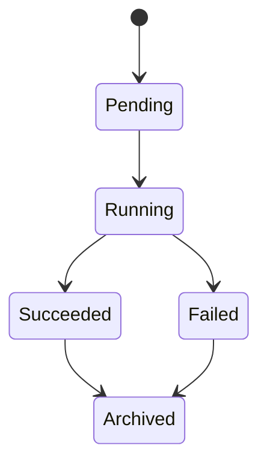
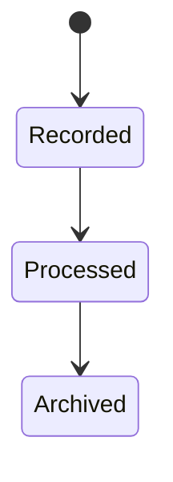

# RFC-022 State Machine

**Status:** Draft  
**Authors:** Tiroq + ChatGPT  
**Last Updated:** 2026-06-28

---

## 1. Summary

This RFC defines all runtime state machines used by Praxis. It establishes the distinction between **lifecycle state**, **processing state**, and **business state** for every runtime object. The RFC sets out the principles for state machine ownership, transition, and observation, ensuring deterministic and auditable behaviour across the Praxis runtime.

## 2. Relationship to Previous RFCs

This RFC builds upon foundational concepts and requirements defined in RFC-000 through RFC-021. It is a direct continuation of the architectural groundwork established in those documents and is a prerequisite for subsequent RFCs.

## 3. Goals

- **Consistent state transitions:** All runtime objects transition state according to explicit, well-defined rules.
- **Deterministic processing:** State machines ensure predictable, repeatable behaviour.
- **Replay compatibility:** State transitions can be replayed to reconstruct current and derived states from event history.
- **Provider independence:** State logic is portable and not tied to any particular storage or transport provider.
- **Explicit ownership:** Each object is solely responsible for its own state machine.

## 4. Non-Goals

- This RFC does **not** define workflow implementation, storage mechanisms, or transport protocols.
- It does **not** mandate specific persistence or messaging strategies.

## 5. State Machine Philosophy

- **State Machines model runtime behaviour:** Every significant runtime object has an associated state machine that governs its lifecycle and behaviour.
- **Objects own their own state:** No object may directly mutate the state of another; ownership is explicit and singular.
- **Observation, not control:** Other objects may observe or react to state changes, but never own or directly change another object's state.
- **Explicit transitions:** All transitions are the result of explicit, auditable events or commands.
- **Auditability:** Every transition is recorded and can be inspected or replayed.

## 6. Runtime Objects

| Object           | Owns State | Produces         | Consumed By        |
|------------------|:----------:|------------------|--------------------|
| Event Record     |    Yes     | Understanding    | Canonical Object   |
| Review Request   |    Yes     | Review Package   | Review             |
| Review           |    Yes     | Decision Request | Review Package     |
| Review Package   |    Yes     | Decision Request | Decision           |
| Decision Request |    Yes     | Decision         | Decision           |
| Decision         |    Yes     | Action Request   | Action Request     |
| Action Request   |    Yes     | Action           | Action             |
| Action           |    Yes     | Execution Result | Execution Result   |
| Execution Result |    Yes     | Learning         | Learning           |
| Canonical Object |    Yes     | Review Request   | Review Request     |

## 7. State Categories

- **Processing State:** Reflects in-flight or intermediate states during computation (e.g. "Pending", "Processing").
- **Lifecycle State:** Represents the creation, active, and terminal stages of an object's existence (e.g. "Created", "Completed", "Archived").
- **Business State:** Encodes domain-specific meaning (e.g. "Approved", "Rejected").
- **Execution State:** Represents the outcome of an action execution (e.g. "Succeeded", "Failed").

**State categories must never be mixed** within a single state machine. Each state machine is responsible for only one category of state.

## 8. Global Runtime Flow

## 9. Individual State Machines

### 9.1 Review Request

**Transitions:**
- Created: Initial state on creation.
- Submitted: After submission for review.
- Packaged: After inclusion in a Review Package.
- Cancelled: If withdrawn before packaging.
- Archived: Terminal state.

### 9.2 Review

**Transitions:**
- Open: Review has started.
- InProgress: Under review.
- Completed: Review finished.
- Failed: Review could not be completed.
- Archived: Terminal state.

### 9.3 Review Package

**Transitions:**
- Assembling: Collecting Review Requests.
- Ready: Ready for submission.
- Submitted: Sent for decision.
- Archived: Terminal state.

### 9.4 Decision Request

**Transitions:**
- Pending: Awaiting decision.
- Deciding: In process.
- Decided: Completed.
- Failed: Could not be decided.
- Archived: Terminal state.

### 9.5 Decision

**Transitions:**
- Proposed: Initial.
- Approved/Rejected: Outcome.
- Archived: Terminal.

### 9.6 Action Request

**Transitions:**
- Issued: Created.
- Dispatched: Sent for action.
- Completed: Action finished.
- Cancelled: Withdrawn.
- Archived: Terminal.

### 9.7 Action

**Transitions:**
- Pending: Awaiting execution.
- Running: In progress.
- Succeeded/Failed: Outcome.
- Archived: Terminal.

### 9.8 Execution Result

**Transitions:**
- Recorded: Result captured.
- Processed: Result integrated.
- Archived: Terminal.

## 10. Transition Rules

- All state transitions are **deterministic**: given the same input and state, the outcome is always the same.
- Transitions are **validated**: only valid transitions are allowed.
- Transitions are **append-only**: history is never mutated or deleted.
- Transitions are **observable**: every change is recorded and can be audited.

## 11. Ownership Rules

- Each runtime object **owns its own state machine**.
- No external object may directly mutate another object's state.
- State changes must be initiated via explicit events or commands.

## 12. Replay Rules

- Replay reconstructs derived state by replaying the full, immutable event history.
- No state is mutated during replay; only derived from the append-only log.
- Replay enables recovery, migration, and auditing.

## 13. Failure States

- **Failed:** The object could not complete its intended process.
- **Cancelled:** The process was intentionally stopped before completion.
- **Timed Out:** The process did not complete within the expected window.
- **Superseded:** The object was replaced by a newer version.
- **Archived:** The object is no longer active but retained for history.

**Recovery Rules:**
- Failed, Cancelled, Timed Out, and Superseded objects may trigger compensating actions or notifications.
- Archived objects are immutable and not reactivated.

## 14. Invariants

- Every runtime object owns **exactly one** state machine.
- State transitions are **append-only** and never removed.
- Object **identity survives** all transitions.
- **Decisions never change Review state**.
- **Actions never change Decision state**.
- **Execution Results never change Action history**.

## 15. Architectural Consequences

- **CQRS:** Command-query separation is enforced by explicit state machines.
- **Auditability:** Every transition is recorded for inspection and compliance.
- **Replay:** Supports deterministic replay for recovery and migration.
- **Distributed Execution:** State machines support coordination across multiple agents and systems.
- **Multi-agent Coordination:** Explicit state and transitions enable robust multi-party interactions.

## 16. Dependencies

- Depends on RFC-000 through RFC-021 for foundational concepts and requirements.
- Required before RFC-023 (Action Model) and RFC-030 (System Architecture).

## 17. Acceptance Criteria

- All runtime objects define their state machines according to this RFC.
- State transitions are deterministic, auditable, and append-only.
- No object directly mutates another's state.
- Replay and audit are supported for all state machines.
- Failure states and invariants are enforced.

## 18. Decision Log

| Date       | Decision         | Author      | Notes                |
|------------|------------------|-------------|----------------------|
| 2026-06-28 | Initial Draft    | Tiroq + GPT | Draft for review     |

---

> "Behavior emerges from explicit state transitions, not implicit side effects."