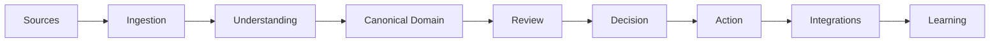
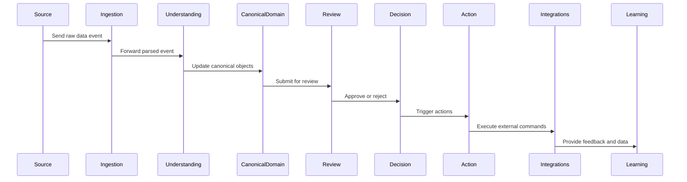

# RFC-030 System Architecture

**Status:** Draft  
**Authors:** Tiroq + ChatGPT  
**Last Updated:** 2026-06-28

---

## 1. Summary

This RFC defines the runtime architecture of Praxis, including service boundaries, communication model, and deployment principles. It establishes how the system's conceptual components map to runtime services and outlines the principles guiding their interactions and scalability.

## 2. Relationship to Previous RFCs

RFC-000 through RFC-023 define the conceptual architecture of Praxis. This RFC builds on those foundations by mapping the conceptual components to runtime services, specifying how they interact and operate in production.

## 3. Goals

- Clear service ownership.  
- Loose coupling between components.  
- Event-driven runtime architecture.  
- Horizontal scalability.  
- Provider independence.  
- Local-first deployment.

## 4. Non-Goals

- Detailing implementation specifics.  
- Defining database schemas.  
- Specifying deployment manifests.

## 5. Architectural Principles

- **Single Responsibility:** Each service has a focused responsibility.  
- **Event First:** Events drive state changes and communication.  
- **API Last:** APIs expose functionality but are secondary to events.  
- **Local First:** Services and deployments prioritize local operation.  
- **Replaceable Components:** Components can be swapped without disrupting the system.  
- **Stateless Services where possible:** Minimize service state to improve scalability.  
- **Immutable Events:** Events are immutable facts of the system.  
- **Observable Everything:** Full observability is built-in for monitoring and debugging.

## 6. High-Level Architecture

Every stage communicates exclusively through immutable events, ensuring clear boundaries and traceability.

## 7. Core Runtime Services

| Service               | Responsibility                                   | Owns                      |
|-----------------------|-------------------------------------------------|---------------------------|
| Gateway               | Edge API access and authentication               | API endpoints              |
| Ingestion Service     | Intake of external and internal data sources     | Raw input events           |
| Understanding Service | Processing and interpreting ingested data        | Parsed knowledge           |
| Canonical Domain Service | Maintaining core business objects and logic     | Canonical Objects          |
| Review Service        | Validation and human-in-the-loop review           | Review workflows           |
| Decision Service      | Automated decision-making                          | Decision rules             |
| Action Service        | Executing commands and side effects               | Action workflows           |
| Learning Service      | Continuous learning and model updates             | Learning data              |
| Projection Service    | Building read models and materialized views       | Projections                |
| Search Service        | Indexing and query capabilities                    | Search indexes             |
| Notification Service  | Sending notifications and alerts                   | Notification templates     |
| Scheduler             | Scheduling tasks and delayed actions               | Scheduled tasks            |
| Integration Service   | Adapters to external systems                        | Integration adapters       |
| Observability Service | Metrics, logs, tracing, and monitoring              | Observability data         |
| Policy Service        | Authorization and policy enforcement                | Policy definitions         |
| LLM Routing Service   | Routing requests to appropriate language models    | Model routing logic        |

## 8. Communication Model

Praxis uses synchronous APIs only at system edges for user and external system interactions. Internally, services communicate asynchronously over an event bus. Communication patterns include:

- **Commands:** Directed requests to perform actions.  
- **Events:** Immutable notifications of state changes.  
- **Queries:** Requests for data or projections.

## 9. Data Ownership

Each service owns its persistence layer. Canonical Objects represent logical ownership but are not stored in shared databases. This separation ensures data consistency and autonomy.

## 10. Runtime Flow

## 11. Deployment Model

Praxis supports multiple deployment models:

- **Local Docker Compose:** For development and local-first use.  
- **Single-node:** Standalone production deployment.  
- **Distributed Kubernetes:** Scalable multi-node clusters.  
- **Hybrid Deployment:** Combining local and cloud resources.

## 12. External Integrations

Supported external systems include:

- Telegram  
- Gmail  
- Google Calendar  
- Google Tasks  
- GitHub  
- Upwork  
- OpenRouter  
- Ollama  
- Local models  
- Future provider integrations

Adapters normalize external system protocols and data formats into Praxis events and commands.

## 13. Cross-Cutting Concerns

- Authentication  
- Authorization  
- Configuration  
- Observability  
- Audit  
- Replay  
- Metrics  
- Secrets management  
- Prompt Registry

## 14. Architectural Invariants

- Services own their behavior exclusively.  
- Events are immutable facts.  
- Services communicate only through defined contracts.  
- No shared mutable state between services.  
- Canonical Objects remain provider-independent abstractions.  
- The runtime can be rebuilt from event streams.

## 15. Dependencies

This RFC depends on RFC-000 through RFC-023 and is required before specifications for:

- Service Catalog  
- Data Flow  
- Storage Model  
- Agent Architecture

## 16. Acceptance Criteria

- Clear mapping from conceptual components to runtime services.  
- Defined communication patterns and event-driven model.  
- Documented deployment options.  
- Cross-cutting concerns addressed.  
- Architectural invariants enforced.

## 17. Decision Log

| Date       | Decision                         | Notes                          |
|------------|---------------------------------|--------------------------------|
| 2026-06-28 | Initial draft created            | Defined core architecture      |

---

"The architecture is defined by ownership and contracts, not by technologies."
