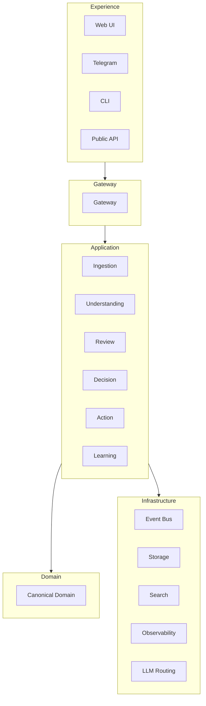
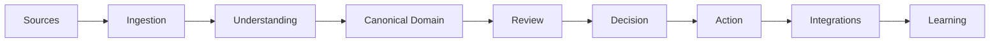
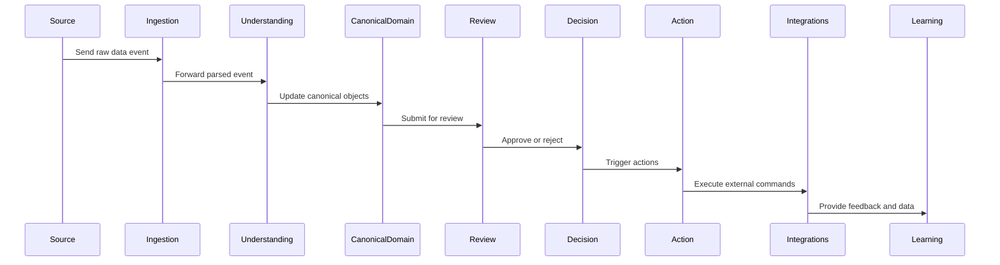
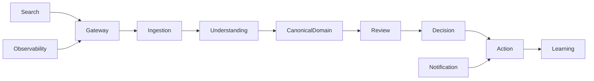

# RFC-030 System Architecture

**Status:** Draft  
**Authors:** Tiroq + ChatGPT  
**Last Updated:** 2026-06-28

---

## 1. Summary

This RFC defines the runtime architecture of Praxis, including service boundaries, communication model, and deployment principles. It establishes how the system's conceptual components map to runtime services and outlines the principles guiding their interactions and scalability.

## 2. Relationship to Previous RFCs

RFC-000 through RFC-023 define the conceptual architecture of Praxis. This RFC builds on those foundations by mapping the conceptual components to runtime services, specifying how they interact and operate in production.

## 3. Goals

- Clear service ownership.  
- Loose coupling between components.  
- Event-driven runtime architecture.  
- Horizontal scalability.  
- Provider independence.  
- Local-first deployment.

## 4. Non-Goals

- Detailing implementation specifics.  
- Defining database schemas.  
- Specifying deployment manifests.

## 5. Architectural Principles

- **Single Responsibility:** Each service has a focused responsibility.  
- **Event First:** Events drive state changes and communication.  
- **API Last:** APIs expose functionality but are secondary to events.  
- **Local First:** Services and deployments prioritize local operation.  
- **Replaceable Components:** Components can be swapped without disrupting the system.  
- **Stateless Services where possible:** Minimize service state to improve scalability.  
- **Immutable Events:** Events are immutable facts of the system.  
- **Observable Everything:** Full observability is built-in for monitoring and debugging.

## 5.1 Runtime Layers

The runtime architecture is organized into five distinct layers, each with clear responsibilities and dependencies that always point downward:

- **Experience:** The user interaction layer, including web UI, CLI, Telegram, and public APIs. It handles user-facing interfaces and input/output.

- **Gateway:** Acts as the protocol translation layer, managing authentication, authorization, and routing between external clients and internal services.

- **Application:** Contains use cases and orchestration logic, coordinating workflows such as ingestion, understanding, review, decision, action, and learning.

- **Domain:** Encapsulates business rules and maintains Canonical Objects as the single source of truth for core business logic.

- **Infrastructure:** Provides technical capabilities such as event bus, storage, search, observability, and LLM routing. It supports the runtime but does not contain business logic.

Dependencies flow strictly from higher layers to lower layers, ensuring clear separation of concerns and preventing circular dependencies.

## 5.2 Layer Ownership

| Layer          | Owns                           |
|----------------|-------------------------------|
| Experience     | User interaction              |
| Gateway        | Protocol translation          |
| Application    | Use cases and orchestration   |
| Domain         | Business rules and Canonical Objects |
| Infrastructure | Technical capabilities        |

Business rules must never migrate into the Infrastructure layer. This separation preserves the integrity of domain logic and avoids coupling business concerns with technical implementation details.

## 6. High-Level Architecture

Every stage communicates exclusively through immutable events, ensuring clear boundaries and traceability.

## 7. Core Runtime Services

| Service               | Consumes                                         | Produces                                | Owns                      |
|-----------------------|-------------------------------------------------|----------------------------------------|---------------------------|
| Gateway               | External user requests (HTTP, Telegram, CLI)    | Commands and queries to Application    | API endpoints, authentication |
| Ingestion Service     | External and internal raw data events            | Parsed knowledge events                 | Raw input events           |
| Understanding Service | Raw input events from Ingestion                   | Interpreted domain events               | Parsed knowledge           |
| Canonical Domain Service | Domain events from Understanding and Application | Updated Canonical Objects events        | Canonical Objects          |
| Review Service        | Canonical domain events requiring validation      | Review outcome events                   | Review workflows           |
| Decision Service      | Approved review events                             | Decision commands and events            | Decision rules             |
| Action Service        | Decision commands                                 | External commands and side-effect events| Action workflows           |
| Learning Service      | Feedback and data from Integrations and Actions  | Learning data events                    | Learning data              |
| Projection Service    | Domain and application events                      | Read model projections                  | Projections                |
| Search Service        | Domain and application events                      | Search indexes updates                  | Search indexes             |
| Notification Service  | Action events and triggers                         | Notifications and alerts                | Notification templates     |
| Scheduler             | Scheduled commands and delayed actions             | Scheduled task events                   | Scheduled tasks            |
| Integration Service   | External system events and commands                | External system commands and responses | Integration adapters       |
| Observability Service | Metrics, logs, traces from all layers              | Observability data                      | Observability data         |
| Policy Service        | Authorization requests                              | Authorization decisions                 | Policy definitions         |
| LLM Routing Service   | Language model requests                             | Routed responses                        | Model routing logic        |

## 7.1 Service Contracts

Every service exposes exactly three types of contracts to other services and clients:

- **Commands:** Directed requests to perform specific actions, always targeting a single service owner.

- **Events:** Immutable notifications signaling state changes or occurrences, broadcast to all interested parties without expecting responses.

- **Queries:** Requests for data or projections that do not change system state.

Services never communicate through shared persistence. Instead, all interactions occur via these well-defined contracts, ensuring loose coupling and clear ownership.

## 8. Communication Model

Praxis uses synchronous APIs only at system edges for user and external system interactions. Internally, services communicate asynchronously over an event bus. Communication patterns include:

- **Commands:** Directed requests to perform actions.  
- **Events:** Immutable notifications of state changes.  
- **Queries:** Requests for data or projections.

## 8.1 Communication Rules

- Commands are point-to-point, targeting a single service owner.  
- Events are broadcast to all interested subscribers.  
- Queries never change state and are used solely to retrieve data.  
- Events never expect responses or acknowledgments.  
- Commands always target one owner and are not broadcast.

## 9. Data Ownership

Each service owns its persistence layer. Canonical Objects represent logical ownership but are not stored in shared databases. This separation ensures data consistency and autonomy.

## 10. Runtime Flow

## 10.1 Runtime Dependencies

Search, Observability, and Notification are supporting services that never participate in business decisions. They provide auxiliary capabilities such as indexing, monitoring, and alerting, supporting the runtime without influencing core business logic.

## 11. Deployment Model

Praxis supports multiple deployment models:

- **Local Docker Compose:** For development and local-first use.  
- **Single-node:** Standalone production deployment.  
- **Distributed Kubernetes:** Scalable multi-node clusters.  
- **Hybrid Deployment:** Combining local and cloud resources.

## 12. External Integrations

Supported external systems include:

- Telegram  
- Gmail  
- Google Calendar  
- Google Tasks  
- GitHub  
- Upwork  
- OpenRouter  
- Ollama  
- Local models  
- Future provider integrations

Adapters normalize external system protocols and data formats into Praxis events and commands.

## 13. Cross-Cutting Concerns

- Authentication  
- Authorization  
- Configuration  
- Observability  
- Audit  
- Replay  
- Metrics  
- Secrets management  
- Prompt Registry

## 13.1 Runtime Boundaries

- Domain never depends on Infrastructure.  
- Infrastructure never owns business rules.  
- Application coordinates but does not own domain invariants.  
- Experience never bypasses Gateway.

## 14. Architectural Invariants

- Services own their behavior exclusively.  
- Events are immutable facts.  
- Services communicate only through defined contracts.  
- No shared mutable state between services.  
- Canonical Objects remain provider-independent abstractions.  
- The runtime can be rebuilt from event streams.  
- Runtime layers have one-way dependencies.  
- Every service owns its persistence.  
- Services expose contracts instead of implementation.  
- Canonical Domain is the single business source of truth.  
- Runtime remains reconstructable from immutable Events.

## 15. Dependencies

This RFC depends on RFC-000 through RFC-023 and is required before specifications for:

- RFC-031 Service Contracts  
- RFC-032 Data Flow  
- RFC-033 Storage Model  
- RFC-040 Agent Architecture

## 16. Acceptance Criteria

- Clear mapping from conceptual components to runtime services.  
- Defined communication patterns and event-driven model.  
- Documented deployment options.  
- Cross-cutting concerns addressed.  
- Architectural invariants enforced.  
- Runtime layers are explicitly defined.  
- Layer ownership is unambiguous.  
- Service contracts are specified.  
- Runtime dependencies are acyclic.  
- Business rules remain isolated from infrastructure.

## 17. Decision Log

| Date       | Decision                         | Notes                          |
|------------|---------------------------------|--------------------------------|
| 2026-06-28 | Initial draft created            | Defined core architecture      |

---

"The architecture is defined by ownership and contracts, not by technologies."
