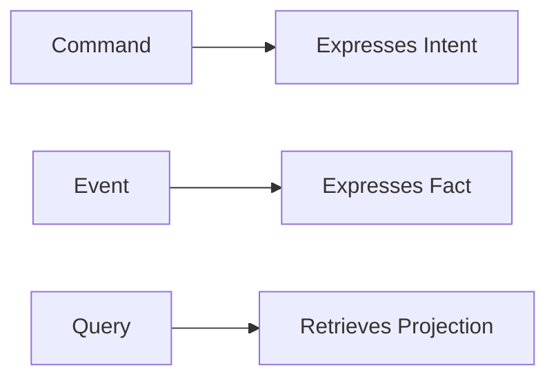
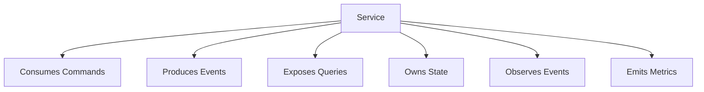

# RFC-031 Service Contracts

**Status:** Draft  
**Authors:** Tiroq + ChatGPT  
**Last Updated:** 2026-06-28

---

## 1. Summary

This RFC defines the canonical service contract model for Praxis runtime services.

RFC-030 defines the runtime architecture and service boundaries. This RFC defines how services communicate, what contracts they expose, how those contracts evolve, and which invariants must hold so that Praxis remains event-driven, observable, replayable, provider-independent, and locally deployable.

A service contract is not an implementation detail. It is the public architectural boundary of a runtime service.

Every Praxis service must expose its behavior through three contract types only:

- **Commands** — express intent.
- **Events** — express facts.
- **Queries** — retrieve projections.

Services must never coordinate through shared mutable state, shared databases, hidden side effects, or implicit coupling.

---

## 2. Relationship to Previous RFCs

This RFC depends on:

- RFC-000 Vision
- RFC-001 Principles
- RFC-002 Terminology
- RFC-003 Concept Model
- RFC-010 Capability Map
- RFC-011 Domain Model
- RFC-012 Artifact Model
- RFC-013 Event Model
- RFC-014 Identity & Representation Model
- RFC-015 Object Lifecycle Model
- RFC-020 Review System
- RFC-021 Decision Model
- RFC-022 State Machine
- RFC-030 System Architecture

RFC-030 defines the system architecture. This RFC refines that architecture by specifying the contract rules every service must follow.

RFC-032 Data Flow will use these service contracts to describe end-to-end runtime flows.

RFC-033 Storage Model will define how each service persists its own state without violating service contract boundaries.

---

## 3. Goals

The goals of this RFC are to:

- Define the standard contract model for every Praxis service.
- Ensure services interact through Commands, Events, and Queries only.
- Prevent hidden coupling between services.
- Define ownership boundaries for service behavior.
- Establish versioning and compatibility rules.
- Support replay, auditability, and observability.
- Enable independent service implementation and replacement.
- Support both local-first and distributed deployments.
- Provide a foundation for contract testing.

---

## 4. Non-Goals

This RFC does not:

- Define concrete API endpoints.
- Define database schemas.
- Define message broker implementation.
- Define serialization formats.
- Define authentication protocols.
- Define deployment manifests.
- Define UI behavior.

Concrete transport, storage, and deployment details are intentionally deferred to later RFCs.

---

## 5. Service Contract Philosophy

A service contract is the boundary between what a service owns and what other services may depend on.

Praxis follows these rules:

- Services expose contracts, not internals.
- Services own behavior, not global state.
- Services communicate through explicit messages.
- Services may observe events but must not mutate another service's state.
- Services may query projections but must not read another service's database.
- Contracts are versioned and evolvable.
- Breaking changes require explicit migration.

Service contracts are the mechanism that keeps Praxis modular.

Without contracts, service boundaries become documentation-only boundaries. With contracts, boundaries become enforceable architecture.

---

## 6. Canonical Service Contract

Every service in Praxis must be described using the same contract template.

| Field | Meaning |
|------|---------|
| Service Name | Canonical service name. |
| Responsibility | What the service is responsible for. |
| Owns | State, behavior, policies, or projections owned by the service. |
| Does Not Own | Explicitly excluded responsibilities. |
| Commands Consumed | Commands accepted by the service. |
| Events Produced | Events emitted by the service. |
| Events Observed | Events the service listens to. |
| Queries Exposed | Read-only queries served by the service. |
| Persistence Ownership | What the service may persist. |
| Failure Modes | Expected failure classes. |
| Idempotency Rules | How duplicate requests are handled. |
| Compatibility Rules | Contract evolution constraints. |
| Observability | Metrics, logs, traces, and audit records. |

This template will be used by RFC-031-derived service specifications and later implementation documentation.

---

## 7. Contract Types

Praxis services expose exactly three contract types.

No other service-to-service interaction model is allowed without a future RFC.

---

## 8. Commands

A **Command** is a directed request for a specific service to do something.

Commands express intent, not facts.

Examples:

- `ingestion.capture_input`
- `understanding.analyze_event`
- `review.request_review`
- `decision.evaluate_package`
- `action.execute_request`
- `projection.rebuild_view`
- `notification.send_message`

### Command Rules

- A Command targets exactly one service owner.
- A Command may be accepted, rejected, deferred, or failed.
- A Command may produce Events.
- A Command must be idempotent where practical.
- A Command must have a correlation ID.
- A Command must not be broadcast.
- A Command must not directly mutate another service's state.

### Command Structure

Every Command must include:

- Command ID
- Command Type
- Target Service
- Actor
- Payload
- Metadata
- Correlation ID
- Causation ID
- Idempotency Key
- Schema Version
- Requested At

---

## 9. Events

An **Event** is an immutable fact emitted by a service after something happened.

Events express facts, not requests.

Examples:

- `event_record.accepted`
- `artifact.created`
- `review.completed`
- `review_package.completed`
- `decision.committed`
- `action.started`
- `action.succeeded`
- `projection.rebuilt`
- `notification.sent`

### Event Rules

- Events are immutable.
- Events are append-only.
- Events may be observed by many services.
- Events never expect direct responses.
- Events must preserve causation and correlation metadata.
- Events must be safe to replay.
- Events must not contain hidden commands.

### Event Structure

Events must follow the Event Envelope defined by RFC-013.

At minimum, every Event must include:

- Event ID
- Event Type
- Source Service
- Payload
- Metadata
- Correlation ID
- Causation ID
- Trace ID
- Schema Version
- Occurred At
- Observed At

---

## 10. Queries

A **Query** is a read-only request for data.

Queries retrieve projections, read models, or service-owned state views.

Examples:

- `projection.get_space_view`
- `search.find_artifacts`
- `review.get_review_package`
- `decision.get_decision_history`
- `action.get_execution_status`

### Query Rules

- Queries never mutate state.
- Queries never emit business Events.
- Queries may read service-owned projections.
- Queries must not access another service's database directly.
- Queries should be optimized for read models, not canonical writes.

### Query Structure

Every Query should include:

- Query ID
- Query Type
- Target Service
- Parameters
- Actor
- Authorization Context
- Correlation ID
- Requested At

---

## 11. Service Ownership

Every service owns a specific part of runtime behavior.

| Service | Owns | Does Not Own |
|--------|------|--------------|
| Gateway | Edge protocols, authentication handoff, routing | Business logic |
| Ingestion Service | Input capture and event normalization | Understanding or decisions |
| Understanding Service | Interpretation of Event Records | Canonical object lifecycle |
| Canonical Domain Service | Canonical Objects and business invariants | UI projections |
| Review Service | Review Requests, Reviews, Review Packages | Decisions |
| Decision Service | Decision Requests and Decisions | Action execution |
| Action Service | Action Requests, Actions, Execution Results | Decision reasoning |
| Learning Service | Feedback and improvement signals | Historical mutation |
| Projection Service | Projections and read models | Canonical truth |
| Search Service | Search indexes | Canonical identity |
| Notification Service | Notifications | Business decisions |
| Scheduler | Time-based commands | Business ownership |
| Integration Service | External adapters | Canonical identity |
| Policy Service | Policies and policy evaluation | Final decisions unless explicitly delegated |
| LLM Routing Service | Model routing and provider abstraction | Business truth |

Ownership is exclusive. A service may observe another service's Events, but it must not own another service's responsibilities.

---

## 12. Service Contract Diagram

This model applies to every runtime service.

---

## 13. Contract Versioning

All service contracts are versioned.

Versioning applies to:

- Command schemas
- Event schemas
- Query schemas
- Error formats
- Policy references
- Payload structures

### Versioning Rules

- Additive changes are allowed within the same major version.
- Removing fields requires a new major version.
- Changing field semantics requires a new major version.
- Renaming fields requires a new major version.
- Consumers must tolerate unknown fields where practical.
- Producers must not silently change meaning.

Contract versions must be explicit and observable.

---

## 14. Compatibility Rules

Praxis services must support backward-compatible evolution.

Compatible changes:

- Adding optional fields.
- Adding new event types.
- Adding new query filters.
- Adding new command metadata.

Breaking changes:

- Removing required fields.
- Changing field meaning.
- Changing identity semantics.
- Changing idempotency behavior.
- Changing lifecycle semantics.

Breaking changes require a migration RFC or explicit compatibility plan.

---

## 15. Error Contracts

Errors are part of service contracts.

Every service must expose structured errors.

### Error Structure

Errors should include:

- Error ID
- Error Code
- Error Type
- Message
- Retryable Flag
- Actor-visible Message
- Internal Details
- Correlation ID
- Causation ID
- Timestamp

### Error Categories

| Category | Meaning |
|---------|---------|
| Validation Error | Input does not satisfy contract. |
| Authorization Error | Actor lacks permission. |
| Conflict Error | State transition or version conflict. |
| Dependency Error | Required dependency unavailable. |
| Timeout Error | Operation exceeded time limit. |
| Policy Error | Policy rejected operation. |
| Internal Error | Unexpected service failure. |

Errors must be observable and traceable.

---

## 16. Idempotency

Commands that may be retried must support idempotency.

Idempotency prevents duplicate side effects when commands are retried due to network failures, worker restarts, or distributed execution.

### Idempotency Rules

- Commands should include an idempotency key.
- Repeated commands with the same key must not duplicate effects.
- Idempotency scope must be explicit.
- Idempotency results must be observable.
- Non-idempotent commands require explicit justification.

Examples of commands requiring idempotency:

- Send notification.
- Create external task.
- Submit proposal.
- Execute action.
- Schedule reminder.

---

## 17. Timeouts and Retries

Timeout and retry behavior must be contractually defined.

Services must specify:

- Default timeout.
- Maximum retry count.
- Retry strategy.
- Backoff policy.
- Whether retry is safe.
- Compensation behavior if applicable.

Retries must not violate idempotency.

---

## 18. Contract Discovery

Praxis services should expose machine-readable contract metadata.

Contract discovery may include:

- Service name.
- Contract version.
- Supported commands.
- Produced events.
- Exposed queries.
- Health status.
- Schema references.

This enables tooling, validation, testing, and future UI generation.

---

## 19. Contract Testing

Every service contract must be testable.

Contract tests should verify:

- Command validation.
- Event schema compatibility.
- Query behavior.
- Error formats.
- Idempotency.
- Version compatibility.
- Authorization behavior.
- Replay safety.

Contract tests are mandatory for stable services.

---

## 20. Observability Contracts

Every service must emit operational signals.

Required observability signals:

- Logs
- Metrics
- Traces
- Audit records
- Health checks
- Contract violation events

Observability is part of the service contract, not optional instrumentation.

---

## 21. Runtime Registration

Services should register their contract metadata with the runtime.

Runtime registration enables:

- Service discovery.
- Contract validation.
- Health monitoring.
- Dependency analysis.
- UI introspection.
- Agent tool discovery.

Runtime registration must not become a hard dependency for local-first operation. Services should remain operable in static configuration mode.

---

## 22. Contract Evolution

Contract evolution must preserve system integrity.

The evolution process:

1. Introduce additive changes.
2. Support old and new versions in parallel.
3. Migrate consumers.
4. Mark old version deprecated.
5. Remove old version only after explicit migration.

Silent contract changes are forbidden.

---

## 23. Service Contract Invariants

The following invariants must hold:

- Services communicate only through Commands, Events, and Queries.
- Services never share mutable state.
- Services never read another service's database.
- Commands target exactly one service owner.
- Events are immutable and replay-safe.
- Queries never mutate state.
- Contracts are versioned.
- Errors are structured.
- Idempotency is explicit.
- Service ownership is unambiguous.
- Contract changes are observable.

---

## 24. Architectural Consequences

This model enables:

- Independent service implementation.
- Local-first deployment.
- Distributed deployment.
- Replayable runtime behavior.
- Contract-driven testing.
- Service replacement.
- Agent tool discovery.
- Provider independence.
- Reduced hidden coupling.

The cost is additional discipline: every service boundary must be maintained explicitly.

---

## 25. Dependencies

Depends on:

- RFC-000 through RFC-030

Required before:

- RFC-032 Data Flow
- RFC-033 Storage Model
- RFC-040 Agent Architecture
- RFC-060 Testing Strategy
- RFC-061 Verification Scripts

---

## 26. Acceptance Criteria

This RFC can be accepted when:

- The three contract types are clearly defined.
- Every service can be described by the canonical contract template.
- Command, Event, and Query rules are explicit.
- Ownership boundaries are unambiguous.
- Contract versioning rules are defined.
- Error contracts are defined.
- Idempotency requirements are defined.
- Contract testing requirements are defined.
- No service requires shared database access.
- Runtime registration remains compatible with local-first operation.

---

## 27. Decision Log

| Date | Decision | Author |
|------|----------|--------|
| 2026-06-28 | Initial draft | Tiroq + ChatGPT |

---

> **Services are replaceable when their contracts are explicit.**