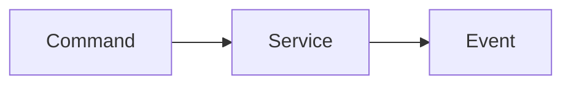
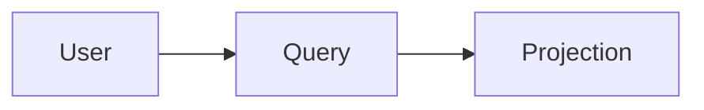

# RFC-032 Data Flow

**Metadata:**
- Status: Draft
- Authors: Tiroq + ChatGPT
- Last Updated: 2026-06-28

---

## 1. Summary

This RFC defines the canonical data flow within Praxis, from initial ingestion through to learning and projection. It specifies how information moves through the system, ensuring traceability, immutability, and replayability. Data Flow here refers to the lifecycle of business information, distinct from Control Flow, which governs operational sequencing and orchestration.

## 2. Relationship to Previous RFCs

This RFC builds on concepts and definitions from RFC-000 through RFC-031, establishing foundational data movement patterns required for upcoming RFCs such as RFC-033 (Storage Model) and RFC-040 (Agent Architecture).

## 3. Goals
- **End-to-end traceability:** Every datum can be traced from ingestion to its ultimate effect.
- **Immutable flow:** Data is never mutated in place; each transformation produces a new immutable record.
- **Replay compatibility:** The system can reconstruct derived state from the event log.
- **Provider independence:** Data flow does not depend on specific transport or storage technologies.
- **Observable processing:** Every stage emits observable artifacts for monitoring and audit.

## 4. Non-Goals

This RFC does **not** define:
- Concrete transport implementations (e.g., Kafka, NATS, HTTP, etc.)
- Broker, queue, or topic configuration
- Internal storage mechanisms or schema

## 5. Data Flow Philosophy

In Praxis, **data flows**; **ownership does not**. Each service or component owns its behavior and outputs, but never the data it receives or forwards. Ownership transfer only occurs through explicit contracts, not via data movement.

## 6. Canonical Runtime Flow

```mermaid
flowchart LR
    Source --> Gateway
    Gateway --> Ingestion
    Ingestion --> EventRecord
    EventRecord --> Understanding
    Understanding --> CanonicalObject
    CanonicalObject --> ReviewRequest
    ReviewRequest --> Reviews
    Reviews --> ReviewPackage
    ReviewPackage --> DecisionRequest
    DecisionRequest --> Decision
    Decision --> ActionRequest
    ActionRequest --> Action
    Action --> ExecutionResult
    ExecutionResult --> Learning
    Learning --> Projections
```

## 7. Flow Stages

| Stage             | Input                        | Output                      | Primary Owner       |
|-------------------|-----------------------------|-----------------------------|---------------------|
| Gateway           | Source Request               | Normalized Request          | Gateway             |
| Ingestion         | Normalized Request           | Event Record                | Ingestion Service   |
| Understanding     | Event Record                 | Canonical Object            | Understanding       |
| Canonical Domain  | Canonical Object             | Review Request              | Domain Service      |
| Review            | Review Request               | Review Package              | Review Service      |
| Decision          | Review Package               | Decision                    | Decision Service    |
| Action            | Decision                     | Action Request / Execution  | Action Service      |
| Learning          | Execution Result             | Learning Event              | Learning Service    |
| Projection        | All Events                   | Queryable Projection        | Projection Service  |

## 8. Control Flow vs Data Flow

| Aspect         | Data Flow                                 | Control Flow                          |
|----------------|-------------------------------------------|---------------------------------------|
| Responsibility | Business information movement             | Orchestration, sequencing, scheduling |
| Artifacts      | Events, Commands, Projections             | Triggers, timers, retries             |
| Mutability     | Immutable                                 | Mutable (stateful)                    |
| Ownership      | Remains with service                      | Shared/transient                      |

## 9. Event Flow

Every stage communicates via **immutable Events**. Events are append-only, timestamped, and carry correlation metadata.

**Example event names:**
- `RequestIngested`
- `UnderstandingCreated`
- `ReviewRequested`
- `ReviewCompleted`
- `DecisionMade`
- `ActionDispatched`
- `ExecutionResulted`
- `LearningRecorded`

## 10. Command Flow

Commands **initiate work**; Events **describe completed work**. Commands are requests for a service to perform an action; events are facts about what has occurred.

## 11. Query Flow

Queries **read** from **projections** only. They never trigger side effects or state changes.

## 12. Correlation Model

Every datum in the pipeline carries:
- **Correlation ID:** Groups related events/commands (e.g., for a single workflow).
- **Causation ID:** Identifies the event/command that directly caused this one.
- **Trace ID:** End-to-end trace for distributed tracing.

These IDs are propagated and required at every stage for full observability and replay.

## 13. Replay Flow

Replay is performed by reading the **Event Records** and deterministically rebuilding the state of Canonical Objects, Review Packages, Decisions, Actions, and Projections. **No event is ever rewritten or deleted.** Replay ensures derived state can be reconstructed at any time.

## 14. Failure Flow

Failures at any stage are handled via:
- **Retries:** Automatic or manual, with idempotency.
- **Dead-letter queues:** Events/commands that cannot be processed are isolated for manual intervention.
- **Compensating actions:** For non-idempotent failures, compensating events can be emitted.
- **Error events:** All errors are emitted as events for observability and audit.

## 15. Cross-Service Boundaries

Services exchange only **Commands**, **Events**, and **Queries**. No direct data or state sharing is permitted.

## 16. Architectural Invariants
- Data flows strictly forward.
- Events are immutable and append-only.
- Ownership never flows with data.
- Each service owns its own behavior and outputs.
- Replay reconstructs all derived state from the event log.
- Queries never change state.

## 17. Dependencies

Depends on RFC-000 through RFC-031. Required for RFC-033 (Storage Model) and RFC-040 (Agent Architecture).

## 18. Acceptance Criteria
- End-to-end data flow is documented and traceable.
- Each stage emits immutable events with correlation metadata.
- Replay is possible and reconstructs all derived state.
- No cross-service mutations outside of commands/events/queries.
- All error/failure scenarios are observable.

## 19. Decision Log

*No decisions recorded yet.*

---

> "Data flows through the system. Ownership stays with the service that earned it."