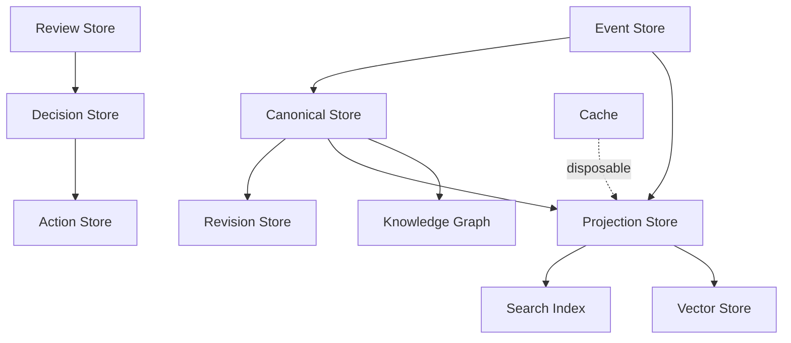

# RFC-033 Storage Model

**Status:** Draft  
**Authors:** Tiroq + ChatGPT  
**Last Updated:** 2026-06-28

---

## 1. Summary

This RFC defines the storage model for Praxis.

RFC-030 defines the runtime architecture. RFC-031 defines service contracts. RFC-032 defines how information flows through the system. This RFC defines where different categories of data belong, which service owns them, how storage boundaries are enforced, and how Praxis remains replayable, auditable, local-first, and provider-independent.

Storage in Praxis is not a single shared database. Storage is a set of explicitly owned persistence responsibilities.

The storage model is based on the following principles:

- Every service owns its persistence.
- Services never read another service's database directly.
- Immutable Events are the historical source of truth for runtime reconstruction.
- Canonical Objects are the business source of truth.
- Projections and Read Models are derived and rebuildable.
- Search indexes, vector indexes, caches, and analytics views are disposable derived stores.
- External systems may be synchronized but never own Praxis identity.

---

## 2. Relationship to Previous RFCs

This RFC depends on:

- RFC-000 Vision
- RFC-001 Principles
- RFC-002 Terminology
- RFC-003 Concept Model
- RFC-010 Capability Map
- RFC-011 Domain Model
- RFC-012 Artifact Model
- RFC-013 Event Model
- RFC-014 Identity & Representation Model
- RFC-015 Object Lifecycle Model
- RFC-020 Review System
- RFC-021 Decision Model
- RFC-022 State Machine
- RFC-030 System Architecture
- RFC-031 Service Contracts
- RFC-032 Data Flow

RFC-013 defines Events and Event Records.

RFC-014 defines Identity, Canonical Objects, Projections, Read Models, and Views.

RFC-015 defines Object Lifecycle.

RFC-030 defines runtime service boundaries.

RFC-031 states that services must never communicate through shared persistence.

RFC-032 defines the end-to-end data flow.

This RFC turns those architectural concepts into a coherent storage ownership model.

---

## 3. Goals

The goals of this RFC are to:

- Define the storage categories used by Praxis.
- Define ownership rules for each storage category.
- Separate canonical storage from derived storage.
- Support CQRS-style separation between writes and reads.
- Support event replay and reconstruction.
- Support local-first operation.
- Support future distributed deployment.
- Prevent shared mutable database coupling.
- Define migration and versioning principles.
- Define retention and archival expectations.
- Establish backup and recovery boundaries.

---

## 4. Non-Goals

This RFC does not:

- Select a concrete database engine.
- Define SQL schemas.
- Define table layouts.
- Define indexes in implementation detail.
- Define cloud infrastructure.
- Define backup tooling.
- Define encryption implementation.
- Define ORM or repository libraries.

Concrete implementation choices are deferred to implementation RFCs and engineering design documents.

---

## 5. Storage Philosophy

Praxis treats storage as an architectural boundary, not merely an implementation detail.

Storage must preserve the following distinctions:

- Facts vs state.
- Canonical truth vs derived views.
- Business identity vs external references.
- Long-lived history vs disposable acceleration structures.
- Service ownership vs convenience access.

The most dangerous failure mode is turning storage into the integration layer between services.

Praxis explicitly rejects shared database integration.

Services integrate through Commands, Events, and Queries. Storage is internal to service ownership.

---

## 6. Storage Categories

Praxis uses multiple storage categories, each with a distinct purpose.

| Storage Category | Purpose | Rebuildable | Owner |
|------------------|---------|-------------|-------|
| Event Store | Immutable Event Records and transition events | No | Event/Ingestion runtime |
| Canonical Store | Canonical Objects and business invariants | Partially | Canonical Domain Service |
| Revision Store | Object revision history | No | Canonical Domain Service |
| Review Store | Reviews and Review Packages | No | Review Service |
| Decision Store | Decision Requests and Decisions | No | Decision Service |
| Action Store | Action Requests, Actions, Execution Results | No | Action Service |
| Projection Store | Space projections and read models | Yes | Projection Service |
| Search Index | Text and structured search | Yes | Search Service |
| Vector Store | Embeddings and semantic search indexes | Yes | Memory/Search services |
| Knowledge Graph Store | Semantic relationships | Rebuildable where derived | Knowledge Service |
| Blob Store | Files, attachments, large payloads | No if original, Yes if derived | Owning service |
| Cache | Temporary acceleration | Yes | Owning service |
| Audit Store | Security, policy, and operational audit | No | Observability/Audit service |
| Configuration Store | Runtime configuration and service metadata | No | Configuration/Policy service |

---

## 7. High-Level Storage Architecture

Canonical and immutable stores preserve truth and history.

Projection, search, vector, and cache stores accelerate access and may be rebuilt.

---

## 8. Event Store

The Event Store stores immutable Event Records and transition events.

It is the historical backbone of Praxis runtime reconstruction.

### Stores

- Event Records from RFC-013.
- State transition events from RFC-022.
- Integration events.
- System events.
- Error events.
- Replay markers.

### Rules

- Event Records are immutable.
- Events are append-only.
- Events are never updated in place.
- Corrections are represented as new Events.
- Events preserve correlation, causation, and trace identifiers.
- Event schemas are versioned.

### Does Not Store

- Mutable business object state.
- Query-optimized read models.
- UI views.
- Temporary cache state.

---

## 9. Canonical Store

The Canonical Store holds Canonical Objects and their current business truth.

Canonical Objects are defined by RFC-014.

### Stores

- Canonical Object identity.
- Current lifecycle state.
- Current business state where applicable.
- Business invariants.
- Relationships owned by the Canonical Domain Service.
- External identity mappings where owned by the Canonical Domain Service.

### Rules

- Canonical Objects are provider-independent.
- Canonical Objects own business identity.
- External IDs are references only.
- Canonical state changes must produce revisions and events.
- Canonical state must not be modified by external services directly.

### Does Not Store

- Service-specific projections.
- Search indexes.
- UI state.
- LLM prompts or responses unless materialized as Canonical Objects or Artifacts.

---

## 10. Revision Store

The Revision Store preserves object history.

Revisions are immutable records of meaningful changes to Canonical Objects and Artifacts.

### Stores

- Revision ID.
- Object ID.
- Parent revision ID.
- Actor.
- Timestamp.
- Change reason.
- Source Event or Decision.
- Previous state snapshot or diff.
- New state snapshot or diff.

### Rules

- Revisions are immutable.
- Revision history is append-only.
- Revisions must preserve lineage.
- Revisions must be traceable to Events, Decisions, or manual actors.
- Revision history must never be silently rewritten.

---

## 11. Review Store

The Review Store is owned by the Review Service.

### Stores

- Review Requests.
- Individual Reviews.
- Review Strategies used.
- Review Policies used.
- Review Packages.
- Aggregated assessments.
- Evidence summaries.
- Review lifecycle state.

### Rules

- Reviews are immutable after completion.
- Review Packages are immutable after completion.
- Review Store does not own Decisions.
- Review Store does not mutate Canonical Objects.
- Review evidence must remain traceable.

---

## 12. Decision Store

The Decision Store is owned by the Decision Service.

### Stores

- Decision Requests.
- Decisions.
- Decision Policy ID.
- Decision Policy Version.
- Decision reasoning.
- Evidence summary.
- Supersession references.
- Decision lifecycle state.

### Rules

- Decisions are immutable once committed.
- A superseding Decision creates a new Decision record.
- Decisions reference Review Packages, not individual Reviews.
- Decision Store does not execute Actions.
- Decision Store does not mutate Review history.

---

## 13. Action Store

The Action Store is owned by the Action Service.

### Stores

- Action Requests.
- Action Plans.
- Actions.
- Execution attempts.
- Execution Results.
- Retry state.
- Compensation references.
- External execution references.

### Rules

- Actions reference Decisions.
- Action execution must be idempotent where practical.
- Execution Results are append-only.
- External side effects must be traceable.
- Action Store does not change Decisions.

---

## 14. Projection Store

The Projection Store holds derived representations optimized for user Spaces, workflows, dashboards, and API queries.

### Stores

- Space projections.
- Workflow projections.
- Dashboard read models.
- Timeline views.
- Kanban views.
- Calendar views.
- Aggregate counters.

### Rules

- Projections are derived.
- Projections may be rebuilt.
- Projections do not own business truth.
- Projections may be stale.
- Projection freshness must be observable.
- Projection rebuilds must not alter Canonical Objects.

---

## 15. Search Index

The Search Index supports text and structured search.

### Stores

- Indexed titles.
- Indexed descriptions.
- Tags.
- Full-text fields.
- Search facets.
- Ranking metadata.

### Rules

- Search indexes are derived.
- Search indexes may be rebuilt.
- Search indexes do not own identity.
- Search results must reference Canonical Object IDs.
- Search failures must not corrupt Canonical state.

---

## 16. Vector Store

The Vector Store supports semantic retrieval and similarity search.

### Stores

- Embeddings.
- Chunk references.
- Semantic metadata.
- Model/version metadata.
- Source object references.

### Rules

- Embeddings are derived representations.
- Embeddings may be regenerated.
- Vector records must reference source objects or source documents.
- Embedding model version must be stored.
- Vector Store does not own business truth.

---

## 17. Knowledge Graph Store

The Knowledge Graph Store connects Canonical Objects, Artifacts, Events, people, documents, decisions, and external references through semantic relationships.

### Stores

- Nodes.
- Edges.
- Relationship types.
- Evidence references.
- Confidence scores.
- Source references.

### Rules

- Knowledge Graph does not own identity.
- Knowledge Graph relationships must be traceable.
- Derived relationships may be rebuilt.
- Manually confirmed relationships may require revision history.
- Knowledge Graph must not become a hidden business state store.

---

## 18. Blob Store

The Blob Store holds large binary or text payloads.

Examples:

- Uploaded files.
- Attachments.
- PDFs.
- Images.
- Audio transcripts.
- Exported reports.
- Raw external payloads too large for normal stores.

### Rules

- Blob metadata must be stored separately from blob content.
- Blob content must be addressable by stable reference.
- Original blobs are not rebuildable unless re-imported.
- Derived blobs may be regenerated.
- Blob references must be traceable to owning objects.

---

## 19. Cache

Caches are temporary acceleration structures.

### Rules

- Cache is disposable.
- Cache must never be the only source of truth.
- Cache invalidation must be safe.
- Cache misses must not break correctness.
- Cache may improve latency but must not define behavior.

---

## 20. CQRS Model

Praxis follows a CQRS-compatible storage model.

Commands affect service-owned state.

Events describe facts after state changes.

Queries read projections and read models.

The write model and read model are intentionally separated.

---

## 21. Replay Model

Replay rebuilds derived state from immutable history.

Replay may rebuild:

- Projections.
- Read Models.
- Search Indexes.
- Vector indexes.
- Knowledge Graph derived relationships.
- Analytics views.
- Caches.

Replay must never rewrite:

- Event Records.
- Canonical identity.
- Historical Decisions.
- Completed Reviews.
- Revision history.
- Execution Results.

---

## 22. Snapshot Strategy

Snapshots may be used to improve replay performance.

Snapshots are optimization artifacts, not the source of truth.

### Snapshot Rules

- Snapshots must reference source Event offsets or revision IDs.
- Snapshots must be rebuildable.
- Snapshots must be versioned.
- Snapshot corruption must not destroy canonical history.
- Snapshot usage must be observable.

---

## 23. Consistency Model

Praxis accepts different consistency models for different storage categories.

| Store | Consistency Expectation |
|-------|-------------------------|
| Event Store | Strong append consistency |
| Canonical Store | Strong consistency per object |
| Revision Store | Strong append consistency |
| Review Store | Strong consistency per review package |
| Decision Store | Strong consistency per decision request |
| Action Store | Strong consistency per action execution |
| Projection Store | Eventual consistency |
| Search Index | Eventual consistency |
| Vector Store | Eventual consistency |
| Cache | Best-effort consistency |

Eventual consistency is acceptable only for derived stores.

---

## 24. Transactions

Transactions must stay within service ownership boundaries.

### Rules

- A service may use local transactions for its own state.
- Cross-service distributed transactions are avoided.
- Cross-service coordination uses Events and compensating actions.
- External side effects must be idempotent where practical.
- Transaction boundaries must be explicit.

---

## 25. Migrations

Storage schemas and data structures will evolve.

### Migration Rules

- Migrations must be versioned.
- Migrations must be reversible where practical.
- Breaking storage changes require a migration plan.
- Event schema migrations must preserve replay compatibility.
- Derived stores may be rebuilt instead of migrated.
- Migration status must be observable.

---

## 26. Retention and Archival

Different data categories require different retention policies.

| Data Type | Retention Strategy |
|----------|--------------------|
| Event Records | Long-term / maximum feasible |
| Canonical Objects | While active + archived history |
| Revisions | Long-term |
| Reviews | Long-term for auditability |
| Decisions | Long-term for auditability |
| Actions | Long-term if external side effects occurred |
| Projections | Rebuildable, may be pruned |
| Search Index | Rebuildable, may be pruned |
| Vector Store | Rebuildable, may be regenerated |
| Cache | Short-lived |
| Blobs | Based on ownership and source type |

Retention policy must be explicit and configurable.

---

## 27. Backup and Recovery

Backup strategy must prioritize non-rebuildable data.

Highest priority:

- Event Store.
- Canonical Store.
- Revision Store.
- Decision Store.
- Review Store.
- Action Store.
- Original Blob Store.

Lower priority:

- Projection Store.
- Search Index.
- Vector Store.
- Cache.

Derived stores may be recovered by replay or rebuild.

---

## 28. Security and Privacy

Storage must support privacy and access control.

### Requirements

- Sensitive fields must be identifiable.
- Secrets must not be stored in normal business stores.
- External tokens must be stored only in secure secret storage.
- Access control must apply to queries and projections.
- Audit logs must record sensitive access where required.
- Data export and deletion policies must be defined for user-owned data.

---

## 29. Local-First Storage

Praxis must support local-first deployment.

This means:

- The system can run on a personal machine or home server.
- Core storage can operate without managed cloud services.
- External providers are optional adapters.
- Local LLMs and local indexes must be supported.
- Backup/export must be possible without vendor lock-in.

Local-first does not mean local-only. It means the architecture does not require cloud ownership of core data.

---

## 30. Storage Ownership Matrix

| Service | Primary Stores |
|--------|----------------|
| Ingestion Service | Event Store input partitions, raw payload references |
| Understanding Service | Understanding outputs, interpretation traces |
| Canonical Domain Service | Canonical Store, Revision Store |
| Review Service | Review Store |
| Decision Service | Decision Store |
| Action Service | Action Store |
| Projection Service | Projection Store |
| Search Service | Search Index |
| Learning Service | Learning data, feedback records |
| Knowledge Service | Knowledge Graph Store, Vector Store |
| Integration Service | External identity mappings, adapter sync state |
| Notification Service | Notification logs and templates |
| Scheduler | Scheduled command store |
| Observability Service | Logs, metrics, traces, audit store |
| Policy Service | Policy definitions and versions |
| LLM Routing Service | Provider configs, routing metrics, model registry references |

---

## 31. Storage Invariants

The following invariants must hold:

- Services own their storage.
- Services never read another service's database directly.
- Event Records are immutable.
- Canonical identity is stable.
- Derived stores are rebuildable.
- Projections do not own business truth.
- Search does not own identity.
- Vector Store does not own meaning.
- Cache does not own correctness.
- External systems do not own Praxis identity.
- Replay never rewrites history.
- Backups prioritize non-rebuildable stores.

---

## 32. Architectural Consequences

This storage model enables:

- Replayability.
- Auditability.
- CQRS.
- Local-first deployment.
- Independent service evolution.
- Provider independence.
- Search and semantic retrieval without corrupting canonical truth.
- Multiple projections over the same Canonical Objects.
- Safe rebuild of derived stores.

The cost is operational discipline: storage boundaries must be respected even when direct database access appears convenient.

---

## 33. Dependencies

Depends on:

- RFC-000 through RFC-032

Required before:

- RFC-040 Agent Architecture
- RFC-043 Memory & Knowledge Graph
- RFC-060 Testing Strategy
- RFC-061 Verification Scripts

---

## 34. Acceptance Criteria

This RFC can be accepted when:

- Storage categories are clearly defined.
- Storage ownership is unambiguous.
- Canonical and derived stores are separated.
- Replayable stores and non-replayable stores are distinguished.
- CQRS expectations are clear.
- Service database sharing is explicitly forbidden.
- Retention strategy is defined at the category level.
- Backup priorities are clear.
- Local-first storage requirements are preserved.
- Storage invariants are agreed upon.

---

## 35. Decision Log

| Date | Decision | Author |
|------|----------|--------|
| 2026-06-28 | Initial draft | Tiroq + ChatGPT |

---

> **Storage preserves truth only when ownership is explicit.**