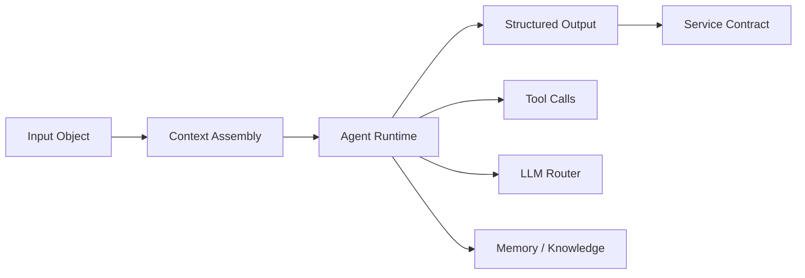
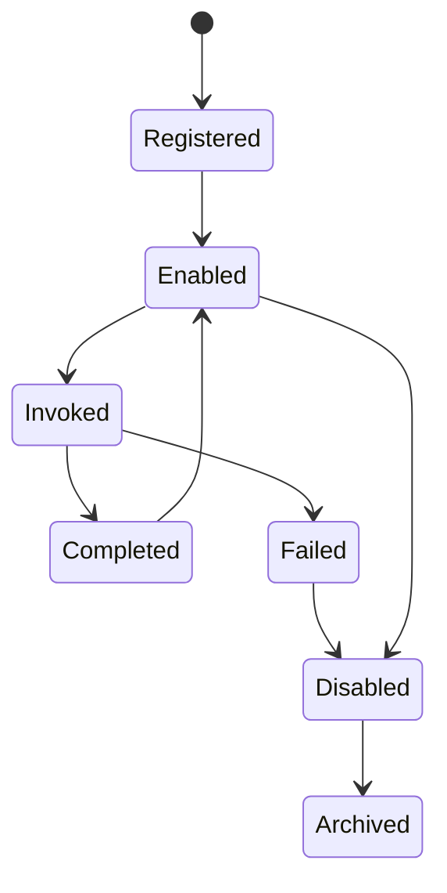
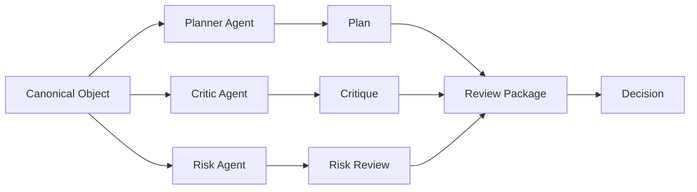

# RFC-040 Agent Architecture

**Status:** Draft  
**Authors:** Tiroq + ChatGPT  
**Last Updated:** 2026-06-28

---

## 1. Summary

This RFC defines the Agent Architecture for Praxis.

Agents are bounded runtime participants that perform cognitive, analytical, advisory, or execution-support work within the Praxis system. They do not replace the core architecture. They operate inside it.

Agents may understand information, retrieve context, generate plans, review objects, critique proposals, classify opportunities, recommend actions, prepare drafts, or assist humans. However, agents do not own canonical business truth, do not bypass Review or Decision models, and do not execute irreversible side effects without an explicit Decision and Action Request.

The Agent Architecture builds on the runtime foundation defined by RFC-030 through RFC-033 and integrates with the Review System, Decision Model, State Machine, LLM Routing, Prompt Versioning, Memory, and Knowledge Graph RFCs.

---

## 2. Relationship to Previous RFCs

This RFC depends on:

- RFC-000 Vision
- RFC-001 Principles
- RFC-002 Terminology
- RFC-003 Concept Model
- RFC-010 Capability Map
- RFC-011 Domain Model
- RFC-012 Artifact Model
- RFC-013 Event Model
- RFC-014 Identity & Representation Model
- RFC-015 Object Lifecycle Model
- RFC-020 Review System
- RFC-021 Decision Model
- RFC-022 State Machine
- RFC-030 System Architecture
- RFC-031 Service Contracts
- RFC-032 Data Flow
- RFC-033 Storage Model

This RFC prepares the ground for:

- RFC-041 LLM Routing
- RFC-042 Prompt Versioning
- RFC-043 Memory & Knowledge Graph
- RFC-050 Freelance Domain
- RFC-060 Testing Strategy
- RFC-061 Verification Scripts
- RFC-062 Benchmarking

RFC-020 defines how Reviews are produced. Agents may be Review participants.

RFC-021 defines how Decisions are committed. Agents may advise Decisions, but they do not own Decisions.

RFC-030 defines runtime services. Agents operate through services and contracts.

RFC-031 defines Commands, Events, and Queries. Agents must use those contracts.

RFC-033 defines storage ownership. Agents do not own canonical storage unless represented by a dedicated service.

---

## 3. Goals

The goals of this RFC are to:

- Define what an Agent is in Praxis.
- Define agent responsibilities and boundaries.
- Define how agents interact with services.
- Define the agent lifecycle.
- Define agent identity and configuration.
- Define multi-agent collaboration rules.
- Define tool usage boundaries.
- Define human-in-the-loop requirements.
- Prevent agents from bypassing architectural invariants.
- Support provider-independent LLM execution.
- Support local-first and cloud-assisted agent execution.
- Provide a foundation for agent testing and benchmarking.

---

## 4. Non-Goals

This RFC does not:

- Define concrete prompts.
- Define LLM provider routing.
- Define memory storage implementation.
- Define agent UI.
- Define tool schemas in full detail.
- Define domain-specific agent behavior exhaustively.
- Define scheduling implementation.
- Define workflow engine implementation.

Those concerns are handled by later RFCs.

---

## 5. Agent Philosophy

Agents are not autonomous owners of the system.

Agents are bounded collaborators.

Praxis follows these principles:

- Agents propose; humans or policies decide.
- Agents review; Decisions commit.
- Agents may prepare Actions; Action Service executes.
- Agents may query Knowledge; Knowledge Graph owns semantic relationships.
- Agents may use tools; tools must be contract-bound.
- Agents may reason; reasoning must be traceable enough to audit outputs.
- Agents may fail; failures must be observable.
- Agents must remain replaceable.

The architecture must avoid the anti-pattern where an agent becomes an unbounded hidden workflow engine.

---

## 6. Agent Definition

An **Agent** is a runtime participant with a defined role, capabilities, policies, tools, context access, and output contract.

An Agent may be powered by:

- An LLM.
- A deterministic rules engine.
- A hybrid reasoning pipeline.
- A script.
- A human-assisted process.
- A local model.
- A cloud model.

An Agent is defined by behavior and contract, not by implementation technology.

---

## 7. Agent vs Related Concepts

| Concept | Difference from Agent |
|--------|------------------------|
| Service | Owns runtime behavior and contracts. Agents operate within services. |
| Workflow | Orchestrates capabilities. Agents may perform workflow steps. |
| Tool | Performs a bounded operation. Agents may invoke tools. |
| Model | Generates or classifies content. Agents may use models. |
| Prompt | Instruction template for model-backed agents. |
| Review | Evaluation artifact. Agents may produce Reviews. |
| Decision | Commitment. Agents do not own Decisions. |
| Action | Execution. Agents do not execute irreversible Actions directly. |

---

## 8. Agent Runtime Model

The agent runtime receives an input object, assembles context, invokes reasoning or deterministic logic, optionally calls tools, and produces structured output through a service contract.

Agents must not write directly into unrelated stores or bypass service contracts.

---

## 9. Agent Identity

Every Agent has a stable identity.

Agent identity is separate from:

- LLM provider.
- Prompt version.
- Runtime instance.
- Tool set.
- Deployment environment.

### Mandatory Agent Identity Fields

- Agent ID
- Agent Name
- Agent Role
- Agent Type
- Owner Service
- Capability Set
- Policy Set
- Prompt Version References
- Model Routing Policy
- Tool Permissions
- Created At
- Updated At

Agent identity must remain stable even if its implementation changes.

---

## 10. Agent Types

Praxis defines the following baseline agent types.

| Agent Type | Responsibility |
|-----------|----------------|
| Classifier Agent | Classifies events, artifacts, leads, tasks, and messages. |
| Planner Agent | Produces plans, steps, decompositions, and execution proposals. |
| Critic Agent | Finds flaws, contradictions, missing information, and weak assumptions. |
| Reviewer Agent | Produces structured Reviews for Review Packages. |
| Research Agent | Gathers and synthesizes contextual knowledge. |
| Architect Agent | Reviews architecture, RFCs, design decisions, and system consistency. |
| Risk Agent | Evaluates risk, uncertainty, safety, cost, and failure modes. |
| Domain Expert Agent | Applies domain-specific knowledge, such as Freelance, Work, or Product. |
| Proposal Agent | Drafts or improves proposals, offers, and client communication. |
| Routing Agent | Selects models, tools, or workflows based on policy. |
| Memory Agent | Helps retrieve, connect, and summarize memory and knowledge. |
| Execution Assistant | Prepares Action Requests but does not execute irreversible actions. |
| Learning Agent | Extracts feedback and improvement signals from outcomes. |

This list is extensible through future RFCs.

---

## 11. Agent Capability Model

Agents are assigned capabilities rather than arbitrary permissions.

Examples:

- Classify.
- Summarize.
- Translate.
- Plan.
- Review.
- Critique.
- Estimate.
- Retrieve Context.
- Draft Message.
- Generate Proposal.
- Compare Options.
- Produce Structured Output.
- Request Human Review.
- Prepare Action Request.

Capabilities must map back to RFC-010 Capability Map where possible.

Agents must not invent capabilities at runtime.

---

## 12. Agent Lifecycle

### Lifecycle States

| State | Meaning |
|------|---------|
| Registered | Agent definition exists. |
| Enabled | Agent may be invoked. |
| Invoked | Agent is currently processing a request. |
| Completed | Agent produced a valid output. |
| Failed | Agent failed to complete successfully. |
| Disabled | Agent cannot be invoked. |
| Archived | Agent is retained for history but no longer active. |

Agent lifecycle belongs to the agent definition and runtime instance, not to the object being processed.

---

## 13. Agent Invocation

Agent invocation must be explicit.

An invocation includes:

- Invocation ID
- Agent ID
- Input Object ID
- Input Object Type
- Requested Capability
- Context Policy
- Tool Policy
- Model Routing Policy
- Prompt Version
- Actor
- Correlation ID
- Causation ID
- Timestamp

Agent invocations must be observable and replay-analyzable.

---

## 14. Agent Inputs

Agents may receive:

- Event Records.
- Artifacts.
- Canonical Objects.
- Review Requests.
- Review Packages.
- Decision Requests.
- Action Requests.
- Documents.
- Messages.
- Search results.
- Knowledge Graph subgraphs.
- User instructions.

Inputs must be typed and versioned.

Agents should not rely on implicit global context.

---

## 15. Agent Outputs

Agent outputs must be structured.

Examples:

- Classification Result.
- Summary.
- Review.
- Critique.
- Plan.
- Draft.
- Proposal.
- Risk Assessment.
- Context Bundle.
- Tool Call Request.
- Action Request Draft.
- Learning Signal.

Outputs must include:

- Output ID
- Agent ID
- Invocation ID
- Output Type
- Payload
- Confidence
- Evidence References
- Model/Engine Metadata
- Prompt Version if applicable
- Created At

Unstructured text may be included as payload, but it must be wrapped by a structured output contract.

---

## 16. Multi-Agent Collaboration

Agents may collaborate through explicit orchestration patterns.

Agents do not communicate through hidden memory or private side channels.

Collaboration must be mediated through explicit artifacts, reviews, events, or structured outputs.

---

## 17. Agent Orchestration Patterns

Praxis supports several orchestration patterns.

| Pattern | Description | Typical Use |
|--------|-------------|-------------|
| Single Agent | One agent processes one input. | Simple classification. |
| Pipeline | Agents run in sequence. | Research → Draft → Critique. |
| Fan-Out / Fan-In | Multiple agents evaluate independently, then aggregate. | Reviews and scoring. |
| Debate | Agents produce opposing arguments. | High-risk decisions. |
| Supervisor | One agent coordinates specialist agents. | Complex planning. |
| Human-Gated | Agent output requires human approval. | Proposals and external actions. |
| Policy-Gated | Agent execution depends on policy rules. | Risk-sensitive workflows. |

Orchestration patterns must be explicit and observable.

---

## 18. Agent Context Model

Agents operate on bounded context.

Context may include:

- Current input object.
- Related Events.
- Related Artifacts.
- Related Decisions.
- Relevant policies.
- Retrieved Knowledge.
- Similar objects.
- User preferences.
- Space projection.
- Workflow state.

Context must be assembled through a Context Policy.

Agents must not receive unlimited context by default.

---

## 19. Context Policy

A Context Policy defines what information an agent may see.

Policy dimensions:

- Scope.
- Time range.
- Object types.
- Privacy level.
- Space.
- Domain.
- Retrieval strategy.
- Token budget.
- Recency preference.
- Evidence requirements.

Context Policy is required for repeatability, safety, and cost control.

---

## 20. Tool Use

Agents may use tools only through explicit Tool Contracts.

Examples:

- Search.
- Retrieve object.
- Retrieve knowledge.
- Generate draft.
- Validate schema.
- Score opportunity.
- Prepare Action Request.
- Query external integration.

### Tool Use Rules

- Tools must be registered.
- Tool permissions must be explicit.
- Tool calls must be logged.
- Tool outputs must be typed.
- Tool failures must be observable.
- Tools must not bypass service ownership.
- Dangerous tools require human or policy approval.

---

## 21. LLM Interaction

LLM-backed agents must use the LLM Routing Service.

Agents must not hard-code model providers.

LLM invocation must include:

- Model routing policy.
- Prompt version.
- Input context.
- Output schema.
- Safety policy.
- Cost/latency preference where relevant.
- Correlation ID.

LLM outputs are never trusted blindly. They must be validated against output schemas or downstream policies.

---

## 22. Prompt Versioning

Agents using prompts must reference explicit prompt versions.

Prompt versions must be traceable from agent outputs.

An output produced by an LLM-backed agent must be able to answer:

- Which agent produced it?
- Which prompt version was used?
- Which model was used?
- Which context was provided?
- Which tool calls were made?
- Which output schema was expected?

Detailed prompt lifecycle is defined by RFC-042.

---

## 23. Memory and Knowledge Interaction

Agents may retrieve memory and knowledge, but they do not own memory.

Memory and Knowledge Graph concerns are defined by RFC-043.

Agent access to memory must be:

- Policy-bound.
- Scoped.
- Traceable.
- Evidence-based.
- Revocable.

Agents may propose new knowledge relationships, but Knowledge services own persistence and validation.

---

## 24. Human-in-the-Loop

Human approval is required when:

- An agent output triggers external irreversible effects.
- The workflow policy requires human review.
- Confidence is below threshold.
- Risk exceeds threshold.
- The action affects external clients or finances.
- The action changes canonical identity or lifecycle.

Human review creates Reviews or Decisions according to RFC-020 and RFC-021.

Agents must not treat human feedback as hidden state. Feedback must be recorded as Events, Reviews, Decisions, or Learning Signals.

---

## 25. Agent Failure Model

Agents may fail in multiple ways.

| Failure Type | Meaning |
|-------------|---------|
| Input Error | Input object is invalid or unsupported. |
| Context Error | Required context cannot be retrieved. |
| Tool Error | Tool invocation failed. |
| Model Error | Model unavailable or returned invalid output. |
| Schema Error | Output failed validation. |
| Policy Error | Policy denied the operation. |
| Timeout | Agent exceeded runtime budget. |
| Low Confidence | Output confidence below threshold. |
| Contradiction | Agent output contradicts evidence or policy. |

Failures must produce observable error Events.

---

## 26. Agent Observability

Every agent invocation must be observable.

Required signals:

- Invocation count.
- Success rate.
- Failure rate.
- Latency.
- Token usage where applicable.
- Cost where applicable.
- Tool calls.
- Model usage.
- Output validation failures.
- Confidence distribution.
- Human override rate.

Agent observability is required for debugging, trust, and cost control.

---

## 27. Agent Security Boundaries

Agents must operate under least privilege.

Security rules:

- Agents receive only permitted context.
- Agents use only permitted tools.
- Agents cannot access secrets directly.
- Agents cannot bypass Gateway, Policy, or Service Contracts.
- Agents cannot execute irreversible actions directly.
- Agents cannot modify canonical stores directly.
- Agents cannot self-expand permissions.

Agent permissions must be inspectable.

---

## 28. Agent Configuration

Agent configuration must be explicit and versioned.

Configuration includes:

- Agent identity.
- Enabled/disabled state.
- Capability set.
- Model routing policy.
- Prompt version references.
- Tool permissions.
- Context policy.
- Safety policy.
- Output schema.
- Retry policy.
- Timeout policy.
- Cost policy.

Configuration changes must be auditable.

---

## 29. Agent Testing

Agents must be testable.

Testing dimensions:

- Schema compliance.
- Deterministic fixture tests where possible.
- Regression tests.
- Golden examples.
- Adversarial examples.
- Cost and latency tests.
- Tool permission tests.
- Prompt version tests.
- Multi-agent workflow tests.
- Human approval path tests.

Agent testing is further defined by RFC-060, RFC-061, and RFC-062.

---

## 30. Agent Benchmarking

Agent benchmarking should measure:

- Accuracy.
- Helpfulness.
- Consistency.
- Cost.
- Latency.
- Tool usage quality.
- Output schema validity.
- Review quality.
- Decision usefulness where advisory.
- Human override rate.

Benchmarks must be tied to real Praxis workflows, not generic leaderboard scores.

---

## 31. Agent Storage

Agents do not own canonical business storage.

They may have service-owned operational storage for:

- Invocation records.
- Output records.
- Tool call logs.
- Evaluation metrics.
- Configuration versions.
- Prompt references.

Agent storage must follow RFC-033 Storage Model.

---

## 32. Agent Invariants

The following invariants must hold:

- Agents do not own canonical business truth.
- Agents do not own Decisions.
- Agents do not execute irreversible Actions directly.
- Agents use Service Contracts.
- Agents use LLM Routing for model calls.
- Agents use explicit prompt versions.
- Agents operate under Context Policy.
- Agents operate under Tool Policy.
- Agent outputs are structured.
- Agent invocations are observable.
- Agents remain replaceable.
- Human override remains possible.

---

## 33. Architectural Consequences

This architecture enables:

- Multi-agent reasoning without hidden coupling.
- Local and cloud model interchangeability.
- Human-in-the-loop governance.
- Review Package generation.
- Explainable agent outputs.
- Provider-independent intelligence.
- Agent benchmarking and regression testing.
- Safe external automation.

The cost is additional discipline: agents must be treated as bounded participants, not unrestricted autonomous processes.

---

## 34. Dependencies

Depends on:

- RFC-000 through RFC-033

Required before:

- RFC-041 LLM Routing
- RFC-042 Prompt Versioning
- RFC-043 Memory & Knowledge Graph
- RFC-050 Freelance Domain
- RFC-060 Testing Strategy
- RFC-061 Verification Scripts
- RFC-062 Benchmarking

---

## 35. Acceptance Criteria

This RFC can be accepted when:

- Agent responsibilities are clearly defined.
- Agent boundaries are explicit.
- Agent lifecycle is defined.
- Agent identity is stable and provider-independent.
- Agent capabilities are policy-bound.
- Agent tool usage is contract-bound.
- Agent context access is policy-bound.
- Agent outputs are structured and traceable.
- Human-in-the-loop requirements are explicit.
- Agent failure modes are defined.
- Agent observability requirements are defined.
- Agent invariants are agreed upon.

---

## 36. Decision Log

| Date | Decision | Author |
|------|----------|--------|
| 2026-06-28 | Initial draft | Tiroq + ChatGPT |

---

> **Agents are powerful only when their boundaries are explicit.**