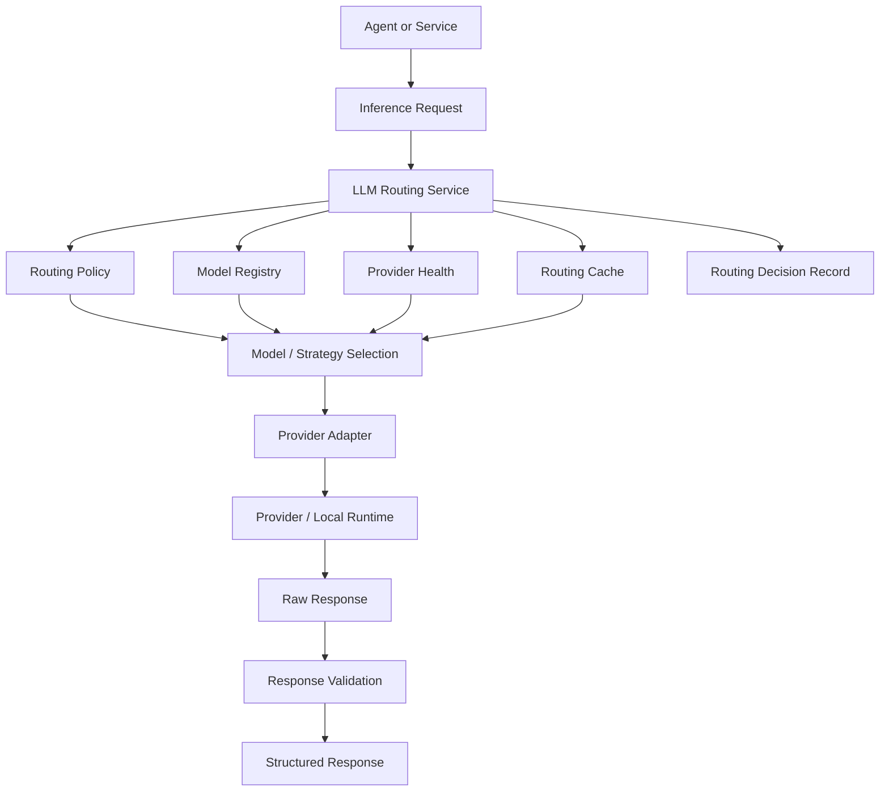
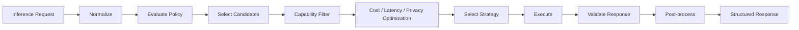
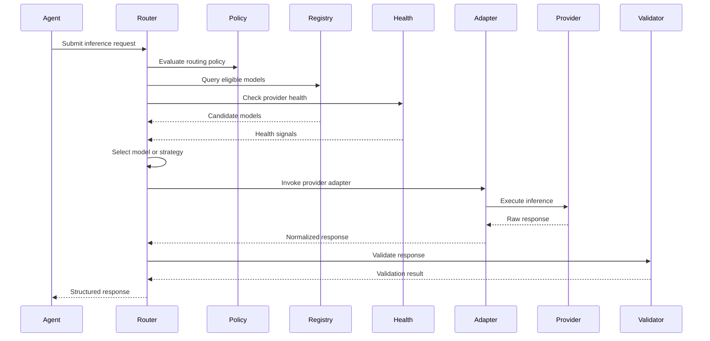
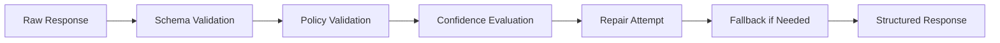

# RFC-041 LLM Routing

**Status:** Draft  
**Authors:** Tiroq + ChatGPT  
**Last Updated:** 2026-06-28

---

## 1. Summary

This RFC defines the LLM Routing architecture for Praxis.

LLM Routing is the provider-independent inference layer used by agents and services when they need language-model-backed reasoning, classification, summarization, drafting, translation, structured extraction, scoring, or review assistance.

The LLM Routing Service does not own prompts, business logic, memory, decisions, or agent behavior. It owns model selection, provider abstraction, routing policy evaluation, fallback, retries, output validation, cost and latency controls, privacy enforcement, and routing observability.

The long-term direction of this RFC is broader than text-only LLM calls. The same architecture may evolve into a general **Inference Routing** layer covering chat models, coding models, embedding models, rerankers, OCR models, vision models, speech-to-text, text-to-speech, and image generation models. This RFC keeps the title `LLM Routing` because LLM routing is the first implementation scope.

---

## 2. Relationship to Previous RFCs

This RFC depends on:

- RFC-000 Vision
- RFC-001 Principles
- RFC-002 Terminology
- RFC-003 Concept Model
- RFC-010 Capability Map
- RFC-011 Domain Model
- RFC-012 Artifact Model
- RFC-013 Event Model
- RFC-014 Identity & Representation Model
- RFC-015 Object Lifecycle Model
- RFC-020 Review System
- RFC-021 Decision Model
- RFC-022 State Machine
- RFC-030 System Architecture
- RFC-031 Service Contracts
- RFC-032 Data Flow
- RFC-033 Storage Model
- RFC-040 Agent Architecture

This RFC is required before:

- RFC-042 Prompt Versioning
- RFC-043 Memory & Knowledge Graph
- RFC-060 Testing Strategy
- RFC-061 Verification Scripts
- RFC-062 Benchmarking

RFC-040 defines that agents must not call providers directly. This RFC defines the routing service they must use.

RFC-042 will define prompt lifecycle and prompt versioning. This RFC explicitly does not own prompts.

RFC-043 will define memory and knowledge retrieval. This RFC may receive context bundles, but it does not own memory.

---

## 3. Goals

The goals of this RFC are to:

- Decouple agents and services from concrete model providers.
- Route requests by capability rather than model name.
- Support local-first and cloud-assisted inference.
- Support cost, latency, privacy, quality, and context constraints.
- Support fallback and retry behavior.
- Support structured output validation.
- Support multi-model strategies.
- Support provider health tracking.
- Make routing decisions observable and auditable.
- Keep prompts, memory, business logic, and decisions outside the routing layer.
- Provide a foundation for model benchmarking and routing verification.

---

## 4. Non-Goals

This RFC does not:

- Define prompt templates.
- Define prompt versioning.
- Define agent workflows.
- Define business decisions.
- Define memory retrieval implementation.
- Define provider SDK details.
- Define exact pricing tables.
- Define UI for model configuration.
- Define benchmark datasets.

---

## 5. Routing Philosophy

Praxis routes inference requests by capability, policy, and constraints.

The system should not ask:

> Which provider should this agent call?

It should ask:

> What capability is required, under what constraints, with what privacy, latency, cost, and output requirements?

The router then selects the best available model or strategy.

This keeps Praxis independent from any single provider and allows local models, paid APIs, free APIs, specialized models, and future inference engines to be swapped without changing agent logic.

---

## 6. Why LLM Routing Exists

LLM Routing exists because direct provider calls create hidden coupling.

Without a routing layer:

- Agents become tied to provider APIs.
- Prompts become mixed with provider-specific parameters.
- Cost control becomes scattered.
- Fallback behavior becomes inconsistent.
- Observability becomes fragmented.
- Local models become second-class citizens.
- Provider outages affect business logic.
- Benchmarking and comparison become difficult.

With a routing layer:

- Agents ask for capabilities.
- Policies choose models.
- Providers become replaceable adapters.
- Routing decisions are recorded.
- Local and cloud models can coexist.
- Cost, privacy, and latency become enforceable.

---

## 7. Routing Architecture

The router is responsible for the entire path from request normalization to provider invocation, validation, fallback, and decision recording.

---

## 8. Routing Responsibilities

The LLM Routing Service owns:

- Request normalization.
- Capability-based model selection.
- Routing policy evaluation.
- Model registry lookup.
- Provider health evaluation.
- Provider adapter invocation.
- Local-first enforcement.
- Fallback strategy.
- Retry strategy.
- Context and token budget enforcement.
- Structured output validation.
- Cost tracking.
- Latency tracking.
- Routing decision records.
- Routing metrics.

The LLM Routing Service does not own:

- Agent identity.
- Prompt lifecycle.
- Business rules.
- Canonical Objects.
- Reviews.
- Decisions.
- Memory persistence.
- Knowledge Graph truth.

---

## 9. Model Registry

The Model Registry is a catalog of available models and inference engines.

It stores capability metadata, not business logic.

### Registry Fields

| Field | Meaning |
|------|---------|
| Model ID | Stable internal model identifier. |
| Provider | Provider or local runtime. |
| Model Name | Provider-specific model name. |
| Model Version | Version or release identifier where known. |
| Capabilities | Supported inference capabilities. |
| Context Window | Maximum usable context. |
| Input Modalities | Text, image, audio, file, etc. |
| Output Modalities | Text, JSON, embeddings, audio, image, etc. |
| Structured Output Support | Whether schema-constrained output is supported. |
| Tool Use Support | Whether function/tool calling is supported. |
| Privacy Class | Local, private cloud, public cloud, unknown. |
| Cost Profile | Cost metadata or estimate. |
| Latency Profile | Expected latency class. |
| Availability | Whether currently routable. |
| Quality Scores | Internal benchmark results. |

### Example Capability Matrix

| Model | Runtime | Strength | Context | Privacy | Structured Output | Cost Class |
|------|---------|----------|---------|---------|-------------------|------------|
| qwen-local | Ollama | General reasoning | Medium | Local | Partial | Free/local |
| gemma-local | Ollama | Fast classification | Small/Medium | Local | Partial | Free/local |
| cloud-strong | Cloud API | High-quality reasoning | Large | Cloud | Strong | Paid |
| cloud-fast | Cloud API | Low-latency tasks | Medium | Cloud | Strong | Paid |

The registry should support manual entries first and dynamic discovery later.

---

## 10. Provider Adapters

Provider Adapters isolate Praxis from provider-specific APIs.

A Provider Adapter owns:

- Authentication to provider runtime.
- API request formatting.
- Provider-specific parameter mapping.
- Response parsing.
- Provider error normalization.
- Streaming support where available.
- Rate-limit handling.
- Capability exposure.

Provider Adapters must expose a uniform internal interface to the LLM Routing Service.

Agents and business services must never depend on provider SDKs directly.

---

## 11. Routing Policies

Routing policies are declarative rules that determine how models are selected.

Routing policies may include:

- Required capability.
- Privacy requirements.
- Cost budget.
- Latency budget.
- Context size.
- Language.
- Structured output requirement.
- Tool use requirement.
- Local-first preference.
- Fallback order.
- Retry behavior.
- Multi-model strategy.

### Routing Policy Dimensions

| Dimension | Example Values |
|----------|----------------|
| Capability | classify, summarize, reason, code, review, translate |
| Quality | fast, balanced, high-quality, critical |
| Privacy | local-only, cloud-allowed, redacted-cloud |
| Cost | free-only, low-cost, balanced, quality-first |
| Latency | realtime, interactive, background |
| Context | small, medium, large, long-context |
| Output | text, JSON, schema-required, streaming |
| Strategy | single, cascade, voting, judge, debate |

Policies must be versioned and observable.

---

## 12. Capability-Based Routing

Praxis routes by capability, not by provider name.

Example capabilities:

- Classification.
- Summarization.
- Translation.
- Reasoning.
- Coding.
- Architecture review.
- Risk review.
- Proposal drafting.
- JSON extraction.
- Tool calling.
- Long-context synthesis.
- Multilingual processing.
- Vision analysis.
- Embedding generation.
- Reranking.

Agents request capabilities. The router maps capabilities to eligible models.

This prevents agent logic from depending on model names such as `gpt-*`, `claude-*`, `qwen-*`, or local runtime identifiers.

---

## 13. Routing Inputs

Routing decisions use the following input fields.

| Input | Meaning |
|------|---------|
| Request ID | Unique inference request identifier. |
| Requested Capability | Capability needed by caller. |
| Agent ID | Agent making the request. |
| Task Type | Classification, review, drafting, etc. |
| Quality Requirement | Required quality level. |
| Latency Budget | Maximum acceptable latency. |
| Cost Budget | Maximum acceptable cost. |
| Privacy Level | Allowed data exposure. |
| Language | Input and output language expectations. |
| Context Size | Estimated tokens or bytes. |
| Output Schema | Expected structured output contract. |
| Tool Requirement | Whether tool calling is required. |
| Streaming Requirement | Whether streaming is required. |
| Determinism Requirement | Whether low-temperature deterministic output is required. |
| Correlation ID | Runtime correlation identifier. |
| Causation ID | Source request identifier. |

---

## 14. Routing Outputs

Routing produces:

- Structured response.
- Selected model.
- Selected provider adapter.
- Routing strategy used.
- Fallback path if any.
- Retry count.
- Validation result.
- Cost estimate or actual cost.
- Latency measurement.
- Token usage where applicable.
- Routing Decision Record.

Routing output must be traceable to the input request, selected policy, selected model, and validation result.

---

## 15. Routing Pipeline

### Pipeline Stages

| Stage | Responsibility |
|------|----------------|
| Normalize | Convert caller request into canonical routing request. |
| Evaluate Policy | Apply routing policy and constraints. |
| Select Candidates | Retrieve possible models from registry. |
| Capability Filter | Remove models that cannot satisfy requirements. |
| Optimize | Rank by cost, latency, privacy, quality, and health. |
| Select Strategy | Choose single model or multi-model strategy. |
| Execute | Invoke provider adapter or local runtime. |
| Validate | Validate schema, policy, confidence, and safety. |
| Post-process | Normalize final result and metadata. |

---

## 16. Routing Decision Process

---

## 17. Multi-Model Strategies

Routing may use more than one model when policy requires it.

| Strategy | Description | Typical Use |
|----------|-------------|-------------|
| Single Model | Use one selected model. | Normal tasks. |
| Fast to Smart | Try fast/cheap model, escalate if confidence is low. | Background classification. |
| Cascade | Progressively escalate through stronger models. | Cost-controlled reasoning. |
| Parallel Voting | Run multiple models and aggregate. | High-confidence classification. |
| Judge | Generate with one model, evaluate with another. | Structured drafting and review. |
| Debate | Use opposing models/agents to surface tradeoffs. | Risky decisions. |
| Local Preferred | Try local model first, cloud fallback if allowed. | Privacy-sensitive workflows. |
| Cost Optimized | Select cheapest model satisfying requirements. | High-volume tasks. |
| Quality First | Select strongest available model. | Critical reviews. |

Multi-model strategies must be explicit in routing metadata.

---

## 18. Fallback Strategy

Fallback is used when the selected model or strategy cannot satisfy the request.

Fallback triggers include:

- Provider unavailable.
- Timeout.
- Rate limit.
- Invalid output.
- Schema validation failure.
- Low confidence.
- Context too large.
- Policy rejection.

Fallback options:

- Retry same provider.
- Use alternative provider.
- Use stronger model.
- Use smaller context.
- Use local fallback.
- Return structured failure.

Fallback must never violate privacy policy.

---

## 19. Retry Strategy

Retries must be controlled by policy.

Retry parameters:

- Maximum retry count.
- Retryable error classes.
- Backoff policy.
- Same-provider retry permission.
- Cross-provider retry permission.
- Idempotency key.
- Total latency budget.
- Total cost budget.

Retries must not create duplicate irreversible side effects because LLM Routing must not own irreversible side effects.

---

## 20. Local-First Strategy

Praxis prefers local models when policy allows and capability requirements can be satisfied.

Local-first routing supports:

- Privacy-sensitive tasks.
- Offline operation.
- Low-cost background processing.
- High-volume classification.
- Development environments.
- Home-server deployment.

Local-first does not mean local-only. Policy determines whether cloud fallback is allowed.

---

## 21. Provider Independence

Provider independence means:

- Agents never call providers directly.
- Provider SDKs remain inside adapters.
- Business logic never branches on provider name.
- Prompt versions are not provider identities.
- Model selection can change without changing agent code.
- Local and cloud models are interchangeable when capabilities match.

Provider-specific features may be exposed only through normalized capability metadata.

---

## 22. Prompt Separation

LLM Routing does not own prompts.

Prompt concerns belong to RFC-042.

Routing may receive:

- Prompt version reference.
- Rendered prompt.
- Output schema.
- Prompt metadata.

Routing must not silently modify prompt intent.

Routing may adapt provider-specific formatting only when this does not change semantic meaning.

---

## 23. Context Limits and Token Budgeting

Routing enforces context limits.

Responsibilities:

- Estimate input tokens.
- Estimate output budget.
- Check model context window.
- Enforce maximum request size.
- Reject oversized requests when policy requires.
- Request context compression when available.
- Track token usage.

Routing may not arbitrarily remove context without recording truncation or compression metadata.

---

## 24. Response Validation Pipeline

LLM outputs must be validated before being returned to agents.

Validation stages:

- Schema validation.
- Type validation.
- Policy validation.
- Safety validation where applicable.
- Confidence evaluation.
- Repair attempt if allowed.
- Fallback if repair fails.

Invalid output must be observable.

---

## 25. Structured Output Validation

Structured output requirements must be explicit.

Examples:

- JSON object.
- JSON schema.
- Enum-only classification.
- Markdown section contract.
- Review object.
- Plan object.
- Proposal draft object.
- Tool call object.

Routing must return either a valid structured response or a structured error.

---

## 26. Cost Management

Routing tracks and limits cost.

Cost management includes:

- Per-request budget.
- Per-agent budget.
- Per-workflow budget.
- Daily/monthly budget.
- Local-first preference.
- Free-provider preference.
- Paid escalation rules.

Cost policy must be explicit. Silent high-cost escalation is forbidden.

---

## 27. Latency Management

Routing tracks and controls latency.

Latency classes:

| Class | Meaning |
|------|---------|
| Realtime | User is waiting immediately. |
| Interactive | User expects a response soon. |
| Background | Can run asynchronously. |
| Batch | Can run slowly and cheaply. |

Latency policy influences model selection, fallback, and multi-model strategy.

---

## 28. Provider Health Model

The router maintains provider and model health signals.

| Health Signal | Meaning |
|--------------|---------|
| Availability | Whether provider is currently usable. |
| Error Rate | Recent failed requests. |
| Latency Score | Recent response latency. |
| Rate Limit State | Whether provider is throttling. |
| Validation Failure Rate | Frequency of invalid outputs. |
| Token Throughput | Effective processing speed. |
| Recent Incidents | Recent provider degradation. |

Routing should avoid unhealthy providers when alternatives exist.

---

## 29. Routing Cache

Routing may use caches to reduce cost and latency.

Cache types:

| Cache Type | Purpose |
|-----------|---------|
| Exact Cache | Reuse identical request results. |
| Semantic Cache | Reuse similar request results where safe. |
| Embedding Cache | Reuse generated embeddings. |
| Prompt Cache | Reuse provider-supported prompt prefix caching. |
| Capability Cache | Cache model eligibility decisions. |

Cache usage must respect privacy, freshness, and correctness policies.

Caches must never become the source of truth.

---

## 30. Privacy and Security

Routing enforces privacy constraints.

Privacy policies may require:

- Local-only execution.
- Redaction before cloud routing.
- No logging of sensitive payloads.
- No provider retention where configurable.
- Restricted provider allowlist.
- User approval before cloud escalation.

Sensitive data must not be sent to providers that violate the request policy.

---

## 31. Observability

Routing must emit observable signals.

Required metrics:

- Provider selection count.
- Model selection count.
- Latency.
- Token usage.
- Estimated cost.
- Actual cost where available.
- Failure rate.
- Fallback rate.
- Retry count.
- Cache hit rate.
- Validation failure rate.
- Local vs cloud usage ratio.
- Policy rejection count.

Logs must include routing metadata without leaking sensitive payloads.

---

## 32. Routing Decision Record

Every routing request must produce a Routing Decision Record.

Fields:

- Routing Decision ID.
- Request ID.
- Agent ID or Caller ID.
- Requested Capability.
- Policy ID.
- Policy Version.
- Candidate Models.
- Rejected Models and reasons.
- Selected Model.
- Selected Provider.
- Strategy.
- Fallback Path.
- Validation Result.
- Cost Estimate.
- Latency.
- Token Usage.
- Correlation ID.
- Timestamp.

Routing Decision Records enable audit, debugging, benchmarking, and policy improvement.

---

## 33. Failure Model

| Failure Category | Description | Retryable | Fallback Possible |
|------------------|-------------|-----------|-------------------|
| Provider Error | Provider 5xx, outage, SDK failure | Yes | Yes |
| Rate Limit | Provider throttled request | Yes | Yes |
| Timeout | Latency budget exceeded | Yes | Yes |
| Validation Error | Output failed schema or policy validation | Sometimes | Yes |
| Context Overflow | Request exceeds context window | No | Yes |
| Policy Violation | Request violates routing policy | No | No |
| Privacy Violation Risk | No provider satisfies privacy rule | No | No |
| Cost Budget Exceeded | Routing would exceed budget | No | Sometimes |
| No Eligible Model | Registry contains no matching model | No | No |

Failures must return structured errors.

---

## 34. Configuration Model

Routing configuration is declarative and versioned.

| Field | Description |
|------|-------------|
| Model Registry | Available models and capabilities. |
| Provider Adapters | Enabled adapters and credentials references. |
| Routing Policies | Selection rules. |
| Fallback Policies | Fallback order and constraints. |
| Retry Policies | Retry classes and limits. |
| Cost Budgets | Cost limits by scope. |
| Latency Budgets | Latency limits by scope. |
| Privacy Policies | Data exposure constraints. |
| Cache Policies | Cache enablement and freshness. |
| Validation Policies | Output validation requirements. |

Configuration changes must be auditable.

---

## 35. Future Inference Routing

The LLM Routing architecture should evolve toward broader inference routing.

Future supported inference types may include:

- Chat completion.
- Structured extraction.
- Embeddings.
- Reranking.
- OCR.
- Vision analysis.
- Speech-to-text.
- Text-to-speech.
- Image generation.
- Code generation.
- Classification.
- Moderation.

This RFC keeps the LLM Routing name for current scope but intentionally avoids assumptions that prevent future inference expansion.

---

## 36. Routing Invariants

The following invariants must hold:

- Agents never call providers directly.
- Providers are replaceable.
- Prompts are versioned separately.
- Routing decisions are observable.
- Business logic never depends on provider.
- Local models and cloud models are interchangeable when capabilities match.
- Routing is based on capability and policy, not hard-coded provider names.
- Routing never owns business truth.
- Routing never owns prompts.
- Routing never owns memory.
- Routing never commits Decisions.
- Routing never executes Actions.
- Privacy policy must not be violated by fallback.
- Invalid structured outputs must not be silently accepted.

---

## 37. Architectural Consequences

This architecture enables:

- Provider-independent intelligence.
- Local-first inference.
- Cost-aware automation.
- Latency-aware routing.
- Safer privacy boundaries.
- Model benchmarking and comparison.
- Gradual adoption of stronger models.
- Robust fallback during provider outages.
- Multi-model reasoning strategies.
- Future expansion into general inference routing.

The cost is additional routing complexity and the need for model registry maintenance, policy management, and validation infrastructure.

---

## 38. Dependencies

Depends on:

- RFC-000 through RFC-040

Required before:

- RFC-042 Prompt Versioning
- RFC-043 Memory & Knowledge Graph
- RFC-060 Testing Strategy
- RFC-061 Verification Scripts
- RFC-062 Benchmarking

---

## 39. Acceptance Criteria

This RFC can be accepted when:

- Agents never invoke LLM providers directly.
- Routing decisions are logged and observable.
- Routing is capability-based.
- Routing policies can be updated without agent code changes.
- Provider adapters can be swapped without affecting agents.
- Local-first routing is supported.
- Fallback and retry strategies are configurable.
- Structured output validation is defined.
- Provider health is represented.
- Routing cache rules are defined.
- Privacy constraints are enforced.
- Routing Decision Records are defined.
- Future inference expansion is not blocked.

---

## 40. Decision Log

| Date | Decision | Author |
|------|----------|--------|
| 2026-06-28 | Initial draft | Tiroq + ChatGPT |
| 2026-06-28 | Expanded routing into capability-based inference architecture | Tiroq + ChatGPT |

---

> **Intelligence should depend on capability, not on a specific model provider.**