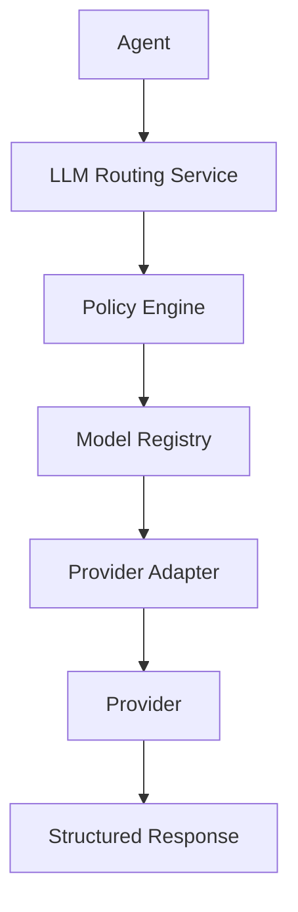
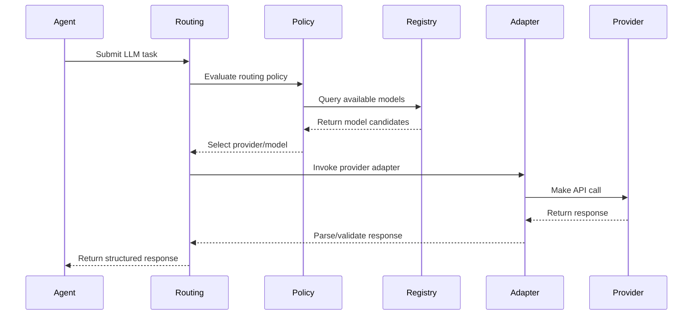

# RFC-041 LLM Routing

**Status:** Draft  
**Authors:** Tiroq + ChatGPT  
**Last Updated:** 2026-06-28

---

## 1. Summary

This RFC defines the architecture, responsibilities, and policies for LLM Routing within the Praxis platform. LLM Routing is a service layer responsible for selecting the most appropriate large language model (LLM) provider for a given user task, based on a variety of criteria including capability, cost, latency, privacy, and structured output requirements. LLM Routing ensures that agents never interact with providers directly and that all provider-specific logic is encapsulated, supporting provider independence, observability, and flexible policy-driven selection.

---

## 2. Relationship to Previous RFCs

- **Depends on:** RFC-000 through RFC-040
- **Required by:** RFC-042 Prompt Versioning, RFC-043 Memory & Knowledge Graph, RFC-060 Testing

---

## 3. Goals

- Abstract away provider-specific details from agent code.
- Enable policy-driven dynamic selection of LLM providers.
- Support fallback, retry, and local-first strategies.
- Maintain observability and traceability of routing decisions.
- Ensure structured output requirements are met.
- Support cost, latency, privacy, and capability constraints.
- Facilitate provider independence and easy swapping.

---

## 4. Non-Goals

- LLM Routing does **not** own or version prompts (see RFC-042).
- Does not implement business logic or agent-specific workflows.
- Does not define provider-specific adapters (but coordinates with them).
- Does not persist or manage long-term memory (see RFC-043).

---

## 5. Routing Philosophy

LLM Routing is designed to allow the Praxis platform to intelligently leverage any LLM provider, local or remote, based on task requirements and organizational policy. Routing is transparent, auditable, and policy-driven, with the goal of maximizing capability and flexibility while minimizing vendor lock-in.

---

## 6. Why LLM Routing Exists

- **Provider Independence:** Decouple business logic from LLM providers.
- **Policy Flexibility:** Select providers based on dynamic policies.
- **Cost & Latency Optimization:** Route requests according to organizational priorities.
- **Fallback & Resilience:** Provide robustness against provider failures.
- **Observability:** Enable monitoring of routing decisions and outcomes.

---

## 7. Routing Architecture

---

## 8. Routing Responsibilities

- Receive requests from agents.
- Evaluate routing policies.
- Select and invoke the appropriate provider adapter.
- Handle fallback and retry strategies.
- Enforce structured output requirements.
- Log routing decisions and outcomes.
- Report metrics and observability data.

---

## 9. Model Registry

The Model Registry is a catalog of all available LLM models and their capabilities, including metadata such as:

- Model name & version
- Provider
- Capabilities (task types, languages, context size, etc.)
- Cost per token
- Latency characteristics
- Privacy guarantees
- Availability status

**Provider Capability Matrix Example:**

| Model         | Provider    | Max Tokens | Languages      | Cost ($/1K tokens) | Privacy Level | Structured Output |
|--------------|-------------|------------|---------------|--------------------|--------------|------------------|
| GPT-4        | OpenAI      | 128k       | EN, DE, FR    | 0.03               | Cloud        | Yes              |
| Claude 3 Opus| Anthropic   | 200k       | EN, FR        | 0.025              | Cloud        | Yes              |
| Llama 3      | Local       | 8k         | EN, ES        | 0                  | Local        | Yes              |

---

## 10. Provider Adapters

Provider Adapters abstract the technical integration with each LLM provider. They expose a uniform interface for invocation, error handling, and structured output parsing. Adapters can be swapped out or updated independently of routing logic.

---

## 11. Routing Policies

Routing policies are declarative rules that determine which provider/model to use for a given request based on:

- Task type (chat, code, summarization, etc.)
- Capability requirements (context size, language, structured output)
- Latency and cost constraints
- Privacy requirements
- User or organization preferences

**Routing Policy Dimensions Table:**

| Dimension         | Example Values                |
|-------------------|------------------------------|
| Task Type         | chat, code, summarize        |
| Capability        | context >= 32k, JSON output  |
| Latency           | < 2s, < 500ms                |
| Cost              | < $0.01/1K tokens            |
| Privacy           | local only, cloud allowed    |
| Language          | English, German              |
| Structured Output | required, optional           |

---

## 12. Routing Inputs

Routing decisions use the following inputs:

- Task type
- Capability requirements
- Latency constraints
- Cost constraints
- Privacy level
- Language
- Context size
- Structured output requirements
- User/organization preferences

---

## 13. Routing Outputs

The output of routing is:

- Selected provider/model
- Invocation parameters
- Structured response (or error/fallback)
- Routing decision metadata (for observability)

---

## 14. Routing Decision Process

---

## 15. Fallback Strategy

If the selected provider fails (timeout, error, unavailability), routing may:

- Select the next-best provider/model according to policy.
- Retry with degraded requirements (e.g., smaller context).
- Return a structured error if no fallback is possible.

---

## 16. Retry Strategy

Routing may retry failed requests according to policy:

- Max retry count
- Backoff strategy (exponential, linear)
- Retry on specific error categories only

---

## 17. Local-First Strategy

When policy allows, routing prefers local models over cloud providers to maximize privacy, reduce cost, and minimize latency.

---

## 18. Provider Independence

Routing ensures agents and business logic are never coupled to a specific LLM provider. Providers can be added, removed, or replaced without affecting agent code.

---

## 19. Prompt Separation

Routing never owns or versions prompts. Prompt management and versioning is handled by RFC-042.

---

## 20. Context Limits and Token Budgeting

Routing is responsible for enforcing context window limits and token budgets per provider/model. Requests exceeding limits are rejected or truncated according to policy.

---

## 21. Structured Output Validation

Routing validates that provider responses conform to required structured output (e.g., JSON schemas). Invalid responses may trigger fallback or error handling.

---

## 22. Cost Management

Routing enforces cost constraints per request and per user/organization. Exceeding cost budgets results in fallback or rejection according to policy.

---

## 23. Latency Management

Routing tracks and enforces latency requirements. Requests exceeding latency budgets may be retried, degraded, or rerouted.

---

## 24. Privacy and Security

Routing enforces privacy policies, ensuring that requests requiring local processing are never sent to cloud providers. Sensitive data is never logged or persisted outside policy bounds.

---

## 25. Observability

Routing emits metrics and logs for:

- Provider/model selection
- Latency per request
- Token usage
- Failure and fallback rates
- Retry counts
- Cache hit/miss rates

---

## 26. Failure Model

**Failure Categories Table:**

| Category         | Description                        | Retryable | Fallback Possible |
|------------------|------------------------------------|-----------|-------------------|
| Provider Error   | 5xx, rate limit, downtime          | Yes       | Yes               |
| Validation Error | Invalid output, schema mismatch    | No        | Yes               |
| Timeout          | Exceeded latency budget            | Yes       | Yes               |
| Policy Violation | Privacy/cost/context violation     | No        | No                |

---

## 27. Configuration Model

Routing is configured via declarative policy files specifying:

- Model registry entries
- Routing policies
- Fallback/retry parameters
- Cost/latency/privacy budgets
- Local-first preferences

**Configuration Fields Table:**

| Field             | Type     | Description                          |
|-------------------|----------|--------------------------------------|
| models            | list     | Registered models/providers          |
| policies          | list     | Routing policy definitions           |
| fallback_strategy | string   | Policy for fallback (e.g., priority) |
| retry_count       | int      | Max retries per request              |
| cost_budget       | float    | Max cost per request                 |
| latency_budget    | int      | Max latency in ms                    |
| privacy_level     | string   | Allowed privacy levels               |

---

## 28. Routing Invariants

- **Agents never call providers directly.**
- **Providers are replaceable.**
- **Prompts are versioned separately.**
- **Routing decisions are observable.**
- **Business logic never depends on provider.**
- **Local models and cloud models are interchangeable.**

---

## 29. Architectural Consequences

- Facilitates rapid provider/model integration and replacement.
- Enables robust fallback and resilience to provider outages.
- Supports compliance with privacy and cost policies.
- Centralizes observability and reporting.
- Decouples agent/business logic from LLM infrastructure.

---

## 30. Dependencies

- **Required before:** RFC-042 Prompt Versioning, RFC-043 Memory & Knowledge Graph, RFC-060 Testing
- **Depends on:** RFC-000 through RFC-040

---

## 31. Acceptance Criteria

- Agents never invoke LLM providers directly.
- Routing decisions are logged and observable.
- Policies can be updated without code changes.
- Fallback and retry strategies are configurable.
- Local-first routing is supported.
- Provider adapters can be swapped without affecting agent code.
- Structured output is validated.

---

## 32. Decision Log

- **2026-06-28:** Initial draft by Tiroq + ChatGPT.

---

> **Intelligence should depend on capability, not on a specific model provider.**