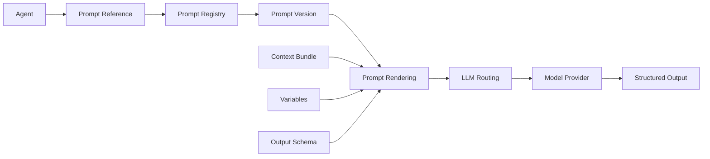
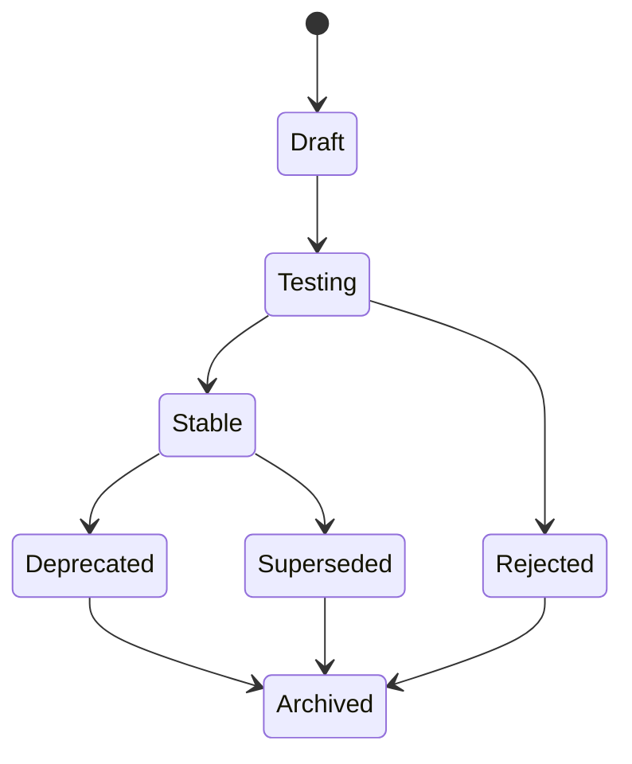

# RFC-042 Prompt Versioning

**Status:** Draft  
**Authors:** Tiroq + ChatGPT  
**Last Updated:** 2026-06-28

---

## 1. Summary

This RFC defines the Prompt Versioning architecture for Praxis.

Prompts are versioned architectural artifacts used by agents, services, and LLM-backed workflows to produce structured, repeatable, observable outputs. A prompt is not a casual string embedded inside code. A prompt is part of the runtime contract between an Agent, the LLM Routing Service, the Context system, the expected output schema, and the downstream Review, Decision, or Action pipeline.

Prompt Versioning exists to make AI behavior inspectable, testable, reproducible, and evolvable.

Praxis treats prompts as first-class runtime assets with stable identity, explicit versions, dependencies, lifecycle states, test cases, rollback rules, observability metadata, and compatibility constraints.

---

## 2. Relationship to Previous RFCs

This RFC depends on:

- RFC-000 Vision
- RFC-001 Principles
- RFC-002 Terminology
- RFC-003 Concept Model
- RFC-010 Capability Map
- RFC-011 Domain Model
- RFC-012 Artifact Model
- RFC-013 Event Model
- RFC-014 Identity & Representation Model
- RFC-015 Object Lifecycle Model
- RFC-020 Review System
- RFC-021 Decision Model
- RFC-022 State Machine
- RFC-030 System Architecture
- RFC-031 Service Contracts
- RFC-032 Data Flow
- RFC-033 Storage Model
- RFC-040 Agent Architecture
- RFC-041 LLM Routing

This RFC is required before:

- RFC-043 Memory & Knowledge Graph
- RFC-060 Testing Strategy
- RFC-061 Verification Scripts
- RFC-062 Benchmarking

RFC-040 defines Agents and states that LLM-backed agents must reference explicit prompt versions.

RFC-041 defines LLM Routing and states that routing does not own prompts.

This RFC defines the missing layer: how prompts are identified, versioned, rendered, tested, evaluated, promoted, rolled back, and observed.

---

## 3. Goals

The goals of this RFC are to:

- Treat prompts as versioned architectural artifacts.
- Separate prompts from agent code.
- Separate prompts from model provider selection.
- Make prompt behavior traceable and reproducible.
- Define prompt identity and lifecycle.
- Define prompt composition and dependency rules.
- Define prompt rendering and variable resolution.
- Define prompt testing and evaluation expectations.
- Support safe prompt rollout and rollback.
- Support local-first and provider-independent prompt execution.
- Enable prompt observability and benchmarking.

---

## 4. Non-Goals

This RFC does not:

- Define concrete prompt text for every agent.
- Define LLM provider routing.
- Define model registry behavior.
- Define memory storage.
- Define domain-specific workflows.
- Define UI for prompt editing.
- Define exact benchmark datasets.
- Define security implementation details.

Those concerns are handled by later RFCs and implementation documents.

---

## 5. Prompt Philosophy

A prompt is executable instruction content.

That means it must be governed like code.

Praxis follows these principles:

- Prompts are versioned.
- Prompts are testable.
- Prompts are observable.
- Prompts are rollback-safe.
- Prompts are provider-independent where possible.
- Prompts are linked to expected output schemas.
- Prompts must not silently change behavior.
- Prompts must not hide business rules that belong in policies or services.

The dangerous anti-pattern is embedding prompts directly into agents as mutable strings.

Praxis rejects that pattern.

---

## 6. Prompt Definition

A **Prompt** is a named, versioned instruction artifact that can be rendered with variables, context, policies, and output constraints before being sent to an inference model through RFC-041 LLM Routing.

A Prompt may contain:

- System instructions.
- Role instructions.
- Task instructions.
- Context placement rules.
- Output format requirements.
- Tool-use guidance.
- Safety constraints.
- Examples.
- Evaluation hints.
- Refusal or escalation rules.

A Prompt must not contain:

- Secrets.
- Hard-coded provider credentials.
- Hidden business state.
- Unversioned operational policy.
- Irreversible execution instructions that bypass Decisions.

---

## 7. Prompt vs Related Concepts

| Concept | Difference from Prompt |
|--------|-------------------------|
| Agent | Runtime participant that uses prompts. |
| Model | Inference engine selected by LLM Routing. |
| Routing Policy | Selects model/provider; does not own prompt text. |
| Context Policy | Defines what context may be injected. |
| Tool Contract | Defines callable tools; prompt may describe when to use them. |
| Output Schema | Defines expected structure; prompt instructs model to produce it. |
| Review | Evaluation artifact; prompt may generate review content. |
| Decision | Commitment; prompt never commits decisions. |
| Memory | Retrieved knowledge; prompt may include selected memory but does not own it. |

---

## 8. Prompt Architecture

The Agent references a Prompt Version. The Prompt Registry resolves it. The Prompt Renderer combines the versioned prompt with variables, context, and output schema. The rendered prompt is passed to LLM Routing, which selects the model provider.

---

## 9. Prompt Identity

Every Prompt has stable identity independent of its versions.

Prompt identity is separate from:

- Prompt version.
- Agent using it.
- Model provider.
- Runtime environment.
- Context bundle.
- Output schema version.

### Prompt Identity Fields

| Field | Meaning |
|------|---------|
| Prompt ID | Stable unique identifier. |
| Name | Human-readable name. |
| Purpose | Why the prompt exists. |
| Owner Service | Service responsible for the prompt. |
| Agent References | Agents allowed to use it. |
| Capability | Capability supported by the prompt. |
| Current Stable Version | Version currently approved for normal use. |
| Status | Active, deprecated, archived, etc. |
| Created At | Creation timestamp. |
| Updated At | Last metadata update timestamp. |

---

## 10. Prompt Version

A **Prompt Version** is an immutable revision of a Prompt.

Prompt text must never be edited in place after release.

Changing prompt behavior creates a new Prompt Version.

### Prompt Version Fields

| Field | Meaning |
|------|---------|
| Prompt Version ID | Unique identifier of this version. |
| Prompt ID | Parent prompt identity. |
| Version | Semantic or monotonic version. |
| Status | Draft, Testing, Stable, Deprecated, Archived. |
| Template Body | Versioned prompt template. |
| Variables | Declared required and optional variables. |
| Output Schema Reference | Expected output schema. |
| Context Policy Reference | Context injection policy. |
| Tool Policy Reference | Tool availability policy. |
| Evaluation Suite Reference | Test cases used for validation. |
| Change Summary | What changed and why. |
| Author | Who created this version. |
| Created At | Creation timestamp. |

---

## 11. Prompt Registry

The Prompt Registry stores prompt identities, versions, metadata, lifecycle states, and references.

It does not execute prompts.

It owns:

- Prompt identities.
- Prompt versions.
- Prompt lifecycle metadata.
- Prompt dependency metadata.
- Prompt compatibility metadata.
- Prompt evaluation metadata.
- Stable version pointers.

It does not own:

- Agent behavior.
- LLM routing decisions.
- Memory retrieval.
- Business decisions.
- Tool execution.

---

## 12. Prompt Lifecycle

### Lifecycle States

| State | Meaning |
|------|---------|
| Draft | Prompt version is being edited. |
| Testing | Prompt version is under evaluation. |
| Stable | Approved for normal runtime use. |
| Rejected | Failed evaluation or review. |
| Deprecated | Still available but no longer preferred. |
| Superseded | Replaced by a newer stable version. |
| Archived | Preserved for history only. |

Lifecycle transitions must be recorded.

---

## 13. Prompt Rendering Pipeline

### Rendering Stages

| Stage | Responsibility |
|------|----------------|
| Resolve Version | Choose explicit prompt version. |
| Load Template | Load immutable template body. |
| Resolve Variables | Substitute declared variables. |
| Inject Context | Insert context according to Context Policy. |
| Attach Output Schema | Bind expected output contract. |
| Apply Safety Constraints | Add required guardrails. |
| Render Prompt | Produce final inference-ready prompt. |

Rendering must be deterministic for the same inputs and version where practical.

---

## 14. Variable Resolution

Prompt variables must be declared.

A prompt must not depend on undeclared variables.

### Variable Metadata

| Field | Meaning |
|------|---------|
| Name | Variable name. |
| Type | String, number, enum, object, list, etc. |
| Required | Whether variable is mandatory. |
| Source | Caller, context, policy, default. |
| Default | Optional default value. |
| Validation | Constraints or allowed values. |
| Sensitive | Whether the variable contains sensitive data. |

Variable resolution failures must produce structured errors.

---

## 15. Context Injection

Prompts may receive context, but context injection is governed by Context Policy.

Context may include:

- Current object.
- Related Events.
- Related Artifacts.
- Related Decisions.
- Retrieved Knowledge.
- Similar examples.
- User preferences.
- Space projection.
- Workflow state.
- Policies.

Prompt templates must specify where context is placed and how it should be delimited.

Context injection must be traceable.

---

## 16. Prompt Composition

Prompts may be composed from reusable parts.

Examples:

- Base system instruction.
- Agent role block.
- Task instruction block.
- Output schema block.
- Safety block.
- Style block.
- Domain policy block.
- Examples block.

Composition must be explicit and versioned.

Prompt fragments must not silently change stable prompt behavior.

---

## 17. Prompt Packages

A **Prompt Package** groups related prompt versions used together by an agent, workflow, or domain.

Examples:

- Review Agent Prompt Package.
- Freelance Proposal Prompt Package.
- Task Classification Prompt Package.
- Architecture Review Prompt Package.

Prompt Packages may reference:

- Prompt versions.
- Output schemas.
- Context policies.
- Tool policies.
- Evaluation suites.

Prompt Packages are useful for rollout, rollback, and benchmarking.

---

## 18. Prompt Dependencies

Prompt behavior may depend on external artifacts.

Dependencies include:

- Output schema version.
- Context policy version.
- Tool policy version.
- Safety policy version.
- Agent version.
- Model routing policy version.
- Example dataset version.

Dependencies must be recorded so behavior can be reproduced.

---

## 19. Semantic Versioning

Prompt versions should use semantic versioning where practical.

| Change Type | Version Impact |
|------------|----------------|
| Typo fix that does not alter behavior | Patch |
| Clarification with minimal behavior change | Patch or Minor |
| New optional output field | Minor |
| New required output field | Major |
| Changed task semantics | Major |
| Changed safety behavior | Major |
| Changed tool-use behavior | Major |

The exact versioning scheme may be implementation-specific, but behavioral compatibility must be explicit.

---

## 20. Compatibility Rules

Compatible prompt changes:

- Adding examples without changing output contract.
- Clarifying language without changing semantics.
- Adding optional variables.
- Improving formatting instructions while preserving schema.

Breaking prompt changes:

- Changing required output schema.
- Changing decision-relevant semantics.
- Changing safety constraints.
- Changing tool-use permission expectations.
- Changing required context assumptions.
- Changing classification labels.

Breaking changes require a new major version or explicit migration plan.

---

## 21. Prompt Testing

Prompts must be testable.

Test types:

- Schema validation tests.
- Golden input/output tests.
- Regression tests.
- Adversarial tests.
- Context injection tests.
- Variable resolution tests.
- Provider compatibility tests.
- Cost and latency tests.
- Human review tests.

Prompt tests must run against explicit prompt versions.

---

## 22. Golden Examples

Golden Examples are stable test cases used to detect prompt regressions.

A Golden Example includes:

- Input fixture.
- Context fixture.
- Expected output or expected properties.
- Allowed variance.
- Evaluation criteria.
- Prompt version.
- Model routing policy.

Golden Examples are not perfect truth. They are regression anchors.

---

## 23. Prompt Evaluation

Prompt evaluation measures behavior before promotion.

Evaluation dimensions:

| Dimension | Meaning |
|----------|---------|
| Correctness | Output satisfies task. |
| Schema Validity | Output matches schema. |
| Consistency | Similar inputs produce stable outputs. |
| Robustness | Handles noisy or incomplete input. |
| Safety | Follows safety and policy constraints. |
| Cost | Token and provider cost. |
| Latency | Runtime performance. |
| Human Preference | Human reviewers prefer output. |

Evaluation results must be stored with prompt version metadata.

---

## 24. A/B Prompt Evaluation

Praxis may evaluate multiple prompt versions in parallel.

A/B evaluation requires:

- Explicit experiment ID.
- Prompt versions being compared.
- Traffic allocation.
- Evaluation metrics.
- Rollback criteria.
- Human review rules where applicable.

A/B testing must not silently affect high-risk workflows without policy approval.

---

## 25. Prompt Promotion

A prompt version may be promoted from Testing to Stable only after satisfying acceptance criteria.

Promotion requires:

- Passing required tests.
- Passing schema validation.
- Meeting cost and latency expectations.
- Satisfying safety checks.
- Approval by owner or policy.
- Recorded promotion decision.

Prompt promotion is a lifecycle transition and must be auditable.

---

## 26. Prompt Rollback

Prompt rollback changes the active stable pointer back to a previous version.

Rollback does not delete newer versions.

Rollback may be triggered by:

- Regression.
- Cost spike.
- Latency spike.
- Safety issue.
- Output schema failure.
- Human override.
- Production incident.

Rollback must produce a Prompt Decision Record.

---

## 27. Prompt Decision Record

Every significant prompt lifecycle change must produce a Prompt Decision Record.

Fields:

- Prompt Decision ID.
- Prompt ID.
- Prompt Version ID.
- Decision Type.
- Actor.
- Reason.
- Evaluation Summary.
- Test Results Reference.
- Previous Stable Version.
- New Stable Version.
- Timestamp.
- Correlation ID.

Decision types include:

- Create.
- Promote.
- Reject.
- Deprecate.
- Supersede.
- Rollback.
- Archive.

---

## 28. Prompt Observability

Prompt execution must be observable.

Required metrics:

- Prompt usage count.
- Prompt version usage count.
- Schema validation failure rate.
- Model/provider distribution.
- Cost per prompt version.
- Latency per prompt version.
- Human override rate.
- Review rejection rate.
- Fallback rate.
- Regression rate.

Prompt observability enables safe evolution.

---

## 29. Prompt Security

Prompts are security-sensitive artifacts.

Security requirements:

- Prompts must not contain secrets.
- Prompt variables must identify sensitive fields.
- Prompt rendering must respect privacy policy.
- Prompt injection risks must be considered.
- Tool instructions must not bypass tool permissions.
- System-level instructions must be protected from untrusted context.
- Context must be delimited from instructions.

Prompt security is especially important when using retrieved memory, external documents, emails, web content, or user-provided text.

---

## 30. Prompt Injection Defense

Praxis must treat external context as untrusted unless explicitly trusted.

Defense rules:

- Separate instructions from context.
- Delimit retrieved content.
- Mark source trust level.
- Do not allow retrieved content to override system instructions.
- Validate output against schema.
- Use policy checks for high-risk outputs.
- Escalate suspicious outputs when needed.

Prompt injection defense must be part of prompt design and evaluation.

---

## 31. Provider Independence

Prompts should be provider-independent where possible.

Provider-specific formatting may be handled at render or adapter level, but prompt semantics must remain stable.

A prompt should not require a specific provider unless explicitly documented.

If a prompt depends on provider-specific behavior, that dependency must be recorded.

---

## 32. Prompt Storage

Prompt storage must follow RFC-033 Storage Model.

The Prompt Registry stores:

- Prompt identities.
- Prompt versions.
- Prompt metadata.
- Prompt lifecycle states.
- Prompt dependencies.
- Prompt evaluation references.
- Prompt decision records.

Rendered prompts may be stored only according to privacy and retention policy because they may contain sensitive context.

---

## 33. Prompt Invariants

The following invariants must hold:

- Prompts are versioned.
- Prompt versions are immutable after release.
- Agents reference prompt versions, not raw prompt strings.
- LLM Routing does not own prompts.
- Prompts do not own models.
- Prompts do not own memory.
- Prompts do not own business decisions.
- Prompt rendering is traceable.
- Prompt variables are declared.
- Prompt dependencies are recorded.
- Prompt changes are observable.
- Breaking prompt changes require explicit version changes.
- Prompt rollback does not delete history.

---

## 34. Architectural Consequences

This architecture enables:

- Reproducible agent behavior.
- Prompt regression testing.
- Safe prompt rollout.
- Safe prompt rollback.
- Provider-independent prompt design.
- Better debugging of AI behavior.
- Better benchmarking of agents.
- Separation of prompts from code.
- Separation of prompts from model routing.
- Governance over AI behavior changes.

The cost is operational discipline: prompts must be managed as real runtime artifacts, not informal text snippets.

---

## 35. Dependencies

Depends on:

- RFC-000 through RFC-041

Required before:

- RFC-043 Memory & Knowledge Graph
- RFC-060 Testing Strategy
- RFC-061 Verification Scripts
- RFC-062 Benchmarking

---

## 36. Acceptance Criteria

This RFC can be accepted when:

- Prompt identity is defined.
- Prompt versioning is defined.
- Prompt Registry responsibilities are clear.
- Prompt rendering pipeline is defined.
- Variable resolution rules are explicit.
- Context injection rules are explicit.
- Prompt lifecycle is defined.
- Prompt testing expectations are defined.
- Prompt evaluation expectations are defined.
- Prompt rollback is defined.
- Prompt Decision Records are defined.
- Prompt observability is defined.
- Prompt security concerns are addressed.
- Prompt invariants are agreed upon.

---

## 37. Decision Log

| Date | Decision | Author |
|------|----------|--------|
| 2026-06-28 | Initial draft | Tiroq + ChatGPT |

---

> **Prompts are code-like artifacts. They must be versioned, tested, and observable.**