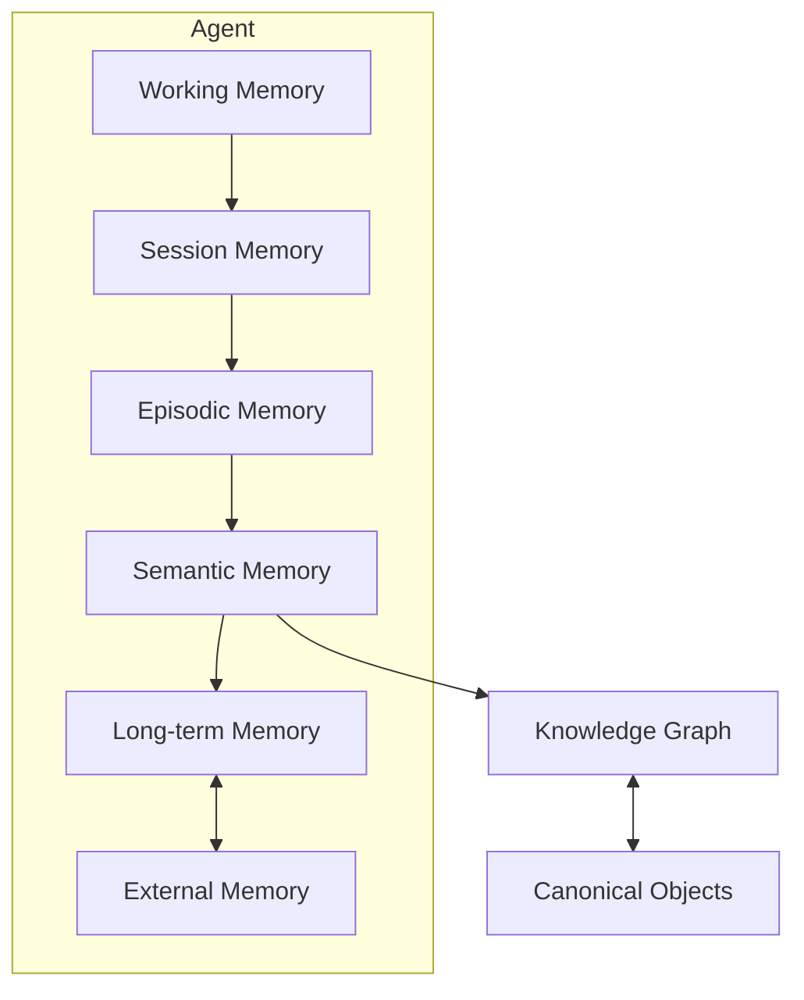
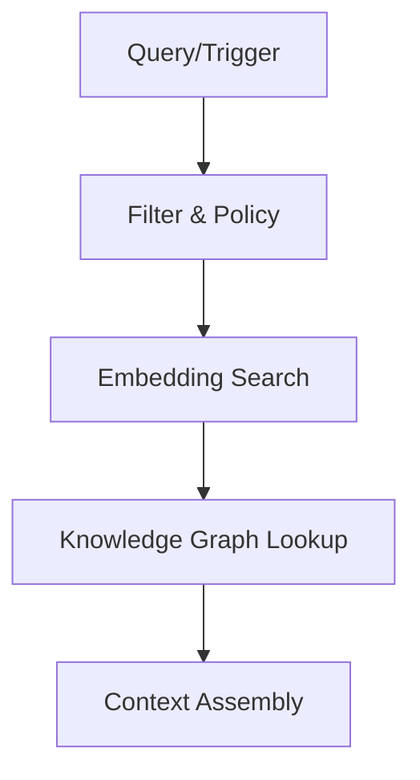

# RFC-043 Memory & Knowledge Graph

**Status:** Draft  
**Authors:** Tiroq + ChatGPT  
**Last Updated:** 2026-06-28

---

## 1. Summary

This RFC defines the architecture for Memory and Knowledge Graph within the Praxis system. It specifies the philosophy, structure, retrieval, and lifecycle of memory and knowledge, and how these concepts interact with canonical objects, agents, context assembly, and storage. The RFC provides a comprehensive model for integrating memory and knowledge in a way that is robust, privacy-aware, and extensible.

## 2. Relationship to Previous RFCs

- **Depends on:** RFC-000 through RFC-042  
- **Notable Dependencies:**  
  - RFC-033 (Storage and Stores)  
  - RFC-040 (Agent Architecture)  
  - RFC-041 (Context Assembly)  
  - RFC-042 (Canonical Objects)

## 3. Goals

- Define a clear philosophy and architecture for memory and knowledge in Praxis.
- Enable agents to store, retrieve, and reason over experience and knowledge.
- Support layered memory, knowledge graphs, and context assembly.
- Ensure privacy, observability, and policy-based retrieval.
- Integrate with canonical objects and external knowledge sources.

## 4. Non-Goals

- Does **not** prescribe specific ML models for embedding or retrieval.
- Does **not** define user interface details.
- Does **not** address distributed storage beyond referencing RFC-033.
- Does **not** establish a global truth; canonical objects are referenced, not owned.

## 5. Memory Philosophy

Memory is the persistent or transient record of experience, perception, and interaction within the system. Memory is agent-scoped, layered, and policy-bound. It is reconstructable, non-authoritative, and subject to forgetting and consolidation.

## 6. Knowledge Philosophy

Knowledge is the structured, interrelated set of facts, concepts, and relationships derived from memory, external sources, or canonical objects. Knowledge is organized as a graph, supports reasoning, and is validated at multiple levels. It is distinct from raw memory and from canonical truth.

## 7. Memory vs Knowledge vs Context

| Aspect      | Memory                | Knowledge Graph        | Context                  |
|-------------|----------------------|-----------------------|--------------------------|
| Purpose     | Record experience    | Structure meaning     | Supply prompt/operation  |
| Persistence | Layered, variable    | Persistent, versioned | Ephemeral, assembled     |
| Authority   | Non-canonical        | Non-canonical         | Not authoritative        |
| Structure   | Chronological, loose | Graph, typed entities | Sequence, rich text      |
| Retrieval   | Policy-bound         | Query/graph search    | Assembled per request    |
| Scope       | Agent, session, ext. | Agent, global, ext.   | Agent, operation         |

## 8. Memory Architecture

## 9. Memory Layers

| Layer           | Scope         | Volatility | Purpose                             | Example                          |
|-----------------|--------------|------------|-------------------------------------|----------------------------------|
| Working         | Agent        | Volatile   | Immediate, short-term state         | Current turn, recent utterance   |
| Session         | Agent        | Semi-stable| Session state/history               | Ongoing conversation             |
| Episodic        | Agent        | Stable     | Discrete event memory               | Meeting, user interaction        |
| Semantic        | Agent        | Stable     | Abstracted, structured meaning      | "User likes cats"                |
| Long-term       | Agent/global | Durable    | Persistent, consolidated knowledge  | "User is a premium subscriber"   |
| External        | External     | Variable   | Linked stores, external systems     | Calendar, CRM, web sources       |

## 10. Knowledge Graph Architecture

- **Entities:** Typed nodes (Person, Place, Event, Concept, CanonicalObject, etc.)
- **Relationships:** Typed edges (knows, participated_in, derived_from, etc.)
- **Attributes:** Key-value pairs on nodes/edges.
- **References:** Canonical objects, external IDs, provenance.
- **Versioning:** Changes tracked over time.

## 11. Canonical Knowledge vs Derived Knowledge

| Aspect              | Canonical Knowledge         | Derived Knowledge           |
|---------------------|----------------------------|----------------------------|
| Source              | Canonical Objects          | Memory, observation, ext.   |
| Authority           | Authoritative              | Non-authoritative          |
| Mutability          | Versioned, controlled      | Mutable, agent-specific    |
| Reference           | Knowledge Graph references | May reference canonical    |
| Example             | Product spec, law          | User preference, summary   |

## 12. Memory Identity

- Each memory and knowledge entity has a stable, unique identifier.
- Provenance is tracked (agent, time, source).
- Relationships are identified and versioned.

## 13. Memory Lifecycle

1. **Capture:** Experience or data ingested.
2. **Index:** Embedded/vectorized and indexed.
3. **Store:** Written to appropriate memory layer.
4. **Retrieve:** Fetched via policy and search.
5. **Assemble:** Used in context or knowledge graph.
6. **Consolidate:** Summarized or abstracted.
7. **Expire/Forget:** Removed per policy or decay.

## 14. Knowledge Entity Model

- **EntityID:** Unique identifier.
- **Type:** (Person, Place, Event, Concept, CanonicalObject, etc.)
- **Attributes:** Arbitrary key-value pairs.
- **References:** Canonical object IDs, external links.
- **Provenance:** Source, agent, timestamp.

## 15. Relationship Model

| Type          | Description                         | Example                        |
|---------------|-------------------------------------|--------------------------------|
| knows         | Social connection                   | Alice knows Bob                |
| participated_in| Event participation                | Bob participated in Meeting123 |
| derived_from  | Derived knowledge                   | Summary derived from Event456  |
| references    | Points to canonical object          | Note references Product789     |
| contradicts   | Conflicting information             | Statement contradicts Policy12 |

## 16. Retrieval Pipeline

| Stage          | Purpose                          |
|----------------|----------------------------------|
| Filter & Policy| Scope, privacy, relevance        |
| Embedding Search| Semantic similarity             |
| KG Lookup      | Entity/relation search           |
| Context Assembly| Compose for agent use           |

## 17. Context Assembly

- Retrieves relevant memory and knowledge per operation.
- Assembles ephemeral context for agent actions or prompts.
- References, but does not persist, assembled context.

## 18. Memory Consolidation

- Summarizes or abstracts episodic/semantic memory.
- Promotes to long-term memory or knowledge graph.
- May involve human or agent validation.

## 19. Forgetting and Expiration

- Memory may decay, expire, or be deleted per policy or privacy requirements.
- Supports user/agent-initiated forgetting.
- Expiration tracked and observable.

## 20. Embeddings and Vector Store

- Memories and knowledge entities are embedded for similarity search.
- Vector store is rebuildable from raw data.
- Embeddings are not authoritative; can be updated or replaced.

## 21. Search Integration

- Supports hybrid search: keyword, semantic (vector), graph traversal.
- Integrates with RFC-033 stores and external indices.
- Retrieval is policy-bound and observable.

## 22. Agent Interaction Rules

- Agents may read/write memory per capability and policy.
- Agents must not overwrite canonical objects.
- Knowledge graph is append-only except for corrections/expiration.
- All agent actions are auditable.

## 23. Human Feedback Integration

- Human users may annotate, validate, or correct memory/knowledge.
- Feedback is tracked with provenance.
- Supports trust and quality improvement.

## 24. Knowledge Validation

| Level         | Description                       | Example                      |
|---------------|-----------------------------------|------------------------------|
| Unvalidated   | Not reviewed                      | Auto-extracted fact          |
| Agent-validated| Checked by agent                 | Summarized meeting notes     |
| Human-validated| Checked by human                 | User confirms preference     |
| Canonical     | From canonical object             | Law, product spec            |

## 25. Memory Privacy

- Memory is subject to privacy policies per agent, user, and organization.
- Retrieval and storage are audited.
- Sensitive data is protected and may be redacted or deleted.

## 26. Memory Observability

- All memory and knowledge operations are observable and auditable.
- Provenance and access logs are maintained.
- Supports debugging, transparency, and compliance.

## 27. Storage Mapping

- Each memory layer and knowledge graph is mapped to RFC-033 stores.
- External memory integrates via adapters.
- Canonical objects are referenced, not stored in memory.

## 28. Memory Invariants

- **Memory never owns canonical truth.**
- **Knowledge Graph references Canonical Objects.**
- **Context is assembled, never persisted as truth.**
- **Embeddings are rebuildable.**
- **Memory retrieval is policy-bound.**

## 29. Architectural Consequences

- Memory and knowledge are always reconstructable.
- Canonical objects are source of truth; memory is referential.
- Agents operate within strict retrieval and privacy policies.
- System supports explainability, audit, and compliance.

## 30. Dependencies

- RFC-000 through RFC-042
- RFC-033 (Stores)
- RFC-040 (Agents)
- RFC-041 (Context)
- RFC-042 (Canonical Objects)

## 31. Acceptance Criteria

- Memory and knowledge graph layers implemented per architecture.
- Retrieval pipeline supports policy, embedding, and graph search.
- Memory and knowledge entities have stable IDs and provenance.
- Canonical objects are referenced, not owned.
- Context assembly is ephemeral and auditable.
- Privacy and observability features are present.

## 32. Decision Log

- **2026-06-28:** Initial draft. Adopted layered memory and knowledge graph; canonical objects referenced, not owned.

---

> **Memory preserves experience. Knowledge preserves meaning. Canonical objects preserve truth.**