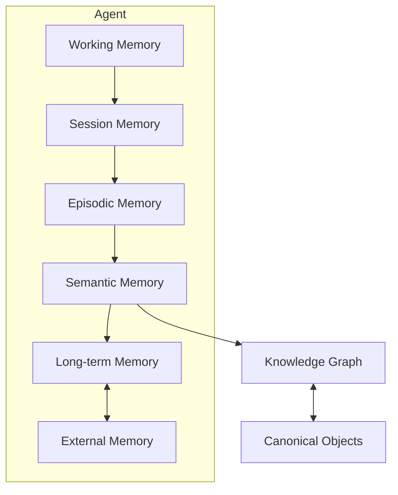
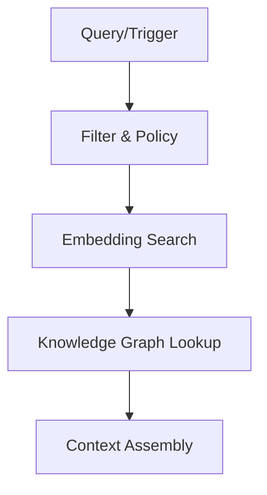

# RFC-043 Memory & Knowledge Graph

**Status:** Draft  
**Authors:** Tiroq + ChatGPT  
**Last Updated:** 2026-06-28

---

## 1. Summary

This RFC defines the architecture for Memory and Knowledge Graph within the Praxis system. It specifies the philosophy, structure, retrieval, and lifecycle of memory and knowledge, and how these concepts interact with canonical objects, agents, context assembly, and storage. The RFC provides a comprehensive model for integrating memory and knowledge in a way that is robust, privacy-aware, and extensible.

## 2. Relationship to Previous RFCs

This RFC depends on:

- RFC-000 through RFC-042
- RFC-033 Storage Model
- RFC-040 Agent Architecture
- RFC-041 LLM Routing
- RFC-042 Prompt Versioning

RFC-033 defines storage ownership for Memory, Vector Store, Search Index, Knowledge Graph Store, Blob Store, and Cache.

RFC-040 defines how Agents interact with memory and knowledge through explicit policies.

RFC-041 defines model routing and states that inference routing does not own memory.

RFC-042 defines how prompts receive context while keeping prompt templates separate from memory retrieval.

## 3. Goals

- Define a clear philosophy and architecture for memory and knowledge in Praxis.
- Enable agents to store, retrieve, and reason over experience and knowledge.
- Support layered memory, knowledge graphs, and context assembly.
- Ensure privacy, observability, and policy-based retrieval.
- Integrate with canonical objects and external knowledge sources.

## 4. Non-Goals

- Does **not** prescribe specific ML models for embedding or retrieval.
- Does **not** define user interface details.
- Does **not** address distributed storage beyond referencing RFC-033.
- Does **not** establish a global truth; canonical objects are referenced, not owned.

## 5. Memory Philosophy

Memory is the persistent or transient record of experience, perception, and interaction within the system. Memory is agent-scoped, layered, and policy-bound. It is reconstructable, non-authoritative, and subject to forgetting and consolidation.

## 6. Knowledge Philosophy

Knowledge is the structured, interrelated set of facts, concepts, and relationships derived from memory, external sources, or canonical objects. Knowledge is organized as a graph, supports reasoning, and is validated at multiple levels. It is distinct from raw memory and from canonical truth.

## 7. Memory vs Knowledge vs Context

| Aspect      | Memory                | Knowledge Graph        | Context                  |
|-------------|----------------------|-----------------------|--------------------------|
| Purpose     | Record experience    | Structure meaning     | Supply prompt/operation  |
| Persistence | Layered, variable    | Persistent, versioned | Ephemeral, assembled     |
| Authority   | Non-canonical        | Non-canonical         | Not authoritative        |
| Structure   | Chronological, loose | Graph, typed entities | Sequence, rich text      |
| Retrieval   | Policy-bound         | Query/graph search    | Assembled per request    |
| Scope       | Agent, session, ext. | Agent, global, ext.   | Agent, operation         |

## 8. Memory Architecture



## 9. Memory Layers

| Layer           | Scope         | Volatility | Purpose                             | Example                          |
|-----------------|--------------|------------|-------------------------------------|----------------------------------|
| Working         | Agent        | Volatile   | Immediate, short-term state         | Current turn, recent utterance   |
| Session         | Agent        | Semi-stable| Session state/history               | Ongoing conversation             |
| Episodic        | Agent        | Stable     | Discrete event memory               | Meeting, user interaction        |
| Semantic        | Agent        | Stable     | Abstracted, structured meaning      | "User likes cats"                |
| Long-term       | Agent/global | Durable    | Persistent, consolidated knowledge  | "User is a premium subscriber"   |
| External        | External     | Variable   | Linked stores, external systems     | Calendar, CRM, web sources       |

## 9.1 Memory Taxonomy

Praxis distinguishes memory layers from memory categories.

Layers describe where memory lives.

Taxonomy describes what memory represents.

| Memory Type | Purpose | Lifetime | Example |
|-------------|---------|----------|---------|
| Working | Current reasoning state | Seconds | Current planning |
| Session | Conversation state | Minutes to hours | Active chat |
| Episodic | Individual experiences | Persistent | Meeting outcome |
| Semantic | Learned facts | Persistent | User prefers Go |
| Procedural | Learned workflows | Persistent | Deployment procedure |
| Organizational | Shared team knowledge | Persistent | Engineering standards |
| Shared Workspace | Shared project knowledge | Persistent | RFC discussions |
| External | Referenced external systems | External | GitHub, Calendar |

Memory layers and memory taxonomy are orthogonal concepts.

## 9.2 Memory Confidence Model

Every memory carries quality metadata.

| Attribute | Meaning |
|-----------|---------|
| Confidence | Estimated correctness |
| Freshness | Time relevance |
| Importance | Business significance |
| Stability | Expected change frequency |
| Provenance | Origin quality |

Confidence changes over time.

Human confirmation increases confidence.

Contradictions reduce confidence.

## 10. Knowledge Graph Architecture

- **Entities:** Typed nodes (Person, Place, Event, Concept, CanonicalObject, etc.)
- **Relationships:** Typed edges (knows, participated_in, derived_from, etc.)
- **Attributes:** Key-value pairs on nodes/edges.
- **References:** Canonical objects, external IDs, provenance.
- **Versioning:** Changes tracked over time.

## 11. Canonical Knowledge vs Derived Knowledge

| Aspect              | Canonical Knowledge         | Derived Knowledge           |
|---------------------|----------------------------|----------------------------|
| Source              | Canonical Objects          | Memory, observation, ext.   |
| Authority           | Authoritative              | Non-authoritative          |
| Mutability          | Versioned, controlled      | Mutable, agent-specific    |
| Reference           | Knowledge Graph references | May reference canonical    |
| Example             | Product spec, law          | User preference, summary   |

## 11.1 Temporal Knowledge Graph

Knowledge evolves over time.

The Knowledge Graph therefore stores temporal validity for relationships and derived facts.

Every temporal relationship may include:

- valid_from
- valid_until
- observed_at
- superseded_by

No relationship is silently overwritten.

Historical graph traversal must remain possible.

## 11.2 Evidence Graph

Derived knowledge must reference evidence.

Evidence sources include:

- Events
- Artifacts
- Reviews
- Decisions
- Human confirmations
- External systems

Every derived node or relationship should maintain:

- provenance
- evidence references
- confidence
- extraction method

Knowledge without provenance should be treated as low confidence.

## 12. Memory Identity

- Each memory and knowledge entity has a stable, unique identifier.
- Provenance is tracked (agent, time, source).
- Relationships are identified and versioned.

## 13. Memory Lifecycle

1. **Capture:** Experience or data ingested.
2. **Index:** Embedded/vectorized and indexed.
3. **Store:** Written to appropriate memory layer.
4. **Retrieve:** Fetched via policy and search.
5. **Assemble:** Used in context or knowledge graph.
6. **Consolidate:** Summarized or abstracted.
7. **Expire/Forget:** Removed per policy or decay.

## 14. Knowledge Entity Model

- **EntityID:** Unique identifier.
- **Type:** (Person, Place, Event, Concept, CanonicalObject, etc.)
- **Attributes:** Arbitrary key-value pairs.
- **References:** Canonical object IDs, external links.
- **Provenance:** Source, agent, timestamp.

## 15. Relationship Model

| Type          | Description                         | Example                        |
|---------------|-------------------------------------|--------------------------------|
| knows         | Social connection                   | Alice knows Bob                |
| participated_in| Event participation                | Bob participated in Meeting123 |
| derived_from  | Derived knowledge                   | Summary derived from Event456  |
| references    | Points to canonical object          | Note references Product789     |
| contradicts   | Conflicting information             | Statement contradicts Policy12 |

## 15.1 Relationship Categories

Relationships belong to explicit categories.

| Category | Examples |
|----------|----------|
| Structural | parent_of, contains |
| Temporal | before, after |
| Semantic | similar_to |
| Ownership | owned_by |
| Dependency | depends_on |
| Causal | caused_by |
| Evidence | supported_by |
| Workflow | produced_by |

Different categories support different graph traversal strategies.

## 16. Retrieval Pipeline



| Stage          | Purpose                          |
|----------------|----------------------------------|
| Filter & Policy| Scope, privacy, relevance        |
| Embedding Search| Semantic similarity             |
| KG Lookup      | Entity/relation search           |
| Context Assembly| Compose for agent use           |

## 16.1 Retrieval Ranking

Retrieval combines multiple signals.

Ranking considers:

- semantic similarity
- confidence
- freshness
- importance
- personalization
- graph proximity
- source trust

No single metric should dominate retrieval quality.

## 16.2 Context Budget

Context assembly operates under an explicit budget.

Selection considers:

- relevance
- confidence
- freshness
- diversity
- token budget
- redundancy elimination
- privacy constraints

Large memories are summarized before inclusion.

## 17. Context Assembly

- Retrieves relevant memory and knowledge per operation.
- Assembles ephemeral context for agent actions or prompts.
- References, but does not persist, assembled context.

## 17.1 Context Assembly Rules

Context assembly must remain ephemeral.

The assembled context may be logged only according to privacy and retention policy.

Context assembly must preserve references to source memories, knowledge nodes, Events, Artifacts, and Canonical Objects.

Agents should be able to explain why a memory was included in context.

## 18. Memory Consolidation

- Summarizes or abstracts episodic/semantic memory.
- Promotes to long-term memory or knowledge graph.
- May involve human or agent validation.

## 18.1 Memory Consolidation Pipeline

Memory consolidation follows a deterministic pipeline.

```text
Capture
↓
Normalize
↓
Extract Entities
↓
Link Graph
↓
Calculate Confidence
↓
Merge
↓
Store
↓
Generate Embeddings
↓
Update Knowledge Graph
```

Consolidation transforms experiences into reusable knowledge.

Consolidation never destroys original Events or Artifacts.

## 19. Forgetting and Expiration

- Memory may decay, expire, or be deleted per policy or privacy requirements.
- Supports user/agent-initiated forgetting.
- Expiration tracked and observable.

## 19.1 Knowledge Decay

Not all memories remain equally valuable.

Importance may decay according to policy.

Decay may be reduced by:

- repeated retrieval
- reuse
- human confirmation
- references from Decisions
- references from Actions

Canonical Objects never decay.

## 20. Embeddings and Vector Store

- Memories and knowledge entities are embedded for similarity search.
- Vector store is rebuildable from raw data.
- Embeddings are not authoritative; can be updated or replaced.

## 21. Search Integration

- Supports hybrid search: keyword, semantic (vector), graph traversal.
- Integrates with RFC-033 stores and external indices.
- Retrieval is policy-bound and observable.

## 22. Agent Interaction Rules

- Agents may read/write memory per capability and policy.
- Agents must not overwrite canonical objects.
- Knowledge graph is append-only except for corrections/expiration.
- All agent actions are auditable.

## 22.1 Shared Memory

Praxis supports multiple memory visibility scopes.

| Scope | Visibility |
|-------|------------|
| Personal | Individual user |
| Family | Family group |
| Workspace | Project or team |
| Organization | Company or organization |
| Public | Global or published knowledge |

Memory cannot automatically cross scopes.

Promotion between scopes is policy-controlled.

## 23. Human Feedback Integration

- Human users may annotate, validate, or correct memory/knowledge.
- Feedback is tracked with provenance.
- Supports trust and quality improvement.

## 23.1 Learning Feedback Loop

Learning is event-driven.

```text
Action
↓
Outcome
↓
Review
↓
Decision
↓
Learning Signal
↓
Memory
↓
Knowledge Graph
```

Nothing is silently learned.

Learning Signals must reference the Events, Actions, Decisions, or human feedback that produced them.

## 24. Knowledge Validation

| Level         | Description                       | Example                      |
|---------------|-----------------------------------|------------------------------|
| Unvalidated   | Not reviewed                      | Auto-extracted fact          |
| Agent-validated| Checked by agent                 | Summarized meeting notes     |
| Human-validated| Checked by human                 | User confirms preference     |
| Canonical     | From canonical object             | Law, product spec            |

## 24.1 Knowledge Validation Pipeline

Knowledge validation is progressive.

| Stage | Meaning |
|-------|---------|
| Observed | Captured from raw event or external source |
| Extracted | Parsed or inferred by a model or rule |
| Correlated | Linked with other memories or graph nodes |
| Reviewed | Checked by an agent or reviewer |
| Human Approved | Confirmed by human |
| Canonical | Backed by Canonical Object or authoritative source |

Validation level must be visible to agents and retrieval policies.

## 24.2 Contradiction Resolution

Conflicting knowledge is preserved.

Praxis stores:

- competing facts
- provenance
- timestamps
- confidence
- validation level

Resolution may be automatic, review-driven, or human-approved.

Contradictions must not be silently overwritten.

## 25. Memory Privacy

- Memory is subject to privacy policies per agent, user, and organization.
- Retrieval and storage are audited.
- Sensitive data is protected and may be redacted or deleted.

## 25.1 Privacy Zones

Memory belongs to explicit privacy zones.

| Zone | Description |
|------|-------------|
| Personal | Private to one user |
| Family | Shared with trusted family context |
| Workspace | Shared within a project or workspace |
| Organization | Shared inside organization boundary |
| Public | Safe for publication or external use |

Policies prevent unauthorized promotion across zones.

Retrieval must respect privacy zones.

## 26. Memory Observability

- All memory and knowledge operations are observable and auditable.
- Provenance and access logs are maintained.
- Supports debugging, transparency, and compliance.

## 26.1 Memory Benchmarking

Memory quality should be measurable.

Suggested metrics:

- retrieval precision
- retrieval recall
- confidence calibration
- stale memory ratio
- contradiction ratio
- graph completeness
- hallucination rate
- privacy violation rate
- human correction rate

## 27. Storage Mapping

- Each memory layer and knowledge graph is mapped to RFC-033 stores.
- External memory integrates via adapters.
- Canonical objects are referenced, not stored in memory.

## 27.1 Memory Decision Records

Major memory operations should generate Memory Decision Records.

Examples:

- Consolidation
- Merge
- Split
- Promotion
- Forgetting
- Human approval
- Contradiction resolution

A Memory Decision Record should include:

- Decision ID
- Operation type
- Actor
- Source memories
- Target memories or graph nodes
- Reason
- Timestamp
- Correlation ID

## 28. Memory Invariants

- **Memory never owns canonical truth.**
- **Knowledge Graph references Canonical Objects.**
- **Context is assembled, never persisted as truth.**
- **Embeddings are rebuildable.**
- **Memory retrieval is policy-bound.**
- **Knowledge never exists without provenance.**
- **Derived knowledge references evidence.**
- **Contradictions are preserved.**
- **Memory confidence is observable.**
- **Relationships are strongly typed.**
- **Memory scopes never leak automatically.**
- **Consolidation never destroys original Events.**
- **Knowledge Graph never owns Canonical Objects.**
- **Retrieval is explainable.**

## 29. Architectural Consequences

- Memory and knowledge are always reconstructable.
- Canonical objects are source of truth; memory is referential.
- Agents operate within strict retrieval and privacy policies.
- System supports explainability, audit, and compliance.
- Temporal graph traversal remains possible.
- Evidence-backed knowledge improves trust.
- Contradictions can be analyzed instead of hidden.
- Shared memory can scale across personal, workspace, and organization scopes.
- Memory quality can be benchmarked and improved over time.

## 30. Dependencies

Depends on:

- RFC-000 through RFC-042

Required before:

- RFC-050 Space Model
- RFC-053 Product Space
- RFC-054 Freelance Space
- RFC-055 Education Space
- RFC-060 Testing Strategy
- RFC-061 Verification Scripts
- RFC-062 Benchmarking

## 31. Acceptance Criteria

- Memory and knowledge graph layers implemented per architecture.
- Retrieval pipeline supports policy, embedding, and graph search.
- Memory and knowledge entities have stable IDs and provenance.
- Canonical objects are referenced, not owned.
- Context assembly is ephemeral and auditable.
- Privacy and observability features are present.
- Temporal relationships are represented.
- Evidence references are required for derived knowledge.
- Retrieval ranking is defined.
- Context budgets are explicit.
- Memory consolidation is traceable.
- Contradiction handling is defined.
- Privacy zones are respected.
- Memory Decision Records are defined.
- Memory quality can be benchmarked.

## 32. Decision Log

| Date | Decision | Author |
|------|----------|--------|
| 2026-06-28 | Initial draft. Adopted layered memory and knowledge graph; Canonical Objects referenced, not owned. | Tiroq + ChatGPT |
| 2026-06-28 | Expanded RFC with temporal graph, evidence graph, confidence model, retrieval ranking, consolidation, contradiction handling, privacy zones, and benchmarking. | Tiroq + ChatGPT |

---

> **Memory preserves experience. Knowledge preserves meaning. Canonical objects preserve truth.**