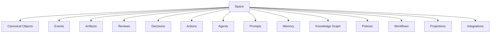
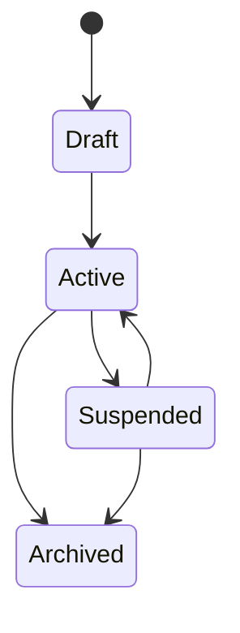

# RFC-050 Space Model

**Status:** Draft  
**Authors:** Tiroq + ChatGPT  
**Last Updated:** 2026-06-28

---

## 1. Summary

This RFC defines the **Space** as the primary bounded context of Praxis.

A Space is an isolated operational domain where Canonical Objects, Events, Artifacts, Reviews, Decisions, Agents, Prompts, Memory, Knowledge, Policies, Workflows, Projections, and Integrations are scoped together under a coherent purpose.

Praxis should not implement Personal, Work, Product, Freelance, Education, and Finance as unrelated domain architectures. Instead, each of them is a specialization of the same Space model.

A Space answers the question:

> Where does this object, memory, decision, agent, policy, or workflow belong?

Every runtime object has exactly one primary Space unless a later RFC explicitly defines shared or replicated ownership rules.

---

## 2. Relationship to Previous RFCs

This RFC depends on:

- RFC-000 Vision
- RFC-001 Principles
- RFC-002 Terminology
- RFC-003 Concept Model
- RFC-010 Capability Map
- RFC-011 Domain Model
- RFC-012 Artifact Model
- RFC-013 Event Model
- RFC-014 Identity & Representation Model
- RFC-015 Object Lifecycle Model
- RFC-020 Review System
- RFC-021 Decision Model
- RFC-022 State Machine
- RFC-030 System Architecture
- RFC-031 Service Contracts
- RFC-032 Data Flow
- RFC-033 Storage Model
- RFC-040 Agent Architecture
- RFC-041 LLM Routing
- RFC-042 Prompt Versioning
- RFC-043 Memory & Knowledge Graph

This RFC is required before:

- RFC-051 Personal Space
- RFC-052 Work Space
- RFC-053 Product Space
- RFC-054 Freelance Space
- RFC-055 Education Space
- RFC-056 Finance Space
- RFC-060 Testing Strategy
- RFC-061 Verification Scripts
- RFC-062 Benchmarking

RFC-003 defines the conceptual model. This RFC defines where concepts are scoped.

RFC-014 defines identity. This RFC defines Space identity and Space ownership boundaries.

RFC-030 defines runtime architecture. This RFC defines domain-level runtime boundaries.

RFC-040 defines Agents. This RFC defines how Agents are scoped by Space.

RFC-043 defines Memory and Knowledge. This RFC defines how Memory and Knowledge are isolated or shared across Spaces.

---

## 3. Goals

The goals of this RFC are to:

- Define Space as the primary bounded context in Praxis.
- Provide a common model for all domain-specific spaces.
- Avoid duplicated domain architectures.
- Scope Canonical Objects, Agents, Prompts, Memory, Knowledge, Reviews, Decisions, and Policies.
- Define cross-space communication and references.
- Define isolation, sharing, and visibility rules.
- Support personal, work, product, freelance, education, and finance use cases.
- Enable future multi-user and multi-tenant operation.
- Provide the foundation for RFC-051 through RFC-056.

---

## 4. Non-Goals

This RFC does not:

- Define detailed workflows for each Space type.
- Define UI screens.
- Define database schemas.
- Define concrete permission implementation.
- Define all domain-specific object types.
- Define all automation rules.
- Define integration-specific behavior.

Those concerns belong to later domain RFCs and implementation documents.

---

## 5. Space Philosophy

Praxis is not only a task manager, CRM, agent runtime, or knowledge system.

Praxis is an operating system for intentional activity.

Intentional activity always happens inside a context.

That context is a Space.

A Space provides:

- boundary;
- purpose;
- ownership;
- memory;
- policies;
- agents;
- workflows;
- projections;
- decisions;
- knowledge.

Without Spaces, all objects collapse into one global undifferentiated system.

With Spaces, Praxis can model personal life, work, products, freelance opportunities, education, and finance using the same architecture while preserving separation.

---

## 6. Why Space Exists

Space exists to prevent architectural fragmentation.

Without Space, Praxis would need separate architectures for:

- personal tasks;
- work projects;
- freelance leads;
- product ideas;
- learning plans;
- financial goals;
- family activities.

That would create duplicated models, duplicated agents, duplicated workflows, and duplicated policies.

With Space, Praxis uses one universal model:

```text
Space
    contains Objects
    scopes Agents
    scopes Memory
    scopes Prompts
    scopes Policies
    scopes Reviews
    scopes Decisions
    exposes Projections
```

Domain-specific behavior becomes configuration and specialization rather than a separate architecture.

---

## 7. Space Definition

A **Space** is a bounded operational context with a stable identity, purpose, owner, policies, memory, agents, knowledge, and runtime configuration.

A Space may represent:

- a personal life area;
- a work environment;
- a product initiative;
- a freelance business pipeline;
- an education path;
- a finance planning area;
- a family domain;
- a temporary project;
- a client engagement.

A Space is not merely a folder or tag.

A Space is an architectural boundary.

---

## 8. Space vs Related Concepts

| Concept | Difference from Space |
|--------|------------------------|
| Project | A project is a goal-oriented initiative. A Space may contain many projects. |
| Tag | A tag is a label. A Space is an ownership boundary. |
| Folder | A folder groups files. A Space scopes runtime behavior. |
| Domain | A domain describes subject matter. A Space operationalizes it. |
| Workflow | A workflow defines process. A Space may contain many workflows. |
| Agent | An Agent acts inside a Space. |
| Memory | Memory is scoped by Space. |
| View | A View projects Space state. |
| Workspace | A workspace may be a UI representation of one or more Spaces. |

---

## 9. High-Level Architecture



A Space is not a single service.

A Space is a cross-service domain boundary applied consistently across runtime services.

---

## 10. Space Identity

Every Space has stable identity.

Space identity is separate from:

- display name;
- current owner name;
- UI location;
- integration provider;
- storage partition;
- active workflow;
- agent configuration.

### Space Identity Fields

| Field | Meaning |
|------|---------|
| Space ID | Stable unique identifier. |
| Space Key | Human-readable stable key where useful. |
| Name | Display name. |
| Type | Personal, Work, Product, Freelance, Education, Finance, etc. |
| Purpose | Why the Space exists. |
| Owner | User, team, organization, or system. |
| Visibility | Private, Shared, Organization, Public. |
| Parent Space ID | Optional parent Space. |
| Status | Draft, Active, Suspended, Archived. |
| Created At | Creation timestamp. |
| Updated At | Last metadata update timestamp. |

---

## 11. Space Ownership Model

A Space owns the domain boundary, not all underlying infrastructure.

A Space owns:

- Space configuration;
- Space policies;
- Space-scoped agents;
- Space-scoped prompt references;
- Space-scoped memory;
- Space-scoped knowledge graph partitions;
- Space-scoped workflows;
- Space projections;
- Space default review rules;
- Space default decision rules.

A Space does not own:

- model providers;
- database engines;
- global runtime services;
- provider credentials outside policy references;
- canonical platform infrastructure;
- unrelated Spaces.

---

## 12. Space Runtime Mapping

A Space is implemented across multiple runtime services.

| Runtime Service | Space-Scoped Responsibility |
|----------------|-----------------------------|
| Canonical Domain Service | Stores Space-scoped Canonical Objects. |
| Event Store | Records Space-scoped Events. |
| Review Service | Produces Space-scoped Reviews and Review Packages. |
| Decision Service | Commits Space-scoped Decisions. |
| Action Service | Executes Space-scoped Action Requests. |
| Agent Runtime | Invokes Space-scoped Agents. |
| Prompt Registry | Resolves Space-scoped Prompt Versions. |
| Memory Service | Retrieves Space-scoped Memory. |
| Knowledge Service | Maintains Space-scoped Knowledge Graph. |
| Projection Service | Builds Space views and dashboards. |
| Policy Service | Evaluates Space-scoped Policies. |
| Integration Service | Synchronizes Space-scoped external systems. |

Space is therefore a logical boundary enforced by all relevant services.

---

## 13. Space Lifecycle



### Lifecycle States

| State | Meaning |
|------|---------|
| Draft | Space exists but is not fully operational. |
| Active | Space is available for normal use. |
| Suspended | Space is temporarily disabled or paused. |
| Archived | Space is retained for history but not active. |

Space archival does not delete historical Events, Decisions, Reviews, or Memory unless retention policy allows it.

---

## 14. Space Types

Praxis defines baseline Space types.

| Space Type | Purpose |
|-----------|---------|
| Personal | Personal life, habits, tasks, family coordination, goals. |
| Work | Employment, team work, company projects, operational tasks. |
| Product | Product ideas, MVPs, experiments, roadmap, launch planning. |
| Freelance | Leads, proposals, clients, contracts, delivery, reputation. |
| Education | Learning plans, courses, skills, children education, research. |
| Finance | Income, expenses, assets, goals, risk, planning. |

Space types provide defaults, not separate architectures.

---

## 15. Space Templates

A Space Template defines default configuration for a Space type.

A template may include:

- default agents;
- default prompts;
- default policies;
- default object types;
- default workflows;
- default projections;
- default memory policy;
- default review policy;
- default decision policy;
- default integrations;
- default dashboard layout.

Templates accelerate setup but do not override Space identity.

---

## 16. Space Capabilities

Spaces enable capabilities from RFC-010 in scoped form.

| Capability | Space-Scoped Meaning |
|-----------|----------------------|
| Capture | Capture information into this Space. |
| Understand | Interpret events and artifacts within this Space. |
| Organize | Classify and structure Space objects. |
| Review | Evaluate Space objects and artifacts. |
| Decide | Commit decisions inside this Space. |
| Act | Execute actions for this Space. |
| Learn | Improve Space memory and policies. |
| Search | Search within Space boundary. |
| Project | Create Space projections and dashboards. |
| Integrate | Connect external systems to this Space. |

Capabilities must respect Space boundaries.

---

## 17. Space Policies

Policies define behavior inside a Space.

Examples:

- privacy policy;
- memory retention policy;
- review policy;
- decision policy;
- action approval policy;
- LLM routing policy;
- prompt policy;
- agent permission policy;
- integration policy;
- notification policy;
- cross-space sharing policy.

Policies are inherited from defaults and may be overridden by Space configuration where allowed.

---

## 18. Space-Scoped Canonical Objects

Canonical Objects belong to one primary Space.

A Canonical Object may be referenced from another Space, but primary ownership remains with its owning Space.

Examples:

- a Freelance Lead belongs to Freelance Space;
- a Product Idea belongs to Product Space;
- a child school task belongs to Personal or Education Space;
- a work incident belongs to Work Space.

Cross-space references must be explicit.

---

## 19. Space-Scoped Events

Events carry Space identity.

Every Event associated with a Space should include:

- Space ID;
- Object ID where applicable;
- Actor;
- Correlation ID;
- Causation ID;
- Event type;
- timestamp.

Events may be globally stored but logically scoped by Space.

---

## 20. Space-Scoped Artifacts

Artifacts inherit Space scope from their source object or ingestion context.

Examples:

- proposal draft in Freelance Space;
- meeting summary in Work Space;
- product spec in Product Space;
- learning note in Education Space;
- budget report in Finance Space.

Artifacts may be shared across Spaces only through explicit reference or copy rules.

---

## 21. Space-Scoped Reviews

Reviews evaluate objects or artifacts inside a Space.

Review strategy and review policy may differ by Space.

Examples:

| Space | Review Style |
|------|--------------|
| Personal | Lightweight, optional review. |
| Work | More formal quality and risk review. |
| Product | Architecture, feasibility, market review. |
| Freelance | Fit, value, risk, proposal review. |
| Finance | High-risk review and human approval. |

Reviews do not cross Space boundaries unless explicitly requested.

---

## 22. Space-Scoped Decisions

Decisions are committed inside a Space.

A Decision must reference:

- Space ID;
- Decision Request ID;
- Review Package ID where applicable;
- Actor;
- Decision Policy;
- Decision outcome.

A Decision in one Space may trigger an Action Request in another Space only through cross-space policy.

---

## 23. Space-Scoped Agents

Agents belong to Spaces.

An Agent may be:

- local to one Space;
- shared from a template;
- available globally but invoked under Space policy;
- specialized for a Space type.

Examples:

| Space | Example Agents |
|------|----------------|
| Personal | Life Planner, Reminder Critic, Family Coordinator. |
| Work | Task Reviewer, Architecture Critic, Incident Analyst. |
| Product | MVP Planner, Market Researcher, Launch Critic. |
| Freelance | Lead Classifier, Proposal Agent, Risk Reviewer. |
| Education | Learning Coach, Curriculum Planner. |
| Finance | Budget Analyst, Risk Critic. |

Agents must operate under Space context policy and Space tool policy.

---

## 24. Space-Scoped Prompt Registry

Prompt Versions may be scoped globally, by Space type, or by individual Space.

Prompt resolution order should be explicit.

Example resolution order:

1. Space-specific prompt override.
2. Space-type prompt default.
3. Global prompt default.

Prompt behavior must remain traceable to the resolved Prompt Version.

---

## 25. Space-Scoped Memory

Memory is scoped by Space.

Space memory may include:

- episodic memory;
- semantic memory;
- procedural memory;
- user preferences;
- project history;
- decision history;
- interaction history;
- learned patterns.

Agents may retrieve memory only through Space context policy.

Memory from one Space must not leak into another Space without explicit cross-space permission.

---

## 26. Space-Scoped Knowledge Graph

The Knowledge Graph may be partitioned or filtered by Space.

A Space-scoped graph may include:

- Space objects;
- Space artifacts;
- Space decisions;
- Space actors;
- Space workflows;
- Space external references;
- Space concepts.

Cross-space edges are allowed only when explicitly typed and policy-approved.

---

## 27. Space Projections

A Space exposes projections for users, agents, and integrations.

Examples:

- dashboard;
- timeline;
- kanban board;
- decision history;
- review queue;
- agent activity;
- memory view;
- opportunity pipeline;
- product roadmap;
- finance summary.

Projections are derived and rebuildable.

---

## 28. Cross-Space References

A Cross-Space Reference links an object in one Space to an object in another Space without transferring ownership.

Reference fields:

| Field | Meaning |
|------|---------|
| Reference ID | Stable reference identifier. |
| Source Space ID | Space creating the reference. |
| Target Space ID | Space being referenced. |
| Source Object ID | Referring object. |
| Target Object ID | Referenced object. |
| Relationship Type | depends_on, imports, delegates_to, etc. |
| Policy | Sharing policy applied. |
| Created At | Timestamp. |

Cross-Space References must be auditable.

---

## 29. Cross-Space Communication

Spaces communicate through explicit mechanisms only.

Allowed mechanisms:

- Cross-Space Reference;
- Cross-Space Event;
- copied Artifact;
- delegated Action Request;
- shared Projection;
- approved Memory promotion;
- explicit Integration mapping.

Implicit memory or object sharing is forbidden.

---

## 30. Cross-Space Events

A Cross-Space Event communicates a fact from one Space to another.

Examples:

- Product Space publishes a launch task into Work Space.
- Freelance Space creates income planning event for Finance Space.
- Education Space creates family schedule event for Personal Space.

Cross-Space Events must preserve:

- source Space;
- target Space;
- causation;
- policy approval;
- payload boundaries.

---

## 31. Space Security Model

Space security is based on explicit visibility and permissions.

Security dimensions:

- Space owner;
- actors;
- roles;
- visibility;
- allowed agents;
- allowed tools;
- memory access;
- prompt access;
- integration access;
- cross-space sharing permissions.

A user may have different permissions in different Spaces.

Agents never inherit global access automatically.

---

## 32. Space Hierarchy

Spaces may optionally form a hierarchy.

Examples:

```text
Personal Space
└── Family Space

Work Space
└── Project Space

Product Space
└── MVP Experiment Space

Freelance Space
└── Client Engagement Space
```

Hierarchy does not imply automatic access.

Inheritance must be policy-defined.

---

## 33. Space Inheritance

A child Space may inherit:

- policies;
- agents;
- prompts;
- workflows;
- projections;
- integrations;
- memory rules.

Inheritance must be explicit and overridable only where policy permits.

Child Spaces may restrict inherited access but must not silently expand it.

---

## 34. Space Storage Mapping

Space identity should be present in storage records where relevant.

| Store | Space Mapping |
|------|---------------|
| Event Store | Events include Space ID. |
| Canonical Store | Objects include primary Space ID. |
| Review Store | Reviews reference Space ID. |
| Decision Store | Decisions reference Space ID. |
| Action Store | Action Requests reference Space ID. |
| Projection Store | Projections are built per Space. |
| Search Index | Search may be filtered by Space. |
| Vector Store | Embeddings reference Space scope. |
| Knowledge Graph | Nodes and edges may carry Space scope. |
| Blob Store | Artifacts reference Space ownership. |

---

## 35. Space Observability

Space-level observability should include:

- object count;
- event rate;
- review queue size;
- decision rate;
- action execution rate;
- agent invocation count;
- memory retrieval count;
- prompt version usage;
- integration sync status;
- cross-space sharing events;
- policy denials;
- errors.

Space observability allows users and operators to understand system behavior by domain context.

---

## 36. Space Failure Modes

| Failure | Description |
|--------|-------------|
| Boundary Leak | Memory, object, or prompt leaks across Spaces. |
| Policy Conflict | Space policy contradicts inherited or global policy. |
| Agent Mis-scope | Agent uses wrong Space context. |
| Projection Drift | Space projection becomes stale or inconsistent. |
| Cross-Space Denial | A valid-looking cross-space request is blocked by policy. |
| Integration Misrouting | External data enters wrong Space. |
| Archive Conflict | Archived Space still receives active events. |

Failures must be observable and recoverable where possible.

---

## 37. Space Invariants

The following invariants must hold:

- Every Canonical Object belongs to one primary Space.
- Every Event associated with a Space carries Space identity.
- Every Agent invocation has Space context.
- Every Prompt resolution occurs under Space context.
- Memory is Space-scoped by default.
- Knowledge Graph traversal is Space-policy-bound.
- Reviews are Space-scoped.
- Decisions are Space-scoped.
- Actions are Space-scoped.
- Cross-Space communication is explicit.
- Cross-Space references do not transfer ownership.
- Space hierarchy does not imply automatic access.
- Space boundaries are auditable.
- Archived Spaces do not accept normal active workflows.

---

## 38. Architectural Consequences

The Space model enables:

- one architecture for many life and work domains;
- domain isolation without architecture duplication;
- safer memory retrieval;
- safer agent execution;
- clearer prompt resolution;
- scoped policies;
- scoped projections;
- explicit cross-domain collaboration;
- future team and organization support;
- easier testing and verification.

The cost is that all runtime records must carry or derive Space context where relevant.

---

## 39. Dependencies

Depends on:

- RFC-000 through RFC-043

Required before:

- RFC-051 Personal Space
- RFC-052 Work Space
- RFC-053 Product Space
- RFC-054 Freelance Space
- RFC-055 Education Space
- RFC-056 Finance Space
- RFC-060 Testing Strategy
- RFC-061 Verification Scripts
- RFC-062 Benchmarking

---

## 40. Acceptance Criteria

This RFC can be accepted when:

- Space is defined as the primary bounded context.
- Space identity is defined.
- Space lifecycle is defined.
- Space ownership is defined.
- Space-scoped objects are defined.
- Space-scoped agents are defined.
- Space-scoped memory is defined.
- Space-scoped prompts are defined.
- Space-scoped policies are defined.
- Cross-Space References are defined.
- Cross-Space Events are defined.
- Space hierarchy rules are defined.
- Space security boundaries are defined.
- Space storage mapping is defined.
- Space invariants are agreed upon.

---

## 41. Decision Log

| Date | Decision | Author |
|------|----------|--------|
| 2026-06-28 | Introduced Space as the primary bounded context for Praxis. | Tiroq + ChatGPT |
| 2026-06-28 | Defined domain RFCs 051 through 056 as Space specializations instead of unrelated domain models. | Tiroq + ChatGPT |

---

> **Everything in Praxis exists within a Space.**
