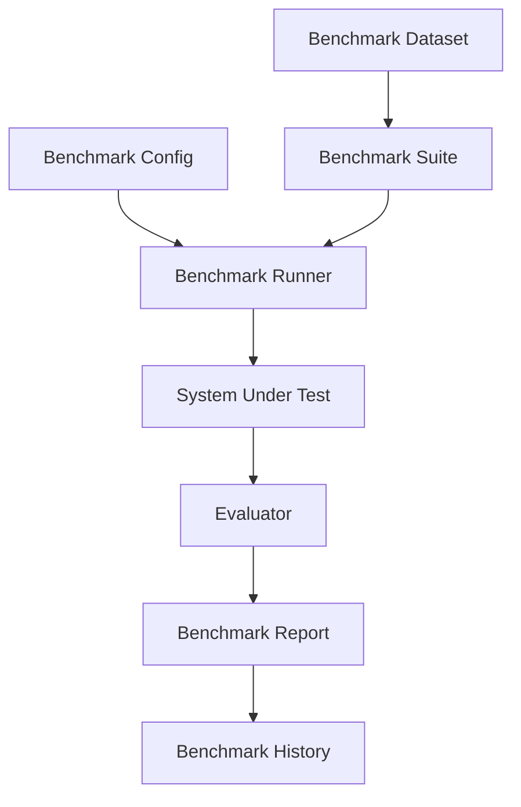

# RFC-062 Benchmarking

**Status:** Draft  
**Authors:** Tiroq + ChatGPT  
**Last Updated:** 2026-06-28

---

## 1. Summary

This RFC defines the benchmarking model for Praxis.

Benchmarking is the systematic measurement of quality, cost, latency, reliability, consistency, and usefulness across agents, prompts, LLM routing, memory retrieval, knowledge graph reasoning, Space workflows, and end-to-end automation.

Praxis cannot rely only on unit tests and verification scripts. Tests verify that the system obeys required invariants. Benchmarks measure how well the system performs over time, across versions, providers, prompts, datasets, Spaces, and workflows.

This RFC defines how Praxis evaluates behavior that is probabilistic, model-dependent, workflow-dependent, or quality-sensitive.

---

## 2. Relationship to Previous RFCs

This RFC depends on:

- RFC-000 Vision
- RFC-001 Principles
- RFC-002 Terminology
- RFC-003 Concept Model
- RFC-010 Capability Map
- RFC-011 Domain Model
- RFC-012 Artifact Model
- RFC-013 Event Model
- RFC-014 Identity & Representation Model
- RFC-015 Object Lifecycle Model
- RFC-020 Review System
- RFC-021 Decision Model
- RFC-022 State Machine
- RFC-030 System Architecture
- RFC-031 Service Contracts
- RFC-032 Data Flow
- RFC-033 Storage Model
- RFC-040 Agent Architecture
- RFC-041 LLM Routing
- RFC-042 Prompt Versioning
- RFC-043 Memory & Knowledge Graph
- RFC-050 Space Model
- RFC-051 Personal Space
- RFC-052 Work Space
- RFC-053 Product Space
- RFC-054 Freelance Space
- RFC-055 Education Space
- RFC-056 Finance Space
- RFC-060 Testing Strategy
- RFC-061 Verification Scripts

RFC-060 defines the testing strategy.

RFC-061 defines executable verification scripts.

This RFC defines benchmark datasets, benchmark suites, scoring, comparison, regression thresholds, and reporting.

---

## 3. Goals

The goals of this RFC are to:

- Define the benchmarking philosophy for Praxis.
- Define benchmark dimensions and metrics.
- Define benchmark suites for agents, prompts, routing, memory, knowledge, Spaces, and workflows.
- Define benchmark datasets and versioning.
- Define evaluation methods for non-deterministic outputs.
- Define comparison across models, providers, prompts, and configurations.
- Define regression thresholds and release gates.
- Define reporting and observability expectations.
- Establish a foundation for continuous improvement.

---

## 4. Non-Goals

This RFC does not:

- Define exact benchmark implementation code.
- Define all benchmark datasets.
- Define model provider contracts.
- Define pricing agreements.
- Define production monitoring.
- Replace human review.
- Replace verification scripts.

Benchmarks measure quality and performance. They do not by themselves prove safety.

---

## 5. Benchmarking Philosophy

Testing answers:

> Does the system satisfy required properties?

Benchmarking answers:

> How well does the system perform under meaningful tasks and constraints?

Praxis requires both.

Benchmarking must make tradeoffs visible:

- better quality may cost more;
- lower latency may reduce reasoning depth;
- local models may improve privacy but reduce quality;
- richer memory retrieval may improve accuracy but increase context cost;
- stricter schemas may improve reliability but reduce model flexibility.

Benchmarks should not chase abstract leaderboard scores. They should measure Praxis-specific usefulness.

---

## 6. Benchmark Dimensions

Praxis benchmarks evaluate multiple dimensions.

| Dimension | Meaning |
|----------|---------|
| Correctness | Output satisfies task requirements. |
| Usefulness | Output helps user or workflow progress. |
| Schema Validity | Output matches required structure. |
| Consistency | Similar inputs produce stable outputs. |
| Robustness | Output handles noise, ambiguity, missing data. |
| Traceability | Output references evidence, prompts, context, and decisions. |
| Safety | Output respects policy and avoids unsafe automation. |
| Privacy | Output does not leak unauthorized memory or Space data. |
| Latency | Time to produce output. |
| Cost | Token, provider, compute, or infrastructure cost. |
| Reliability | Success rate over repeated executions. |
| Drift | Change in behavior across versions. |
| Human Preference | Human reviewers prefer one output over another. |

No single metric is sufficient.

---

## 7. Benchmark Types

| Benchmark Type | Purpose |
|---------------|---------|
| Unit Benchmark | Measures isolated function or component performance. |
| Agent Benchmark | Measures agent behavior on realistic tasks. |
| Prompt Benchmark | Compares prompt versions. |
| Routing Benchmark | Compares model/provider routing decisions. |
| Memory Benchmark | Measures retrieval quality and leakage resistance. |
| Knowledge Graph Benchmark | Measures graph reasoning and evidence quality. |
| Space Benchmark | Measures Space-specific workflows and invariants. |
| Workflow Benchmark | Measures complete end-to-end flows. |
| Cost Benchmark | Measures provider and compute cost. |
| Latency Benchmark | Measures response time and throughput. |
| Reliability Benchmark | Measures failure rate and retry behavior. |
| Human Evaluation Benchmark | Measures subjective quality with structured rubrics. |

---

## 8. Benchmark Architecture

Benchmarks must preserve enough metadata to reproduce or compare results.

---

## 9. Benchmark Dataset Model

A Benchmark Dataset is a versioned collection of fixtures.

Dataset fields:

| Field | Meaning |
|------|---------|
| Dataset ID | Stable identifier. |
| Name | Human-readable name. |
| Version | Dataset version. |
| Domain | Core, Work, Product, Freelance, Education, Finance, etc. |
| Task Type | Classification, review, retrieval, planning, etc. |
| Input Fixtures | Inputs to evaluate. |
| Expected Properties | Expected qualities or constraints. |
| Ground Truth | Optional authoritative answers. |
| Rubric | Evaluation criteria. |
| Privacy Level | Synthetic, anonymized, internal, sensitive. |
| Created At | Creation timestamp. |

Datasets must be versioned and immutable after release.

---

## 10. Benchmark Suite Model

A Benchmark Suite groups datasets, evaluators, and configuration.

Suite fields:

| Field | Meaning |
|------|---------|
| Suite ID | Stable suite identifier. |
| Name | Human-readable name. |
| Scope | Agent, prompt, routing, memory, Space, workflow. |
| Datasets | Referenced dataset versions. |
| Evaluators | Evaluation methods. |
| Metrics | Metrics to collect. |
| Thresholds | Regression or release thresholds. |
| Runtime Profile | fast, standard, full, release, nightly. |
| Owner | Responsible owner. |

---

## 11. Benchmark Runner

The Benchmark Runner executes suites against specific system configurations.

It must record:

- benchmark suite version;
- dataset version;
- prompt version;
- agent version;
- model routing policy;
- model provider;
- model identifier;
- memory configuration;
- Space configuration;
- code version;
- environment;
- timestamp.

Benchmark runs without configuration metadata are not comparable.

---

## 12. Evaluation Methods

Evaluation methods may include:

- exact match;
- schema validation;
- property-based checks;
- rubric scoring;
- pairwise comparison;
- human review;
- LLM-as-judge with calibration;
- retrieval precision and recall;
- cost and latency measurement;
- failure classification;
- policy violation detection.

Evaluation method must match benchmark purpose.

Exact match is inappropriate for most natural language outputs.

---

## 13. Scoring Model

Benchmark scores may be scalar or multidimensional.

Recommended score structure:

| Metric | Example |
|-------|---------|
| quality_score | 0.0 to 1.0 |
| schema_validity_rate | percentage |
| task_success_rate | percentage |
| policy_violation_rate | percentage |
| average_latency_ms | milliseconds |
| p95_latency_ms | milliseconds |
| average_cost | provider-specific cost |
| retry_rate | percentage |
| human_preference_rate | percentage |

Scores must preserve raw measurements where possible.

Aggregated scores must not hide policy violations.

---

## 14. Regression Thresholds

Benchmarks should define thresholds.

Examples:

| Metric | Example Threshold |
|-------|-------------------|
| schema_validity_rate | must not drop below 99% |
| task_success_rate | must not regress more than 3% |
| policy_violation_rate | must remain 0 for critical workflows |
| p95_latency_ms | must not increase more than 20% |
| average_cost | must not increase more than 25% without approval |
| retrieval_precision | must not regress more than 5% |
| human_preference_rate | candidate must beat baseline by agreed margin |

Thresholds are suite-specific.

---

## 15. Baseline Model

Benchmarks compare candidate behavior against a baseline.

Baselines may be:

- previous release;
- current stable prompt;
- current default model;
- local model;
- cloud model;
- human-authored answer;
- rule-based implementation.

Baselines must be preserved with metadata.

A candidate must not replace a baseline without recorded benchmark results and Decision.

---

## 16. Agent Benchmarks

Agent benchmarks evaluate full agent behavior.

They should measure:

- task completion;
- output validity;
- policy compliance;
- tool-use correctness;
- context use;
- refusal correctness;
- escalation correctness;
- retry behavior;
- decision boundary respect;
- human review request quality.

Example agent benchmark tasks:

- classify a task into correct Space;
- review a proposal and identify risks;
- summarize a meeting into actions and decisions;
- analyze an incident timeline;
- propose a learning plan;
- categorize finance transactions.

---

## 17. Prompt Benchmarks

Prompt benchmarks compare Prompt Versions from RFC-042.

They should measure:

- schema validity;
- output usefulness;
- consistency;
- instruction adherence;
- hallucination rate;
- verbosity control;
- context use;
- safety behavior;
- regression against golden examples.

Prompt benchmark results should inform prompt promotion and rollback.

---

## 18. LLM Routing Benchmarks

LLM Routing benchmarks compare routing policies, providers, and models.

They should measure:

- task success by capability;
- cost;
- latency;
- reliability;
- structured output validity;
- provider failure behavior;
- local vs cloud model tradeoff;
- fallback quality;
- privacy policy compliance.

Routing benchmark results should inform RFC-041 routing policy updates.

---

## 19. Memory Benchmarks

Memory benchmarks evaluate retrieval, privacy, provenance, and usefulness.

Metrics:

| Metric | Meaning |
|-------|---------|
| retrieval_precision | Retrieved items are relevant. |
| retrieval_recall | Relevant items are retrieved. |
| evidence_coverage | Outputs reference supporting evidence. |
| stale_memory_rate | Retrieved memory is outdated. |
| leakage_rate | Unauthorized memory is retrieved. |
| contradiction_detection_rate | Conflicts are detected. |
| context_efficiency | Useful context per token. |

Memory benchmarks must include cross-space leakage tests.

---

## 20. Knowledge Graph Benchmarks

Knowledge Graph benchmarks evaluate relationship quality and traversal.

They should measure:

- correct relationship retrieval;
- graph traversal precision;
- graph traversal recall;
- evidence path correctness;
- temporal query correctness;
- contradiction preservation;
- provenance quality;
- graph update correctness.

---

## 21. Space Benchmarks

Space benchmarks evaluate Space-specific behavior.

| Space | Benchmark Focus |
|------|-----------------|
| Personal | privacy, schedule usefulness, family context. |
| Work | incidents, reviews, decisions, service ownership. |
| Product | discovery, prioritization, roadmap, feedback. |
| Freelance | lead qualification, proposal quality, invoice flow. |
| Education | learning plan quality, assessment quality, skill evidence. |
| Finance | categorization, cash flow, risk, privacy, tax evidence. |

Space benchmarks must include boundary checks.

---

## 22. Workflow Benchmarks

Workflow benchmarks evaluate end-to-end flows.

Examples:

- Task capture → classification → review → decision → action.
- Meeting transcript → summary → decisions → tasks → memory update.
- Freelance lead → qualification → proposal → approval.
- Product idea → validation → roadmap candidate.
- Study goal → learning plan → assessment.
- Invoice → payment → finance income projection.

Workflow benchmarks should measure quality, latency, cost, and policy compliance.

---

## 23. Human Evaluation

Human evaluation is required for subjective quality.

Human evaluation should use structured rubrics.

Rubric fields may include:

- correctness;
- usefulness;
- clarity;
- completeness;
- risk awareness;
- actionability;
- tone;
- evidence use;
- decision support value.

Human evaluation must be recorded as benchmark data where used.

---

## 24. LLM-as-Judge Evaluation

LLM-as-judge evaluation may be used but must be treated carefully.

Requirements:

- judge prompt version must be recorded;
- judge model must be recorded;
- rubric must be explicit;
- calibration examples should exist;
- high-risk benchmarks should include human review;
- judge outputs must not be treated as unquestionable truth.

LLM-as-judge is an evaluation tool, not an authority.

---

## 25. Cost Benchmarking

Cost benchmarks measure economic efficiency.

Cost dimensions:

- input tokens;
- output tokens;
- provider cost;
- local compute cost;
- retries;
- embedding cost;
- storage cost;
- indexing cost;
- human review cost where estimated.

Cost must be evaluated together with quality.

Cheap wrong output is not successful optimization.

---

## 26. Latency Benchmarking

Latency benchmarks measure responsiveness.

Latency metrics:

- average latency;
- median latency;
- p95 latency;
- p99 latency;
- timeout rate;
- retry latency;
- queue wait time;
- provider latency;
- rendering latency;
- retrieval latency.

Latency benchmarks should use realistic payload sizes.

---

## 27. Reliability Benchmarking

Reliability benchmarks measure repeated execution quality.

Metrics:

- success rate;
- retry rate;
- timeout rate;
- invalid output rate;
- provider error rate;
- fallback rate;
- variance across runs;
- flaky behavior rate.

Repeated runs are important for non-deterministic components.

---

## 28. Drift Detection

Benchmark history should detect drift.

Drift sources:

- prompt changes;
- model changes;
- provider changes;
- routing policy changes;
- memory retrieval changes;
- dataset changes;
- schema changes;
- agent configuration changes.

Drift must be visible before high-risk changes are promoted.

---

## 29. Benchmark Profiles

Benchmark profiles align with verification profiles from RFC-061.

| Profile | Purpose |
|--------|---------|
| fast | small smoke benchmark for common flows. |
| standard | regular benchmark for pull requests or local validation. |
| full | broad quality benchmark across agents, prompts, and Spaces. |
| release | release gate benchmark with regression thresholds. |
| nightly | long-running benchmark with deeper repeated runs. |

---

## 30. Benchmark Storage

Benchmark results must be stored in a queryable form.

Stored metadata should include:

- run ID;
- suite ID;
- dataset version;
- code version;
- prompt version;
- agent version;
- routing policy;
- model provider;
- model identifier;
- configuration;
- environment;
- metrics;
- raw outputs where allowed;
- evaluator outputs;
- timestamp.

Sensitive outputs must respect privacy policy.

---

## 31. Reporting Model

Benchmark reports should include:

- summary;
- metric table;
- baseline comparison;
- regressions;
- improvements;
- policy violations;
- cost impact;
- latency impact;
- dataset coverage;
- confidence level;
- recommendation.

Reports should be available as:

- JSON;
- Markdown;
- dashboard view;
- CI artifact.

---

## 32. Release Gate Model

Release gates may require benchmark thresholds.

A release may be blocked by:

- policy violation regression;
- privacy leakage;
- schema validity drop;
- major quality regression;
- unacceptable latency regression;
- unacceptable cost regression;
- agent overreach;
- memory leakage;
- benchmark infrastructure failure.

Release gate failures require Review and Decision before override.

---

## 33. Benchmark Ownership

Benchmark ownership follows domain ownership.

| Benchmark Type | Owner |
|---------------|-------|
| Agent Benchmarks | Agent owner. |
| Prompt Benchmarks | Prompt owner. |
| Routing Benchmarks | LLM Routing owner. |
| Memory Benchmarks | Memory and Knowledge owner. |
| Space Benchmarks | Space specialization owner. |
| Workflow Benchmarks | Workflow owner. |
| Cost Benchmarks | Platform or FinOps owner. |
| Human Evaluation | Review owner. |

---

## 34. Benchmark Invariants

The following invariants must hold:

- Benchmark datasets are versioned.
- Benchmark results preserve configuration metadata.
- Benchmarks compare against explicit baselines.
- Policy violations are never hidden inside aggregate scores.
- High-risk benchmarks require human-reviewable evidence.
- Cost and latency are evaluated with quality.
- Non-deterministic benchmarks use repeated runs or variance reporting.
- Raw sensitive outputs are stored only according to privacy policy.
- Prompt, model, routing, memory, and agent versions are recorded.
- Benchmark regressions require Review and Decision before override.

---

## 35. Architectural Consequences

This benchmarking model enables:

- controlled prompt evolution;
- safer model routing changes;
- measurable agent improvement;
- memory retrieval quality tracking;
- Space-specific quality measurement;
- release gate protection;
- cost and latency visibility;
- human-reviewable AI quality management;
- long-term regression detection.

The cost is operational overhead: meaningful benchmarks require curated datasets, stable rubrics, stored results, and review discipline.

---

## 36. Dependencies

Depends on:

- RFC-000 through RFC-061

---

## 37. Acceptance Criteria

This RFC can be accepted when:

- Benchmarking philosophy is defined.
- Benchmark dimensions are defined.
- Benchmark types are defined.
- Dataset and suite models are defined.
- Evaluation methods are defined.
- Scoring and regression thresholds are defined.
- Agent, prompt, routing, memory, graph, Space, and workflow benchmarks are covered.
- Cost, latency, reliability, and drift are covered.
- Release gate behavior is defined.
- Benchmark invariants are agreed upon.

---

## 38. Decision Log

| Date | Decision | Author |
|------|----------|--------|
| 2026-06-28 | Initial draft of Benchmarking RFC. | Tiroq + ChatGPT |
| 2026-06-28 | Defined benchmarking as measurement of quality, cost, latency, reliability, and usefulness across agents, prompts, routing, memory, Spaces, and workflows. | Tiroq + ChatGPT |

---

> **Tests verify that Praxis obeys its rules. Benchmarks measure whether Praxis is getting better.**